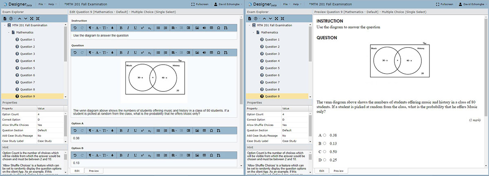
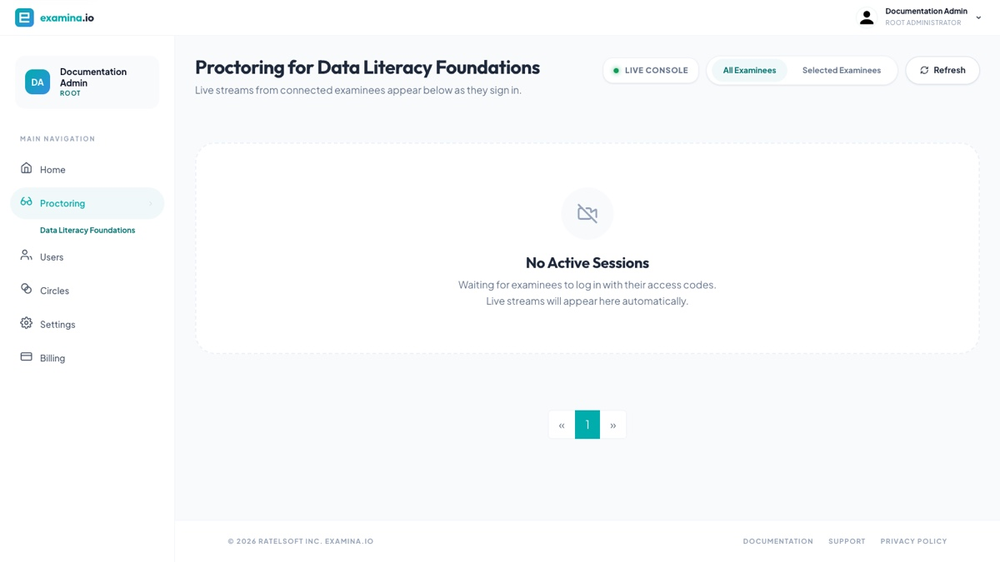
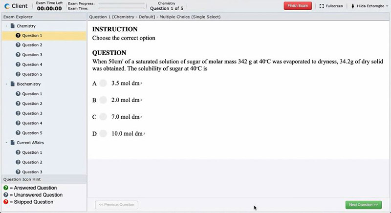

# Understand the examina.io platform

examina.io separates assessment work into focused applications. Question
authors can build content without access to candidate records, administrators
can schedule and deliver exams, invigilators can supervise only the exams they
are assigned, and examinees use a dedicated Client app.

## Assessment workflow

1. **Create** an exam project, papers, sections, and questions in Designer.
2. **Export** the completed exam as a `.smex` file.
3. **Import** that file into Manager.
4. **Add examinees** individually or import them from Excel, CSV, or text.
5. **Organize and assign** examinees with Groups, exam mappings, and paper
   mappings.
6. **Configure delivery** options such as visibility, start time, result
   display, supported devices, identity verification, and live proctoring.
7. **Share the exam link** or send an email from Manager.
8. **Monitor and report** while the exam is active and after it is complete.

The same person can perform several stages in a small organization. Larger
organizations can separate responsibilities with [account roles and
Circles](roles-and-permissions.md).

## Designer

Designer is the exam-authoring application. Use it to create exam projects,
organize one or more papers, add sections, write questions, set scoring and
timing rules, and import existing question content.

When authoring is complete, export the exam as an encrypted `.smex` file for
delivery through Manager. Start with [Introducing Designer](../user-guides/designer/introduction.md).

## Manager

Manager connects exam content with the people taking it. Administrators and
authorized staff use Manager to:

- import `.smex` exam files;
- create or import examinee records;
- organize examinees into Groups;
- map examinees or Groups to an exam and its papers;
- control exam visibility and delivery settings;
- open or distribute an exam link; and
- monitor progress and generate results or reports.

See the [Manager overview](../user-guides/manager/overview.md) for the main
navigation and a recommended operating sequence.

## Proctor

Proctor is the live-invigilation workspace. When live proctoring is enabled for
an exam, authorized invigilators can review the available audio, webcam, and
screen streams, communicate with an examinee, and approve an exam start when
the configured workflow requires it.

Only enable proctoring features that your organization is authorized to use,
and inform examinees about the data that will be collected.

## Client

Client is the examinee-facing application. Examinees open the exam link, enter
their assigned credentials, complete any required system or identity checks,
and take the mapped papers.

Client periodically saves exam state while a connection is available. The
[test-day guide](../user-guides/client/take-an-exam.md) explains how examinees
should prepare and what to do if a connection is interrupted.

## Users, Groups, and Circles

These similar-looking concepts solve different problems:

| Concept | Purpose |
| --- | --- |
| **User** | A staff account that signs in to examina.io, such as an administrator, exam coordinator, or invigilator. |
| **Examinee** | A candidate or student who signs in through an exam link to take an assessment. |
| **Group** | A reusable collection of examinees, used for bulk exam and paper assignments. |
| **Circle** | A permission boundary that connects selected users with selected exams and examinees. |

Use Groups to reduce repetitive assignment work. Use Circles to restrict what
staff can see and manage. Learn more in [Groups and exam
assignments](../user-guides/manager/groups-and-assignments.md) and [Circles and
permissions](../user-guides/administration/circles-and-permissions.md).

## Integrations

Organizations can connect examina.io to other systems with:

- public and secret API keys;
- a completion webhook;
- the embeddable Client widget;
- the REST API; and
- supported learning-platform integrations shown in Settings.

Begin with [API keys and webhooks](../integrations/api-keys-and-webhooks.md) or
go directly to the [API reference](../api/index.md).

## Next step

Follow the [quick start](quick-start.md) for a practical first-exam checklist.
