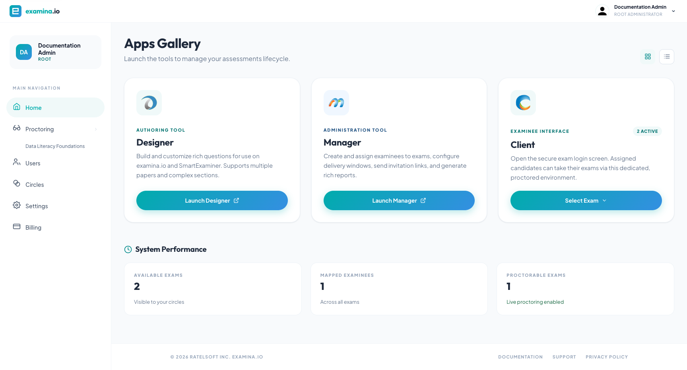

# Quick start: publish your first exam

This checklist takes an organization administrator from a new account to a
testable exam link. If another person authors the questions, they can complete
the Designer steps and send you the exported `.smex` file.

## 1. Confirm staff access

From **Home**, verify that the people preparing the assessment have the right
[account roles](roles-and-permissions.md). Use **Users** to add staff accounts
and **Circles** if access must be limited to particular exams or examinees.

## 2. Create the exam content

Open **Designer**, then:

1. Select **File → New Exam Project**.
2. Create an exam and at least one paper.
3. Add sections and questions.
4. Set the exam and paper instructions, timing, scoring, and navigation rules.
5. Preview the content.
6. Export the finished exam as a `.smex` file.

For detailed authoring instructions, see [Introducing
Designer](../user-guides/designer/introduction.md).

## 3. Import the exam into Manager

Open **Manager** and choose **File → Add New Exam**. Select the exported
`.smex` file and wait for the success message. Review the imported title,
code, papers, and delivery properties before assigning anyone.

See [Import exams](../user-guides/manager/import-exams.md).

## 4. Add examinees

Choose one of these approaches:

- **File → Add New Examinee** for one or a few people.
- **File → Import Examinees from File/Excel** for a class or cohort.

An examinee is a candidate taking an exam, not a staff user. Keep their code or
ID unique. If you import a file, verify the field mapping and preview before
starting the import.

See [Add and import examinees](../user-guides/manager/examinees.md).

## 5. Create Groups when useful

Groups are optional, but they reduce repetitive work. Create a Group for a
class, cohort, department, or sitting, then add the appropriate examinees.

You can assign an entire Group to an exam while still selecting the papers and
optional start time for that assignment.

## 6. Assign the exam and papers

Select an exam and choose **Map Examinees** or **Map Groups**. Move the intended
people or Groups to the selected list, continue to paper mapping, and choose the
papers they may take.

If you set an exam time, also select the correct time zone. The mapped time is
the earliest time the exam becomes available for that assignment.

## 7. Configure delivery

Before sharing the link, review:

- exam visibility;
- whether results appear after completion;
- live proctoring and identity-verification requirements;
- allowed mobile or tablet access;
- internet-disconnection behavior; and
- any proctoring exemptions.

Keep the exam invisible while preparing it. Make it visible only when the exam
and assignments are ready.

## 8. Test the examinee journey

Open the exam link in a private browser window. Confirm that:

- the organization logo and login style are correct;
- the test examinee can sign in;
- the expected papers are available;
- instructions and timing are correct; and
- any device, camera, microphone, or identity checks behave as expected.

Use a fictional or designated test examinee rather than a real candidate.

## 9. Publish and communicate

Make the exam visible, then copy **Open Exam Link** or use **Send Email to
Examinees** from Manager. Include:

- the exam date, start time, and time zone;
- the exam link;
- the examinee code and passcode distribution method;
- device and browser requirements;
- proctoring requirements; and
- a support contact.

Share the [examinee test-day guide](../user-guides/client/take-an-exam.md) with
participants.

## 10. Monitor and report

During the session, refresh Manager to see current connection states. If live
proctoring is enabled, open the exam under **Proctoring**. After examinees
finish, review individual results or generate an exam report.

The [delivery, monitoring, and reporting
guide](../user-guides/manager/deliver-monitor-report.md) contains the detailed
operating checklist.

!!! tip "Run a rehearsal"
    For a high-stakes assessment, conduct a short rehearsal with the same
    device rules, network conditions, and proctoring settings planned for the
    real exam.
