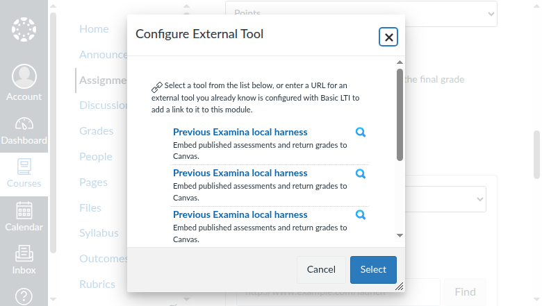
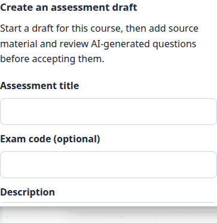
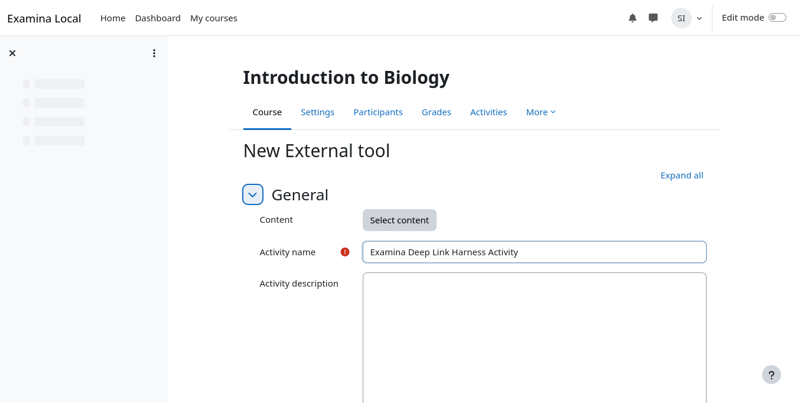
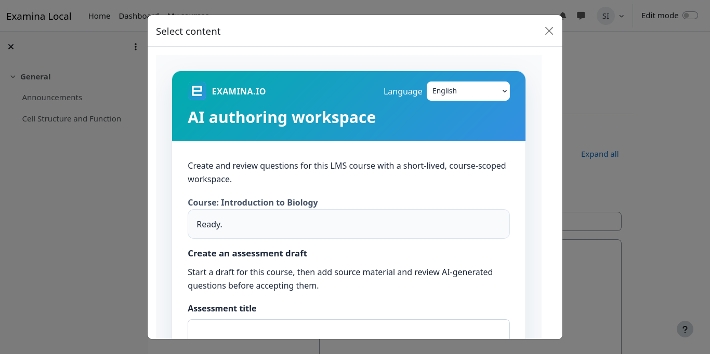
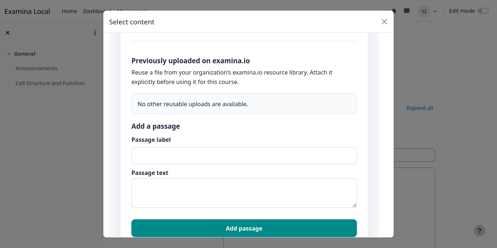
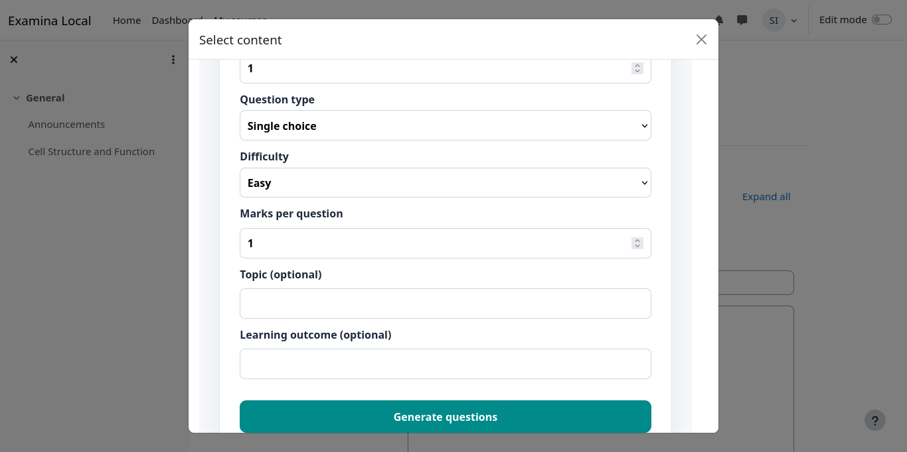
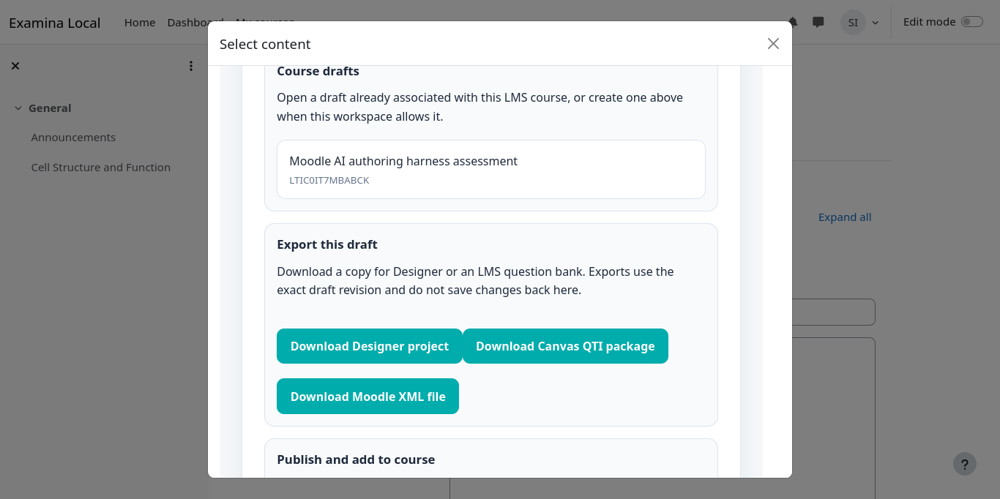
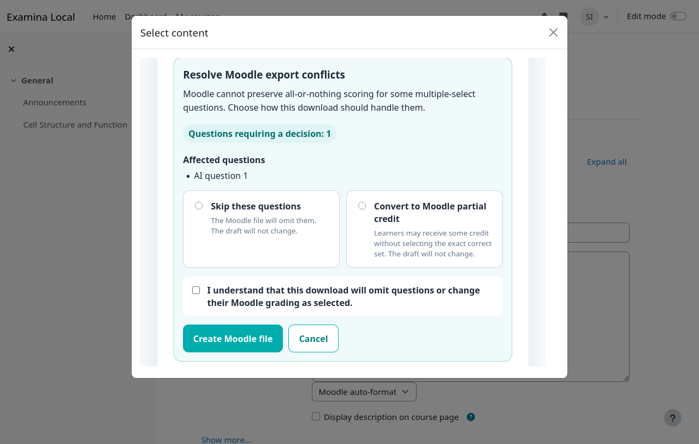

# Create questions with AI from Canvas or Moodle

Instructors can launch examina.io from a Canvas or Moodle course, build a
source-backed question draft with AI, and return a published assessment to the
course. The same draft can also produce a one-time Designer project or a native
question-bank file for the LMS.

This guide covers the complete instructor workflow. An LMS administrator must
first complete the [Canvas LTI 1.3 setup](canvas-lms.md) or
[Moodle LTI 1.3 setup](moodle-lms.md), including **Deep Linking**.

!!! tip "Validate in a test course first"

    Use fictional course material and users to validate authoring, export,
    publication, learner launch, and grade return before a live assessment.

The examples use a fictional **Introduction to Biology (BIO 101)** course and
a draft named **Cell Structure and Function Check**.

## Understand drafts and outputs

The authoring workspace keeps one canonical draft on examina.io. Generation,
review, and source changes update that draft until it is published.

| Output | Purpose | Relationship to the draft |
| --- | --- | --- |
| examina.io draft | Continue AI authoring and review | Mutable and stored on the server |
| `.smex` | Run the final exam | Immutable, final, and stored on the server after publication |
| `.smexproj` | Continue advanced editing in Designer v3 | One-time local copy; Designer saves do not update the server draft |
| Canvas QTI ZIP | Import supported questions into a Canvas classic question bank | One-time native copy |
| Moodle XML | Import supported questions into a Moodle question bank | One-time native copy |

Publishing is a boundary: it creates the immutable `.smex` used by learners.
Exporting a project or LMS file does not publish or change the draft.

## Before you start

Confirm that:

- examina.io appears as an External Tool in the course;
- the registration has Deep Linking enabled;
- you are an instructor, course designer, or administrator allowed to add LMS
  activities;
- your account has room under its active-draft cap; and
- your source files are PDF, DOCX, TXT, or HTML.

`DRAFT` and `PUBLISHING` items count toward the cap. Publishing or deleting a
draft releases its slot. If the workspace reports that the cap has been
reached, finish an existing draft or ask an examina.io administrator to retire
one. Draft deletion is currently an administrative/API operation; it is not
offered inside the LMS authoring screen or Designer.

## 1. Open AI authoring from your LMS

### Canvas

1. Open the course and select **Assignments**.
2. Create or edit an assignment, then choose **External Tool** as the
   submission type.
3. Select **Find**, choose **examina.io**, and open its content picker.

Choose **Create questions with AI**, enter **Cell Structure and Function
Check**, and create the draft. If you previously started one in this course,
you can open it from the course draft list instead.

### Moodle

1. Turn **Edit mode** on in the course.
2. Select **Add an activity or resource**, then **External tool**.
3. Choose the configured examina.io tool and select **Select content**.

Choose **Create questions with AI** or reopen an existing course draft.

### Change the workspace language

Use the language menu at the top of any examina.io LTI page to choose English,
French, Arabic, Latin American Spanish, or Brazilian Portuguese. Arabic uses a
right-to-left interface. The menu changes interface instructions and controls;
it never translates uploaded passages, questions, or answers.

## 2. Create the draft structure

Enter a recognizable title and optional internal code. For this example use:

- **Title:** Cell Structure and Function Check
- **Code:** BIO-101-CELL
- **Paper:** Paper 1
- **Section:** Cell organelles
- **Learner instruction:** Answer every question using the supplied passage.

The workspace separates sources and questions into two columns on wider
screens and stacks them on smaller screens.

## 3. Add one or more source files

Select **Add passages and files**, then either drag several files into the
upload area or choose them with the file picker. The selected files are shown
together before upload so you can remove an accidental selection.

For a quick example, upload a short passage that explains:

> Chloroplasts capture light energy to make sugars, while mitochondria release
> usable energy from those sugars. Plant cells contain both organelles.

Only use material that your institution is authorized to process. Verify that
every file finishes processing before generating questions. A previously
uploaded source remains attached to the server draft when you reopen it from
Canvas or Moodle.

## 4. Generate questions

Select **Generate questions with AI**, then choose the destination paper and
section. examina.io currently generates:

- single-select questions;
- multiple-select questions; and
- fill-in-the-blank questions.

For the example, create two medium single-select questions worth 2 points each,
then create one medium multiple-select question. Set the topic to **Cell
organelles** and the learning outcome to **Distinguish energy capture from
energy release in plant cells**.

AI output can be incorrect or unsuitable. An instructor remains responsible
for checking accuracy, answer keys, ambiguity, difficulty, accessibility,
copyright, and alignment with the intended learning outcome.

## 5. Review the generated candidates

Review every candidate against its source. Keep acceptable questions and
reject poor ones. The focused LMS workspace lets you select questions and
adjust the question title and learner instruction; it is not a full question
stem and answer editor.

When substantial editing is required, either reject and regenerate the
candidate or download a Designer project for advanced local editing. A project
opened in Designer is a revision-pinned copy: saving it does **not** write
changes back to the canonical examina.io draft.

## 6. Choose what to do with the draft

Open the draft actions when review is complete.

You can:

- download a `.smexproj` file for Designer v3;
- download a Canvas QTI ZIP;
- download a Moodle XML file; or
- publish the assessment and return it to the course.

These actions are independent. For example, you can import a native question
copy for reuse and later return to the canonical draft to publish it.

## 7. Import a native Canvas question copy

Canvas export maps compatible single-select, multiple-select, and
fill-in-the-blank questions to QTI. It is a manual, one-way export.

1. Select **Download Canvas QTI package**.
2. In Canvas, open **Settings → Import Course Content**.
3. Choose **QTI .zip file**, select the download, and run the import.
4. Open the classic question bank and preview every imported question.

The current export targets Canvas classic question banks. It does not claim
direct push or certification for New Quizzes. Canvas changes do not sync back
to examina.io.

## 8. Import a native Moodle question copy

Moodle XML supports the same basic question families, but Moodle's
multiple-select scoring does not always preserve the draft's exact-set scoring.
When a conflict exists, examina.io asks you to choose a policy for that export.

- **Skip affected questions** preserves examina.io scoring because conflicting
  questions are omitted from the XML.
- **Convert to Moodle partial credit** assigns a total of +100% across correct
  choices and -100% across distractors. The imported question can therefore
  award partial credit and does not have identical scoring semantics.

If a question already uses canonical partial scoring, choose **Skip affected
questions**. Confirm the one-time-copy acknowledgement before downloading.
Your choice applies only to that export and never changes the server draft.

Then import the file:

1. Open the Moodle course **Question bank**.
2. Select **Import** and choose **Moodle XML format**.
3. Upload the downloaded XML file.
4. Preview every imported question, answer, grade, and penalty.

## 9. Publish and add the assessment to the course

Return to the canonical draft and select **Publish and add to course**. Review
the publication acknowledgement carefully. Publishing creates and persists the
final immutable `.smex`; later draft or LMS-native changes cannot alter it.

After examina.io returns the Deep Link:

- in Canvas, finish the assignment settings and select **Save** or **Save &
  Publish**; or
- in Moodle, finish the activity settings and select **Save and display**.

Use a fictional learner to launch the activity, submit it, and confirm that the
expected result reaches the LMS gradebook when AGS is enabled.

## Reopen a draft in Designer

Designer v3 can choose **File → Open from examina.io drafts**, search the draft
table, and select a draft to open. Designer converts the chosen draft revision
into a local `.smexproj`. It does not save changes back to examina.io and is not
a replacement for publishing the canonical draft.

## Troubleshooting

### The AI-authoring choice is missing

Confirm that the LTI registration enables Deep Linking and that the instructor
launched the content-selection placement, not a learner resource link. The
Canvas or Moodle administrator may also need to update the installed tool.

### A source does not appear after upload

Confirm the file is PDF, DOCX, TXT, or HTML, then wait for processing to finish.
Reopen the same course draft before uploading a duplicate.

### The Moodle export omits a multiple-select question

The selected policy was **Skip affected questions**, or the question uses a
scoring mode Moodle XML cannot preserve. Re-export with partial credit only if
the scoring difference is acceptable and has been reviewed.

### The Designer copy differs from the server draft

This is expected after either copy changes. `.smexproj` is a one-way snapshot;
Designer does not synchronize edits to the canonical draft.

### Publication is unavailable

Resolve incomplete processing or question validation first. If the account has
reached a plan or draft limit, contact its examina.io administrator.

## Instructor validation checklist

- [ ] The correct course and draft are shown.
- [ ] Every source is authorized and fully processed.
- [ ] Every generated stem, option, answer, and point value was reviewed.
- [ ] Any Moodle multiple-select scoring difference was explicitly accepted.
- [ ] Native imports were previewed in the LMS question bank.
- [ ] The final publication acknowledgement was reviewed.
- [ ] A fictional learner launch and grade return succeeded.
