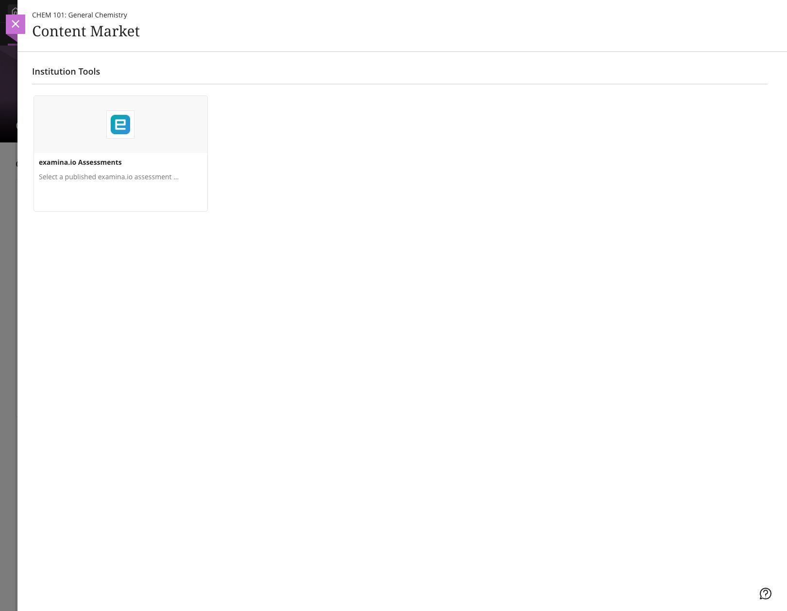
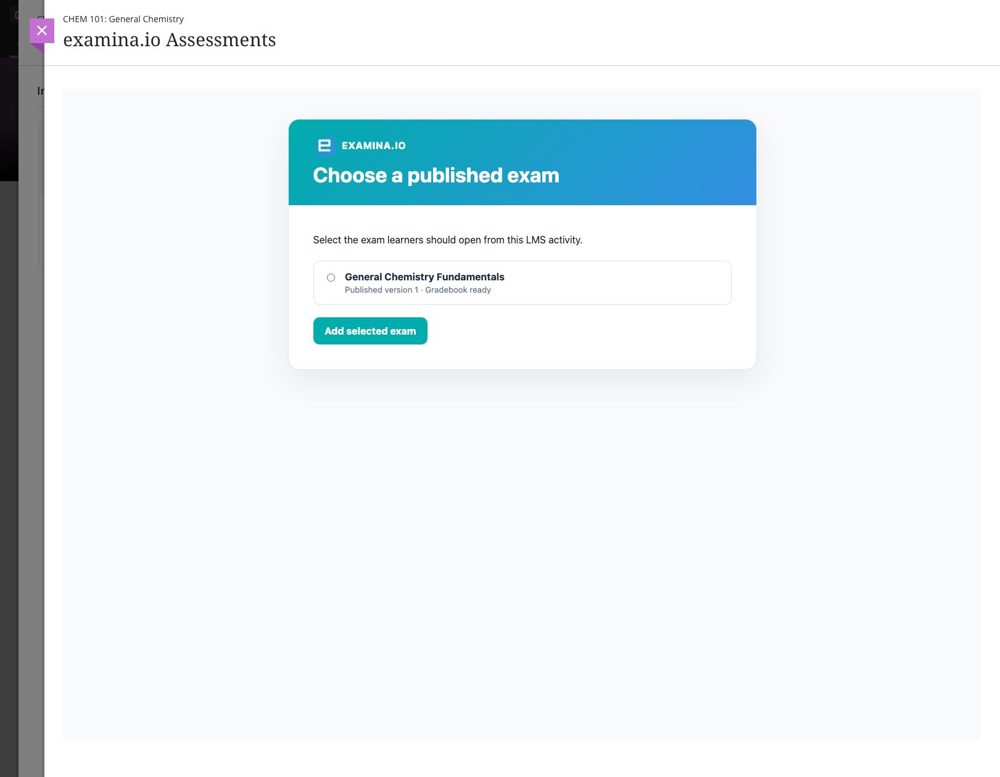
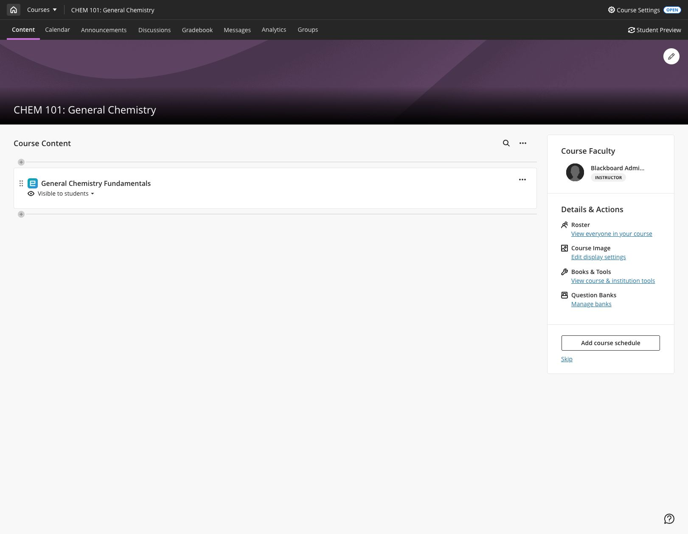
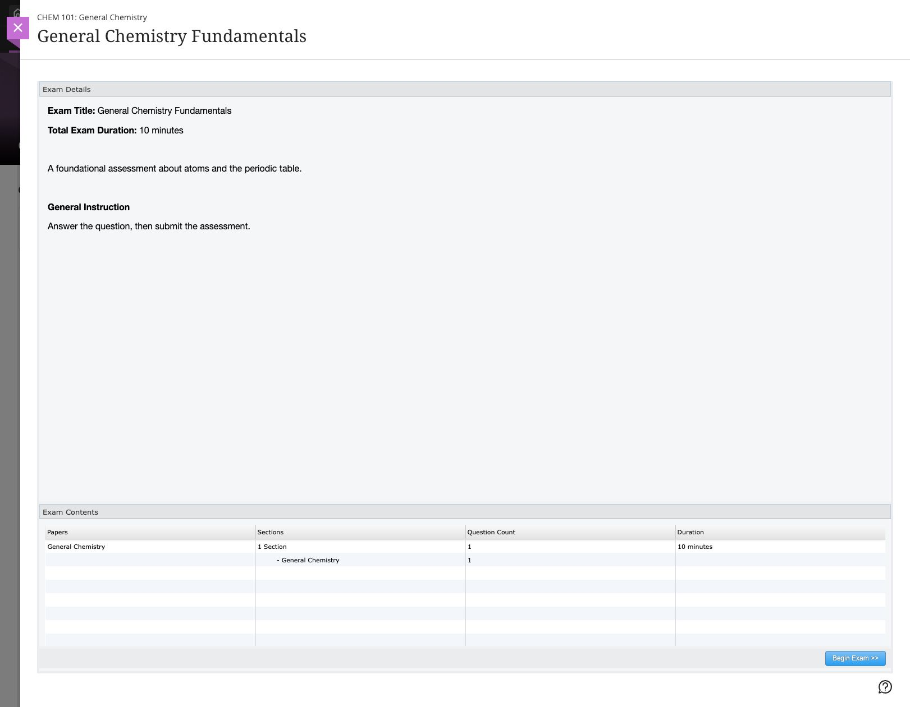
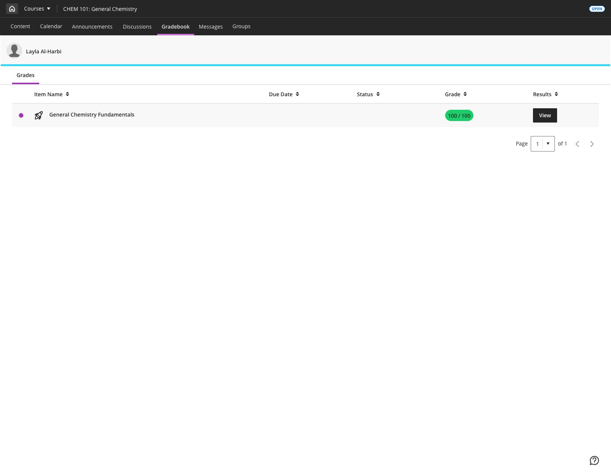

# Integrate examina.io with Blackboard Learn Ultra

Connect examina.io to Blackboard Learn Ultra once, then let instructors add a
published exam from the Content Market without copying an exam URL. Learners
open the assessment inside Blackboard without a second examina.io sign-in, and
examina.io can return each result to the matching Blackboard gradebook item.

!!! tip "Validate before a live assessment"

    Connect and validate the complete workflow in a non-production Blackboard
    course with fictional users before enabling it for a live assessment.

The screenshots use a fictional course named **CHEM 101: General Chemistry**,
an assessment named **General Chemistry Fundamentals**, and a fictional learner
named **Layla Al-Harbi**. Your institution, course, users, identifiers, and
published exams will be different.

## What the integration provides

- **One Blackboard sign-in:** learners do not sign in to examina.io again when
  they open the assessment from their Blackboard course.
- **Published-exam selection:** LTI Deep Linking lets an instructor choose the
  exact published exam while adding course content.
- **Course-aware placement:** the selected exam is bound to the Blackboard
  course and content item that created it.
- **Grade return:** LTI Assignment and Grade Services (AGS) sends the score to
  the correct learner and gradebook item.
- **Optional course roster:** Names and Roles Provisioning Services (NRPS) can
  provide the minimum membership data required by an approved workflow.
- **Institution isolation:** the same vendor Application ID can be installed by
  multiple institutions, but every Blackboard installation has its own
  Deployment ID and its own examina.io registration.

## Before you start

You need:

- a Root or Administrator account in examina.io;
- a Blackboard Learn system administrator who can register LTI 1.3 tools;
- an instructor and a fictional learner in a non-production Blackboard course;
- at least one exam imported and published in examina.io Manager; and
- institutional approval for the learner data and LTI services Blackboard will
  share.

Both systems must be reachable over public HTTPS with trusted certificates and
accurate clocks. LTI login messages and signed responses expire quickly, so an
incorrect clock can reject an otherwise valid configuration.

!!! important "Use the shared examina.io Application ID"

    Use the **Examina Application ID** shown in examina.io. Do not create a
    separate vendor application for each institution. Each Blackboard
    installation supplies its own **Deployment ID**, which must be saved in a
    separate examina.io registration. Never reuse a Deployment ID from another
    Blackboard environment.

## 1. Publish the exam learners will take

Before configuring Blackboard, prepare the assessment in examina.io:

1. Open **Manager** and import the exam from Designer if needed.
2. Review its title, instructions, duration, scoring, availability, and
   learner-facing content.
3. Publish the exam.

Only published exams that the current organization is allowed to use appear in
the Blackboard selection screen. Publishing an exam does not add it to a
course; the instructor selects the course placement later through Deep Linking.

## 2. Start the Blackboard registration in examina.io

As an examina.io Root or Administrator:

1. Open **Home → Settings**.
2. Find **Bring Examina into your LMS** and select **Add registration**.
3. Choose **Blackboard Learn / Ultra**.
4. Copy the read-only **Examina Application ID**.

Keep the form open. Blackboard needs the Application ID before it can create
the institution-specific Deployment ID that completes this registration.

## 3. Register and approve examina.io in Blackboard

As a Blackboard Learn system administrator:

1. Open **Administrator Panel → Integrations → LTI Tool Providers**.
2. Select **Register LTI 1.3/Advantage Tool**.
3. Enter the **Examina Application ID**, then select **Submit**.
4. Review the imported tool name, domain, public-key URL, redirect URLs, and
   managed placement.
5. Set **Tool Status** to **Approved**.
6. Under user data sharing, approve the data your institution permits:
   **Name**, **Email**, and **Role**.
7. Enable **Allow grade service access** when scores should be returned with
   AGS.
8. Enable **Allow Membership Service Access** only when course-roster access is
   required through NRPS.
9. Select **Submit**.

Blackboard always supplies a stable LTI subject identifier for the learner.
Name and email are profile data, so approve them only when your institution's
policy allows examina.io to receive them. Role is needed to distinguish an
instructor workflow from a learner launch.

Open the registered tool's menu, choose **Edit**, and copy its
institution-specific **Deployment ID**. This value belongs to this Blackboard
installation and must not be copied to another institution.

## 4. Finish the registration in examina.io

Return to **Home → Settings → Bring Examina into your LMS**:

1. Continue the open form, or select **Add registration → Blackboard Learn /
   Ultra** again.
2. Enter a descriptive name, such as **Northbridge College Blackboard**.
3. Confirm the read-only **Examina Application ID** and paste the Blackboard
   **Deployment ID**.
4. Confirm these Blackboard platform values:

| examina.io field | Blackboard value |
| --- | --- |
| Issuer URL | `https://blackboard.com` |
| Examina Application ID | The centrally supplied, read-only Application ID |
| Deployment ID | The ID copied from this Blackboard installation |
| Authorization endpoint | `https://developer.blackboard.com/api/v1/gateway/oidcauth` |
| Token endpoint | `https://developer.blackboard.com/api/v1/gateway/oauth2/jwttoken` |
| LMS public keys (JWKS) URL | `https://developer.blackboard.com/.well-known/jwks.json` |

5. Enable **Assessment selection (Deep Linking)**.
6. Enable **Grade return (AGS)** when Blackboard grade service access was
   approved.
7. Enable **Course roster (NRPS)** only when Blackboard Membership Service
   Access was approved.
8. Select **Save registration**, then activate the registration.

The saved registration card is the source of truth for the exact tool URLs.
The production browser-facing values use `https://www.examina.io`:

| Blackboard tool setting | examina.io production value |
| --- | --- |
| OIDC login initiation | Copy the complete value from the registration card |
| LTI launch / target-link URI | `https://www.examina.io/lti/launch` |
| Deep Linking redirect | `https://www.examina.io/lti/deep-link` |
| Tool icon | `https://www.examina.io/img/logo128.png` |
| Tool public keys (JWKS) | Copy the registration-specific value from the registration card |

Always copy the complete OIDC and JWKS values from the registration card
because they identify the saved registration. The Blackboard **LMS public keys
(JWKS) URL** in the first table is Blackboard's key set, which examina.io reads.
The **tool public keys (JWKS)** URL on the registration card is examina.io's key
set, which Blackboard reads. Do not swap them.

Application IDs and Deployment IDs are configuration identifiers, not
passwords. Never put private keys, access tokens, signed launch messages, or
learner data in documentation or support tickets.

## 5. Confirm the Blackboard placement

Return to **LTI Tool Providers** in Blackboard, open the menu for
**examina.io Assessments**, and choose **Manage Placements**. Confirm that the
approved managed placement:

- is available as a Deep Linking content tool;
- uses the examina.io production Deep Linking URL;
- is named **examina.io Assessments**; and
- displays the examina.io logo.

Do not create a second placement unless your institution intentionally needs a
separate placement with different availability. A duplicate placement can make
it unclear which registration an instructor is launching.

## 6. Add a published exam to an Ultra course

As an instructor in the destination course:

1. Open **CHEM 101: General Chemistry → Course Content**.
2. Select the **+** where the assessment should appear.
3. Choose **Content Market**.
4. Find **examina.io Assessments** under **Institution Tools** and select it.

The examina.io picker opens inside Blackboard. Select **General Chemistry
Fundamentals**, then choose **Add selected exam**.

Blackboard returns to the course and creates the assessment content item.
Confirm its learner-facing name, visibility, due date, maximum points, and
attempt policy, then make it visible to learners.

Open the item once as the instructor and confirm that the intended published
exam appears. If the wrong exam was selected, remove the content item and use
the Content Market to select it again.

## 7. Verify the learner launch

Use a fictional learner enrolled in the course:

1. Sign in to Blackboard as the learner.
2. Open **CHEM 101: General Chemistry → Course Content → General Chemistry
   Fundamentals**.
3. Confirm that the assessment opens inside Blackboard without a second
   examina.io sign-in.
4. Begin, complete, and submit the assessment.

The LTI launch verifies the Blackboard platform, Deployment ID, course,
content item, learner, and selected publication. A copied launch URL is not a
replacement for opening the assessment from Blackboard.

## 8. Verify the returned grade

After submission, open **Gradebook** as the instructor. Confirm that the score
appears for **General Chemistry Fundamentals**, the correct learner, and the
correct gradebook item. The learner can also review the result from the course
grades view.

Grade delivery is queued separately from exam submission, so a temporary
Blackboard outage does not turn a completed assessment into a failed
submission. The score may take a short time to appear. Refresh the gradebook
before investigating a missing result.

## Connect another Blackboard institution

The centrally supplied examina.io Application ID can be installed in more than
one Blackboard institution. For each institution:

1. register the shared Application ID in that institution's Blackboard Learn;
2. copy that installation's unique Deployment ID;
3. create a separate Blackboard registration in the correct examina.io
   organization; and
4. grant only that institution's approved user-data, AGS, and NRPS permissions.

Before a broad rollout, verify that each institution sees only its
organization's published exams and that scores return only to the originating
course, learner, and gradebook item.

## Production validation checklist

Before using the integration for a live course, verify all of the following:

- The tool is **Approved** and available only where intended.
- **examina.io Assessments** appears in Content Market with the examina.io logo.
- The Application ID is the centrally supplied examina.io value.
- The Deployment ID came from this exact Blackboard installation.
- Name, Email, and Role sharing match the institution's approved data policy.
- AGS is enabled in both systems when grades should be returned.
- NRPS is enabled in both systems only when course-roster access is required.
- Deep Linking lists only published exams the instructor may select.
- A learner opens the selected assessment without a second sign-in.
- A completed score reaches the correct learner and gradebook item.
- Every browser-facing address uses production HTTPS and a trusted certificate.

## Troubleshooting

| Symptom | What to check |
| --- | --- |
| **examina.io Assessments** is missing from Content Market | Confirm the tool is approved, its managed Deep Linking placement is available to this course, and the current user can add course content. |
| The Content Market tile has no examina.io logo | Confirm the managed placement uses `https://www.examina.io/img/logo128.png`. If the tool was installed before the icon was configured, refresh the existing tool metadata or update its placement. |
| The picker opens but Blackboard rejects the selected exam | Confirm the Application ID and Deployment ID match, Blackboard can fetch the exact registration-specific examina.io JWKS URL, and both systems have accurate clocks. |
| The assessment opens in a blank frame or the launch is refused | Check the OIDC initiation URL, launch URL, redirect URLs, trusted HTTPS certificate, registration status, iframe policy, and browser third-party-cookie settings. |
| Blackboard still opens an old address after the vendor configuration changed | Blackboard may retain the URLs imported when the tool or managed placement was created. Inspect the existing tool and placement target URLs. Refresh or update the existing registration metadata when Blackboard permits it. If the tool must be registered again, record the new Deployment ID and update the matching examina.io registration before making the replacement available. Reselect affected course content so it uses the current placement. |
| The wrong exam opens | Remove or edit the course content and select the intended published exam again. Do not copy a content item between institutions without reselecting the exam. |
| The grade does not appear | Confirm Blackboard **Allow grade service access** and examina.io **Grade return (AGS)** are enabled, the content item has points, and the registration is active. Allow time for queued delivery. |
| Course roster is unavailable | Confirm Blackboard **Allow Membership Service Access** and examina.io **Course roster (NRPS)** are enabled. Assessment launch and grade return do not require NRPS. |
| Blackboard reports a signing-key error | Confirm Blackboard uses the tool JWKS URL copied from the examina.io registration card and examina.io uses `https://developer.blackboard.com/.well-known/jwks.json` for Blackboard's keys. Neither endpoint should redirect to a sign-in page. |
| A second institution sees the first institution's content | Confirm each institution has its own examina.io registration and Blackboard Deployment ID. Never reuse a Deployment ID across institutions. |

For Blackboard's current platform behavior and terminology, see Anthology's
official [LTI application registration](https://docs.blackboard.com/docs/blackboard/lti/1.3/register-an-application)
and [administrator integration](https://help.anthology.com/blackboard/administrator/en/integrations.html)
documentation.
