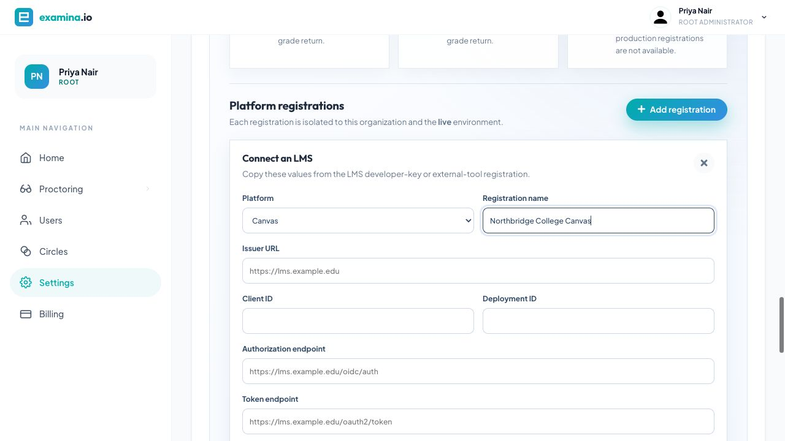
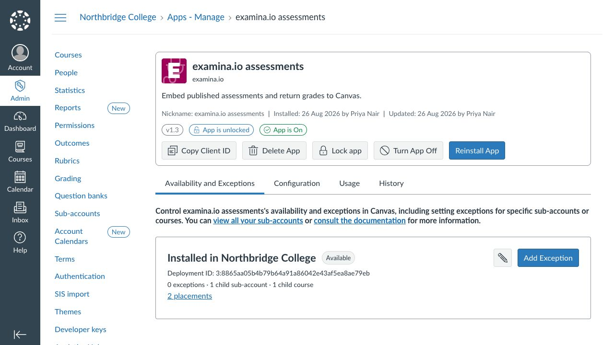
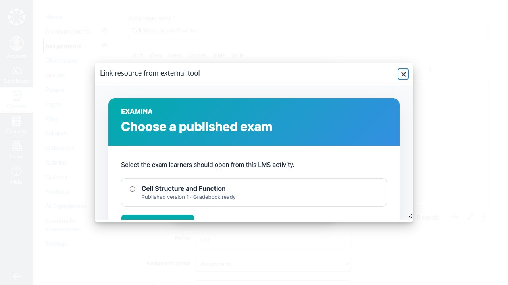
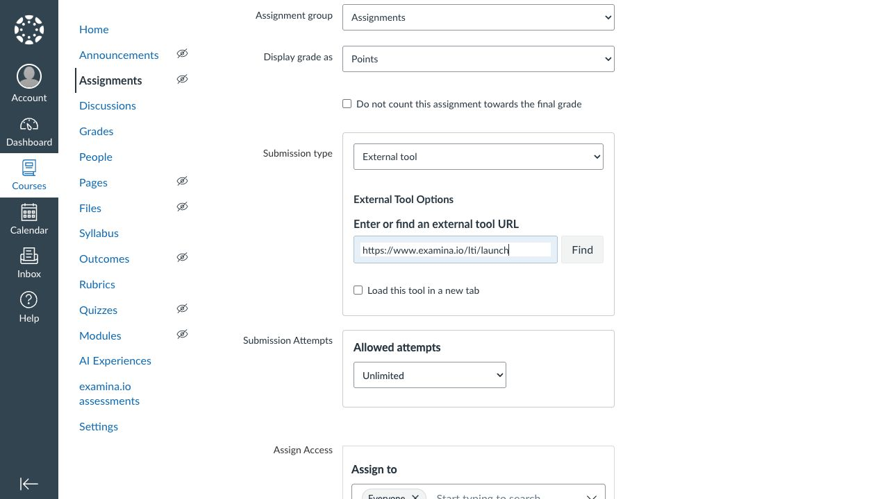
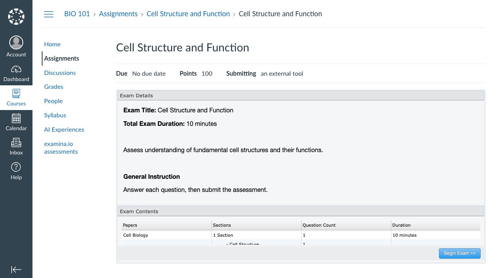
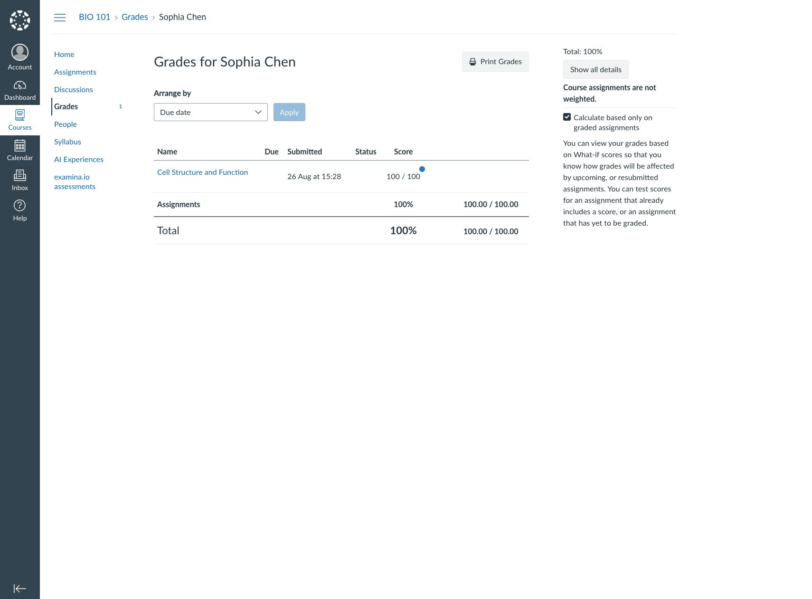

# Integrate examina.io with Canvas

Connect examina.io to a Canvas root account, then let teachers add published
assessments to assignments without copying exam links. Learners open the
assessment inside Canvas without a second sign-in, and examina.io returns each
result to the corresponding Canvas gradebook column.

!!! note "Integration preview"

    Canvas integration is currently in testing. Ask your examina.io account
    contact to enable LMS integrations for your organization, and validate the
    complete workflow in a non-production Canvas course before using it for a
    live assessment.

The screenshots use a fictional **Northbridge College** course,
**Introduction to Biology (BIO 101)**, and an assessment named **Cell
Structure and Function**. Your institution, Canvas hostname, identifiers, and
course names will be different.

## What the integration provides

- **One Canvas sign-in:** learners do not sign in to examina.io again when they
  open an assignment from Canvas.
- **Published-assessment selection:** LTI Deep Linking lets a teacher choose
  the exact exam while creating an External Tool assignment.
- **Course-aware placement:** the selected publication is bound to the Canvas
  course and assignment that created it.
- **Grade return:** LTI Assignment and Grade Services (AGS) sends the score to
  the correct learner and gradebook column.
- **Optional course roster:** Names and Roles Provisioning Services (NRPS) can
  provide the minimum course membership data required by an approved workflow.

Canvas calls this pattern an `assignment_selection` placement. Its official
documentation confirms that the placement uses Deep Linking, loads the chosen
tool assessment for assigned students, and can synchronize grades through LTI
grading services.

## Before you start

You need:

- a Root or Administrator account in examina.io;
- a Canvas root-account administrator who can manage Developer Keys and Apps;
- an instructor and a fictional learner in a non-production Canvas course;
- at least one exam imported and published in examina.io Manager;
- public HTTPS addresses with trusted certificates for both systems; and
- an institution-approved plan for the learner data that Canvas may disclose.

Keep both systems' clocks accurate. LTI login messages and signed responses
expire quickly, so a large clock difference can reject otherwise correct
configuration.

## How Canvas and examina.io exchange settings

Canvas creates a **Client ID** and **Deployment ID** that examina.io needs.
Examina.io creates a registration-specific public-key URL that Canvas needs.
During the preview, configuration therefore has two passes:

1. create a provisional Canvas LTI 1.3 Developer Key and install its App;
2. copy Canvas's identifiers and platform endpoints into examina.io;
3. copy the final examina.io endpoints back into the Canvas key; and
4. turn the App on, make it available, and validate the full workflow.

!!! warning "Keep the provisional App unavailable"

    If Canvas requires a public-key URL during the first pass, use a temporary
    HTTPS JSON Web Key Set endpoint controlled by your institution. It may
    return an empty set (`{"keys":[]}`). Keep the key off and the App
    unavailable until you replace it with the registration-specific examina.io
    **Public key set (JWKS)** URL in Step 3. Never use a local, Docker, or private
    hostname in a production Canvas key.

## 1. Create the provisional Canvas key and App

As a Canvas root-account administrator:

1. Open **Admin → your root account → Developer keys**.
2. Select **+ Developer Key → + LTI Key**.
3. Choose **Manual Entry** and name the key **examina.io assessments**.
4. Set the OIDC initiation, target-link, redirect, Deep Linking, and public-key
   fields to the provisional HTTPS values supplied for the preview. You will
   replace them in Step 3.
5. Add these placements:
   - **Assignment Selection** with message type `LtiDeepLinkingRequest`;
   - **Course Navigation** with message type `LtiResourceLinkRequest`, if your
     institution wants a course-level entry point.
6. Grant only the services you intend to enable:
   - AGS line-item access, score submission, and result read access for grade
     return;
   - NRPS context-membership read access only when course-roster access is
     required.
7. Save the key, copy its **Client ID**, and keep the key **Off**.
8. Open **Admin → your root account → Apps → Manage**, install the App using
   the Client ID, and copy its **Deployment ID**.

Canvas also supports Dynamic Registration, but its registration APIs are
currently marked beta. Use a one-time Dynamic Registration URL only when it is
explicitly supplied by examina.io for your preview; otherwise use the manual
two-pass flow above.

## 2. Add the Canvas registration in examina.io

As an examina.io Root or Administrator:

1. Open **Home → Settings**.
2. Find **Bring Examina into your LMS** and select **Add registration**.
3. Choose **Canvas** and enter a descriptive name, such as **Northbridge
   College Canvas**.
4. Enter the Canvas values shown below.

| examina.io field | Canvas value |
| --- | --- |
| Issuer URL | `https://<your-canvas-host>` |
| Client ID | The LTI Developer Key's Client ID |
| Deployment ID | The installed App's Deployment ID |
| Authorization endpoint | `https://<your-canvas-host>/api/lti/authorize_redirect` |
| Token endpoint | `https://<your-canvas-host>/login/oauth2/token` |
| LMS public keys (JWKS) URL | `https://<your-canvas-host>/api/lti/security/jwks` |

For hosted Canvas, replace `<your-canvas-host>` with the exact hostname your
users sign in to. Do not add a trailing path to the Issuer URL, and do not use
Canvas's generic OAuth JWKS endpoint in the LMS public-keys field.

5. Enable **Assessment selection (Deep Linking)** and **Grade return (AGS)**.
6. Enable **Course roster (NRPS)** only if the matching Canvas scope was
   approved and granted.
7. Select **Save registration**.

The saved card displays the exact **OIDC login initiation**, **LTI launch**,
**Deep Linking**, and registration-specific **Public key set (JWKS)** URLs.
Keep that card open for the next step.

## 3. Finish and activate the Canvas App

Edit the Canvas LTI Developer Key and replace every provisional tool value
with the exact value shown by examina.io:

| Canvas LTI key field | Value from examina.io |
| --- | --- |
| OpenID Connect Initiation URL | OIDC login initiation |
| Target Link URI | LTI launch |
| Redirect URI | LTI launch and Deep Linking URLs, one per line |
| Assignment Selection target link | Deep Linking |
| Public JWK URL | Public key set (JWKS) |

The production browser-facing routes begin with `https://www.examina.io`.
For example, the launch URL is
`https://www.examina.io/lti/launch`. Always copy the complete values from the
registration card because the JWKS URL includes the registration identifier.

Save the key and turn it **On**. In **Apps → Manage**, open **examina.io
assessments**, confirm that the App is on, and make it available to the root
account or to the approved sub-accounts and courses.

Return to examina.io and activate the registration. A suspended or revoked
registration cannot accept new launches.

## 4. Add a published assessment to a Canvas assignment

As an instructor in the destination course:

1. Open **Assignments → + Assignment**.
2. Enter the learner-facing assignment name and maximum points.
3. Set **Submission type** to **External tool**.
4. Select **Find**, then choose **Add an examina.io assessment**.
5. Select the intended published exam and choose **Add selected exam**.

Canvas returns to the assignment form with the launch URL selected. Confirm
the assignment name, points, assignment access, dates, and attempt policy.

Choose **Save & publish**, then open the assignment once as the instructor.
Confirm that the expected assessment appears and that Canvas does not prompt
for a separate examina.io sign-in.

## 5. Verify the learner experience

Use a fictional learner enrolled in the course:

1. Sign in to Canvas as the learner.
2. Open **BIO 101 → Assignments → Cell Structure and Function**.
3. Confirm that the expected exam opens inside the Canvas assignment.
4. Begin, complete, and submit the assessment.

The LTI launch verifies the Canvas platform, deployment, course, assignment,
learner, and selected publication. A copied launch URL is not a replacement for
opening the assignment from Canvas.

## 6. Verify the returned grade

After submission, open the Canvas grade view as the learner or the Gradebook
as an instructor. Confirm that the result appears for the correct assignment
and learner.

Grade delivery is queued separately from exam submission, so a temporary
Canvas outage does not turn a completed assessment into a failed submission.
The score may take a short time to appear. Refresh the grade view before
investigating a missing result.

## Production validation checklist

Before enabling the App for a live course, verify all of the following with a
non-production course and fictional users:

- The Canvas key and App are on and available only where intended.
- The examina.io registration is active in the correct organization and
  environment.
- Canvas uses the registration-specific examina.io JWKS URL.
- Examina.io uses Canvas's `/api/lti/security/jwks` endpoint.
- Deep Linking lists only assessments the instructor may select.
- The assignment launches the intended published assessment inside Canvas.
- A learner launches without a second sign-in.
- A completed score reaches the correct learner and gradebook column.
- Reopening or refreshing the assignment does not duplicate a line item.
- NRPS is disabled when course-roster access is unnecessary.
- Every production-facing URL uses public HTTPS and a trusted certificate.

## Troubleshooting

| Symptom | What to check |
| --- | --- |
| **examina.io assessments** is missing from **Find** | Confirm the key is on, the App is available to this course, and the key includes the Assignment Selection placement with `LtiDeepLinkingRequest`. |
| The picker opens but Canvas rejects the selected exam | Confirm Canvas can fetch the exact registration-specific examina.io JWKS URL from its server network. Browser reachability alone is not enough. Also verify Client ID, Deployment ID, issuer, and clock accuracy. |
| The assignment opens a blank frame or refuses the launch | Check the OIDC initiation URL, launch URL, redirect URIs, trusted HTTPS certificate, iframe policy, and browser third-party-cookie settings. Remove every local, Docker, and private hostname from production configuration. |
| The wrong assessment opens | Edit the assignment and select the publication again. Do not copy an assignment between environments without reselecting its content. |
| The grade does not appear | Confirm AGS scopes and **Grade return** are enabled, the assignment has points, and the App is still available. Allow a short time for queued delivery. |
| Course roster is unavailable | Confirm the NRPS scope and **Course roster** are enabled. Launch and grade return can continue without roster access. |
| Canvas reports a signing-key error | Canvas must use the registration-specific examina.io JWKS URL, and examina.io must use `https://<your-canvas-host>/api/lti/security/jwks`. Confirm that neither endpoint redirects to a sign-in page. |

For Canvas's current platform behavior and terminology, see Instructure's
official [LTI registration](https://developerdocs.instructure.com/services/canvas/external-tools/lti/file.registration),
[Assignment Selection placement](https://developerdocs.instructure.com/services/canvas/external-tools/lti/placements/file.assignment_selection_placement),
[Deep Linking](https://developerdocs.instructure.com/services/canvas/external-tools/lti/file.content_item),
and [grading](https://developerdocs.instructure.com/services/canvas/external-tools/lti/file.assignment_tools)
documentation.
