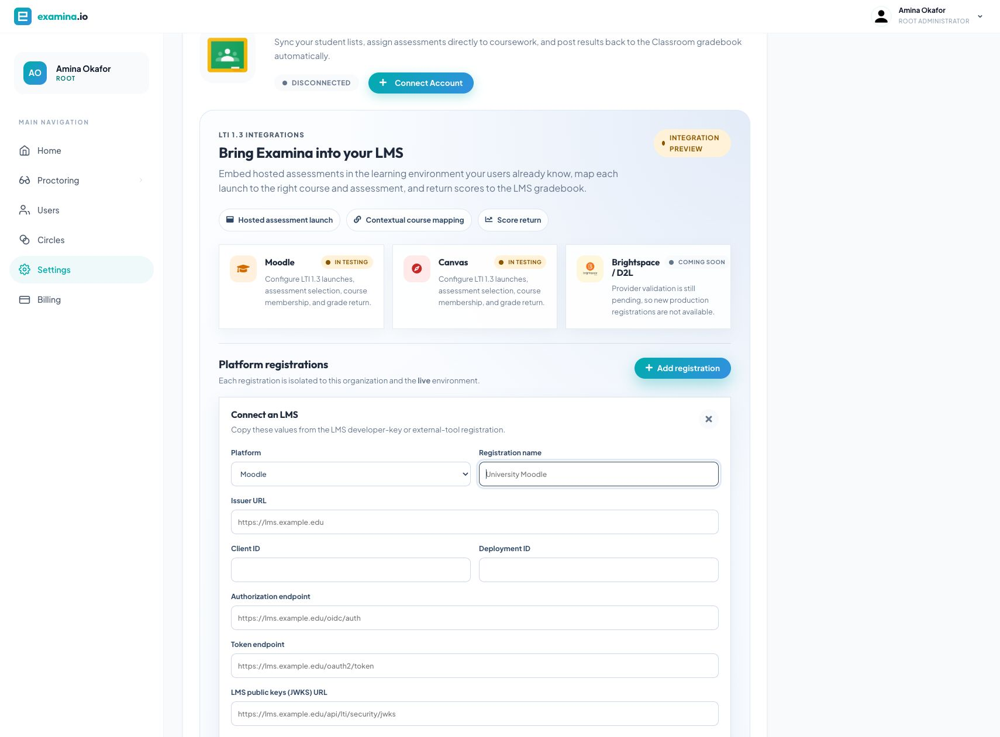
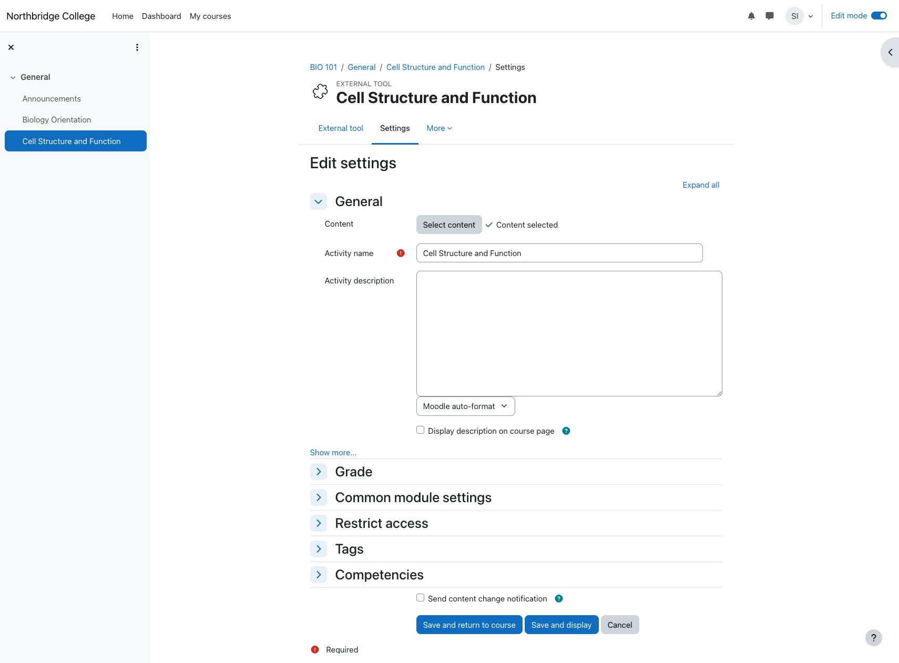
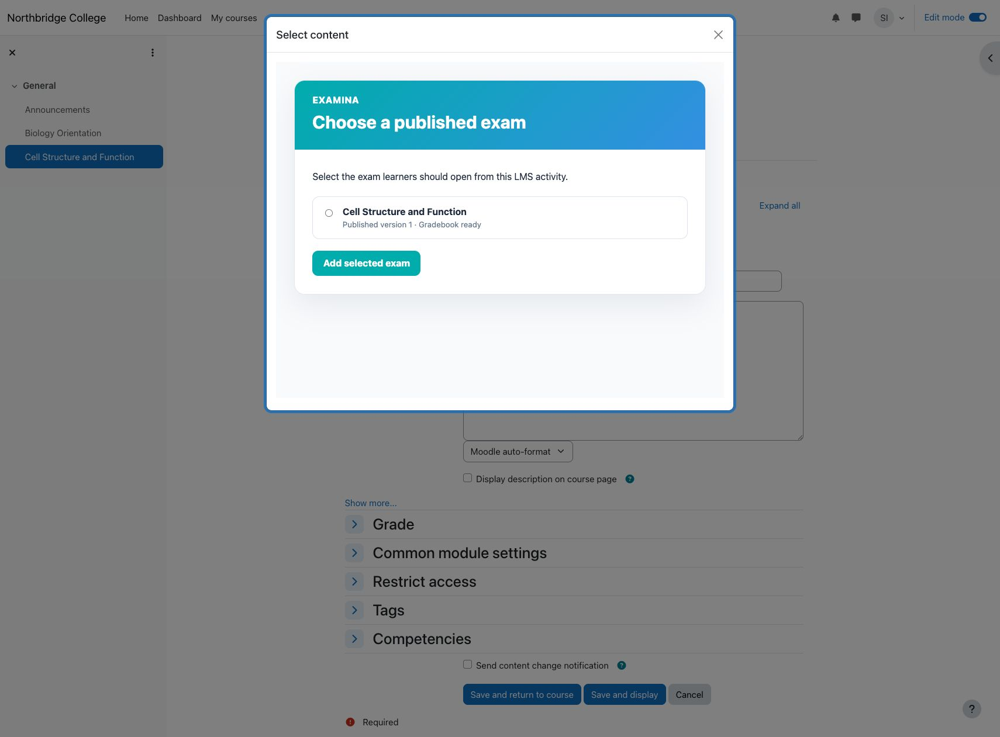
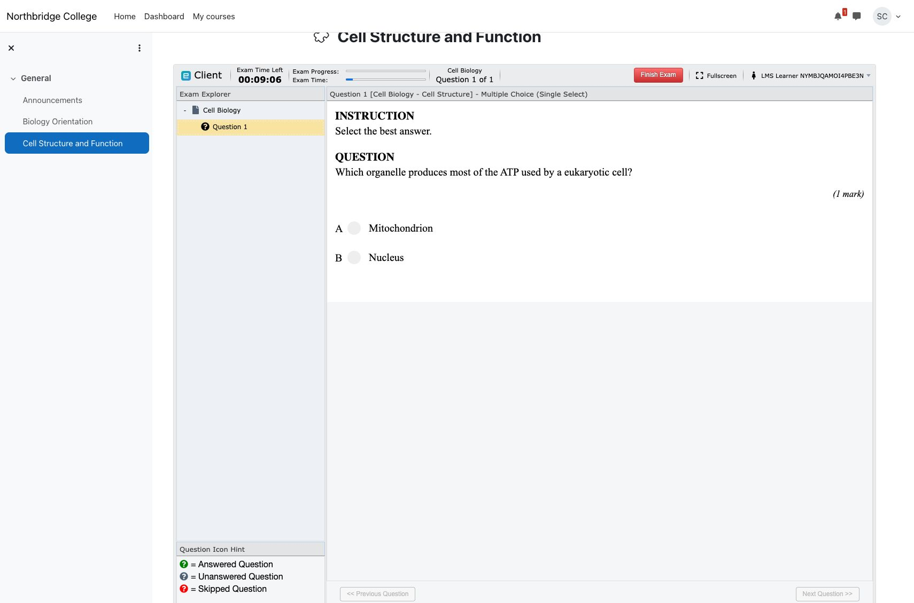
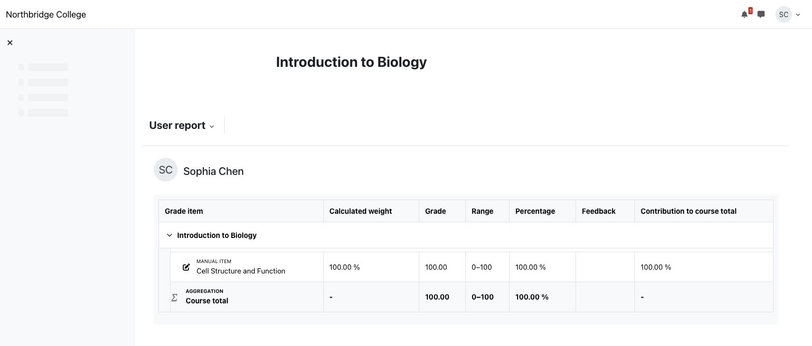

# Integrate examina.io with Moodle

Connect examina.io to Moodle once, then let teachers add published assessments
to their courses without sending learners to a separate login page. Learners
open the assessment inside Moodle, and examina.io can return their scores to
the Moodle gradebook.

!!! note "Integration preview"

    Moodle integration is currently in testing. Ask your examina.io account
    contact to enable LMS integrations for your organization, and validate the
    complete workflow in a non-production Moodle course before using it for a
    live assessment.

The screenshots in this guide use a fictional **Northbridge College** course,
**Introduction to Biology**, and an assessment named **Cell Structure and
Function**. Your organization, URLs, IDs, and course names will be different.

## What the integration provides

- **One Moodle sign-in:** a learner who opens the activity in Moodle does not
  sign in to examina.io again.
- **Assessment selection:** a teacher chooses a published exam through LTI
  Deep Linking instead of copying an exam URL.
- **Course-aware placement:** examina.io associates the LMS course and activity
  with the selected published assessment.
- **Grade return:** LTI Assignment and Grade Services (AGS) can return the
  learner's result to the correct Moodle grade item.
- **Optional course roster:** Names and Roles Provisioning Services (NRPS) can
  provide a minimal course roster when your institution enables it.

## Before you start

You need:

- a Root or Administrator account in examina.io;
- a Moodle site-administrator account;
- a teacher account for the Moodle course;
- at least one exam that has been imported and published in examina.io Manager;
- public HTTPS addresses for Moodle and examina.io; and
- permission to configure an LTI 1.3 external tool and its services in Moodle.

Ensure both systems have accurate clocks. LTI login messages are time-bound,
and a large clock difference can cause an otherwise valid launch to fail.

## How the two systems exchange settings

Moodle creates the **Client ID** and **Deployment ID** that examina.io needs.
Examina.io then creates the registration-specific public-key URL that Moodle
needs. For that reason, initial configuration has two passes:

1. create a provisional external tool in Moodle;
2. copy Moodle's registration details into examina.io;
3. copy the final examina.io endpoints back into Moodle; and
4. activate the registration and test the complete flow.

!!! warning "Do not launch a provisional tool"

    If Moodle requires a public-key URL during the first pass, use a temporary
    HTTPS key-set endpoint controlled by your institution. It may return an
    empty JSON Web Key Set (`{"keys":[]}`). Do not make the tool available to
    courses or attempt a launch until you have replaced it with the exact
    examina.io **Public key set (JWKS)** URL in [Step 4](#4-finish-the-moodle-tool).

## 1. Create the provisional Moodle tool

As a Moodle site administrator:

1. Open **Site administration → Plugins → Activity modules → External tool →
   Manage tools**.
2. Select **Configure a tool manually**.
3. Enter a recognizable tool name, such as **examina.io assessments**.
4. Set **LTI version** to **LTI 1.3**.
5. Set **Public key type** to **Keyset URL**.
6. Enter the provisional key-set URL described above.
7. Enter the public examina.io address in the tool, login, and redirect fields
   for now. You will replace these values with the exact endpoints in Step 4.
8. Keep the tool hidden from the activity chooser until configuration is
   complete, then save it.

Moodle now assigns the tool identity needed by examina.io.

## 2. Copy Moodle's registration details

Return to **Manage tools**, find **examina.io assessments**, and select **View
configuration details**. Keep this page open while you configure examina.io.

Copy these Moodle values into the matching examina.io fields:

| Moodle configuration detail | examina.io registration field |
| --- | --- |
| Platform ID | Issuer URL |
| Client ID | Client ID |
| Deployment ID | Deployment ID |
| Authentication request URL | Authorization endpoint |
| Access token service URL | Token endpoint |
| Public keyset URL | LMS public keys (JWKS) URL |

Treat the identifiers as configuration data. Do not put access tokens, private
keys, user launch messages, or passwords in documentation or support tickets.

## 3. Add the Moodle registration in examina.io

As an examina.io Root or Administrator:

1. Open **Home → Settings**.
2. Find **Bring Examina into your LMS**.
3. Select **Add registration**.
4. Choose **Moodle** and enter a descriptive name, such as **Northbridge
   College Moodle**.
5. Paste the six Moodle values from Step 2.
6. Enable only the services that you will also grant in Moodle:
   - **Assessment selection (Deep Linking)** lets teachers choose a published
     exam from within the Moodle activity form.
   - **Grade return (AGS)** sends completed results to the Moodle gradebook.
   - **Course roster (NRPS)** reads course membership when your workflow needs
     it.
7. Select **Save registration**.

The saved registration card displays the exact **OIDC login initiation**, **LTI
launch**, **Deep Linking**, and registration-specific **Public key set (JWKS)**
endpoints. Keep the card open for the next step.

## 4. Finish the Moodle tool

Edit **examina.io assessments** in Moodle and replace every provisional value
with the exact value shown by examina.io:

| Moodle external-tool field | Value from examina.io |
| --- | --- |
| Tool URL | LTI launch URL |
| Initiate login URL | OIDC login initiation |
| Redirection URI(s) | LTI launch URL and Deep Linking URL, one per line |
| Public keyset | Public key set (JWKS) |
| Content selection URL, when shown | Deep Linking URL |

Then configure the Moodle services and privacy settings:

- Enable **IMS LTI Assignment and Grade Services** if you enabled **Grade
  return (AGS)** in examina.io.
- Allow the tool to accept grades from Moodle's delegated service settings.
- Enable **Names and Role Provisioning Services** only if you enabled **Course
  roster (NRPS)** and your institution permits roster access.
- Make the tool available in the activity chooser after the endpoint and
  service settings are complete.
- Use **Embed** as the default launch container if you want the assessment to
  remain inside the Moodle course page.

Sharing a Moodle display name or email address is optional. Examina.io can map
an LTI learner using the platform's pseudonymous subject identifier. Enable
additional profile fields only when your institution has a documented need and
lawful basis for sharing them.

Return to examina.io and activate the registration. A suspended or revoked
registration cannot accept new launches.

## 5. Add a published assessment to a Moodle course

As a teacher in the destination course:

1. Turn **Edit mode** on.
2. Select **Add an activity or resource** in the desired course section.
3. Choose **External tool** or the preconfigured **examina.io assessments**
   tool.
4. Enter the learner-facing activity name.
5. Select **Select content**.

Examina.io opens a list of published assessments that the instructor may use.
Choose the intended assessment and confirm the selection. In this example, the
teacher chooses **Cell Structure and Function** for **Introduction to Biology**.

Save the activity and open it once as the teacher. Confirm that the activity
shows the correct assessment title and does not prompt for a separate
examina.io username and password.

## 6. Verify the learner experience

Use a fictional learner enrolled in the course for validation:

1. Sign in to Moodle as the learner.
2. Open the course and select the assessment activity.
3. Confirm that the expected exam opens inside Moodle.
4. Complete and submit the assessment.

The learner's Moodle identity, course, activity placement, and selected
published assessment are verified during the LTI launch. A URL copied from a
different course or environment is not a substitute for this launch.

## 7. Verify the returned grade

After the learner submits, open **Grades → Grader report** in Moodle. Confirm
that the result appears under the correct activity and learner.

Grade delivery is queued separately from exam submission so that a temporary
Moodle outage does not turn a completed assessment into a failed submission.
The result may therefore take a short time to appear. Refresh the gradebook
before investigating a missing result.

## Production validation checklist

Before enabling the tool for a live course, verify all of the following with a
non-production course and fictional users:

- The Moodle tool is active and uses the final examina.io endpoints.
- The examina.io registration is active in the correct organization and
  environment.
- Deep Linking lists only assessments the teacher is permitted to select.
- The selected activity launches the intended published assessment.
- The learner launches from Moodle without a second sign-in.
- A completed score reaches the correct learner and grade item.
- Reopening or refreshing the activity does not create duplicate grade items.
- NRPS is disabled when course-roster access is not needed.
- Both applications use public HTTPS URLs and trusted certificates.

## Troubleshooting

| Symptom | What to check |
| --- | --- |
| **Select content** is missing | Confirm that the tool is active, Deep Linking is enabled in both systems, the Deep Linking URL is present, and the current Moodle user can add activities. |
| The activity opens a blank page or the launch is refused | Check the issuer, Client ID, Deployment ID, OIDC login URL, launch URL, HTTPS certificate, iframe policy, and browser third-party-cookie restrictions. Ensure no internal Docker or private hostname appears in a browser-facing URL. |
| The wrong assessment opens | Edit the Moodle activity and select the published assessment again. Do not copy an activity between environments without reselecting its content. |
| The grade does not appear | Confirm that AGS and grade acceptance are enabled in Moodle, **Grade return** is enabled in examina.io, and the activity has a grade item. Allow a short time for queued delivery. |
| Course roster is unavailable | Confirm that NRPS is enabled and granted in Moodle. Assessment launch and grade return can continue without roster access. |
| Moodle reports a key or signature error | Confirm that Moodle uses the registration-specific examina.io JWKS URL, examina.io uses Moodle's current public-key URL, both clocks are accurate, and neither endpoint redirects to a login page. |

For Moodle's platform-side terminology and current menus, see the official
[External tools](https://docs.moodle.org/502/en/LTI_External_tools) and
[External tool FAQ](https://docs.moodle.org/502/en/LTI_External_tool_FAQ)
documentation.
