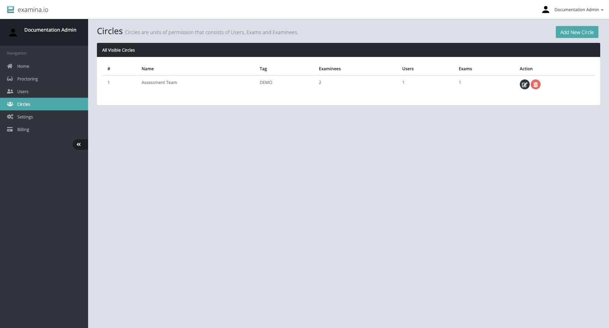

# Configure Circles and permissions

A Circle is a permission boundary made from selected **Users**, **Exams**, and
**Examinees**. A User can work with the resources made available through the
Circle, subject to the User's account role.

## Plan the Circle

Use a Circle for a stable area of responsibility, such as:

- a course or department;
- an exam program;
- a customer or tenant;
- a school location; or
- a restricted assessment project.

Choose a clear name and a short tag, for example **Biology 201** and
**BIO-201**. Avoid putting confidential candidate information in the Circle
name.

## Create a Circle

1. Open **Home → Circles**.
2. Select **Add New Circle**.
3. Enter a unique name and optional tag.
4. Select the Users who need access.
5. Select the Exams they will administer or proctor.
6. Select the Examinees they need to view or manage.
7. Save the Circle.

Root and Administrator accounts can create and edit Circles. Other authorized
Users can see the Circles relevant to them.

## Verify the boundary

The Circles table shows a count of Examinees, Users, and Exams in each Circle.
After saving:

1. compare each count with your intended membership;
2. edit the Circle and spot-check names in all three lists;
3. test with a Regular or Invigilator account;
4. verify that an unrelated exam and examinee are not visible; and
5. verify that required Proctor workspaces appear for invigilators.

## Circles compared with Groups

| Circle | Group |
| --- | --- |
| Controls staff access | Organizes examinees for bulk operations |
| Contains Users, Exams, and Examinees | Contains Examinees |
| Used across Home, Manager, and Proctor permission checks | Used in Manager for assignment work |

It is common to use both. A course Circle can restrict the course team, while a
Group can contain the students mapped to a particular sitting.

## Maintain Circles safely

- Update membership when staff responsibilities change.
- Remove completed exams and stale examinee access according to policy.
- Keep administrator-only resources out of broad Circles.
- Review Circle membership before enabling live proctoring.
- Test permission changes with a non-administrator account.

Deleting a Circle removes the permission grouping. Confirm the impact on staff
access before deleting it.
