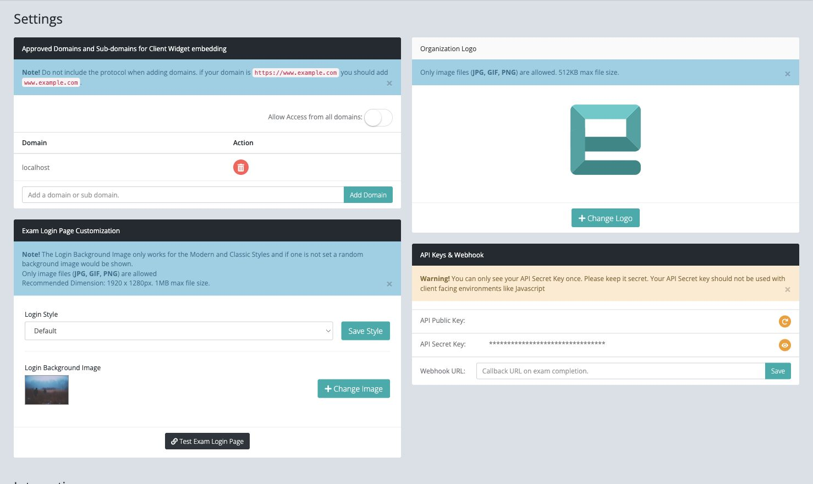

# Organization settings and branding

Root and Administrator accounts can open **Home → Settings** to manage
organization-wide branding, embed domains, API credentials, webhook delivery,
and supported learning-platform connections.

## Approved embed domains

The domain allowlist controls which sites may load the Client widget.

1. Enter only the hostname, without **http://** or **https://**.
2. Select **Add Domain**.
3. Remove domains that are no longer used.

For example, enter **assessment.example.edu**, not
**https://assessment.example.edu/exams**.

Avoid **Allow Access from all domains** in production. If you add
**localhost** or another development host, remove it after testing because it
is not exclusive to your organization.

See [Embed the Client app](../../integrations/embedding-client-app.md).

## Organization logo

The logo appears in supported organization-facing and examinee-facing views.
Select **Change Logo** and choose a JPG, GIF, or PNG file up to 512 KB.

Use a high-contrast logo with transparent or neutral padding, then verify it on
both desktop and mobile-sized screens.

## Exam login page

Choose **Default**, **Modern**, or **Classic** as the organization login style.
Modern and Classic can use an organization background image. If none is
provided, Client can show a supplied background.

1. Choose a login style and select **Save Style**.
2. Select **Change Image** to upload a JPG, GIF, or PNG background.
3. Use a 1920 × 1280 pixel image when possible and keep it within the displayed
   size limit.
4. Select **Test Exam Login Page** and check readability, logo placement, and
   mobile behavior.

See [Customize the exam login page](../client/custom-login-page.md).

## API keys

The **API Public Key** can identify approved browser integrations such as the
Client widget. The **API Secret Key** authenticates server-to-server requests
and must never be included in browser JavaScript, public source code, a mobile
application, or documentation screenshots.

The secret is displayed only once when it is created. Store it immediately in
an approved secret manager. Regenerating a key can break existing integrations
until every consumer is updated.

See [API keys and webhooks](../../integrations/api-keys-and-webhooks.md).

## Completion webhook

Enter an HTTPS callback URL to receive a notification when an exam is
completed. The endpoint should validate requests according to the current API
contract, return a successful response promptly, and process lengthy work
asynchronously.

Do not use a private administrative page or a URL containing credentials as the
webhook URL.

## Learning-platform integrations

Settings can show connectors such as Google Classroom, Blackboard, and
Brightspace. Availability and setup requirements depend on your plan and the
external platform configuration.

Use a dedicated integration account where appropriate, grant only required
permissions, document the owner, and disconnect integrations that are no longer
used.

## Change-control checklist

After changing organization settings:

1. test the login page with a designated exam;
2. test every production embed domain;
3. verify API consumers if a key changed;
4. send a test event through your webhook workflow when available; and
5. record the change and rollback plan for high-stakes environments.
