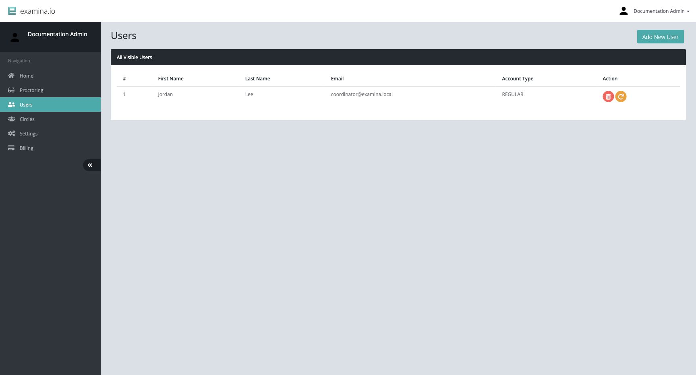

# Manage Users and account roles

Users are staff accounts for authoring, administering, or proctoring exams.
They are not examinee records.

Root and Administrator accounts can open **Home → Users**. The Users table
shows each visible staff member's name, email address, and account type.

## Choose an account role

| Role | Assign to |
| --- | --- |
| **Root** | A primary organization owner who needs billing and full organization administration |
| **Administrator** | A trusted administrator who manages Users, Circles, and Settings |
| **Regular** | A question author, exam coordinator, or other staff member who needs Designer or Manager |
| **Invigilator** | A person who only supervises eligible live-proctored exams |

Use the lowest role that supports the person's work. See [User roles and
permissions](../../getting-started/roles-and-permissions.md) for the detailed
access model.

## Add a User

1. Open **Home → Users**.
2. Select **Add New User**.
3. Enter the person's name and work email address.
4. Choose the account type.
5. Submit the form.
6. Confirm that the person completes the required account-verification or
   password setup process.
7. Add the User to the appropriate Circles.

Use an individual work account for each person. Shared administrator or
invigilator credentials weaken accountability and make offboarding difficult.

## Reset or remove access

The action buttons in the Users table allow an administrator to reset a User's
password or delete the User.

Before a password reset, verify the requester's identity through an approved
channel. Before deleting a User:

1. confirm the exact account;
2. review any operational handoff;
3. remove or reassign Circle responsibilities;
4. preserve required audit information; and
5. notify the account owner according to policy.

Deleting a staff User is different from deleting an examinee.

## Review access regularly

At least before each high-stakes assessment:

- remove accounts for people who no longer need access;
- reduce Administrator accounts that no longer administer the platform;
- confirm Invigilators are attached only to the required exams through Circles;
- verify that Regular users cannot see unrelated exams or examinees; and
- protect Root accounts with strong, unique credentials.

## Troubleshoot missing access

If a staff member can sign in but cannot see an exam or examinee:

1. confirm the account role supports the required application;
2. confirm the User belongs to the relevant Circle;
3. confirm the exam and examinees are in that same Circle; and
4. sign out and back in after permission changes when necessary.

Continue with [Circles and permissions](circles-and-permissions.md).
