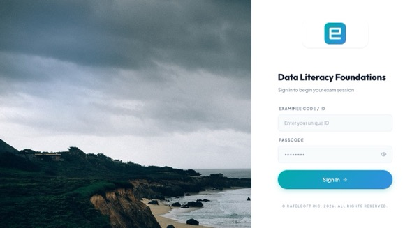
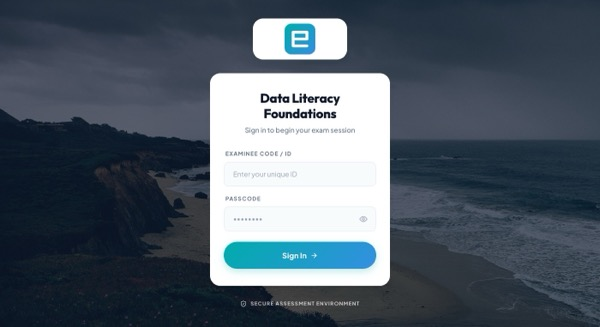
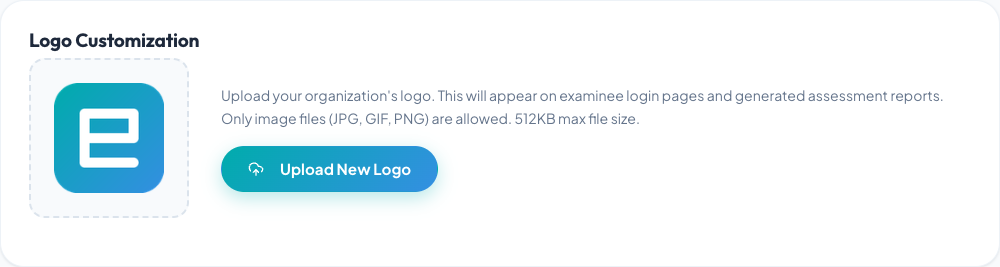
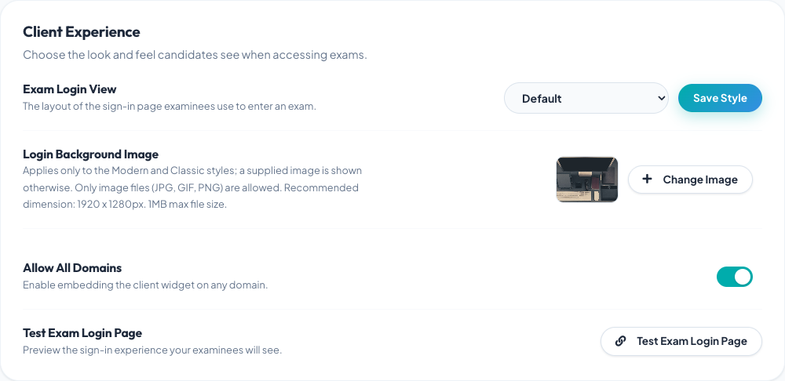

# Customize the exam login page

Root and Administrator accounts can configure an organization-wide login style,
logo, and background from **Home → Settings**. Availability can depend on the
organization's plan.

## Choose a style

Client provides three styles:

1. **Default**
2. **Modern**
3. **Classic**

Default supports exam-specific branding created in Designer. Modern and Classic
use the organization's logo and background image.

Classic applies a visual treatment over the background to preserve contrast
around the login fields. Check the final image in both styles rather than
assuming they will look identical.

## Upload an organization logo

1. Sign in as a Root or Administrator.
2. Open **Home → Settings**.
3. In **Organization Logo**, select **Change Logo**.
4. Choose a JPG, GIF, or PNG file no larger than 512 KB.
5. Wait for the upload to complete.

If no logo is set, the organization name can appear in its place. Use a logo
with clear padding and enough contrast for both light and photographic
backgrounds.

## Select a login style

1. Find **Exam Login Page Customization**.
2. Choose Default, Modern, or Classic.
3. Select **Save Style**.

The change applies at the organization level. Coordinate it with anyone
running an active exam before switching styles.

## Upload a background

1. Select **Change Image**.
2. Choose a JPG, GIF, or PNG file.
3. Use the displayed recommended dimensions—1920 × 1280 pixels—and stay within
   the displayed file-size limit.
4. Wait for the upload to finish.

Modern and Classic can use a supplied background when no custom image is set.
Select the small preview to inspect the current background at a larger size.

## Test the result

If at least one exam is available, select **Test Exam Login Page**. Check:

- logo size and sharpness;
- text contrast;
- the login form on desktop and mobile widths;
- keyboard focus and field readability;
- loading time on a slower connection; and
- whether the correct organization identity is unmistakable.

Open the test in a private browser window to see the examinee experience
without relying on the administrator session.

## Image guidance

- Avoid text embedded in the background; it can be cropped or obscured.
- Keep the visual focus away from the login form.
- Compress large photos before upload.
- Use images your organization is permitted to publish.
- Do not place candidate names, exam questions, or other confidential data in
  branding assets.

For the rest of the organization settings, see [Organization settings and
branding](../administration/organization-settings.md).
