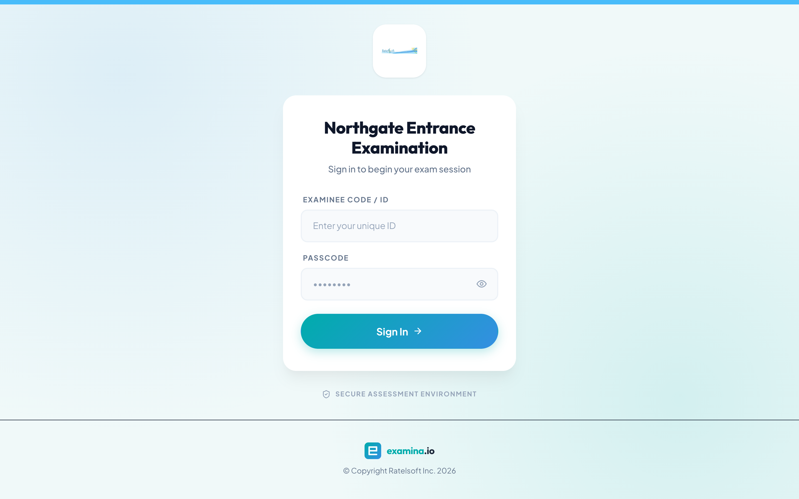
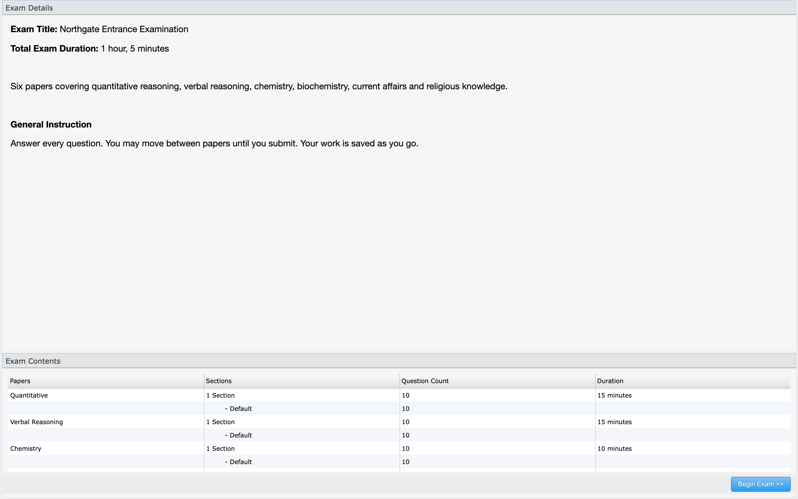
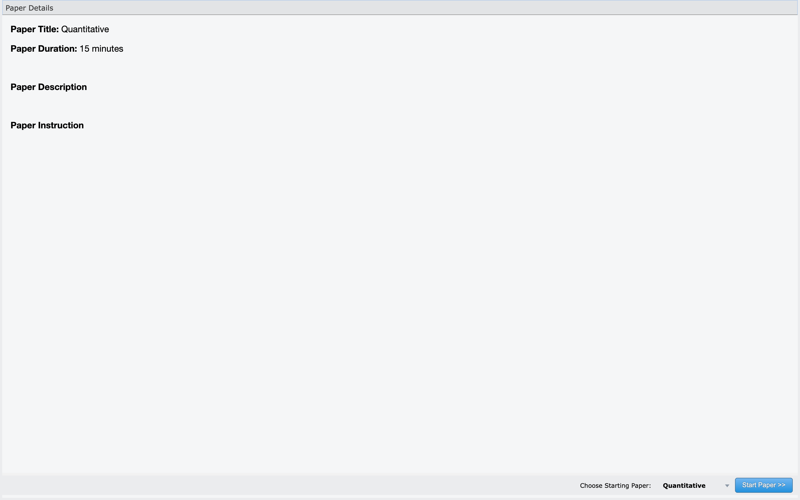
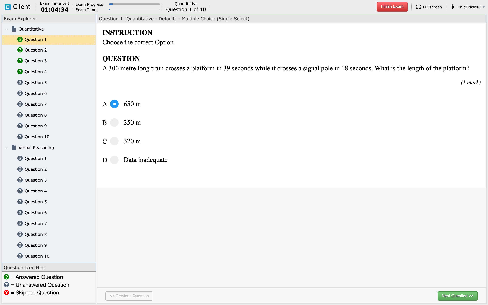
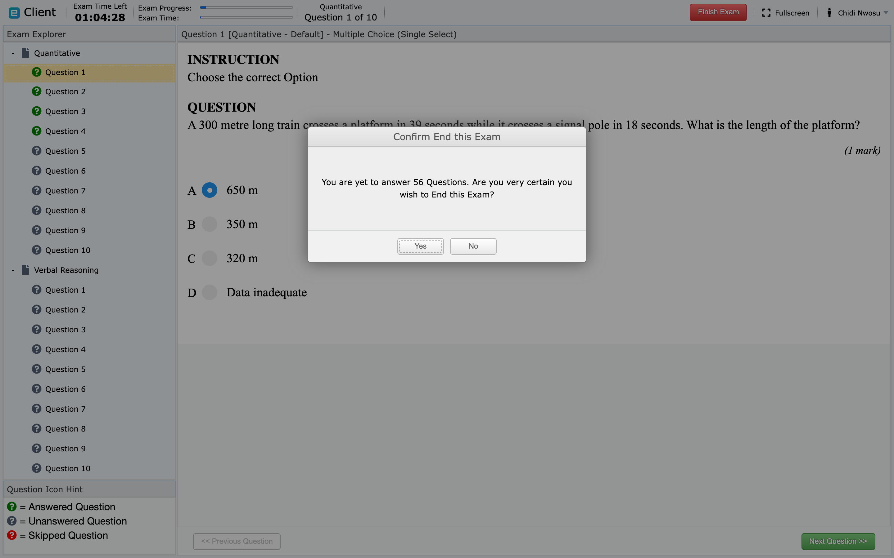
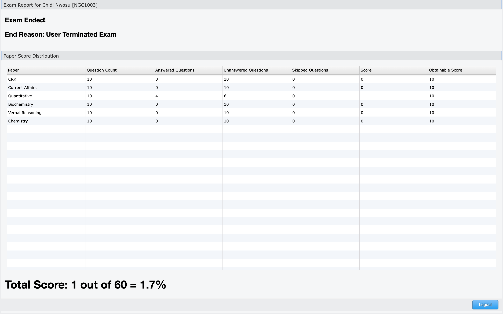

# Take an exam with Client

This guide is for examinees. Your school or assessment provider controls the
exam schedule, credentials, device rules, and support process, so follow their
instructions when they differ from this general guide.

## Before exam day

- Confirm the exam date, start time, and time zone.
- Keep the exact exam link supplied by the organizer.
- Confirm how you will receive your examinee code and passcode.
- Use a supported, up-to-date browser and a device that meets the organizer's
  rules.
- Arrange a stable power source and internet connection.
- If proctoring is required, test your camera, microphone, and screen-sharing
  permissions.
- Close unneeded applications, browser tabs, VPNs, and bandwidth-heavy
  downloads unless your organizer says otherwise.
- Ask for an accommodation before exam day if you need one.

## Sign in

1. Open the exam link supplied by your organizer. Do not begin from an old
   bookmark for a different exam.
2. Enter your examinee code or ID and passcode exactly as provided.
3. Select the sign-in button.
4. Complete any required identity, camera, microphone, screen, or environment
   checks.
5. Read the exam and paper instructions before starting.

The appearance of the login page may be branded by the organization.

!!! tip "If your organizer emailed you a sign-in link"
    Some organizers send a link that signs you in without a code or passcode.
    Open it on the device you intend to sit the exam on, and do not forward it
    to anyone — it carries your identity for this exam.

    The link keeps working if your browser closes and you need to reopen it,
    but it will not let you sit the exam in two places at once. If it does not
    work, it takes you to this sign-in page, where your code and passcode still
    work as normal.

Once you are signed in, Client shows the exam before it starts: its title, the
total duration, the description and general instruction written by the exam
author, and a table of the papers with their question counts and durations.

Read this screen properly. The duration shown is for the whole sitting, and the
paper table is the clearest picture you will get of what is ahead.

## Start the exam

Depending on the configuration, the exam may:

- become available only after a scheduled time;
- require an invigilator's approval;
- contain one or several papers;
- restrict navigation between papers;
- limit which devices can be used; or
- use live proctoring or identity verification.

If a paper is missing or the start button remains unavailable, contact the
organizer rather than trying a different person's credentials.

How the exam begins depends on how it was configured:

- if the exam is **server controlled**, Client shows *Awaiting Manager to issue
  Exam Start Order* and waits — you cannot begin until the invigilator starts it;
- otherwise a **Begin Exam** button appears, and you choose which paper to start
  with.

## While answering

The header carries the time left, the exam progress, the current paper, and the
question number. The **Exam Explorer** on the left lists every paper and
question, and the legend beneath it explains the icons: green for answered,
grey for unanswered, red for skipped. Use it to find what you still owe before
you submit.

- Watch the remaining time shown by Client.
- Use the exam navigation controls rather than the browser's Back button.
- Read whether questions are sequential or randomized.
- Check whether a paper requires only a subset of its questions.
- Avoid refreshing or closing the page unless support instructs you to do so.
- Keep the device powered and connected.

Client periodically saves your exam state while an internet connection is
available. A local answer is not safely stored on the server until a save
succeeds.

## Finish and submit

1. Review unanswered or skipped questions if the exam allows navigation.
2. Use the **Finish Exam** control at the top right.
3. Read the confirmation carefully before submitting.
4. Wait for the completion message or result page.
5. Do not close the browser while a submission is still processing.

Client counts what you have left and tells you before it accepts the
submission, so this dialog is the last chance to go back:

Whether a score is displayed immediately depends on the organizer's settings.
A generic completion message can be normal.

Where results are shown, Client breaks them down per paper — questions
answered, unanswered and skipped, the score and the obtainable score — with the
total underneath.

## If something goes wrong

Keep the exam page open, record the time, and contact the organizer's support
channel. Include your name or examinee code, exam title, the action you were
taking, and the exact message shown. Never send your passcode in a public chat
or screenshot.

See [Test-day troubleshooting](troubleshooting.md) for specific recovery steps.
