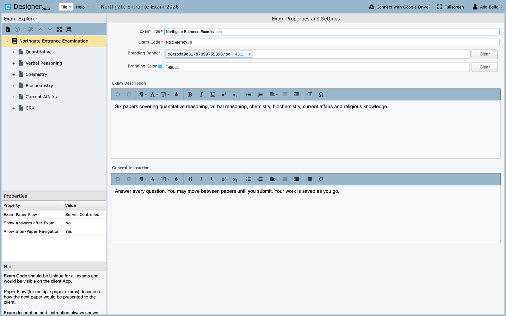

# The exam

Select an exam in Exam Explorer and the editing pane shows everything that
applies to the exam as a whole. Most of it is visible to the examinee, so it is
worth being deliberate here rather than filling it in to get past the screen.

## Exam title

The name the examinee sees while sitting the exam. Write it the way you would
print it on a paper: *Northgate Entrance Examination*, not *entrance-final-v2*.

!!! note "About the examples"
    The screenshots throughout the Designer pages use one sample project,
    **Northgate Entrance Exam 2026**, containing a single exam called
    *Northgate Entrance Examination* with six papers. Where this guide names a
    field's value, it is the value visible in that sample.

## Exam code

**Required, and the field most likely to cause trouble later.**

The code identifies the exam when it reaches Manager, so it has to be unique
across every exam your organization imports. Two exams sharing a code cannot
both be imported cleanly.

Two rules the field enforces:

- **No spaces**
- **Letters and numbers only** — no punctuation, dashes or underscores

`NGCENTRY26` is fine, and is the code used in the sample. `NGC ENTRY 26` and
`NGC-ENTRY-26` are not.

!!! tip "Decide a scheme before your second exam, not your twentieth"
    Something like `SUBJECT` + `YEAR` + `SITTING` stays readable and stays
    unique: `NGCENTRY26`, `NGCMOCK26`. Retrofitting a scheme means re-importing
    exams that are already in use.

## Branding banner and colour

Optional. The banner appears to the examinee while they take the exam, and the
colour tints the surrounding interface.

Use these when a single organization delivers exams on behalf of several
departments or clients, and each needs to look like its own. **Clear** removes
either without affecting the other.

## Description

Shown to the examinee before they begin, and the first thing a nervous candidate
reads. Say what the exam **is** and what it **covers**, in plain language.

Useful things to put here:

- what the exam is for — entrance, end of module, practice
- which subjects or topics it covers, and how many papers
- roughly how long the whole sitting takes
- what a pass means, if that is decided in advance

The sample uses:

> Six papers covering quantitative reasoning, verbal reasoning, chemistry,
> biochemistry, current affairs and religious knowledge.

Avoid restating the exam title, and avoid internal references like version
numbers or committee codes. The candidate cannot act on those.

## General instruction

Also shown before the exam starts. This is for the rules of the room: things a
candidate needs to know to sit the exam properly, applying across **every**
paper.

Useful things to put here:

- whether they must answer every question, or may choose
- whether they can move between papers, and whether they can return
- what is permitted — calculator, notes, scratch paper
- what happens if the connection drops or the browser closes
- how to report a problem during the exam
- whether the work is saved as they go

The sample uses:

> Answer every question. You may move between papers until you submit. Your work
> is saved as you go.

That last sentence does more than it looks: candidates who do not know their
answers are being saved will avoid navigating, and will spend the exam anxious
about losing work.

!!! tip "Say what happens when things go wrong"
    The instruction most worth including is the one nobody writes: what to do if
    the connection drops. A candidate who knows they can rejoin will rejoin. One
    who does not may give up.

Per-paper instructions belong on [the paper](paper.md) instead — timing,
question choice, and anything that applies to one subject only. Anything you
would otherwise repeat on every paper belongs here.

## Exam paper flow

For exams with more than one paper, this decides how the next paper arrives.

| Setting | Behaviour |
|---|---|
| **Server Controlled** | The server decides when each paper opens. Everyone moves together |
| **Client Controlled** | The examinee moves on when they finish the current paper |
| **Force Continuous** | Papers run one after another without a break |

Choose **Server Controlled** for a sitting where everyone must be on the same
paper at the same time. Choose **Client Controlled** when candidates should
work at their own pace within an overall time limit.

## Show answers after exam

Whether the examinee sees which answers were right once they submit.

Useful for practice tests and revision. Almost always wrong for a live
assessment, because it hands the answer key to everyone who sits early.

## Allow inter-paper navigation

Whether an examinee can go back to a paper they have already left.

Set to **No** when each paper is meant to be sealed once submitted. Set to
**Yes** when the whole exam is really one long paper split into parts and
candidates should be free to revisit.

## Before you move on

The exam code is the one setting that is genuinely painful to change later,
because it is how Manager recognises the exam. Everything else can be edited and
re-exported without consequence.

Next: [The paper](paper.md).
