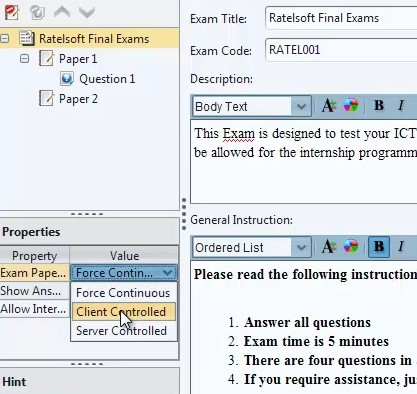

# Create and configure an exam

An exam is the top-level assessment in Designer. It contains one or more papers,
and each paper contains its questions and optional sections.

## Create the project

1. Select **File → New Exam Project**.
2. Select **Untitled Exam** in Exam Explorer.
3. Complete the Exam properties.
4. Save the project.

## Core exam properties

**Exam Title**

: The examinee-facing name. Make it specific enough to distinguish the
  assessment and sitting.

**Exam Code**

: A unique alphanumeric code used when the exam is imported into Manager. Avoid
  spaces and punctuation.

**Branding Banner**

: An optional exam-specific image displayed in supported Default-style Client
  views.

**Branding Colour**

: An optional organization or exam colour used in supported Client views.

**Exam Description and General Instruction**

: Information shown before the exam starts. These required fields must be
  complete before the exam can be exported.

Write instructions that state permitted materials, navigation rules, timing,
submission expectations, and the support process without exposing answers.

## Paper flow

For an exam with several papers, choose how the next paper starts:

- **Force Continuous:** Client starts the next paper after the previous paper
  finishes.
- **Client Controlled:** the examinee chooses when to start an available paper.
- **Server Controlled:** Manager controls when examinees may start a paper.

Choose the flow that matches the operating plan, then test it with an exam that
contains the same number of papers as production.

## Result and navigation settings

**Show Answers After Exam**

: Enable for a learning or practice workflow only when revealing answers is
  appropriate. Keep it disabled for assessments where answers must remain
  confidential.

**Allow Inter-Paper Navigation**

: Allows the examinee to move between papers. Review how this interacts with
  the chosen paper flow and timing rules.

## Validate before export

- Title and code are final and unique.
- Description and general instructions are complete.
- Branding is legible and appropriately licensed.
- Paper flow matches the delivery plan.
- Answer display and inter-paper navigation are intentional.
- Every paper has been previewed.
- The editable project has been saved.

A project can contain multiple exams, but export one exam at a time for import
into Manager.

Continue with [Create and configure a paper](paper.md).
