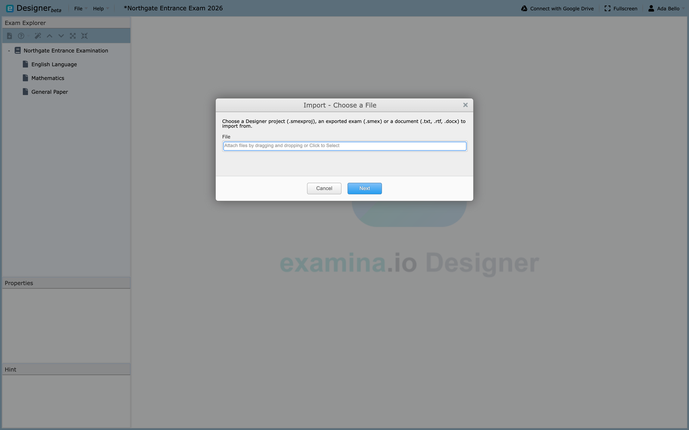
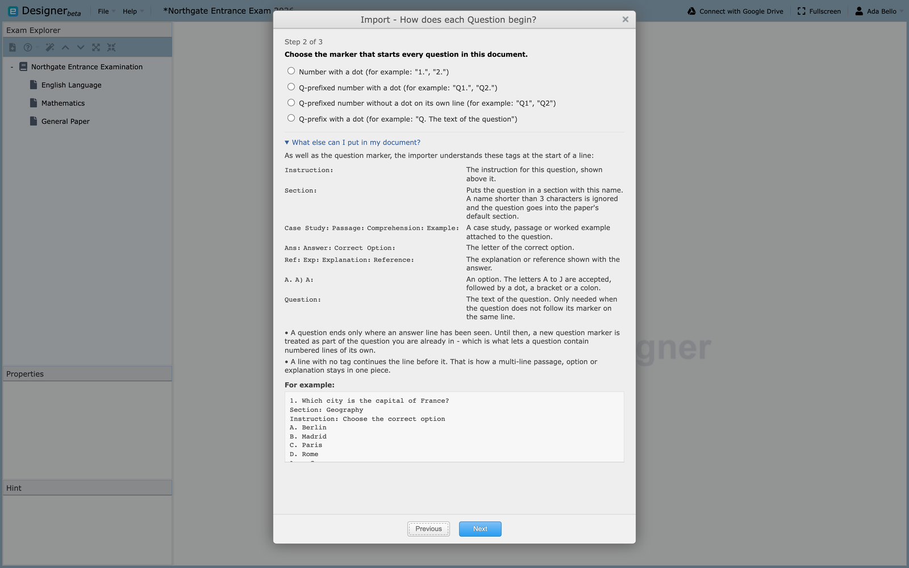
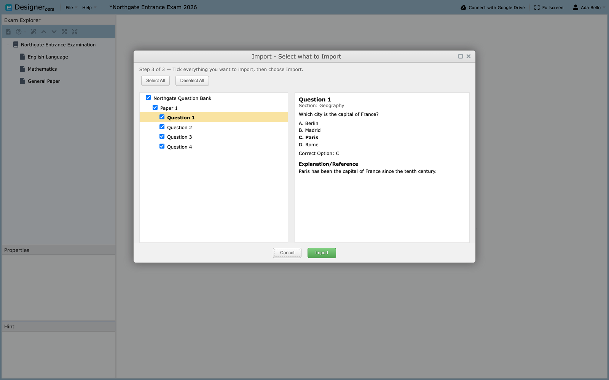
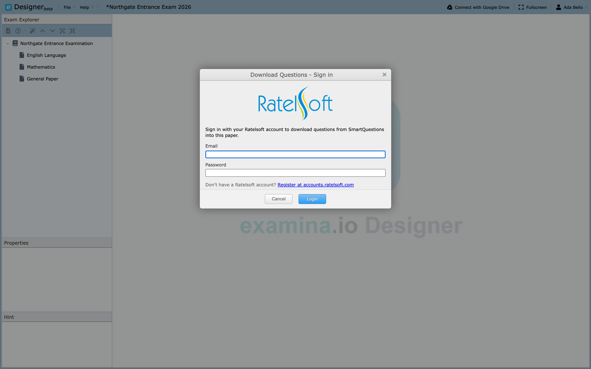

# Import existing content

Designer can take content from another Designer project, from an exam already
exported for delivery, or from a word-processed document in which the questions
are typed out. All three run through the same wizard: choose a file, tell
Designer how the document is laid out, then tick what you want. Where you
started decides what you are allowed to bring in.

## What Designer accepts

A `.smexproj` project file and a `.smex` exported exam are read directly, since
their content is already structured. A `.txt`, `.rtf`, or `.docx` document is
read as text, so Designer needs the marker and tags below to find where each
question begins. `.doc` is not supported: open it in Word and save a `.docx`.

!!! warning "Files from a newer version will not import"
    A project or exported exam saved by a later version of the application than
    the one you are running is refused, with the same message opening it would
    give: *"The file version is greater than the application version"*. Ask
    whoever sent it to save from a matching version.

## Start an import

1. Choose **File → Import Exams from another Project** to bring whole exams
   into the open project.
2. Right-click an exam in **Exam Explorer** and choose **Import Papers From
   File** to add papers to that exam.
3. Right-click a paper and choose **Import Questions From File** to add
   questions to that paper.

Step 1 asks for the file. Documents go to step 2 next; anything else to step 3.

## Tell Designer where each question starts

Step 2 appears for documents only. Choose the marker that begins every question
in your file: `1.`, `Q1.`, `Q1` on a line of its own, or `Q.`. Nothing is
preselected, so pick the one that matches your document. Open **What else can
I put in my document?** for a reference to the tags, each at a line start.

### Tags

**Question:**

: The question text, needed only when it does not follow the marker.

**Instruction:**

: The instruction for that question.

**Section:**

: Puts the question in a named section.

**Case Study:**, **Passage:**, **Comprehension:**, **Example:**

: A passage attached to the question. The tag you choose is the label shown.

**A.**, **A)**, **A:**

: An option. Letters A to J are recognized.

**Ans:**, **Answer:**, **Correct Option:**

: The letter of the correct option.

**Ref:**, **Exp:**, **Explanation:**, **Reference:**

: The explanation shown with the answer.

### The cases that catch people out

A question is only finished once an answer line has been seen. That is what
lets a numbered list inside a case study, `1. First point` and `2. Second
point`, stay in the passage instead of each line starting a question of its
own. A question with no answer line never closes and swallows the ones after
it, so one imported question holding the text of several usually means a
missing **Ans:** line. A second answer replaces the first; it does not add one.

A line carrying no tag continues the line before it, which is how a multi-line
case study stays in one piece, and why a stray note between questions is
appended to the line above. Untagged text before any tag becomes the question
text, and a later **Question:** tag overrides it. A **Section:** name under
three characters is ignored and the question lands in the paper's default
section. Document import always produces multiple-choice single-select items,
so fill in the blank and multiple select must still be [authored by
hand](questions.md).

## Choose what to import

Step 3 shows what Designer found as an Exam → Paper → Question tree.

1. Tick the exams, papers, or questions you want.
2. Select each one to read it in the preview pane on the right.
3. Choose **Import**.

Only the levels your entry point allows are tickable: importing papers lets you
tick papers and questions but not exams; importing questions, only questions.

Images inside a `.docx` are imported with their questions; any image too large
or in a format Designer cannot display is skipped, counted, and reported when
the import finishes. What arrives is ordinary Designer content, so preview it,
set scores and sections, and save the project.

## Download Questions

**Download Questions** is a separate feature, not part of the import wizard.
Right-click a paper and choose it to pull questions from SmartQuestions.

1. Sign in with your Ratelsoft account.
2. Choose a scheme, then up to five subjects.
3. Set how many questions to take from each subject, between 1 and 100.
4. Choose sequential or randomized order, then download.

The sign-in is not stored. Designer asks for it again in a new session.

To copy content inside the open project, see [Reuse project
content](importing-questions.md).
