# Import exams, papers, and questions

Designer can reuse content from another project or import simple questions from
a structured text file. Save a copy of the destination project before a large
import.

## Open an existing project

To continue editing a saved project:

1. Select **File → Open Project**.
2. Choose the project file.
3. Confirm the imported exam, papers, and questions.
4. Save the project under the intended name.

## Import exams from another project

Use this when the destination project should contain an additional exam.

1. Select **Import Exams from a Project**.
2. Choose the source project.
3. Select one or more exams.
4. Expand an exam to review its papers and questions.
5. Confirm the import.

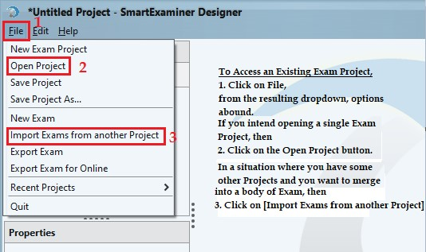

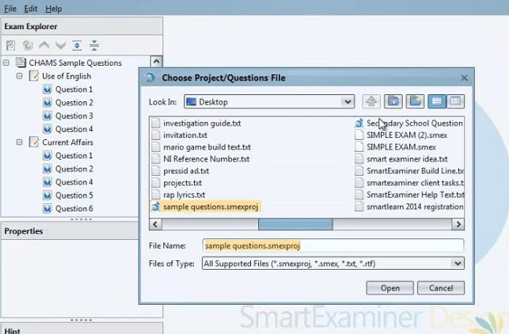

Use **Select All** and **Deselect All** when the source contains many items.

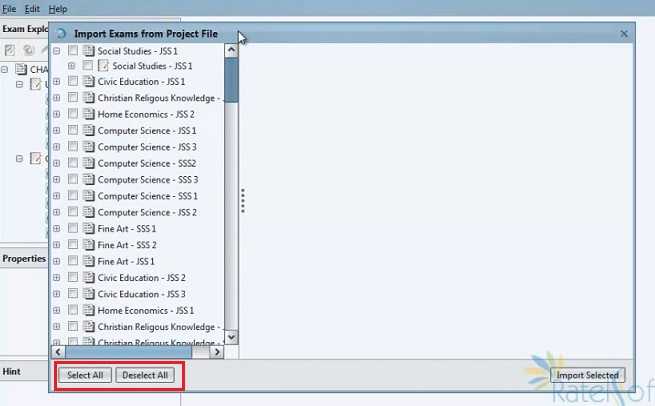

Imported content remains editable. Review properties and instructions because
the source project may have been designed for a different delivery workflow.

## Import papers into an exam

Use this when you want papers added to an existing destination exam:

1. Right-click the destination exam.
2. Select **Import Paper from File**.
3. Choose the source file.
4. Select one or more papers.
5. Expand papers to include or exclude particular questions.
6. Confirm the import.

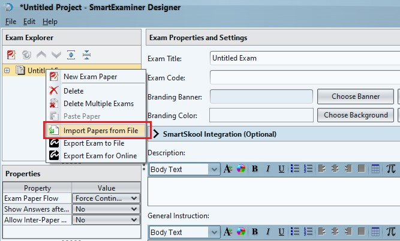

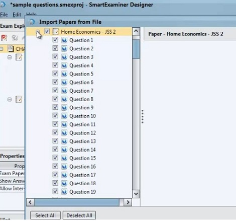

Importing an exam creates another exam in the project. Importing papers adds
those papers to the selected existing exam.

## Import questions into a paper

1. Right-click the destination paper.
2. Select **Import Questions from File**.
3. Choose a supported project or question file.
4. Expand source exams and papers.
5. Select the required questions, including questions from more than one source
   paper when needed.
6. Confirm the import.

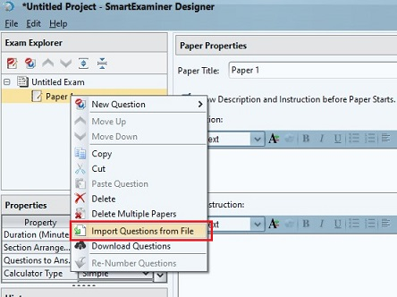

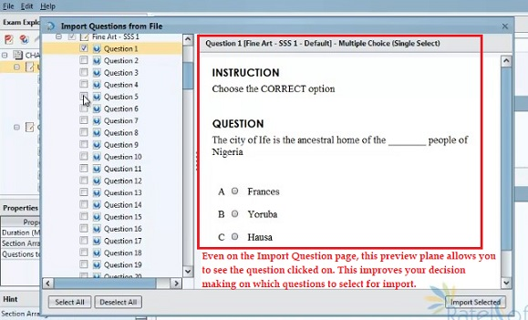

In this workflow, source exams and papers are navigation containers; only the
selected questions are copied into the destination paper.

## Import simple questions from text

Text import is suitable for questions without complex equations, images, or
other rich media. Start with a plain-text or rich-text template and use one
consistent pattern throughout the file.

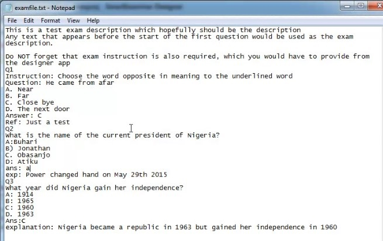

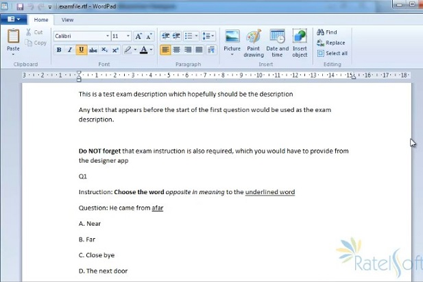

Text before the first question is treated as description or instruction.

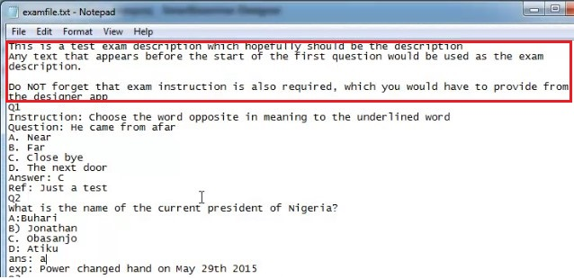

### Question markers

Use one consistent marker style:

- \`1.\`, \`2.\`, \`3.\`
- \`Q1.\`, \`Q2.\`, \`Q3.\`
- \`Q1\`, \`Q2\`, \`Q3\`
- \`Q.\` for automatically numbered questions

### Options and instructions

Put each option on its own line. Supported option labels can use a period,
colon, semicolon, or closing parenthesis when used consistently.

For question-specific instructions, begin the line with:

\`\`\`text
Instruction: Read the passage before answering.
\`\`\`

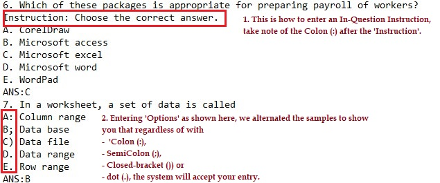

### Correct answer

End the options with an answer component:

\`\`\`text
Answer: B
\`\`\`

or:

\`\`\`text
Ans: B
\`\`\`

If the correct answer is intentionally unknown during drafting, retain the
\`Answer:\` or \`Ans:\` label and leave its value empty. The label also acts as a
delimiter; omitting it can cause options from the next question to merge into
the current question.

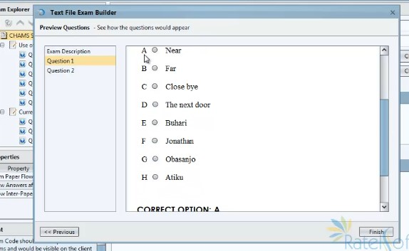

### Explanation or reference

After the answer, use one of:

- \`Explanation:\`
- \`Exp:\`
- \`Reference:\`
- \`Ref:\`

Example:

\`\`\`text
Q1. Which protocol secures an HTTPS connection?
A. FTP
B. TLS
C. SMTP
D. DNS
Answer: B
Explanation: HTTPS uses TLS to protect data in transit.
\`\`\`

## Validate imported content

After any import:

1. compare the imported item count with the source selection;
2. check for duplicate exam or paper titles;
3. verify question type, answer, score, and section;
4. preview formatting, equations, images, and audio;
5. recheck paper duration and questions-to-answer counts;
6. proofread instructions; and
7. save the destination project under a new version before export.
