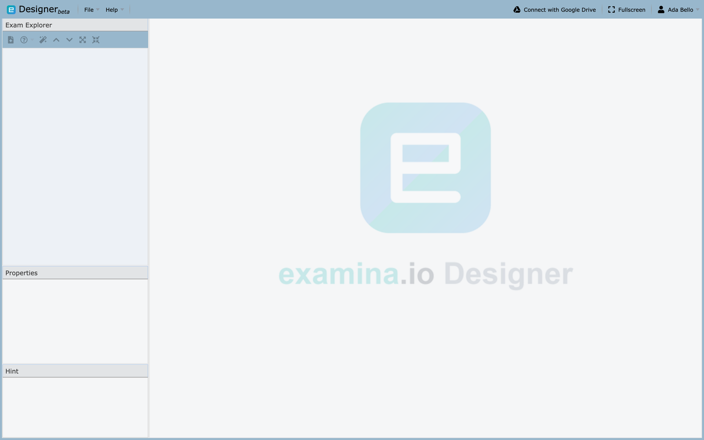
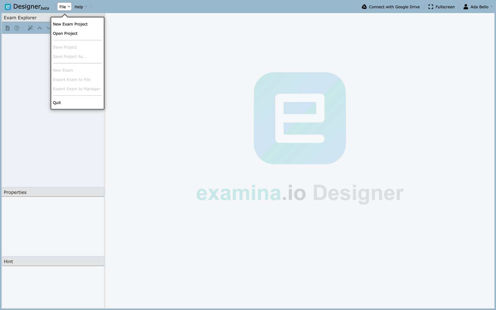
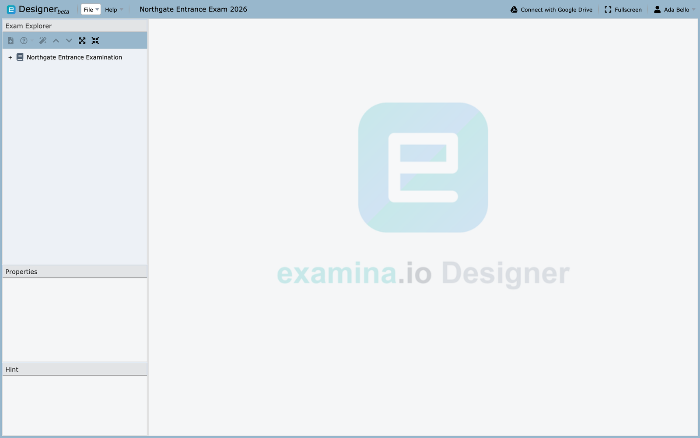

# Introducing Designer

Designer is where exams are written. You build a **project**, put one or more
**exams** inside it, divide each exam into **papers**, and fill the papers with
**questions**. When the exam is ready you send it to Manager, which is where it
gets assigned to people and delivered.

Designer runs in the browser and needs nothing installed.



## The workspace

Four areas, and they stay in the same place throughout.

| Area | What it holds |
|---|---|
| **Exam Explorer** (top left) | The project tree: exams, then papers, then questions |
| **Properties** (lower left) | Settings for whatever is selected in the tree |
| **Hint** (bottom left) | Plain-English explanation of the selected property |
| **Editing pane** (right) | The exam, paper, or question you are working on |

The Hint panel is worth knowing about. Select any row in Properties and it
explains what that setting does, which is usually faster than looking it up.

## Two kinds of file

This distinction causes more confusion than anything else in Designer, so it is
worth getting straight before you start.

| File | Extension | What it is |
|---|---|---|
| **Project** | `.smexproj` | Your editable source. Contains every exam, paper and question, and can be reopened and changed |
| **Exam** | `.smex` | A single exam packaged for delivery. This is what Manager consumes |

Keep the project. If you lose it and keep only the exported exam, you lose the
ability to edit comfortably.

## Create a project

1. Choose **File → New Exam Project**.
2. Designer creates an **Untitled Exam** inside it.
3. Select that exam in Exam Explorer to fill in its details.
4. Choose **File → Save Project** and keep the `.smexproj` somewhere safe.



Notice which items are greyed out. **Save Project**, **New Exam** and both
export actions only become available once a project is open, so an empty File
menu is not a fault.

## Open an existing project

**File → Open Project**, then choose a `.smexproj` file.

!!! warning "Projects from a newer version will not open"
    Designer refuses a project saved by a later version of the application than
    the one you are running, because it cannot be sure it understands
    everything inside. You will see *"The file version is greater than the
    application version"*.

    Export the exam from the version that created it, or ask whoever sent it to
    save from a matching version.



The screenshots in these pages use one sample throughout: a project named
**Northgate Entrance Exam 2026** holding a single exam, *Northgate Entrance
Examination*, split into six papers.

## The shape of an exam

Everything in Designer nests the same way:

```
Project
└── Exam                     one or more
    └── Paper                one or more
        └── Question         one or more
            └── Section      optional grouping within a paper
```

A **paper** usually maps to a subject, course or module. An exam with six papers
might be a single sitting covering six subjects, with its own duration and
question set for each.

## Add a paper

Right-click the exam in Exam Explorer and choose **New Exam Paper**, then select
the new paper to set its title, duration and instructions. See
[The paper](paper.md) for what each setting does.

## Add a question

Right-click a paper and choose the new-question action, or use the button below
Exam Explorer. Designer supports:

- Multiple Choice, single select
- Multiple Choice, multiple select
- Fill in the Blank

Set the answer, the score and the section, then use **Preview** to see the
question exactly as an examinee will. See [Creating questions](questions.md).

## A working order

1. Configure the [exam](exam.md) — title, code, description, instructions
2. Create each [paper](paper.md) and set its duration
3. Add sections if the paper needs them
4. Write the [questions](questions.md)
5. Preview and proofread
6. **Save the project**
7. Export one exam to [Manager](../manager/import-exams.md)

You can also [reuse papers and questions](importing-questions.md) from elsewhere
in the open project, or build drafts from existing documents with
[AI authoring](ai-question-authoring.md).
