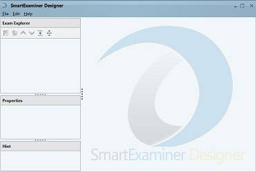
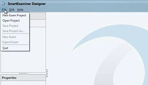
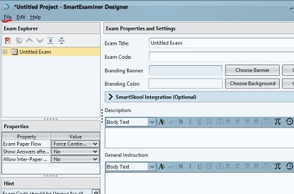
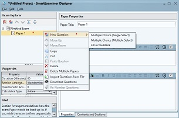

# Introducing Designer

Designer is the exam-authoring workspace. Use it to build an exam project,
organize papers and sections, create questions, configure scoring and timing,
and export a delivery package for Manager.

## Workspace tour

- **Toolbar:** File, Edit, Help, and other application commands.
- **Exam Explorer:** the project tree containing exams, papers, sections, and
  questions.
- **Properties:** settings for the item currently selected in Exam Explorer.
- **Hint:** contextual guidance for the selected item or command.
- **Question editor and preview:** content-authoring and examinee-preview panes
  shown when a question is selected.

## Create an exam project

1. Select **File → New Exam Project**.
2. Designer creates an **Untitled Exam**.
3. Select the exam in Exam Explorer.
4. Complete the required exam properties.
5. Select **File → Save Project** and save the editable project.

Save the project early and often. The project is your editable source; the
exported exam file is the package used for delivery.

## Add a paper

1. Right-click the exam in **Exam Explorer**.
2. Select **New Exam Paper**.
3. Select the new paper.
4. Set its title, duration, instructions, arrangement, and other properties.

An exam can contain multiple papers. Depending on your organization, a paper
may represent a subject, course, module, or assessment section.

## Add a question

Right-click a paper and select the new-question action, or use the **New
Question** button below Exam Explorer.

Designer supports these core question types:

- Multiple Choice — single select
- Multiple Choice — multiple select
- Fill in the Blank

Set the answer, score, section, shuffle behavior, and other properties, then use
Preview to check the examinee experience.

## Authoring sequence

For a reliable project:

1. configure the [exam](exam.md);
2. create and configure each [paper](paper.md);
3. add sections where needed;
4. [create questions](questions.md);
5. preview and proofread;
6. save the project; and
7. export one exam for [Manager](../manager/import-exams.md).

You can also [import exams, papers, or questions](importing-questions.md) from
supported files.
