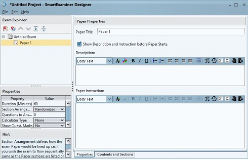
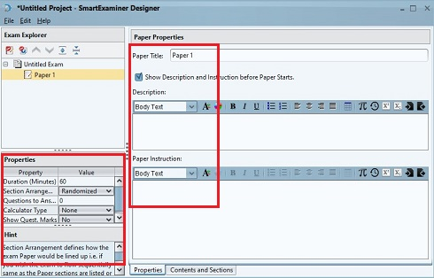
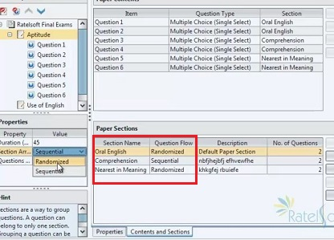

# Create and configure a paper

A paper is a timed unit inside an exam. It can represent a subject, course,
module, or another assessment segment. One exam can contain several papers.

## Create a paper

1. Create or open an exam project.
2. Right-click the exam in **Exam Explorer**.
3. Select **New Exam Paper**.
4. Select the new paper, such as **Paper 1**.
5. Complete its properties.

Paper titles must be unique within the exam.

## Paper properties

**Paper Title**

: The examinee-facing name, such as Mathematics, Aptitude, or Biology 201.

**Description and Instruction**

: Optional unless **Show Description and Instruction before paper starts** is
  enabled. Explain the paper-specific timing, choice, calculator, or navigation
  rules.

**Paper Duration**

: The allowed time in minutes. The minimum duration is five minutes.

**Section Arrangement**

: Controls whether sections are presented sequentially or selected in a
  randomized order.

**Questions to Answer**

: Sets how many questions Client presents from the available pool. Use this to
  draw a randomized subset from a larger question bank.

Set the questions-to-answer value after authoring is complete. Adding questions
later can reset it to the paper's total question count, so verify it again
before export.

**Calculator Type**

: Allows no calculator or one of the supported Simple, Advanced, or Base
  calculators.

**Show Question Marks**

: Controls whether the score value assigned to each question is visible to the
  examinee.

## Sections and content

Open **Contents and Sections** to create sections and set:

- the order of sections;
- sequential or randomized questions within a section; and
- how many questions are selected from each section.

For example, a language paper can contain Oral, Comprehension, and Vocabulary
sections in a fixed order while randomizing questions inside each section.

## Reuse questions

To duplicate existing content in the open project, copy a question and paste it
into the destination paper. See [Reuse project content](importing-questions.md)
for the supported workflow.

## Validate the paper

- The title is unique and recognizable.
- Duration and instructions agree.
- Section order and randomization are intentional.
- Questions-to-answer counts do not exceed the available pool.
- Calculator and score-display settings are appropriate.
- Every question has been previewed.

Continue with [Creating questions](questions.md).
