# Create questions in Designer

Questions belong to a paper and, when sections exist, to one section within that
paper.

## Add a question

1. Open an exam project and create a paper.
2. Right-click the paper and choose the new-question action, or select **New
   Question** below Exam Explorer.
3. Choose a question type.
4. Enter the prompt, answer choices or accepted answers, and optional
   explanation.
5. Set the question properties.
6. Open **Preview** and check the result.
7. Save the project.

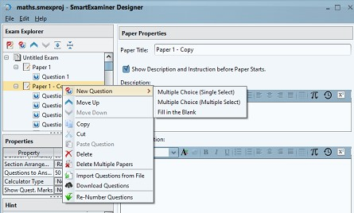

## Question types

Designer supports:

- **Multiple Choice — single select:** one option is correct.
- **Multiple Choice — multiple select:** more than one option can be correct.
- **Fill in the Blank:** the examinee enters text that is evaluated against the
  configured answer rules.

Choose the type that measures the intended skill. Do not turn a multi-answer
item into single select merely to simplify marking.

## Core properties

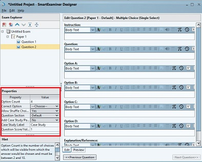

**Option Count**

: Sets the number of multiple-choice options. The supported range is 2 to 10.

**Correct Option**

: Identifies the correct answer for a single-select item. Multiple-select items
  allow the applicable correct choices.

**Allow Shuffle Choices**

: Randomizes option order in Client while preserving which option is correct.
  Avoid shuffling choices such as “all of the above” that depend on position.

**Question Section**

: Assigns the question to one section. Create the required paper sections
  before assigning questions.

**Question Score/Value**

: Sets the mark awarded for the question. Decimal values such as 0.5 are
  supported.

## Case studies and passages

Enable **Add Case Study/Passage** when a prompt depends on shared reading
material, an exhibit, a scenario, or a problem statement. Use **Case Study
Label** to replace the default label with a clearer name such as
**Comprehension Passage**.

If several questions use the same passage, keep the wording and formatting
consistent and preview each question.

## Configure defaults

For a series of similar questions, select **Edit → Configure Defaults**.

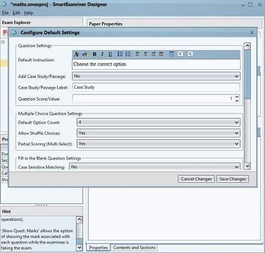

Defaults can cover:

- case study, label, and score;
- multiple-choice option count, shuffle, and partial scoring;
- fill-in-the-blank case, whitespace, order, and partial-scoring rules;
- paper duration, arrangement, calculator, and mark display; and
- exam paper flow, answer display, and inter-paper navigation.

Enable **Apply as Default Setting** to apply the configuration to questions
created afterward. Existing questions are not automatically rewritten.

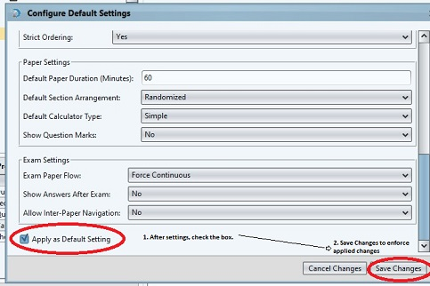

Disable the option when the repeated question series is complete.

## Edit and preview content

The Edit pane supports text formatting, headings, colour, lists, alignment,
superscript, subscript, symbols, expressions, images, audio, and tables.

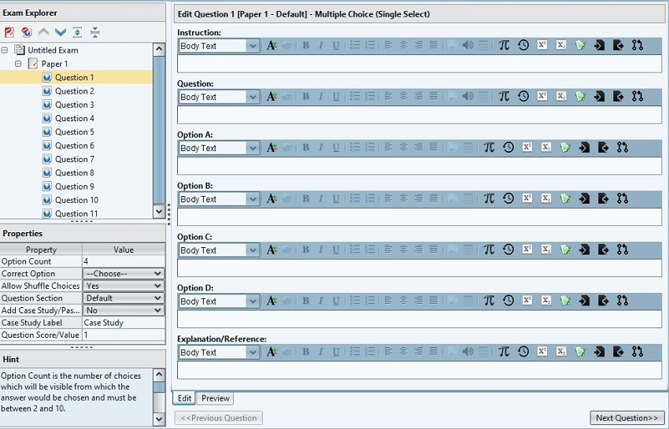

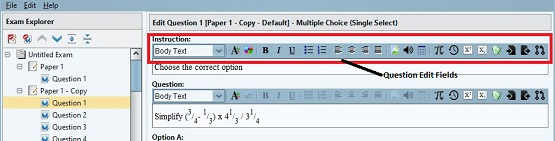

Use formatting to improve structure, not decoration. Confirm that important
meaning is not communicated by colour alone.

### Images

Keep an imported image within the limits shown by Designer. The existing editor
guidance recommends no more than 650 pixels wide and 500 KB so the image
renders reliably across desktop and mobile devices.

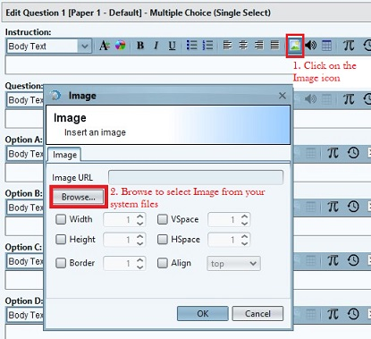

Resize and compress large images before import. Add enough wording in the
question for the image's purpose to remain understandable.

### Audio

Audio items can support listening questions. Configure the available volume,
pause, stop, and seek controls to match the assessment rules.

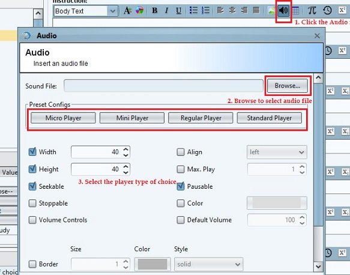

Test with headphones and the lowest bandwidth expected on exam day. Provide an
approved accommodation path when required.

### Tables

Use the table tool to add rows and columns.

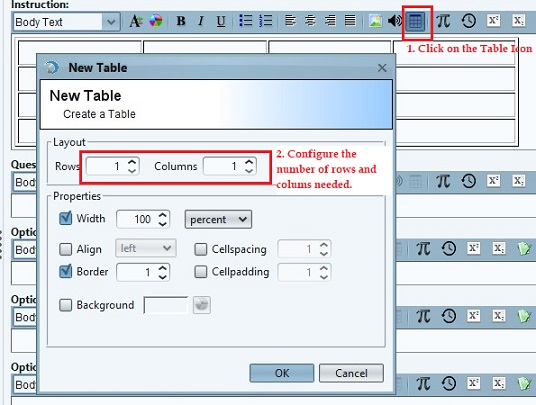

To edit or remove a table, right-click inside it and open **Table Properties**.

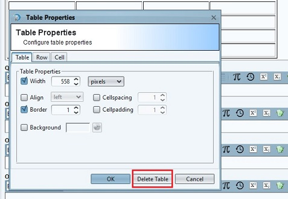

Keep tables small enough to fit supported screens without horizontal scrolling.

## Preview and quality check

Select **Preview** to inspect the rendered prompt and options.

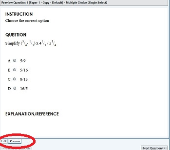

Before export, verify:

- the prompt has one defensible interpretation;
- the correct answer and score are set;
- distractors are plausible and not accidentally revealing;
- section assignment is correct;
- shuffled options remain meaningful;
- media loads and is readable or audible;
- spelling, grammar, and mathematical notation are correct; and
- the question works at the smallest permitted screen size.

To reuse existing content, see [Import exams, papers, and
questions](importing-questions.md).
