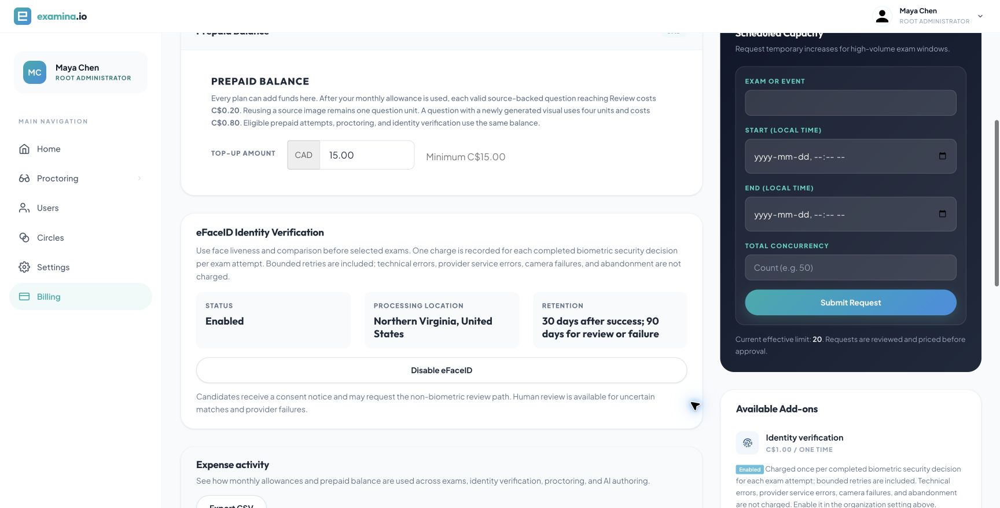
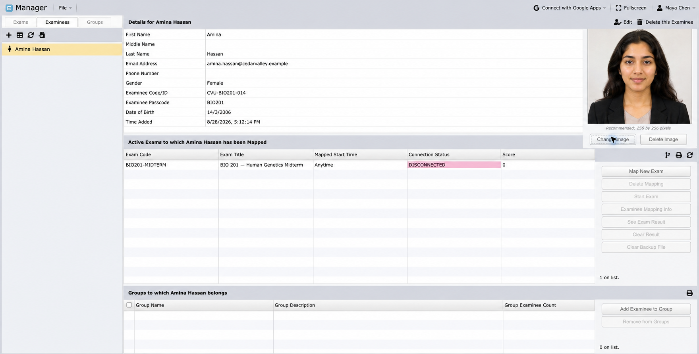
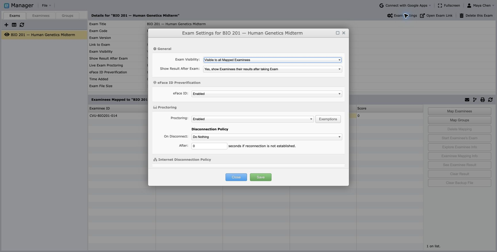
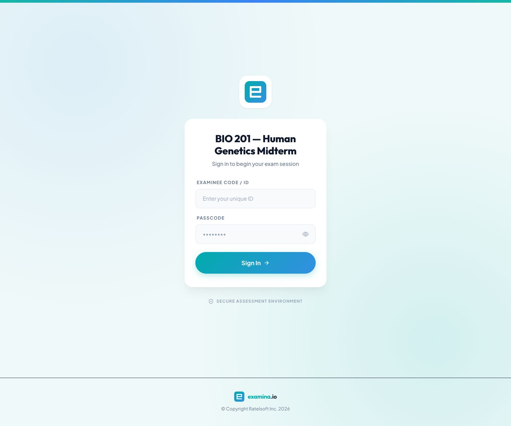
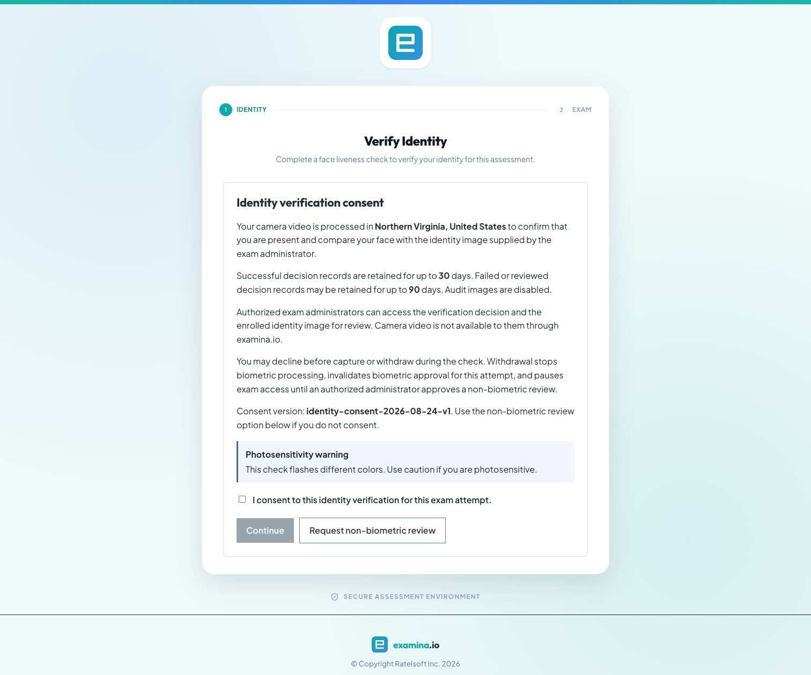
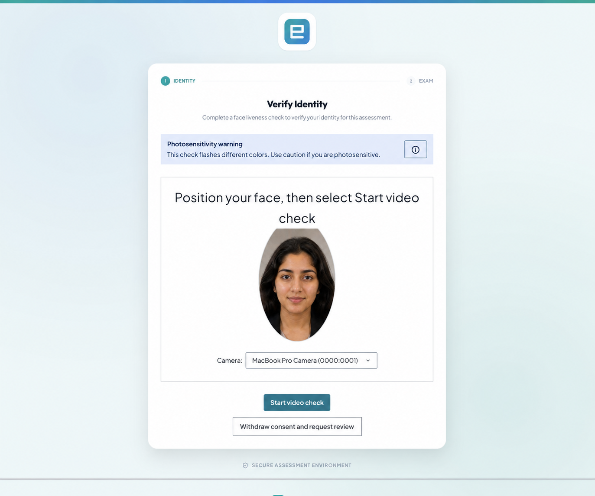

# Configure and use eFaceID

eFaceID helps an organization confirm that the person beginning a protected
exam is present and matches the identity photo supplied by an authorized exam
administrator. It combines a live camera check with a face comparison and
binds the resulting decision to that exam attempt.

This walkthrough uses a fictional **Cedar Valley University** account, a
candidate named **Amina Hassan**, and **BIO 201 — Human Genetics Midterm**.

!!! important "Keep a human fallback"

    A biometric decision must not be the only way a candidate can access an
    assessment. Publish a support route and use the built-in non-biometric
    review workflow for candidates who decline consent, cannot use the camera,
    or require an accommodation.

## Before you start

You need:

- a plan or contract that includes eFaceID;
- Root or Administrator access to enable the organization feature;
- Manager access to enroll candidates and configure the exam;
- one clear, current identity photo for each candidate;
- a supported desktop browser with a working camera; and
- a documented support and non-biometric review process.

Do not use a group photo, scanned document page, filtered selfie, or image with
more than one visible face as the enrollment photo.

## 1. Enable eFaceID for the organization

Open **Billing** from the account sidebar and find **eFaceID verification**.
Confirm that its status is **Enabled**. The card also shows the processing
location and the successful and review retention periods configured for the
organization.

The location is presented as a city or region and country—for example,
**Northern Virginia, United States**. Your organization's location and
retention periods can differ from this example.

## 2. Enroll the candidate's identity photo

In **Manager**:

1. Open **Examinees**.
2. Select the candidate.
3. Choose **Change Image** or the equivalent image action.
4. upload a recent, front-facing portrait with even lighting;
5. verify the candidate name, code, and exam mapping; and
6. save the candidate.

Only authorized administrators can access the enrolled image. Replace it when
the candidate's appearance has materially changed or when your organization's
identity policy requires a new image.

## 3. Protect the exam

Open the exam in Manager and select its settings or protection controls.
Enable:

- **eFaceID Verification** to require identity verification before this exam;
- **Live Proctoring** as well when an invigilator must monitor the sitting; and
- the intended retention and fallback settings for the assessment.

Map every candidate to the correct paper and confirm that each protected
candidate has an enrollment image. Test the complete workflow with a fictional
candidate before publishing a live assessment.

## 4. Candidate sign-in

The candidate opens the exam link and enters the code and passcode supplied by
the institution.

Tell candidates to use one browser window and avoid reopening the same attempt
on another device. An active attempt is deliberately protected against a
second simultaneous sign-in.

## 5. Review consent

Before the camera starts, Examina shows:

- why the check is required;
- the processing location;
- successful and review retention periods;
- who can access the decision and enrolled image;
- the photosensitivity warning; and
- the option to request non-biometric review.

The candidate selects the consent checkbox and chooses **Continue**. Consent
can be withdrawn while the check is running; withdrawal stops biometric
processing and pauses exam access for review.

## 6. Complete the liveness check

The browser requests camera access. The candidate should:

1. sit in a well-lit place without strong light behind them;
2. remove face coverings or tinted glasses when permitted and appropriate;
3. keep only one face in view;
4. centre their face inside the guide; and
5. follow the on-screen colour and movement prompts until a decision appears.

The published screenshot uses a fictional portrait for privacy. The controls
and workflow are the same as the tested live check.

## 7. Understand the outcome

**Approved**

: The successful decision is bound to this candidate, exam, and attempt. The
  candidate continues to device setup or the exam overview.

**Review required**

: The attempt pauses. An authorized administrator reviews the request and
  decides whether to approve a documented non-biometric path.

**Technical failure**

: The candidate receives a usable recovery message. Ask them to check camera
  permission, lighting, browser support, and network connectivity before
  retrying.

**Consent declined or withdrawn**

: No biometric approval is issued. The candidate uses **Request
  non-biometric review**, and the institution follows its accommodation and
  identity policy.

Only a completed biometric security decision is billable. Camera permission
errors, abandoned capture, and provider or network failures are not successful
decisions. Check **Billing** for the price and included allowance that apply to
your organization.

## 8. Review and audit safely

Authorized staff should record the reason and evidence for a non-biometric
approval without copying biometric images into email, chat, or support tickets.
Use the decision status, timestamps, candidate record, and institutional
identity evidence permitted by your policy.

Successful decision records and review records can have different retention
periods. Audit images are not automatically exposed to administrators. The
candidate's camera video is not available to administrators through
examina.io.

## Troubleshooting

**The camera prompt never appears**

: Allow camera access for the exact exam site, close other applications using
  the camera, reload the page, and retry. Some operating systems require the
  browser to be relaunched after a new system permission is granted.

**The face is not detected**

: Improve front lighting, centre the face, remove background faces, and make
  sure the full face is visible.

**The comparison is sent for review**

: Verify that the enrolled photo belongs to the candidate and is recent and
  clear. Do not repeatedly retry to force an approval; use the documented
  review path.

**The candidate changed browsers**

: Identity approval is bound to an attempt session. The candidate may need to
  complete the check again so an approval from another browser cannot be
  reused.

For an exam that also uses an invigilator, continue with
[Live exam proctoring](live-exam-proctoring.md).
