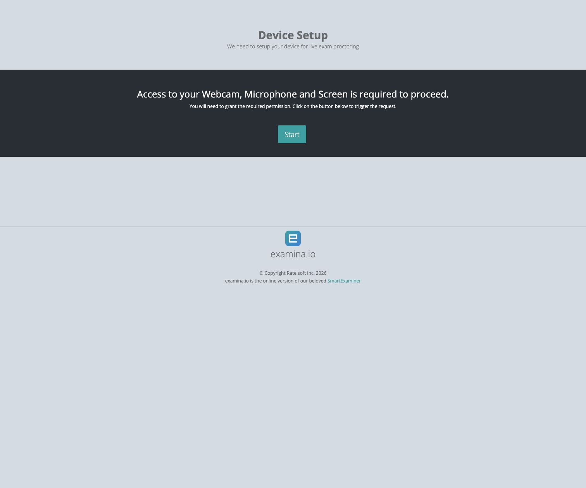
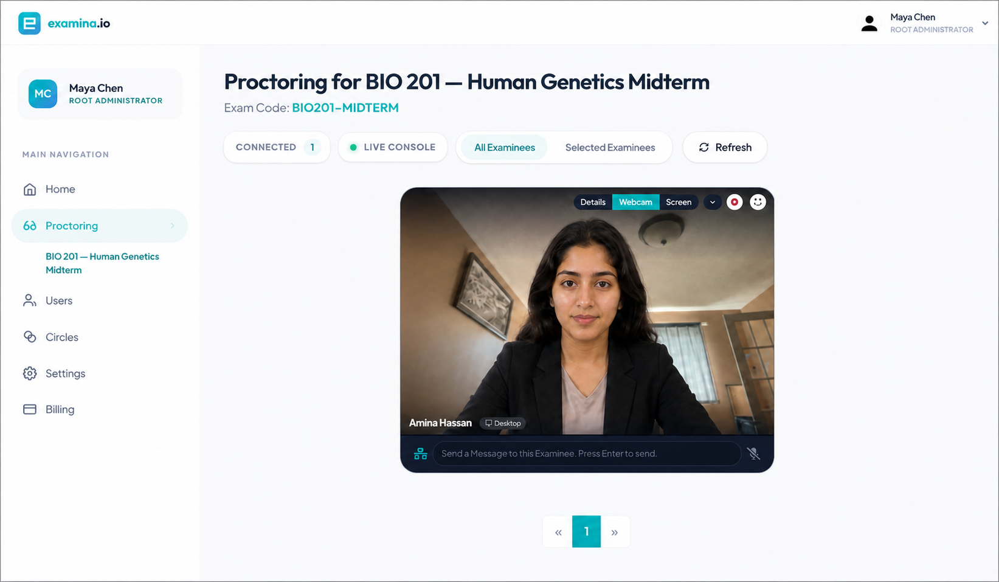
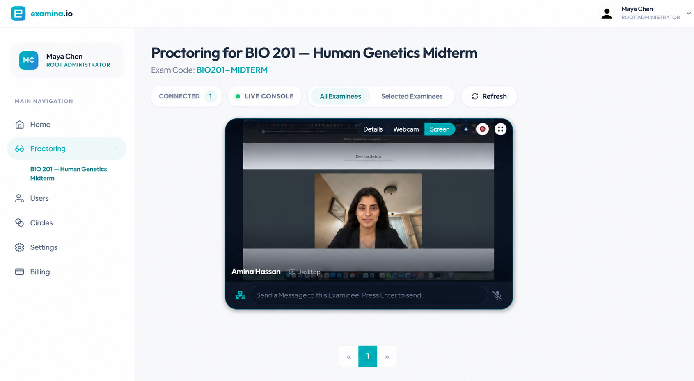
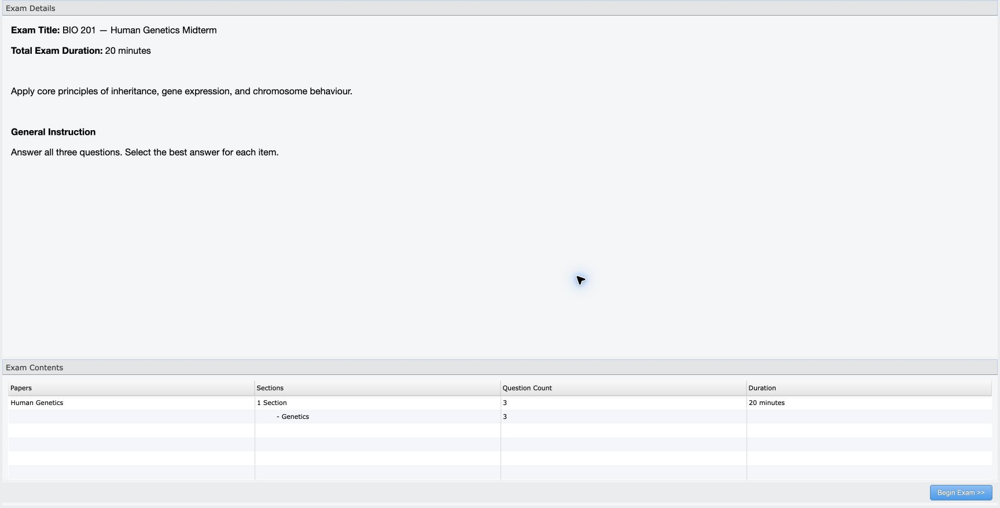
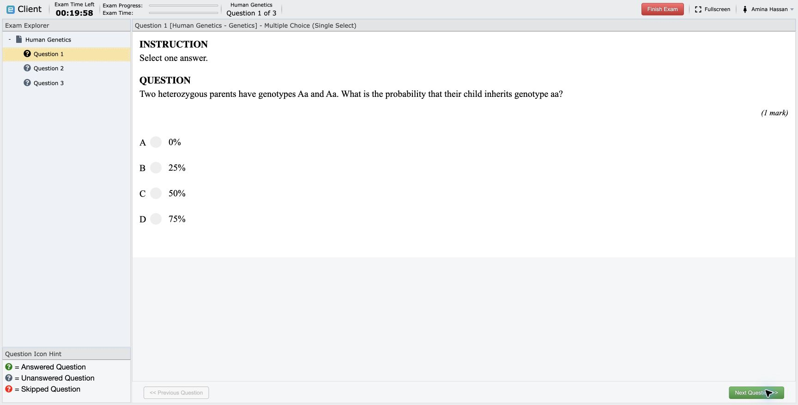
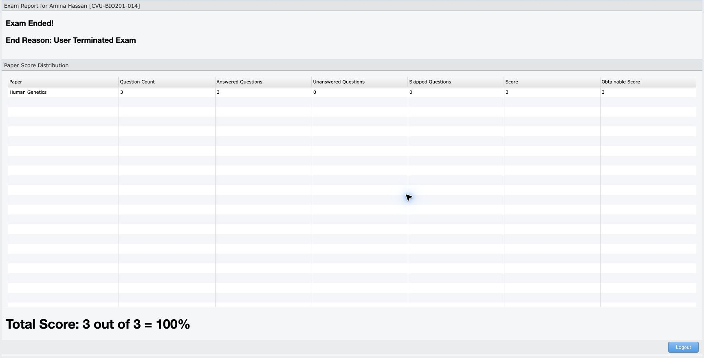

# Run a live proctored exam

Live proctoring lets an authorized invigilator see a candidate's webcam and
shared screen, communicate with the candidate, control admission, and monitor
the sitting from Examina's live console.

This walkthrough uses fictional **Cedar Valley University**, candidate
**Amina Hassan**, and **BIO 201 — Human Genetics Midterm**.

## Before exam day

### Configure the assessment

In Manager, confirm that:

- the exam is mapped to the correct candidates and papers;
- **Live Proctoring** is enabled;
- **eFaceID Verification** is enabled when identity verification is required;
- the exam duration, start window, instructions, and result visibility are
  correct;
- every invigilator has the correct role and Circle access; and
- the support and incident-escalation contacts are published.

### Prepare devices and networks

The candidate should use a desktop or laptop with:

- a supported current browser;
- a working camera and microphone;
- permission to share the exam screen or browser tab;
- a stable internet connection; and
- power connected for the full assessment.

The invigilator should use a separate computer and browser session. The live
console needs microphone permission so the WebRTC connection can be prepared.
Use HTTPS in production; ordinary LAN HTTP addresses are not secure browser
contexts and cannot request media permissions.

Run a rehearsal with a fictional candidate. Confirm webcam, microphone, screen
share, start authorization, answers, submission, and result reporting.

## 1. Candidate completes identity and device setup

The candidate signs in and, when configured, completes the
[eFaceID workflow](efaceid-identity-verification.md). Examina then displays
**Device Setup**.

The candidate chooses **Start**, allows camera and microphone access, and
selects the current exam tab or screen in the browser's sharing chooser. The
page waits while the invigilator connection is established.

!!! warning "Do not share private desktop content"

    Ask candidates to close unrelated windows and notifications before they
    share a screen. When browser-tab sharing satisfies your policy, select the
    exam tab instead of the entire desktop.

## 2. Invigilator opens the live console

The invigilator signs in to Examina and opens the protected exam under
**Proctoring** in the account sidebar. The console shows connected candidates
and a tile for each active sitting.

For a candidate who is waiting:

1. open the tile's action menu;
2. choose **Request Examinee Audio and Video Streams**;
3. allow the invigilator browser's microphone request; and
4. wait for the peer connection to complete.

If a candidate reconnects, refresh the console before sending another stream
request.

## 3. Verify the webcam

Choose **Webcam** on the candidate tile. Confirm that:

- the candidate is visible and matches the expected identity;
- the lighting and camera angle remain usable;
- no unexpected person is present; and
- the connection is stable.

The screenshot uses a fictional candidate image for privacy while preserving
the tested live console state.

## 4. Verify the shared screen

Choose **Screen** on the same tile. Confirm that the exam page is visible and
the candidate shared the intended tab or display.

The invigilator can switch between **Details**, **Webcam**, and **Screen** as
the assessment proceeds. Use the message field for concise, assessment-related
instructions. Follow institutional policy before pausing, disconnecting,
forcing logout, or stopping an attempt.

## 5. Authorize the candidate to start

After identity, environment, and device checks pass:

1. open the candidate tile's action menu;
2. choose **Authorize to start**; and
3. confirm that the console reports success.

The candidate receives **Setup Complete** and moves to the exam overview. They
review the title, duration, instructions, papers, and question count before
choosing **Begin Exam**.

Do not authorize the wrong candidate. Read the candidate name and exam title
before using the action.

## 6. Monitor the sitting

The candidate answers questions in the normal Client player while webcam and
screen monitoring continue.

During the sitting:

- watch connection state and stream health;
- use messages only when intervention is necessary;
- record incidents according to your organization's policy;
- distinguish network or device failure from candidate misconduct; and
- avoid collecting unrelated personal content from the shared screen.

## 7. Finish and verify the result

The candidate chooses **Finish Exam**, confirms submission, and receives the
configured result or completion view. In this rehearsal, Amina answered all
three questions and scored 3 out of 3.

In Manager:

1. confirm that the candidate state is finished or disconnected as expected;
2. open **See Examinee Result**;
3. compare answered, unanswered, skipped, score, and obtainable score values;
4. record any incident disposition; and
5. close the live console when no active candidates remain.

## Incident playbook

**Webcam works but the screen is blank**

: Ask the candidate to stop sharing and share the exam tab or intended screen
  again. Then request streams from the refreshed candidate tile.

**The console says Waiting for stream**

: Confirm both browsers use HTTPS or localhost, media permissions are allowed,
  the candidate clicked **Start**, and the invigilator requested the streams.
  Reload only one side at a time and refresh the console after reconnecting.

**Permission was allowed in system settings but still fails**

: Some operating systems require the browser application to quit and relaunch
  after a new camera or microphone permission is granted. Do this before the
  live assessment whenever possible.

**Candidate changes browser or device**

: The previous attempt lease may remain active briefly. End the old session
  cleanly or wait for its presence lease to expire. The candidate may need to
  repeat identity verification because approval is bound to the attempt
  session.

**Connection drops during the exam**

: Preserve the attempt, restore the network, and follow the configured
  disconnection policy. Do not clear a result or mapping as an ordinary
  recovery step.

## Test-day checklist

- Invigilators signed in on separate computers.
- Correct exam selected under **Proctoring**.
- Candidate identity and enrollment photo checked when eFaceID is used.
- Candidate camera, microphone, and screen permission granted.
- Webcam and shared screen verified before authorization.
- Correct candidate explicitly authorized.
- Connection and incidents monitored through submission.
- Final result verified in Manager.
- Temporary rehearsal accounts and recordings removed according to policy.
