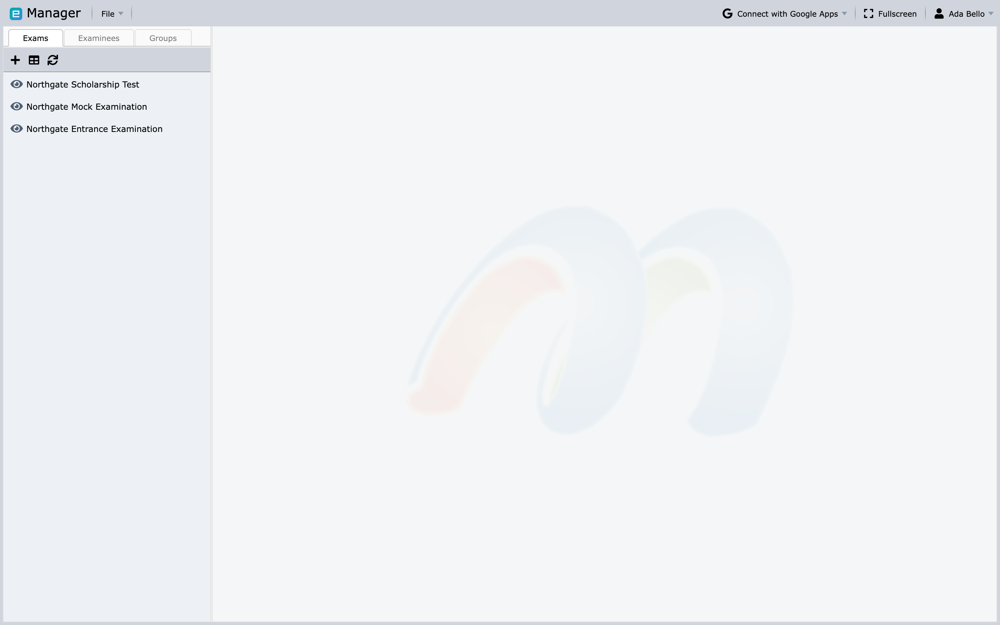
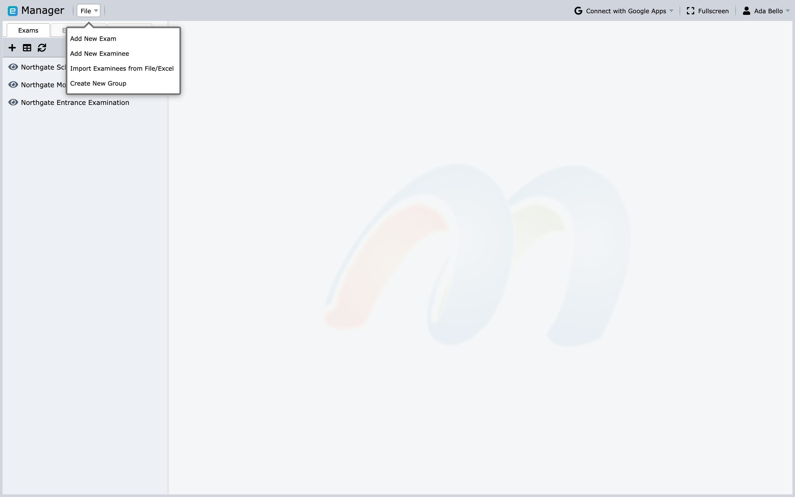
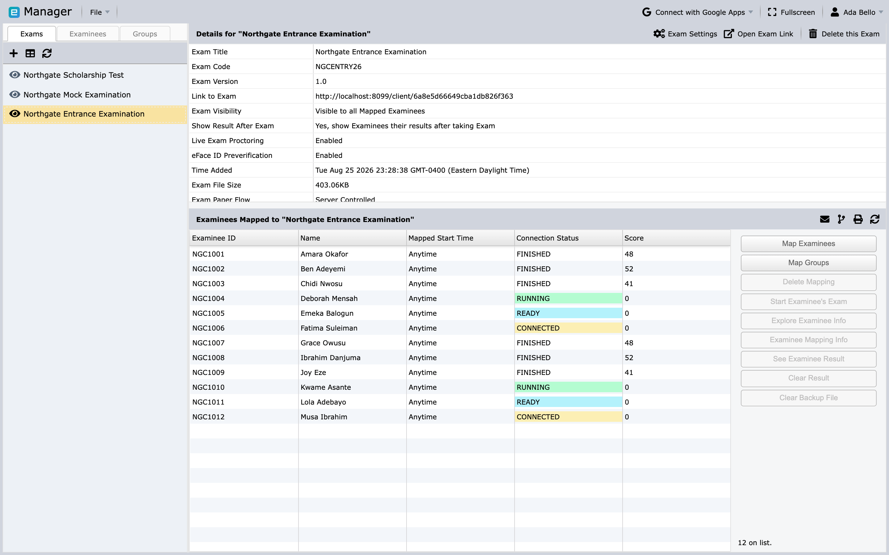
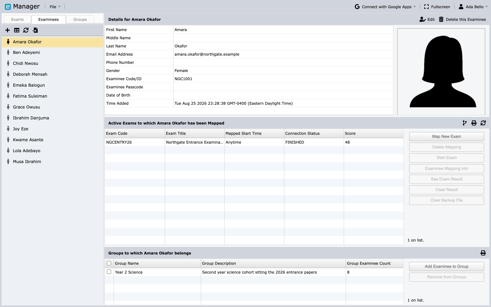
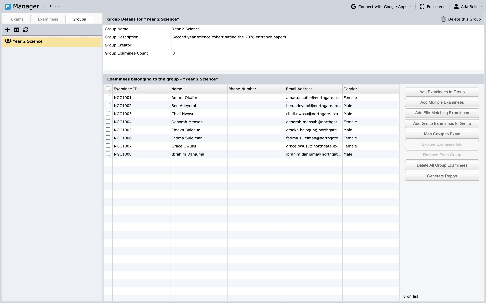

# Manager overview

Manager is the exam-administration workspace. It connects an exported exam with
examinee records, paper assignments, delivery settings, monitoring, and
results.

## Open Manager

Sign in, open **Home**, and select **Manager** in the Apps Gallery. Regular,
Administrator, and Root users can open Manager, but the exams and examinees
they can access may be limited by [Circles](../administration/circles-and-permissions.md).

## Main workspace

Manager has three resource tabs:

- **Exams** lists imported assessments.
- **Examinees** lists candidates who can be mapped to exams.
- **Groups** lists reusable collections of examinees.

Select an item in the left panel to open its details and available actions. The
small toolbar above each list adds a new record, switches to a table view, and
refreshes from the server. Refresh whenever another user may have changed data.

The **File** menu contains the four creation commands, and they are the same
whichever tab you are on:

- **Add New Exam**
- **Add New Examinee**
- **Import Examinees from File/Excel**
- **Create New Group**

## Recommended operating sequence

1. [Import the exam](import-exams.md).
2. [Add or import examinees](examinees.md).
3. Optionally create Groups.
4. [Assign examinees or Groups](groups-and-assignments.md) to the exam and its
   papers.
5. Review visibility, result display, proctoring, identity, device, and
   disconnection settings.
6. Test the exam link with a designated test examinee.
7. Publish and communicate the exam.
8. [Monitor the session and generate results](deliver-monitor-report.md).

## Exams

An exam record shows its title, code and version, the link examinees use,
visibility, whether results are shown after the exam, whether live proctoring
and eFace ID preverification are enabled, the time it was added, the imported
file size, and the paper flow. Exam actions can include:

- map examinees or Groups;
- open the exam link;
- send email to mapped examinees;
- toggle visibility or result display;
- configure live proctoring and identity verification;
- start, stop, or monitor an eligible exam;
- manage permissions and delivery settings; and
- view results or generate reports.

Available actions depend on the exam type, account role, plan, and current exam
state.

## Examinees

An examinee record stores a unique code or ID, passcode, name, gender, and
optional details such as email, phone number, date of birth, and photograph.
Below the details are two panels: the exams this person is mapped to, and the
Groups they belong to. From here you can manage Group membership, map an exam
and papers, review mapping details, and view a completed result.

## Groups

A Group is an operational collection of examinees, such as a class, cohort, or
exam sitting. Mapping a Group to an exam applies the assignment to the Group's
current members who are not already mapped.

Groups are different from Circles: Groups make bulk examinee work easier;
Circles control staff access.

## Safe preparation practices

- Keep an exam invisible until content, assignments, and settings are verified.
- Use unique examinee codes and a secure channel for passcodes.
- Check the time zone whenever an assignment includes a start time.
- Test with fictional or approved test data.
- Refresh before acting on connection status or results.
- Treat **Clear Result**, delete, and key-regeneration actions as sensitive.

## Next steps

If you already have a Designer export, continue with [Import
exams](import-exams.md). If the exam is present, go to [Add and import
examinees](examinees.md).
