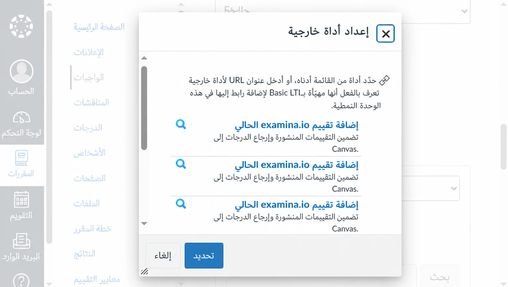
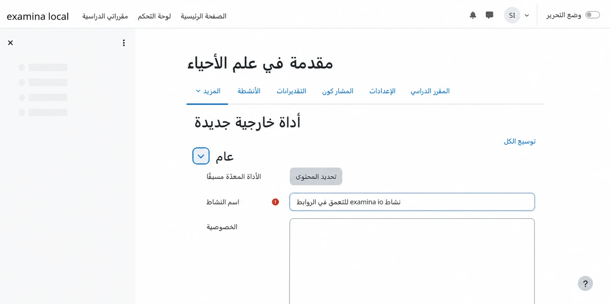
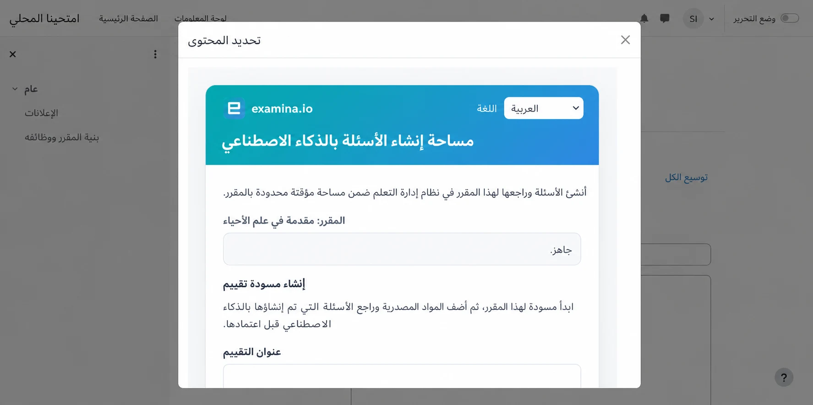
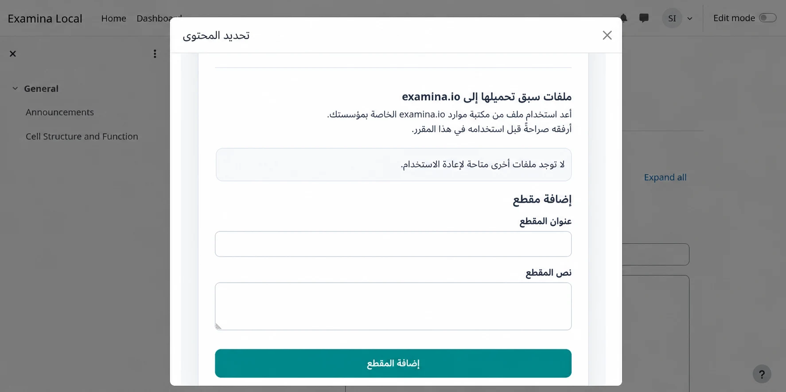
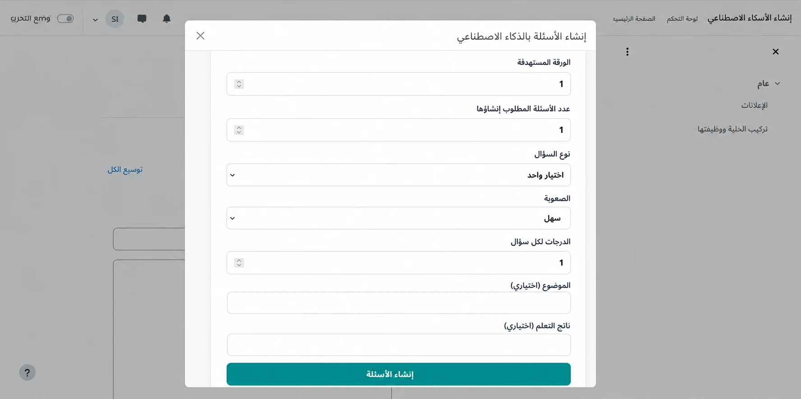
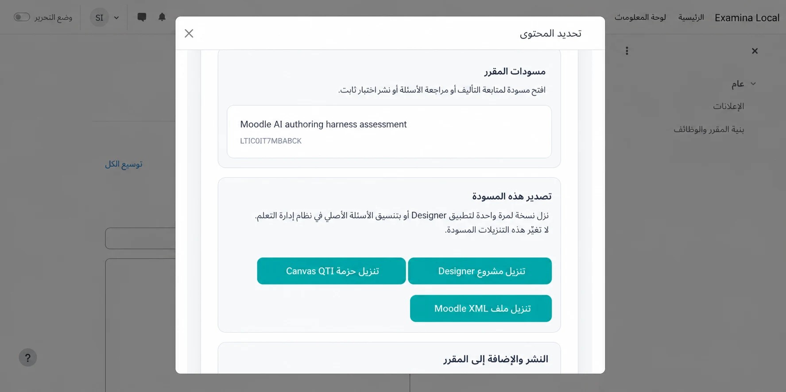
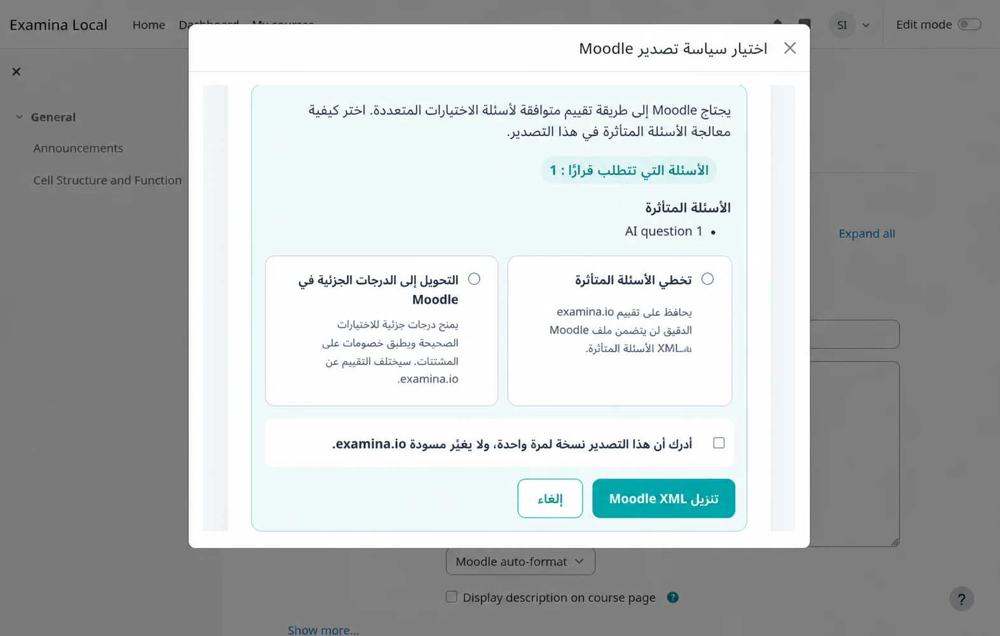

# إنشاء الأسئلة بالذكاء الاصطناعي من Canvas أو Moodle

يستطيع المدرسون تشغيل examina.io من مقرر في Canvas أو Moodle، وإنشاء مسودة
أسئلة مستندة إلى مصادر باستخدام الذكاء الاصطناعي، ثم إعادة اختبار منشور إلى
المقرر. ويمكن للمسودة نفسها أيضًا إنشاء مشروع Designer لمرة واحدة أو ملف
أسئلة بالتنسيق الأصلي لنظام إدارة التعلم.

يشرح هذا الدليل سير عمل المدرس بالكامل. يجب أولًا أن يُكمل مسؤول نظام إدارة
التعلم [إعداد Canvas عبر LTI 1.3](canvas-lms.md) أو
[إعداد Moodle عبر LTI 1.3](moodle-lms.md)، بما في ذلك **Deep Linking**.

!!! tip "تحقق أولًا في مقرر تجريبي"

    استخدم مواد ومستخدمين افتراضيين للتحقق من التأليف والتصدير والنشر وتشغيل
    المتعلم وإرجاع الدرجات قبل تمكين اختبار فعلي.

تستخدم الأمثلة مقررًا افتراضيًا باسم **مقدمة في علم الأحياء (BIO 101)** ومسودة
باسم **اختبار تركيب الخلية ووظيفتها**.

## فهم المسودات والمخرجات

تحتفظ مساحة التأليف بمسودة مرجعية واحدة على examina.io. يؤدي الإنشاء والمراجعة
وتغيير المصادر إلى تحديث هذه المسودة إلى أن تُنشر.

| المخرج | الغرض | علاقته بالمسودة |
| --- | --- | --- |
| مسودة examina.io | متابعة التأليف بالذكاء الاصطناعي والمراجعة | قابلة للتعديل ومحفوظة على الخادم |
| `.smex` | تشغيل الاختبار النهائي | ثابت ونهائي ومحفوظ على الخادم بعد النشر |
| `.smexproj` | متابعة التحرير المتقدم في Designer v3 | نسخة محلية لمرة واحدة؛ لا يؤدي الحفظ في Designer إلى تحديث مسودة الخادم |
| ملف Canvas QTI بصيغة ZIP | استيراد الأسئلة المتوافقة إلى بنك أسئلة Canvas الكلاسيكي | نسخة أصلية لمرة واحدة |
| Moodle XML | استيراد الأسئلة المتوافقة إلى بنك أسئلة Moodle | نسخة أصلية لمرة واحدة |

يمثل النشر حدًا فاصلًا: فهو ينشئ ملف `.smex` الثابت الذي يستخدمه المتعلمون.
ولا يؤدي تصدير مشروع أو ملف لنظام إدارة التعلم إلى نشر المسودة أو تغييرها.

## قبل البدء

تأكد مما يلي:

- ظهور examina.io كأداة خارجية في المقرر؛
- تفعيل Deep Linking في التسجيل؛
- أن تكون مدرسًا أو مصمم مقرر أو مسؤولًا مخولًا بإضافة أنشطة إلى نظام إدارة
  التعلم؛
- وجود مساحة في حسابك ضمن الحد الأقصى للمسودات النشطة؛ و
- أن تكون ملفات المصدر بصيغة PDF أو DOCX أو TXT أو HTML.

تُحتسب العناصر ذات الحالتين `DRAFT` و`PUBLISHING` ضمن الحد الأقصى. يؤدي نشر
المسودة أو حذفها إلى تحرير مكانها. إذا أشارت مساحة العمل إلى بلوغ الحد، فأكمل
مسودة موجودة أو اطلب من مسؤول examina.io إنهاء واحدة. حذف المسودات حاليًا
عملية إدارية/عبر API؛ ولا يتوفر في شاشة التأليف داخل نظام إدارة التعلم أو في
Designer.

## 1. فتح التأليف بالذكاء الاصطناعي من نظام إدارة التعلم

### Canvas

1. افتح المقرر وحدد **الواجبات**.
2. أنشئ واجبًا أو عدّله، ثم اختر **أداة خارجية** كنوع التسليم.
3. حدد **بحث**، واختر **examina.io**، ثم افتح أداة اختيار المحتوى.

اختر **إنشاء الأسئلة بالذكاء الاصطناعي**، وأدخل **اختبار تركيب الخلية
ووظيفتها**، ثم أنشئ المسودة. وإذا سبق أن بدأت مسودة في هذا المقرر، فيمكنك
فتحها من قائمة مسودات المقرر.

### Moodle

1. فعّل **وضع التحرير** في المقرر.
2. حدد **إضافة نشاط أو مورد**، ثم **أداة خارجية**.
3. اختر أداة examina.io المضبوطة وحدد **اختيار المحتوى**.

اختر **إنشاء الأسئلة بالذكاء الاصطناعي** أو أعد فتح مسودة موجودة للمقرر.

### تغيير لغة مساحة العمل

استخدم قائمة اللغة في أعلى أي صفحة LTI في examina.io لاختيار الإنجليزية أو
الفرنسية أو العربية أو الإسبانية لأمريكا اللاتينية أو البرتغالية البرازيلية.
تستخدم العربية واجهة كاملة من اليمين إلى اليسار. تغيّر القائمة تعليمات الواجهة
وعناصر التحكم، لكنها لا تترجم مطلقًا المقاطع أو الأسئلة أو الإجابات المرفوعة.

## 2. إنشاء بنية المسودة

أدخل عنوانًا واضحًا ورمزًا داخليًا اختياريًا. استخدم في هذا المثال:

- **العنوان:** اختبار تركيب الخلية ووظيفتها
- **الرمز:** BIO-101-CELL
- **الورقة:** الورقة 1
- **القسم:** عضيات الخلية
- **تعليمات المتعلم:** أجب عن كل سؤال باستخدام المقطع المرفق.

تفصل مساحة العمل المصادر عن الأسئلة في عمودين على الشاشات العريضة، وتضعهما
عموديًا على الشاشات الأصغر.

## 3. إضافة ملف مصدر واحد أو عدة ملفات

حدد **إضافة المقاطع والملفات**، ثم اسحب عدة ملفات إلى منطقة الرفع أو اخترها
باستخدام منتقي الملفات. تظهر الملفات المحددة معًا قبل الرفع حتى تتمكن من إزالة
أي ملف اختير بالخطأ.

للحصول على مثال سريع، ارفع مقطعًا قصيرًا يوضح ما يلي:

> تلتقط البلاستيدات الخضراء الطاقة الضوئية لصنع السكريات، بينما تطلق
> الميتوكوندريا طاقة قابلة للاستخدام من تلك السكريات. وتحتوي الخلايا النباتية
> على كلتا العضيتين.

لا تستخدم إلا المواد التي تسمح مؤسستك بمعالجتها. تحقق من اكتمال معالجة كل ملف
قبل إنشاء الأسئلة. يظل المصدر الذي رُفع سابقًا مرتبطًا بمسودة الخادم عند إعادة
فتحها من Canvas أو Moodle.

## 4. إنشاء الأسئلة

حدد **إنشاء الأسئلة بالذكاء الاصطناعي**، ثم اختر الورقة والقسم المستهدفين.
ينشئ examina.io حاليًا:

- أسئلة الاختيار الواحد؛
- أسئلة الاختيارات المتعددة؛ و
- أسئلة ملء الفراغ.

في هذا المثال، أنشئ سؤالين من نوع الاختيار الواحد بمستوى متوسط ودرجتين لكل
منهما، ثم أنشئ سؤال اختيارات متعددة بمستوى متوسط. عيّن الموضوع إلى **عضيات
الخلية** وناتج التعلم إلى **التمييز بين التقاط الطاقة وإطلاقها في الخلايا
النباتية**.

قد تكون مخرجات الذكاء الاصطناعي خاطئة أو غير مناسبة. ويظل المدرس مسؤولًا عن
التحقق من الدقة ومفاتيح الإجابة والغموض والصعوبة وإمكانية الوصول وحقوق النشر
والتوافق مع ناتج التعلم المقصود.

## 5. مراجعة الأسئلة المرشحة

راجع كل سؤال مرشح مقابل مصدره. احتفظ بالأسئلة المقبولة وارفض الأسئلة الضعيفة.
تتيح مساحة LMS المركزة تحديد الأسئلة وتعديل عنوان السؤال وتعليمات المتعلم؛
وليست محررًا كاملًا لنص السؤال والإجابات.

إذا احتاج السؤال إلى تحرير كبير، فارفضه وأعد إنشاءه أو نزّل مشروع Designer
للتحرير المحلي المتقدم. المشروع المفتوح في Designer نسخة مرتبطة بمراجعة
محددة: ولا يؤدي حفظه إلى كتابة التغييرات في مسودة examina.io المرجعية.

## 6. اختيار الإجراء المطلوب للمسودة

افتح إجراءات المسودة عند اكتمال المراجعة.

يمكنك:

- تنزيل ملف `.smexproj` لتطبيق Designer v3؛
- تنزيل حزمة Canvas QTI بصيغة ZIP؛
- تنزيل ملف Moodle XML؛ أو
- نشر الاختبار وإعادته إلى المقرر.

هذه الإجراءات مستقلة. يمكنك، على سبيل المثال، استيراد نسخة أصلية لإعادة
استخدامها ثم العودة لاحقًا إلى المسودة المرجعية لنشرها.

## 7. استيراد نسخة أسئلة أصلية إلى Canvas

يحوّل تصدير Canvas أسئلة الاختيار الواحد والاختيارات المتعددة وملء الفراغ
المتوافقة إلى QTI. وهو تصدير يدوي في اتجاه واحد.

1. حدد **تنزيل حزمة Canvas QTI**.
2. في Canvas، افتح **الإعدادات ← استيراد محتوى المقرر**.
3. اختر **ملف QTI .zip**، وحدد الملف المنزّل، ثم ابدأ الاستيراد.
4. افتح بنك الأسئلة الكلاسيكي وعاين كل سؤال مستورد.

يستهدف التصدير الحالي بنوك أسئلة Canvas الكلاسيكية. ولا يدّعي دعم الدفع
المباشر أو الاعتماد لـ New Quizzes. ولا تتم مزامنة تغييرات Canvas إلى
examina.io.

## 8. استيراد نسخة أسئلة أصلية إلى Moodle

يدعم Moodle XML عائلات الأسئلة الأساسية نفسها، لكن تقييم الاختيارات المتعددة
في Moodle لا يحافظ دائمًا على تقييم التطابق الكامل للمسودة. عند وجود تعارض،
يطلب examina.io اختيار سياسة لذلك التصدير.

- **تخطي الأسئلة المتأثرة** يحافظ على تقييم examina.io لأن الأسئلة المتعارضة
  لا تُضمّن في ملف XML.
- **التحويل إلى الدرجات الجزئية في Moodle** يوزع +100% على الاختيارات الصحيحة
  و-100% على المشتتات. ولذلك قد يمنح السؤال المستورد درجات جزئية ولا تكون
  دلالات تقييمه مطابقة.

إذا كان السؤال يستخدم بالفعل التقييم الجزئي المرجعي، فاختر **تخطي الأسئلة
المتأثرة**. أكّد الإقرار بأن الملف نسخة لمرة واحدة قبل تنزيله. ينطبق اختيارك
على ذلك التصدير فقط ولا يغيّر مسودة الخادم مطلقًا.

ثم استورد الملف:

1. افتح **بنك الأسئلة** في مقرر Moodle.
2. حدد **استيراد** واختر **تنسيق Moodle XML**.
3. ارفع ملف XML الذي نزّلته.
4. عاين كل سؤال وإجابة ودرجة وعقوبة مستوردة.

## 9. نشر الاختبار وإضافته إلى المقرر

ارجع إلى المسودة المرجعية وحدد **النشر والإضافة إلى المقرر**. راجع إقرار النشر
بعناية. يؤدي النشر إلى إنشاء ملف `.smex` النهائي الثابت وحفظه؛ ولا تستطيع
التغييرات اللاحقة في المسودة أو النسخة الأصلية في LMS تعديله.

بعد أن يعيد examina.io رابط Deep Link:

- في Canvas، أكمل إعدادات الواجب وحدد **حفظ** أو **حفظ ونشر**؛ أو
- في Moodle، أكمل إعدادات النشاط وحدد **حفظ وعرض**.

استخدم متعلمًا افتراضيًا لتشغيل النشاط وتسليمه، وتأكد من وصول النتيجة المتوقعة
إلى سجل الدرجات في نظام إدارة التعلم عند تفعيل AGS.

## إعادة فتح مسودة في Designer

يمكن في Designer v3 اختيار **ملف ← فتح من مسودات examina.io**، والبحث في
الجدول، ثم تحديد مسودة لفتحها. يحوّل Designer مراجعة المسودة المختارة إلى ملف
`.smexproj` محلي. ولا يحفظ التغييرات مرة أخرى في examina.io ولا يحل محل نشر
المسودة المرجعية.

## استكشاف الأخطاء وإصلاحها

### خيار التأليف بالذكاء الاصطناعي غير ظاهر

تأكد من تفعيل Deep Linking ومن أن المدرس شغّل موضع اختيار المحتوى، لا رابط مورد
للمتعلم. وقد يحتاج مسؤول Canvas أو Moodle أيضًا إلى تحديث الأداة المثبتة.

### لا يظهر المصدر بعد رفعه

تأكد من أن الملف بصيغة PDF أو DOCX أو TXT أو HTML، ثم انتظر اكتمال المعالجة.
أعد فتح مسودة المقرر نفسها قبل رفع نسخة مكررة.

### يُسقط تصدير Moodle سؤال اختيارات متعددة

إما أنه جرى اختيار **تخطي الأسئلة المتأثرة** أو أن Moodle XML لا يستطيع الحفاظ
على نمط التقييم. أعد التصدير بالدرجات الجزئية فقط إذا كان اختلاف التقييم
مقبولًا وقد خضع للمراجعة.

### تختلف نسخة Designer عن مسودة الخادم

هذا متوقع بعد تغيير أي من النسختين. ملف `.smexproj` لقطة في اتجاه واحد؛ ولا
يزامن Designer تعديلاته مع المسودة المرجعية.

### النشر غير متاح

عالج أولًا أي معالجة غير مكتملة أو أخطاء في التحقق من الأسئلة. إذا بلغ الحساب
حد الخطة أو المسودات، فتواصل مع مسؤول examina.io في الحساب.

## قائمة تحقق المدرس

- [ ] يظهر المقرر والمسودة الصحيحان.
- [ ] كل مصدر مصرح به وتمت معالجته بالكامل.
- [ ] تمت مراجعة كل نص وخيار وإجابة وقيمة درجات.
- [ ] جرى قبول أي اختلاف في تقييم Moodle قبولًا صريحًا.
- [ ] تمت معاينة الاستيرادات الأصلية في بنك أسئلة LMS.
- [ ] تمت مراجعة إقرار النشر النهائي.
- [ ] نجح تشغيل متعلم افتراضي وإرجاع درجته.
