# دمج examina.io مع Blackboard Learn Ultra {#integrate-examinaio-with-blackboard-learn-ultra}

قم بتوصيل examina.io بـ Blackboard تعلم Ultra مرة واحدة، ثم اسمح للمدرسين بإضافة
الاختبار المنشور من Content Market دون نسخ عنوان URL للاختبار. المتعلمين
افتح التقييم داخل Blackboard دون تسجيل دخول ثانٍ إلى examina.io، و
يمكن أن يقوم examina.io بإرجاع كل نتيجة إلى عنصر دفتر التقديرات Blackboard المطابق.

!!! tip "التحقق من صحة قبل التقييم المباشر"
    قم بتوصيل سير العمل الكامل والتحقق من صحته في Blackboard غير الإنتاجي
    دورة تدريبية مع مستخدمين خياليين قبل تمكينها لإجراء تقييم مباشر.

تستخدم لقطات الشاشة دورة تدريبية خيالية تسمى **CHEM 101: الكيمياء العامة**،
تقييم اسمه **أساسيات الكيمياء العامة** ومتعلم خيالي
اسمها **ليلى الحربي**. مؤسستك، والدورة التدريبية، والمستخدمون، والمعرفات، و
الامتحانات المنشورة ستكون مختلفة.

تم التقاط لقطات الشاشة Blackboard في Learn Ultra 4000.19.0. أحدث
قد يؤدي الإصدار إلى نقل إجراء ما أو تغيير تسميته قليلاً، ولكن حقول LTI 1.3
ويظل الترتيب الذي يتم به تبادلهما بين النظامين كما هو.

## ما يوفره التكامل {#what-the-integration-provides}

- **تسجيل دخول واحد إلى Blackboard:** لا يقوم المتعلمون بتسجيل الدخول إلى examina.io مرة أخرى عندما
  يفتحون التقييم من دورة Blackboard الخاصة بهم.
- **اختيار الاختبار المنشور:** يتيح الارتباط العميق LTI للمعلم اختيار الاختبار
  الاختبار المنشور الدقيق أثناء إضافة محتوى الدورة.
- **وضع على دراية بالدورة التدريبية:** يرتبط الاختبار المحدد بـ Blackboard
  الدورة التدريبية وعنصر المحتوى الذي أنشأها.
- **إرجاع الدرجات:** تُرسل خدمات التعيين والدرجات LTI (AGS) النتيجة إلى
  المتعلم الصحيح وعنصر دفتر التقديرات.
- **قائمة الدورات التدريبية الاختيارية:** يمكن لخدمات توفير الأسماء والأدوار (NRPS)
  توفير الحد الأدنى من بيانات العضوية التي يتطلبها سير العمل المعتمد.
- **عزل المؤسسة:** يمكن تثبيت معرف تطبيق البائع نفسه من خلاله
  مؤسسات متعددة، ولكن كل تثبيت Blackboard له خاصته
  معرف النشر وتسجيل examina.io الخاص به.

## قبل أن تبدأ {#before-you-start}

أنت بحاجة إلى:

- حساب الجذر أو المسؤول في examina.io؛
- مسؤول نظام Blackboard الذي يمكنه تسجيل أدوات LTI 1.3؛
- مدرب ومتعلم خيالي في دورة Blackboard غير الإنتاجية؛
- تم استيراد امتحان واحد على الأقل ونشره في examina.io Manager؛ و
- الموافقة المؤسسية لبيانات المتعلم وخدمات LTI سوف Blackboard
  شارك.

يجب أن يكون كلا النظامين قابلين للوصول عبر HTTPS العام بشهادات و
ساعات دقيقة. تنتهي صلاحية رسائل تسجيل الدخول LTI والاستجابات الموقعة بسرعة، لذلك
يمكن للساعة غير الصحيحة أن ترفض تكوينًا صالحًا.

!!! important "استخدم معرف تطبيق examina.io المشترك"
    استخدم **معرف تطبيق Examina** الموضح في examina.io. لا تقم بإنشاء أ
    تطبيق بائع منفصل لكل مؤسسة. كل Blackboard
    يوفر التثبيت **معرف النشر** الخاص به، والذي يجب حفظه في ملف
    تسجيل examina.io منفصل. لا تقم مطلقًا بإعادة استخدام معرف النشر من جهة أخرى
    بيئة Blackboard.

## 1. نشر الامتحان الذي سيأخذه المتعلمون {#1-publish-the-exam-learners-will-take}

قبل تكوين Blackboard، قم بإعداد التقييم في examina.io:

1. افتح **Manager** واستورد الاختبار من Designer إذا لزم الأمر.
2. قم بمراجعة عنوانه وتعليماته ومدته وتسجيله ومدى توفره ووقته
   المحتوى الذي يواجه المتعلم.
3. نشر الامتحان.

تظهر فقط الاختبارات المنشورة التي يُسمح للمؤسسة الحالية باستخدامها
شاشة الاختيار Blackboard. نشر الامتحان لا يضيفه إلى أ
بالطبع؛ يقوم المعلم بتحديد موضع الدورة التدريبية لاحقًا من خلال الارتباط العميق.

## 2. ابدأ تسجيل Blackboard في examina.io {#2-start-the-blackboard-registration-in-examinaio}

كجذر أو مسؤول examina.io:

1. افتح **الصفحة الرئيسية → الإعدادات**.
2. ابحث عن **إحضار Examina إلى نظام إدارة التعلم (LMS) الخاص بك** وحدد **إضافة تسجيل**.
3. اختر **Blackboard التعلم / Ultra**.
4. انسخ **معرف تطبيق Examina للقراءة فقط**.

تقع منطقة تكامل LMS بالقرب من أسفل **الإعدادات**. Blackboard تعلم /
يجب أن يظهر Ultra **Available**، بجانب Moodle وCanvas. حدد **إضافة
التسجيل ** من هذه المنطقة للبدء.

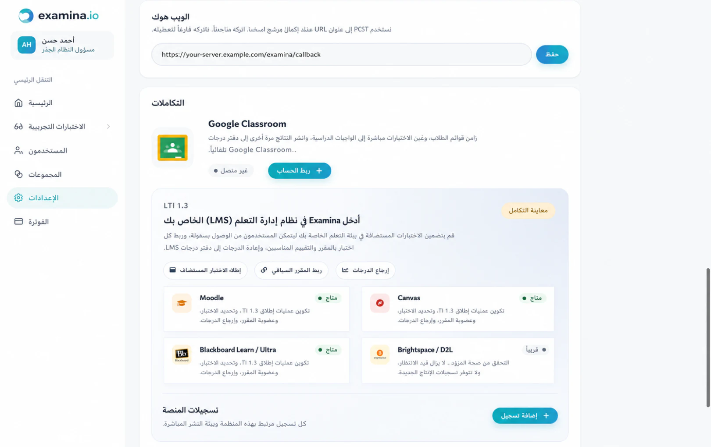

أبقِ النموذج مفتوحًا. يحتاج Blackboard إلى معرف التطبيق قبل أن يتمكن من الإنشاء
معرف النشر الخاص بالمؤسسة الذي يكمل هذا التسجيل.

## 3. قم بالتسجيل والموافقة على examina.io في Blackboard {#3-register-and-approve-examinaio-in-blackboard}

باعتبارك مسؤول نظام Blackboard تعلم:

1. افتح منطقة المسؤول Blackboard. في نظام التنقل الفائق، حدد **النظام
   المشرف**; في التجربة الأصلية، افتح **لوحة الإدارة**.
2. ابحث عن قسم **عمليات التكامل** وحدد **LTI Tool Providers**.

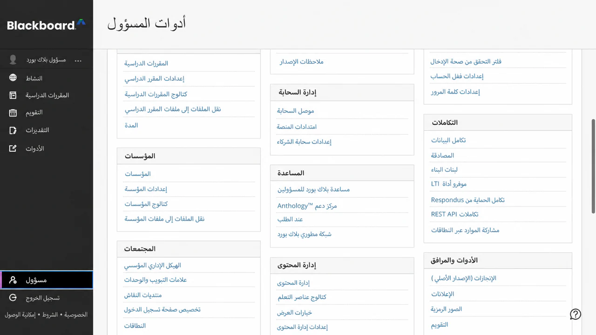

3. حدد **تسجيل LTI 1.3/أداة المزايا**.

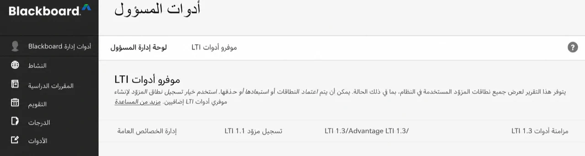

4. أدخل **معرف تطبيق Examina**، ثم حدد **إرسال**.

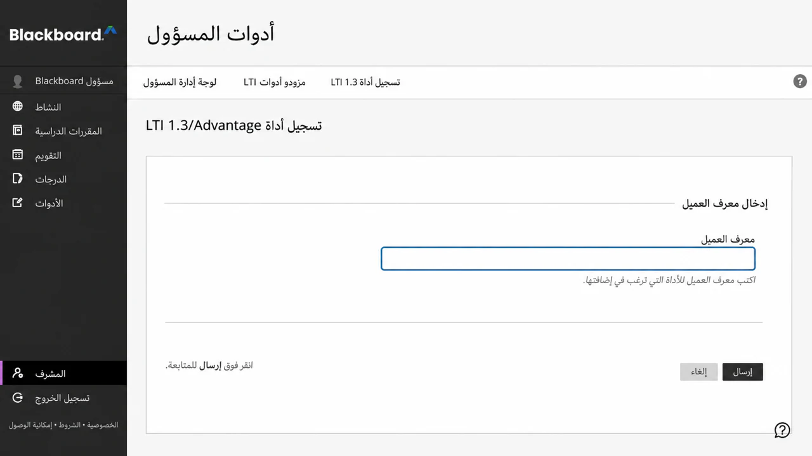

5. قم بمراجعة اسم الأداة المستوردة والمجال وعنوان URL للمفتاح العام وعناوين URL لإعادة التوجيه و
   التنسيب المُدار.
6. اضبط **حالة الأداة** على **موافق عليها**.

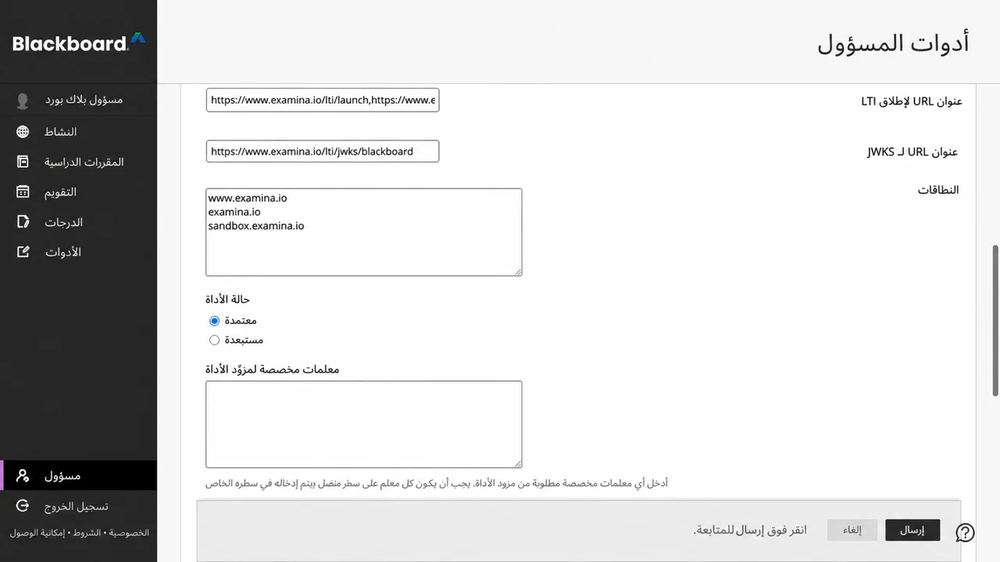

7. ضمن مشاركة بيانات المستخدم، قم بالموافقة على البيانات التي تسمح بها مؤسستك:
   **الاسم** و**البريد الإلكتروني** و**الدور**.
8. قم بتمكين **السماح بالوصول إلى خدمة التقدير** عندما يجب إرجاع النتائج
   AGS.
9. قم بتمكين **السماح بالوصول إلى خدمة العضوية** فقط عندما يكون الوصول إلى قائمة المقرر الدراسي متاحًا
   مطلوب من خلال NRPS.
10. حدد **إرسال**.

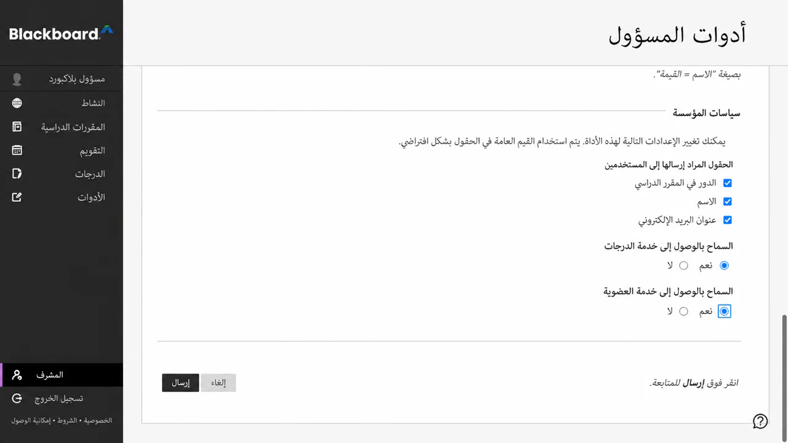

!!! note "يتم التحكم بالأذونات بواسطة مسؤول النظام"
    إذا لم يكن **مسؤول النظام** مرئيًا في شريط التنقل الرئيسي Blackboard، فسيتم
    الحساب الذي تم تسجيل الدخول إليه لا يتمتع بدور النظام المطلوب لتثبيت LTI
    أداة. لا يمكن للمدرس إكمال هذه الخطوة على مستوى المؤسسة.

يوفر Blackboard دائمًا معرف موضوع LTI ثابتًا للمتعلم.
يعد الاسم والبريد الإلكتروني من بيانات الملف الشخصي، لذا لا يمكنك الموافقة عليهما إلا عندما تكون مؤسستك
تسمح السياسة لـ examina.io باستلامها. الدور مطلوب للتمييز
سير عمل المعلم من إطلاق المتعلم.

افتح قائمة الأداة المسجلة واختر **إدارة عمليات النشر**. انسخ
معرف النشر الذي ينطبق على المؤسسة أو عقدة التسلسل الهرمي المؤسسي
حيث سيستخدم المدربون examina.io. إذا كان إصدار Blackboard الخاص بك يعرض فقط
عملية نشر واحدة، قد تظهر نفس القيمة على صفحة **تحرير** الخاصة بالأداة بدلاً من ذلك.
تنتمي هذه القيمة إلى تثبيت Blackboard ويجب عدم نسخها إليه
مؤسسة أخرى.

قم بإنشاء نشر Blackboard آخر فقط عندما تكون المؤسسة متعمدة
يحتاج إلى حدود تثبيت منفصلة، مثل حرم جامعي مختلف أو مرخص
وحدة. يحتاج كل معرف نشر إلى تسجيل examina.io الخاص به.

بعد الإرسال، يجب أن تظهر قائمة الموفرين **تقييمات examina.io** كـ
أداة LTI 1.3 معتمدة. تعتمد حقول البيانات الدقيقة وعدد المواضع على ذلك
على الأذونات والمواضع التي وافقت عليها مؤسستك.

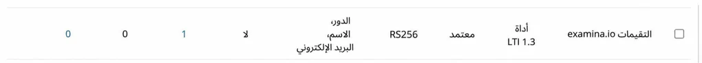

## 4. قم بإنهاء التسجيل في examina.io {#4-finish-the-registration-in-examinaio}

ارجع إلى **الصفحة الرئيسية → الإعدادات → قم بإحضار Examina إلى نظام إدارة التعلم (LMS) الخاص بك**:

1. تابع النموذج المفتوح، أو حدد **إضافة تسجيل → Blackboard تعلم /
   الترا ** مرة أخرى.
2. أدخل اسمًا وصفيًا، مثل **Northbridge College Blackboard**.
3. قم بتأكيد **معرف تطبيق Examina للقراءة فقط** ولصق Blackboard
   **معرف النشر**.
4. قم بتأكيد قيم منصة Blackboard هذه:

| حقل examina.io | قيمة Blackboard |
| --- | --- |
| عنوان URL للمصدر | `https://blackboard.com` |
| معرف تطبيق الفحص | معرف التطبيق المتوفر مركزيًا للقراءة فقط |
| معرف النشر | المعرف المنسوخ من تثبيت Blackboard |
| نقطة نهاية التفويض | `https://developer.blackboard.com/api/v1/gateway/oidcauth` |
| نقطة نهاية الرمز المميز | `https://developer.blackboard.com/api/v1/gateway/oauth2/jwttoken` |
| عنوان URL للمفاتيح العامة لنظام إدارة التعلم (JWKS) | `https://developer.blackboard.com/.well-known/jwks.json` |

5. قم بتمكين **اختيار التقييم (الربط العميق)**.
6. قم بتمكين **إرجاع التقدير (AGS)** عندما يكون الوصول إلى خدمة التقدير Blackboard متاحًا
   تمت الموافقة عليه.
7. قم بتمكين **قائمة الدورات التدريبية (NRPS)** فقط عند خدمة عضوية Blackboard
   تمت الموافقة على الوصول.
8. حدد **حفظ التسجيل**، ثم قم بتفعيل التسجيل.

تعد بطاقة التسجيل المحفوظة مصدر الحقيقة لعناوين URL الدقيقة للأداة.
تستخدم قيم مواجهة متصفح الإنتاج `https://www.examina.io`:

| إعداد أداة Blackboard | قيمة الإنتاج examina.io |
| --- | --- |
| بدء تسجيل الدخول OIDC | انسخ القيمة كاملة من بطاقة التسجيل |
| LTI إطلاق / URI للارتباط المستهدف | `https://www.examina.io/lti/launch` |
| إعادة توجيه الارتباط العميق | `https://www.examina.io/lti/deep-link` |
| أيقونة الأداة | `https://www.examina.io/img/logo128.png` |
| أداة المفاتيح العامة (JWKS) | انسخ القيمة الخاصة بالتسجيل من بطاقة التسجيل |

قم دائمًا بنسخ قيم OIDC وJWKS الكاملة من بطاقة التسجيل
لأنها تحدد التسجيل المحفوظ. المفاتيح العامة Blackboard **LMS
(JWKS) URL** في الجدول الأول هو مجموعة مفاتيح Blackboard، والتي يقرأها examina.io.
** المفاتيح العامة للأداة (JWKS)** عنوان URL الموجود على بطاقة التسجيل هو مفتاح examina.io
مجموعة، والذي يقرأ Blackboard. لا مبادلة لهم.

معرفات التطبيق ومعرفات النشر هي معرفات التكوين، وليست
كلمات المرور. لا تضع مطلقًا مفاتيح خاصة أو رموز وصول أو رسائل تشغيل موقعة أو
بيانات المتعلم في الوثائق أو تذاكر الدعم.

## 5. قم بتأكيد موضع Blackboard {#5-confirm-the-blackboard-placement}

ارجع إلى **LTI موفري الأدوات** في Blackboard، افتح القائمة لـ
**تقييمات examina.io**، ثم اختر **إدارة المواضع**. تأكيد أن
الموضع المختار المعتمد:

- متاح كأداة محتوى للربط العميق؛
- يستخدم عنوان URL للربط العميق للإنتاج examina.io؛
- يُسمى ** تقييمات examina.io **؛ و
- يعرض شعار examina.io.

لا تقم بإنشاء موضع ثانٍ إلا إذا كانت مؤسستك بحاجة إلى ذلك عمدًا
موضع منفصل مع توفر مختلف. يمكن إجراء موضع مكرر
ليس من الواضح ما هو التسجيل الذي يطلقه المدرب.

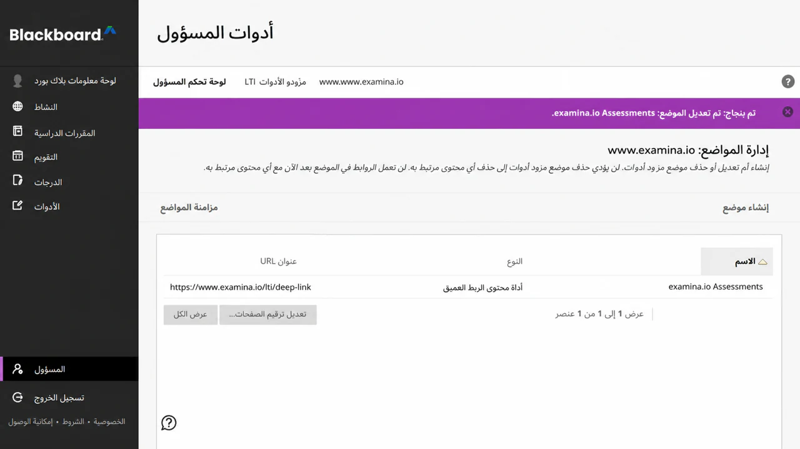

## 6. قم بإضافة اختبار منشور إلى مقرر Ultra الدراسي {#6-add-a-published-exam-to-an-ultra-course}

كمدرس في الدورة التدريبية الوجهة:

1. افتح **CHEM 101: الكيمياء العامة → محتوى الدورة**.
2. حدد ******* حيث يجب أن يظهر التقييم.
3. اختر **سوق المحتوى**.
4. ابحث عن **تقييمات examina.io** ضمن **أدوات المؤسسة** وحدده.

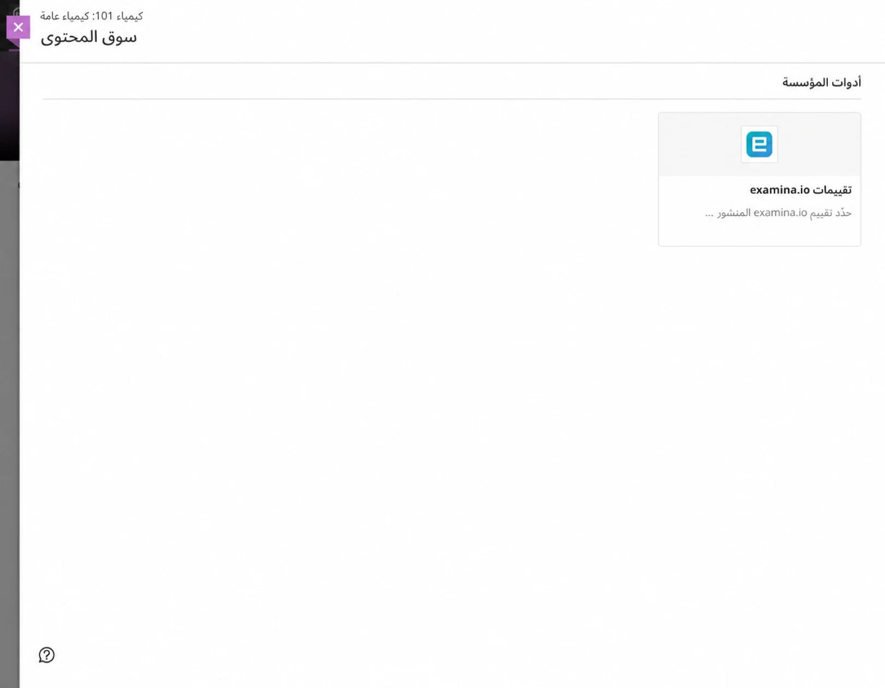

يتم فتح المنتقي examina.io داخل Blackboard. اختر **الكيمياء العامة
الأساسيات**، ثم اختر **إضافة الاختبار المحدد**.

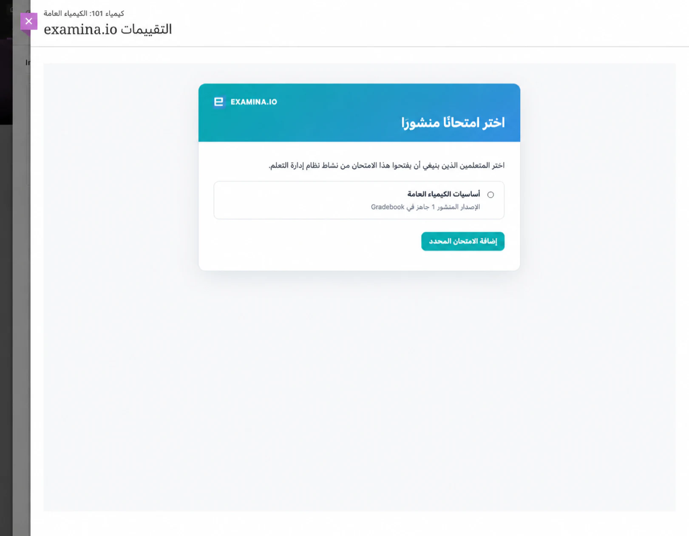

يعود Blackboard إلى المقرر الدراسي ويقوم بإنشاء عنصر محتوى التقييم.
قم بتأكيد الاسم المواجه للمتعلم، وإمكانية الرؤية، وتاريخ الاستحقاق، والحد الأقصى للنقاط، و
تجربة السياسة، ثم جعلها مرئية للمتعلمين.

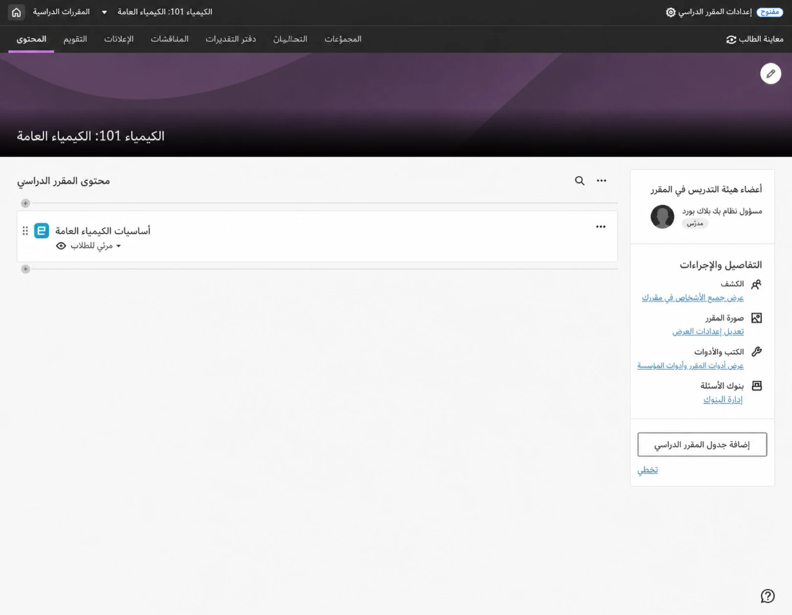

افتح العنصر مرة واحدة كمدرس وتأكد من نشر المقصود
يظهر الامتحان. إذا تم تحديد اختبار خاطئ، قم بإزالة عنصر المحتوى واستخدامه
سوق المحتوى لتحديده مرة أخرى.

## 7. التحقق من إطلاق المتعلم {#7-verify-the-learner-launch}

استخدم متعلمًا خياليًا مسجلاً في الدورة:

1. قم بتسجيل الدخول إلى Blackboard بصفتك المتعلم.
2. افتح **CHEM 101: الكيمياء العامة → محتوى الدورة → الكيمياء العامة
   الأساسيات**.
3. التأكد من فتح التقييم داخل Blackboard بدون ثانية
   تسجيل الدخول examina.io.
4. ابدأ التقييم وأكمله وأرسله.

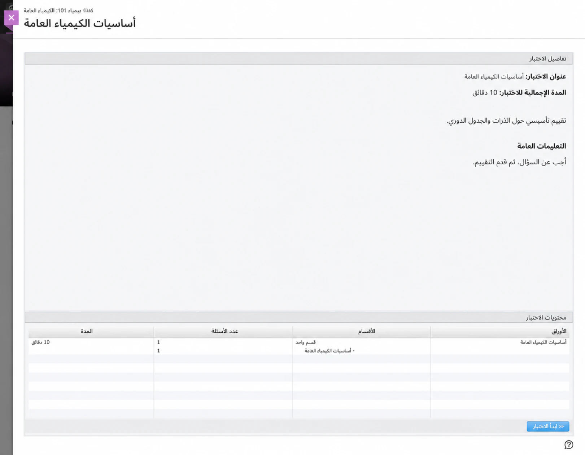

يتحقق إطلاق LTI من منصة Blackboard، ومعرف النشر، والدورة التدريبية،
عنصر المحتوى، والمتعلم، والنشر المحدد. عنوان URL المنسوخ للإطلاق ليس ملفًا
بديل لفتح التقييم من Blackboard.

## 8. التحقق من الدرجة المرتجعة {#8-verify-the-returned-grade}

بعد الإرسال، افتح **دفتر التقديرات** كمدرس. تأكيد أن النتيجة
يظهر في **أساسيات الكيمياء العامة**، والمتعلم الصحيح، و
عنصر دفتر التقديرات الصحيح. ويمكن للمتعلم أيضا مراجعة النتيجة من الدورة
عرض الدرجات.

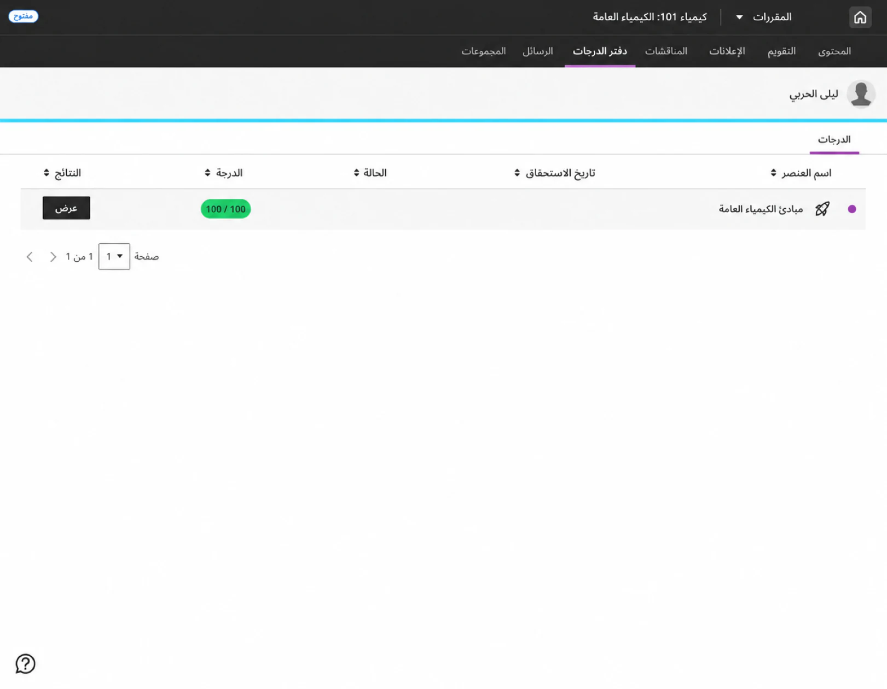

يتم وضع تسليم الدرجات في قائمة الانتظار بشكل منفصل عن تقديم الاختبار، لذا فهو مؤقت
لا يؤدي انقطاع Blackboard إلى تحويل التقييم المكتمل إلى تقييم فاشل
تقديم. قد يستغرق ظهور النتيجة وقتًا قصيرًا. قم بتحديث دفتر التقديرات
قبل التحقيق في النتيجة المفقودة.

## قم بتوصيل مؤسسة Blackboard أخرى {#connect-another-blackboard-institution}

يمكن تثبيت معرف تطبيق examina.io الذي يتم توفيره مركزيًا في أكثر من
مؤسسة Blackboard واحدة. لكل مؤسسة:

1. قم بتسجيل معرف التطبيق المشترك في Blackboard Learn الخاص بتلك المؤسسة؛
2. انسخ معرف النشر الفريد لهذا التثبيت؛
3. قم بإنشاء تسجيل Blackboard منفصل في examina.io الصحيح
   التنظيم؛ و
4. قم بمنح بيانات المستخدم المعتمدة لهذه المؤسسة فقط، وأذونات AGS وNRPS.

قبل الطرح على نطاق واسع، تأكد من أن كل مؤسسة ترى فقط ما لديها
الامتحانات المنشورة للمنظمة وأن الدرجات تعود فقط إلى الأصل
المقرر الدراسي والمتعلم وعنصر دفتر التقديرات.

## قائمة التحقق من صحة الإنتاج {#production-validation-checklist}

قبل استخدام التكامل لدورة تدريبية مباشرة، تحقق من كل ما يلي:

- الأداة **معتمدة** ومتاحة فقط في الأماكن المخصصة لها.
- تظهر **تقييمات examina.io** في Content Market بشعار examina.io.
- معرف التطبيق هو قيمة examina.io المتوفرة مركزيًا.
- جاء معرف النشر من تثبيت Blackboard بالضبط.
- الاسم والبريد الإلكتروني ومشاركة الدور يتوافق مع سياسة البيانات المعتمدة للمؤسسة.
- يتم تمكين AGS في كلا النظامين عند إرجاع الدرجات.
- يتم تمكين NRPS في كلا النظامين فقط عندما يكون الوصول إلى قائمة المقرر الدراسي مطلوبًا.
- يسرد الارتباط العميق الاختبارات المنشورة فقط التي قد يحددها المعلم.
- يفتح المتعلم التقييم المحدد دون تسجيل دخول ثانٍ.
- تصل النتيجة المكتملة إلى عنصر المتعلم ودفتر التقديرات الصحيحين.
- يستخدم كل عنوان يواجه المتصفح بروتوكول HTTPS للإنتاج وشهادة موثوقة.

## استكشاف الأخطاء وإصلاحها {#troubleshooting}

| العَرَض | ما يجب التحقق منه |
| --- | --- |
| ** تقييمات examina.io ** مفقودة من Content Market | تأكد من الموافقة على الأداة، وأن موضع الارتباط العميق المُدار الخاص بها متاح لهذه الدورة التدريبية، ويمكن للمستخدم الحالي إضافة محتوى الدورة التدريبية. |
| لا تحتوي لوحة Content Market على شعار examina.io | تأكد من أن الموضع المُدار يستخدم `https://www.examina.io/img/logo128.png`. إذا تم تثبيت الأداة قبل تكوين الرمز، فقم بتحديث بيانات تعريف الأداة الموجودة أو قم بتحديث موضعها. |
| يتم فتح المنتقي لكن Blackboard يرفض الاختبار المحدد | تأكد من تطابق معرف التطبيق ومعرف النشر، ويمكن لـ Blackboard جلب عنوان URL الدقيق الخاص بالتسجيل examina.io JWKS، ويحتوي كلا النظامين على ساعات دقيقة. |
| يتم فتح التقييم في إطار فارغ أو يتم رفض الإطلاق | تحقق من عنوان URL لبدء OIDC، وعنوان URL الخاص بالتشغيل، وعناوين URL لإعادة التوجيه، وشهادة HTTPS الموثوقة، وحالة التسجيل، وسياسة iframe، وإعدادات ملفات تعريف الارتباط الخاصة بالطرف الثالث في المتصفح. |
| لا يزال Blackboard يفتح عنوانًا قديمًا بعد تغيير تكوين البائع | قد يحتفظ Blackboard بعناوين URL التي تم استيرادها عند إنشاء الأداة أو الموضع المختار. افحص الأداة الحالية وعناوين URL المستهدفة للمواضع. قم بتحديث أو تحديث بيانات تعريف التسجيل الحالية عندما يسمح Blackboard بذلك. إذا كان من الضروري تسجيل الأداة مرة أخرى، فقم بتسجيل معرف النشر الجديد وقم بتحديث تسجيل examina.io المطابق قبل إتاحة البديل. قم بإعادة تحديد محتوى المقرر الدراسي المتأثر بحيث يستخدم الموضع الحالي. |
| يفتح الامتحان الخاطئ | قم بإزالة محتوى الدورة التدريبية أو تحريره ثم حدد الاختبار المنشور المقصود مرة أخرى. لا تقم بنسخ عنصر المحتوى بين المؤسسات دون إعادة تحديد الاختبار. |
| لا يظهر الصف | تأكد من تمكين Blackboard **السماح بالوصول إلى خدمة التقدير** وexamina.io **إرجاع التقدير (AGS)**، ويحتوي عنصر المحتوى على نقاط، والتسجيل نشط. إتاحة الوقت للتسليم في قائمة الانتظار. |
| قائمة الدورة غير متاحة | تأكد من تمكين Blackboard **السماح بالوصول إلى خدمة العضوية** وexamina.io **قائمة الدورات التدريبية (NRPS)**. لا يتطلب إطلاق التقييم وإرجاع الدرجة استخدام NRPS. |
| يُبلغ Blackboard عن خطأ في مفتاح التوقيع | تأكد من أن Blackboard يستخدم أداة JWKS URL المنسوخ من بطاقة تسجيل examina.io وأن examina.io يستخدم `https://developer.blackboard.com/.well-known/jwks.json` لمفاتيح Blackboard. لا ينبغي لأي من نقطتي النهاية إعادة التوجيه إلى صفحة تسجيل الدخول. |
| مؤسسة ثانية ترى محتوى المؤسسة الأولى | تأكد من أن كل مؤسسة لديها تسجيل examina.io ومعرف نشر Blackboard الخاص بها. لا تقم مطلقًا بإعادة استخدام معرف النشر عبر المؤسسات. |

للتعرف على سلوك النظام الأساسي الحالي ومصطلحاته لـ Blackboard، راجع Anthology's
تسجيل التطبيق الرسمي [LTI](https://docs.blackboard.com/docs/blackboard/lti/1.3/register-an-application)
و[تكامل المسؤول ](https://help.anthology.com/blackboard/administrator/en/integrations.html)
الوثائق.
