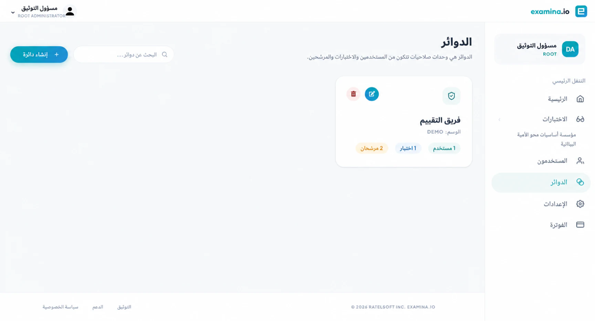

# تكوين الدوائر والأذونات {#configure-circles-and-permissions}

الدائرة عبارة عن حد إذن تم إنشاؤه من **المستخدمين** و**الاختبارات** و
** الممتحنين **. يمكن للمستخدم العمل مع الموارد المتاحة من خلال
دائرة، تخضع لدور حساب المستخدم.

## خطط للدائرة {#plan-the-circle}

استخدم دائرة لمنطقة مسؤولية ثابتة، مثل:

- دورة أو قسم.
- برنامج الامتحان؛
- العميل أو المستأجر؛
- موقع المدرسة؛ أو
- مشروع تقييم مقيد.

اختر اسمًا واضحًا وعلامة قصيرة، على سبيل المثال **أحياء 201** و
**بيو-201**. تجنب وضع معلومات المرشح السرية في الدائرة
اسم.

## إنشاء دائرة {#create-a-circle}

1. افتح **الصفحة الرئيسية ← الدوائر**.
2. حدد **إضافة دائرة جديدة**.
3. أدخل اسمًا فريدًا وعلامة اختيارية.
4. حدد المستخدمين الذين يحتاجون إلى الوصول.
5. حدد الاختبارات التي سيقومون بإدارتها أو مراقبتها.
6. حدد الممتحنين الذين يريدون عرضهم أو إدارتهم.
7. احفظ الدائرة.

يمكن لحسابات الجذر والمسؤول إنشاء الدوائر وتحريرها. أخرى مرخصة
يمكن للمستخدمين رؤية الدوائر ذات الصلة بهم.

## التحقق من الحدود {#verify-the-boundary}

يعرض جدول الدوائر عدد الممتحنين والمستخدمين والممتحنين في كل دائرة.
بعد الحفظ:

1. قارن كل عدد مع عضويتك المقصودة؛
2. قم بتحرير أسماء الدائرة والتحقق الفوري في القوائم الثلاث؛
3. الاختبار باستخدام الحساب العادي أو حساب المراقب؛
4. التحقق من عدم ظهور الامتحان غير المرتبط والممتحن. و
5. التحقق من ظهور مساحات عمل المراقب المطلوبة للمراقبين.

## الدوائر مقارنة بالمجموعات {#circles-compared-with-groups}

| الدائرة | المجموعة |
| --- | --- |
| يتحكم في وصول الموظفين | ينظم الممتحنين للعمليات بالجملة |
| يحتوي على المستخدمين والامتحانات والممتحنين | يحتوي على الممتحنين |
| يتم استخدامه عبر عمليات التحقق من إذن الصفحة الرئيسية وManager وProctor | يستخدم في Manager للأعمال المهمة |

ومن الشائع استخدام كليهما. يمكن لدائرة الدورة التدريبية تقييد فريق الدورة التدريبية، بينما أ
يمكن أن تحتوي المجموعة على الطلاب المعينين لجلسة معينة.

## الحفاظ على الدوائر بأمان {#maintain-circles-safely}

- تحديث العضوية عندما تتغير مسؤوليات الموظفين.
- إزالة الاختبارات المكتملة وإمكانية وصول الممتحنين التي لا معنى لها وفقًا للسياسة.
- احتفظ بالموارد المخصصة للمسؤول فقط خارج الدوائر الواسعة.
- قم بمراجعة عضوية الدائرة قبل تمكين المراقبة المباشرة.
- يتغير إذن الاختبار باستخدام حساب غير المسؤول.

يؤدي حذف دائرة إلى إزالة تجميع الأذونات. تأكيد التأثير على الموظفين
الوصول قبل حذفه.
