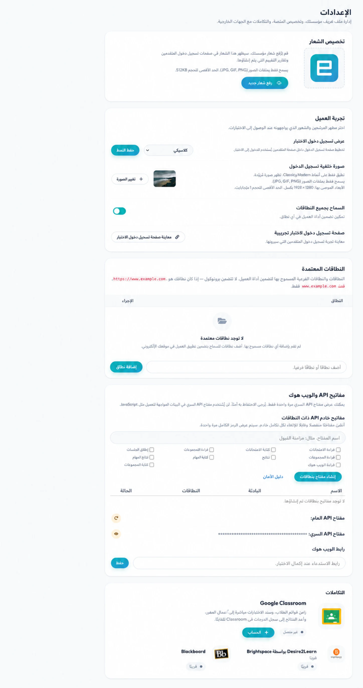

# إعدادات المنظمة والعلامات التجارية {#organization-settings-and-branding}

يمكن لحسابات الجذر والمسؤول فتح **الصفحة الرئيسية → الإعدادات** لإدارتها
العلامات التجارية على مستوى المؤسسة، وتضمين المجالات، وبيانات اعتماد API، وتسليم خطاف الويب،
ودعم اتصالات منصة التعلم.

## مجالات التضمين المعتمدة {#approved-embed-domains}

تتحكم القائمة المسموح بها للنطاق في المواقع التي يمكنها تحميل أداة العميل.

1. أدخل اسم المضيف فقط، بدون **http://** أو **https://**.
2. حدد **إضافة نطاق**.
3. قم بإزالة النطاقات التي لم تعد مستخدمة.

على سبيل المثال، أدخل **assessment.example.edu**، وليس
**https://assessment.example.edu/exams**.

تجنب **السماح بجميع المجالات** في الإنتاج. إذا قمت بإضافة
**المضيف المحلي** أو مضيف تطوير آخر، قم بإزالته بعد الاختبار لأنه
لا يقتصر على مؤسستك.

راجع [تضمين تطبيق العميل](../../integrations/embedding-client-app.md).

## شعار المنظمة {#organization-logo}

تتحكم لوحة **تخصيص الشعار** في الشعار الموضح في الدعم
وجهات النظر التي تواجه المنظمة والممتحنين. حدد **تحميل شعار جديد** و
اختر ملف JPG أو GIF أو PNG بحجم يصل إلى 512 كيلوبايت.

استخدم شعارًا عالي التباين مع حشوة شفافة أو محايدة، ثم قم بالتحقق منه
كل من شاشات سطح المكتب والشاشات المحمولة.

## صفحة تسجيل الدخول للامتحان {#exam-login-page}

في لوحة **تجربة العميل**، قم بتعيين **عرض تسجيل الدخول للاختبار** إلى **الافتراضي**،
**حديث** أو **كلاسيكي**.
يمكن للحديث والكلاسيكي استخدام صورة خلفية للمؤسسة. إذا لم يكن هناك شيء
شريطة أن يتمكن العميل من إظهار الخلفية المتوفرة.

1. اختر طريقة عرض تسجيل الدخول وحدد **حفظ النمط**.
2. حدد **تغيير الصورة** لتحميل خلفية JPG أو GIF أو PNG.
3. استخدم صورة بدقة 1920 × 1280 بكسل عندما يكون ذلك ممكنًا واحتفظ بها ضمن الشاشة المعروضة
   الحد من الحجم.
4. حدد **صفحة تسجيل الدخول للاختبار** وتحقق من إمكانية القراءة وموضع الشعار و
   سلوك المحمول.

راجع [تخصيص صفحة تسجيل الدخول للاختبار](../client/custom-login-page.md).

## مفاتيح API {#api-keys}

يمكن للمفتاح العام API ** تحديد عمليات تكامل المتصفح المعتمدة مثل
القطعة العميل. يقوم **API Secret Key** بتوثيق الطلبات من خادم إلى خادم
ويجب ألا يتم تضمينها أبدًا في متصفح JavaScript أو كود المصدر العام أو الهاتف المحمول
لقطات شاشة للتطبيق أو التوثيق.

يتم عرض السر مرة واحدة فقط عند إنشائه. قم بتخزينه على الفور
مدير سري معتمد. يمكن أن تؤدي إعادة إنشاء المفتاح إلى كسر عمليات التكامل الحالية
حتى يتم تحديث كل مستهلك.

راجع [مفاتيح وخطافات الويب API](../../integrations/api-keys-and-webhooks.md).

## خطاف ويب للإكمال {#completion-webhook}

أدخل عنوان URL لرد اتصال HTTPS لتلقي إشعار عند إجراء الاختبار
اكتمل. يجب أن تتحقق نقطة النهاية من صحة الطلبات وفقًا لـ API الحالي
العقد، وإرجاع الاستجابة الناجحة على الفور، ومعالجة العمل المطول
بشكل غير متزامن.

لا تستخدم صفحة إدارية خاصة أو عنوان URL يحتوي على بيانات اعتماد مثل
عنوان URL للويب هوك.

## تكامل منصات التعلم {#learning-platform-integrations}

يمكن أن تعرض الإعدادات موصلات منصة التعلم وتسجيلات LTI 1.3.
تعتمد متطلبات التوفر والإعداد على خطتك وعلى الخطة الخارجية
تكوين المنصة. للحصول على الإعداد الكامل وتدفقات التحقق من الصحة، راجع
[دمج examina.io مع Moodle](../../integrations/moodle-lms.md) و
[ادمج examina.io مع Canvas](../../integrations/canvas-lms.md)، أو
[ادمج examina.io مع Blackboard تعلم Ultra](../../integrations/blackboard-lms.md).

استخدم حساب تكامل مخصص حيثما كان ذلك مناسبًا، والمنحة مطلوبة فقط
الأذونات، وتوثيق المالك، وفصل عمليات التكامل التي لم تعد موجودة
تستخدم.

## قائمة التحقق من التحكم في التغيير {#change-control-checklist}

بعد تغيير إعدادات المؤسسة:

1. اختبار صفحة تسجيل الدخول باختبار محدد؛
2. اختبار كل مجال تضمين الإنتاج؛
3. التحقق من عملاء API في حالة تغيير المفتاح؛
4. إرسال حدث اختباري من خلال سير عمل خطاف الويب الخاص بك عندما يكون متاحًا؛ و
5. سجل خطة التغيير والتراجع للبيئات عالية المخاطر.
