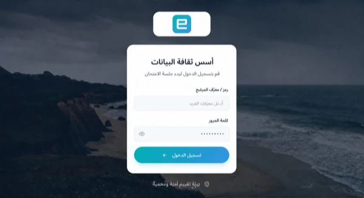
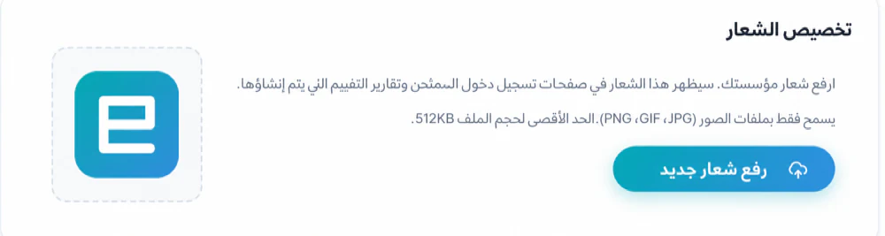
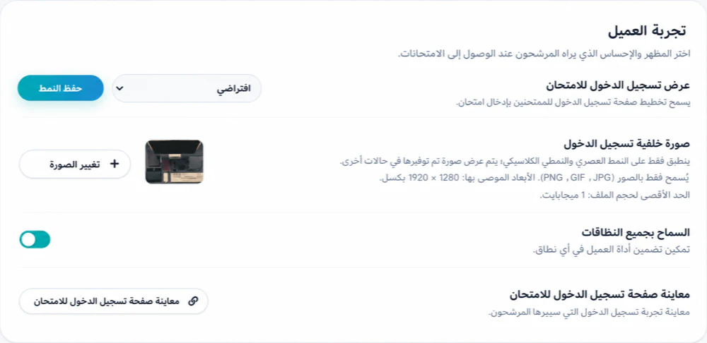

# تخصيص صفحة تسجيل الدخول للامتحان {#customize-the-exam-login-page}

يمكن لحسابات الجذر والمسؤول تكوين نمط تسجيل الدخول على مستوى المؤسسة،
الشعار والخلفية من **الصفحة الرئيسية → الإعدادات**. يمكن أن يعتمد التوفر على
خطة المنظمة.

## اختر النمط {#choose-a-style}

يوفر العميل ثلاثة أنماط:

1. **الافتراضي**
2. **حديث**
3. **كلاسيكي**

يدعم الإعداد الافتراضي العلامة التجارية الخاصة بالامتحان والتي تم إنشاؤها في Designer. الحديثة والكلاسيكية
استخدام شعار المنظمة وصورة الخلفية.

يطبق الطراز الكلاسيكي معالجة بصرية على الخلفية للحفاظ على التباين
حول حقول تسجيل الدخول. تحقق من الصورة النهائية في كلا النمطين بدلاً من ذلك
على افتراض أنها سوف تبدو متطابقة.

## تحميل شعار المنظمة {#upload-an-organization-logo}

1. قم بتسجيل الدخول كجذر أو مسؤول.
2. افتح **الصفحة الرئيسية → الإعدادات**.
3. في **تخصيص الشعار**، حدد **تحميل شعار جديد**.
4. اختر ملف JPG أو GIF أو PNG لا يزيد حجمه عن 512 كيلو بايت.
5. انتظر حتى يكتمل التحميل.

إذا لم يتم تعيين أي شعار، فيمكن أن يظهر اسم المؤسسة في مكانه. استخدم شعارًا
مع حشوة واضحة وتباين كافٍ لكل من الضوء والصور الفوتوغرافية
الخلفيات.

## حدد نمط تسجيل الدخول {#select-a-login-style}

1. ابحث عن **تجربة العميل**.
2. ضمن **عرض تسجيل دخول الاختبار**، اختر افتراضي، أو حديث، أو كلاسيكي.
3. حدد **حفظ النمط**.

ينطبق التغيير على مستوى المؤسسة. تنسيقه مع أي شخص
إجراء اختبار نشط قبل تبديل الأنماط.

## قم بتحميل خلفية {#upload-a-background}

1. ضمن **صورة خلفية تسجيل الدخول**، حدد **تغيير الصورة**.
2. اختر ملف JPG، GIF، أو PNG.
3. استخدم الأبعاد الموصى بها المعروضة — 1920 × 1280 بكسل — والتزم بها
   الحد الأقصى لحجم الملف المعروض.
4. انتظر حتى ينتهي التحميل.

يمكن للحديث والكلاسيكي استخدام الخلفية المتوفرة عند عدم تعيين صورة مخصصة.
حدد المعاينة الصغيرة لفحص الخلفية الحالية بحجم أكبر.

## اختبر النتيجة {#test-the-result}

في حالة توفر اختبار واحد على الأقل، حدد **صفحة تسجيل الدخول للاختبار**. تحقق:

- حجم الشعار والحدة.
- تباين النص؛
- نموذج تسجيل الدخول على عرض سطح المكتب والجوال؛
- التركيز على لوحة المفاتيح وسهولة القراءة الميدانية؛
- وقت التحميل على اتصال أبطأ؛ و
- ما إذا كانت هوية المنظمة الصحيحة لا لبس فيها.

افتح الاختبار في نافذة متصفح خاصة للاطلاع على تجربة الممتحنين
دون الاعتماد على جلسة المسؤول.

## توجيه الصورة {#image-guidance}

- تجنب النص المضمن في الخلفية. يمكن اقتصاصها أو حجبها.
- أبعد التركيز البصري عن نموذج تسجيل الدخول.
- ضغط الصور الكبيرة قبل التحميل.
- استخدم الصور المسموح لمؤسستك بنشرها.
- لا تضع أسماء المرشحين أو أسئلة الامتحان أو أي بيانات سرية أخرى
  أصول العلامات التجارية.

بالنسبة لبقية إعدادات المؤسسة، راجع [إعدادات المؤسسة و
العلامة التجارية](../administration/organization-settings.md).
