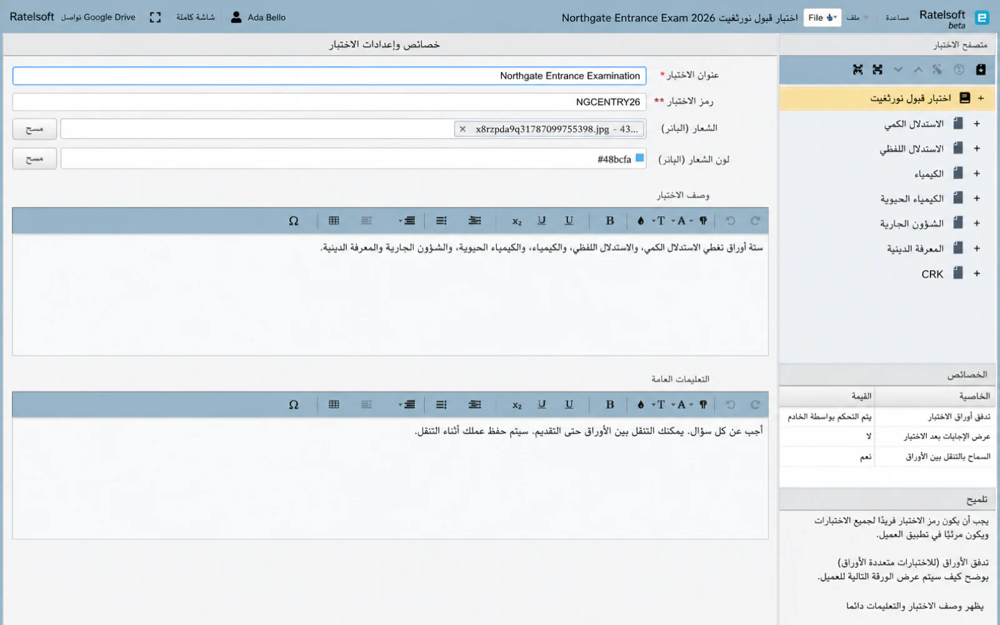

# الامتحان {#the-exam}

حدد اختبارًا في Exam Explorer وسيعرض جزء التحرير كل ذلك
ينطبق على الامتحان ككل معظمها مرئي للممتحن، فهو كذلك
يستحق أن يتم تعمده هنا بدلاً من ملئه لتجاوز الشاشة.

## عنوان الامتحان {#exam-title}

الاسم الذي يراه الممتحن أثناء أداء الامتحان. اكتبها بالطريقة التي تريدها
اطبعها على ورقة: *اختبار مدخل Northgate*، وليس *entrance-final-v2*.

!!! note "حول الأمثلة"
    تستخدم لقطات الشاشة في صفحات Designer نموذجًا واحدًا للمشروع،
    **امتحان مدخل Northgate 2026**، ويحتوي على اختبار واحد يسمى
    *امتحان مدخل Northgate* بستة أوراق. حيث يسمي هذا الدليل أ
    قيمة الحقل، هي القيمة المرئية في تلك العينة.

## كود الامتحان {#exam-code}

**مطلوب، والحقل الأكثر احتمالاً أن يسبب مشاكل لاحقاً.**

الكود يحدد الامتحان عندما يصل إلى Manager، لذلك يجب أن يكون فريدًا
عبر كل اختبار تستورده مؤسستك. لا يمكن لامتحانين مشاركة الرمز
كلاهما يتم استيراده بشكل نظيف.

قاعدتان يفرضهما المجال:

- **بدون مسافات**
- **الأحرف والأرقام فقط** — بدون علامات ترقيم أو شرطات أو شرطات سفلية

`NGCENTRY26` جيد، وهو الرمز المستخدم في العينة. `NGC ENTRY 26` و
`NGC-ENTRY-26` ليست كذلك.

!!! tip "قرر خطة قبل امتحانك الثاني، وليس العشرين"
    شيء مثل `SUBJECT` + `YEAR` + `SITTING` يبقى قابلاً للقراءة ويبقى
    فريدة من نوعها: `NGCENTRY26`، `NGCMOCK26`. التحديث التحديثي للمخطط يعني إعادة الاستيراد
    الاختبارات المستخدمة بالفعل.

## شعار العلامة التجارية واللون {#branding-banner-and-colour}

اختياري. تظهر اللافتة للممتحن أثناء إجراء الامتحان، و
تلوين الواجهة المحيطة.

استخدمها عندما تقوم مؤسسة واحدة بتقديم الاختبارات نيابة عن عدة مؤسسات
الإدارات أو العملاء، وكل منها يحتاج إلى أن يبدو وكأنه خاص به. **مسح** يزيل
إما دون التأثير على الآخر.

## وصف {#description}

يظهر للممتحن قبل أن يبدأ، وأول شيء للمرشح العصبي
يقرأ. اذكر ما هو **الاختبار** وما **يغطيه**، بلغة واضحة.

أشياء مفيدة ضعها هنا:

- الغرض من الاختبار - الدخول، نهاية الوحدة، التدريب
- ما هي المواضيع أو المواضيع التي يغطيها، وعدد الأوراق
- تقريبًا المدة التي تستغرقها الجلسة بأكملها
- ماذا يعني التمرير، إذا تم تحديد ذلك مسبقًا

تستخدم العينة:

> ستة أوراق تغطي الاستدلال الكمي، والاستدلال اللفظي، والكيمياء،
> الكيمياء الحيوية والشؤون الجارية والمعرفة الدينية.

تجنب إعادة صياغة عنوان الاختبار، وتجنب المراجع الداخلية مثل الإصدار
أرقام أو رموز اللجنة. ولا يمكن للمرشح التصرف بناء على ذلك.

## تعليمات عامة {#general-instruction}

يظهر أيضًا قبل بدء الامتحان. هذا بالنسبة لقواعد الغرفة: الأشياء أ
يحتاج المرشح إلى معرفة كيفية إجراء الاختبار بشكل صحيح، والتقدم عبر **كل**
ورقة.

أشياء مفيدة ضعها هنا:

- هل يجب عليهم الإجابة على كل سؤال، أو يمكنهم الاختيار
- هل يمكنهم التنقل بين الأوراق، وهل يمكنهم العودة
- ما هو مسموح به - الآلة الحاسبة، الملاحظات، ورقة المسودة
- ماذا يحدث إذا انقطع الاتصال أو تم إغلاق المتصفح
- كيفية الإبلاغ عن مشكلة أثناء الامتحان
- ما إذا كان يتم حفظ العمل أثناء المضي قدمًا

تستخدم العينة:

> الإجابة على كل سؤال. يمكنك التنقل بين الأوراق حتى تقوم بالتقديم. عملك
> يتم حفظه كما تذهب.

هذه الجملة الأخيرة تفعل أكثر مما تبدو: المرشحون الذين لا يعرفون مرشحهم
الإجابات التي يتم حفظها سوف تتجنب التنقل، وسوف تقضي الامتحان قلقًا
عن فقدان العمل.

!!! tip "قل ماذا يحدث عندما تسوء الأمور"
    التعليمات الأكثر أهمية هي تلك التي لا يكتبها أحد: ماذا تفعل إذا
    يسقط الاتصال. المرشح الذي يعرف أن بإمكانه الانضمام مرة أخرى سوف ينضم مجددًا. واحد
    ومن لا يستطيع أن يستسلم.

تنتمي التعليمات لكل ورقة إلى [الورقة ](paper.md) بدلاً من ذلك - التوقيت،
اختيار السؤال، وأي شيء ينطبق على موضوع واحد فقط. أي شيء أنت
خلاف ذلك سوف أكرر على كل ورقة تنتمي هنا.

## تدفق ورقة الامتحان {#exam-paper-flow}

بالنسبة للامتحانات التي تحتوي على أكثر من ورقة واحدة، فإن هذا هو ما يحدد كيفية وصول الورقة التالية.

| الإعداد | السلوك |
|---|---|
| **التحكم بالخادم** | يقرر الخادم متى تفتح كل ورقة. الجميع يتحرك معًا |
| ** التحكم بالعميل ** | ينتقل الممتحن إلى حال الانتهاء من الورقة الحالية |
| **القوة المستمرة** | تجري الأوراق الواحدة تلو الأخرى دون انقطاع |

اختر **التحكم بالخادم** للجلوس حيث يجب أن يكون الجميع على نفس المستوى
الورق في نفس الوقت . اختر **مراقبة العميل** عندما ينبغي على المرشحين ذلك
العمل بالسرعة التي تناسبهم خلال فترة زمنية إجمالية.

## عرض الإجابات بعد الامتحان {#show-answers-after-exam}

ما إذا كان الممتحن يرى الإجابات الصحيحة بمجرد إرسالها.

مفيدة لاختبارات الممارسة والمراجعة. دائمًا ما يكون الخطأ في الحياة
التقييم، لأنه يسلم مفتاح الإجابة لكل من يجلس مبكرًا.

## السماح بالتنقل بين الورق {#allow-inter-paper-navigation}

ما إذا كان يمكن للممتحن العودة إلى الورقة التي تركها بالفعل.

اضبط على **لا** عندما يكون من المفترض أن يتم إغلاق كل ورقة بمجرد إرسالها. اضبط على
**نعم** عندما يكون الاختبار بأكمله عبارة عن ورقة طويلة مقسمة إلى أجزاء
يجب أن يكون المرشحون أحرارًا في إعادة الزيارة.

## قبل المضي قدما {#before-you-move-on}

رمز الاختبار هو الإعداد الوحيد الذي يصعب تغييره لاحقًا،
لأن هذه هي الطريقة التي يتعرف بها Manager على الاختبار. كل شيء آخر يمكن تحريره و
إعادة تصديرها دون عواقب.

التالي: [الورقة](paper.md).
