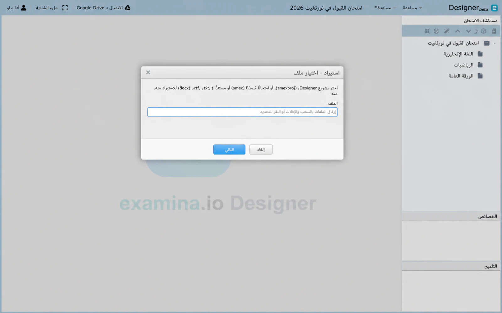
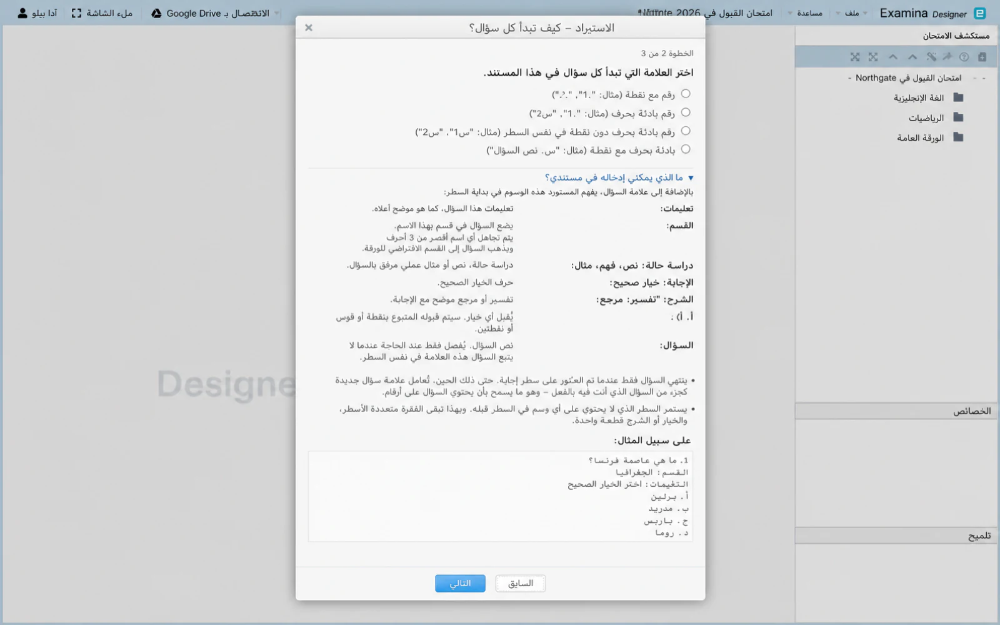
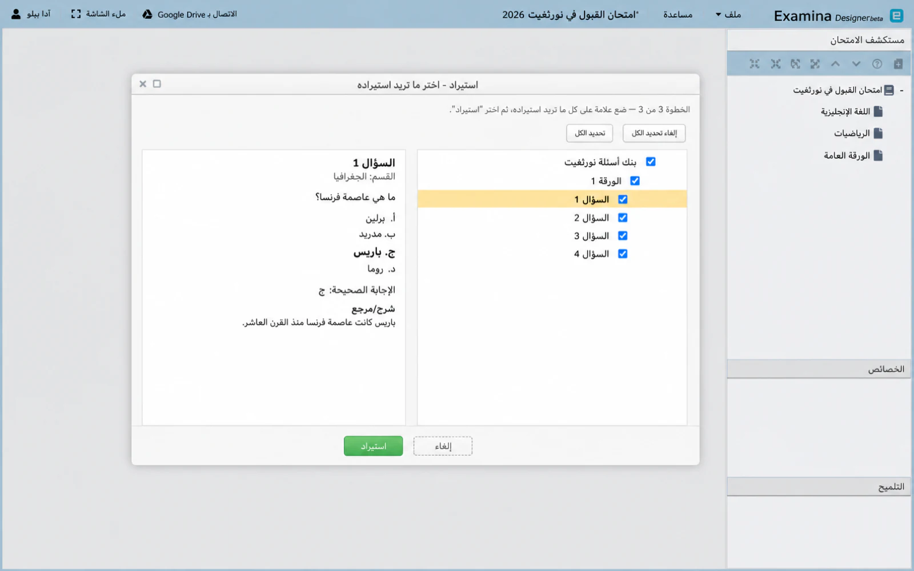
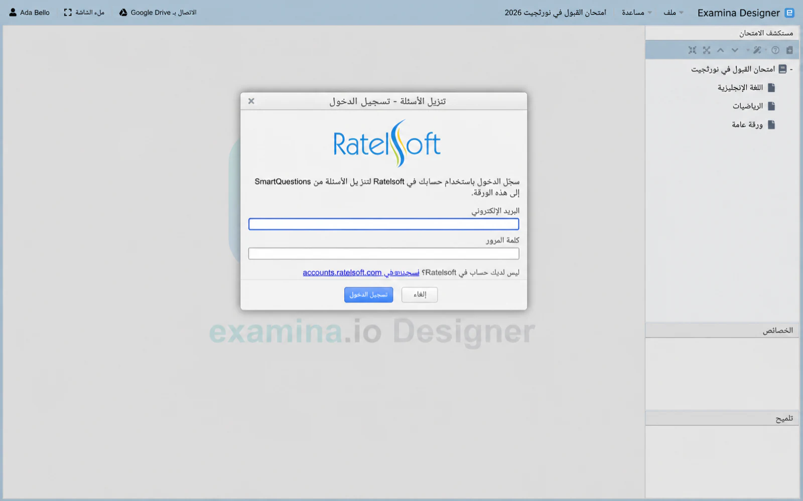

# استيراد المحتوى الموجود {#import-existing-content}

يمكن لـ Designer أن يأخذ محتوى من مشروع Designer آخر، من اختبار بالفعل
تصديرها للتسليم، أو من مستند معالج بالنصوص فيه الأسئلة
يتم كتابتها. يعمل الثلاثة جميعًا من خلال نفس المعالج: اختر ملفًا وأخبره
Designer كيفية وضع المستند، ثم حدد ما تريد. أين أنت
بدأت تقرر ما المسموح لك بإحضاره.

## ما يقبله Designer {#what-designer-accepts}

تتم قراءة ملف مشروع `.smexproj` واختبار `.smex` المُصدَّر مباشرةً، نظرًا لأنه
محتواها منظم بالفعل. مستند `.txt` أو `.rtf` أو `.docx` هو
للقراءة كنص، لذا يحتاج Designer إلى العلامة والعلامات أدناه للعثور على مكان كل منها
يبدأ السؤال. `.doc` غير مدعوم: افتحه في Word واحفظ `.docx`.

!!! warning "لن يتم استيراد الملفات من إصدار أحدث"
    مشروع أو اختبار تم تصديره محفوظ بواسطة إصدار أحدث من التطبيق
    تم رفض الملف الذي تقوم بتشغيله، مع فتح نفس الرسالة
    إعطاء: *"إصدار الملف أكبر من إصدار التطبيق"*. اسأل
    من أرسلها للحفظ من النسخة المطابقة.

## ابدأ عملية الاستيراد {#start-an-import}

1. اختر **ملف → استيراد الاختبارات من مشروع آخر** لإحضار الاختبارات بأكملها
   في المشروع المفتوح.
2. انقر بزر الماوس الأيمن فوق أحد الاختبارات في **Exam Explorer** واختر **استيراد الأوراق من
   ملف ** لإضافة أوراق إلى هذا الاختبار.
3. انقر بزر الماوس الأيمن فوق ورقة واختر **استيراد أسئلة من ملف** لإضافتها
   أسئلة لتلك الورقة.

الخطوة 1 تطلب الملف. تنتقل المستندات إلى الخطوة 2 التالية؛ أي شيء آخر للخطوة 3.

## أخبر Designer أين يبدأ كل سؤال {#tell-designer-where-each-question-starts}

تظهر الخطوة 2 للمستندات فقط. اختر العلامة التي تبدأ بها كل سؤال
في ملفك: `1.`، أو `Q1.`، أو `Q1` على سطر خاص به، أو `Q.`. لا شيء
محددة مسبقًا، لذا اختر الخيار الذي يطابق وثيقتك. افتح ** ماذا يمكن
أضع في وثيقتي؟** للإشارة إلى العلامات، كل منها في بداية السطر.

### العلامات {#tags}

**السؤال:**

: نص السؤال، مطلوب فقط عندما لا يتبع العلامة.

** التعليمات: **

: تعليمات لهذا السؤال.

**القسم:**

: يضع السؤال في قسم مسمى.

**دراسة حالة:**, **المقطع:**, **الفهم:**, **مثال:**

: فقرة مرفقة بالسؤال. العلامة التي تختارها هي التسمية المعروضة.

**أ.**، **أ)**، **أ:**

: خيار. يتم التعرف على الحروف من A إلى J.

**الإجابة:**، **الإجابة:**، **الخيار الصحيح:**

: حرف الخيار الصحيح.

**المرجع:**, **الخبرة:**, **الشرح:**, **المرجع:**

: الشرح الموضح مع الجواب .

### الحالات التي تصطاد الناس {#the-cases-that-catch-people-out}

يتم الانتهاء من السؤال فقط بمجرد رؤية سطر الإجابة. هذا ما
تتيح قائمة مرقمة داخل دراسة الحالة، `1. First point` و`2. Second
point`، البقاء في المقطع بدلاً من أن يبدأ كل سطر سؤالاً خاصًا به
الخاصة. السؤال الذي ليس له سطر إجابة لا يُغلق أبدًا ويبتلع الأسئلة التي تليها
لذلك، فإن السؤال المستورد الذي يحمل نص عدة يعني عادةً أ
مفقود **الإجابة:** السطر. الإجابة الثانية تحل محل الأولى؛ لا يضيف واحدة.

السطر الذي لا يحمل أي علامة يستمر في السطر الذي قبله، وهو ما يعني أنه متعدد الأسطر
دراسة الحالة تبقى قطعة واحدة، ولماذا تكون الملاحظة الضالة بين الأسئلة
ملحق بالسطر أعلاه. النص بدون علامة قبل أن يصبح أي علامة هو السؤال
نص، وعلامة **سؤال:** لاحقة تتجاوزه. **القسم:** الاسم تحت
يتم تجاهل ثلاثة أحرف ويقع السؤال في الوضع الافتراضي للورقة
قسم. يؤدي استيراد المستندات دائمًا إلى إنتاج عناصر متعددة الاختيارات ومحددة بشكل فردي،
لذا املأ الفراغ ويجب أن يظل الاختيار المتعدد [من تأليف
يد](questions.md).

## اختر ما تريد استيراده {#choose-what-to-import}

توضح الخطوة 3 ما وجده Designer كاختبار → ورقة → شجرة الأسئلة.

1. ضع علامة أمام الامتحانات أو الأوراق أو الأسئلة التي تريدها.
2. حدد كل واحدة لقراءتها في جزء المعاينة على اليمين.
3. اختر **استيراد**.

فقط المستويات التي تسمح بها نقطة الدخول الخاصة بك هي التي يمكن تحديدها: استيراد الأوراق يتيح لك ذلك
ضع علامة على الأوراق والأسئلة ولكن ليس الامتحانات؛ استيراد الأسئلة، الأسئلة فقط.

يتم استيراد الصور الموجودة داخل `.docx` مع أسئلتها؛ أي صورة كبيرة جدًا
أو بتنسيق Designer لا يمكن عرضه، يتم تخطيه واحتسابه والإبلاغ عنه متى
ينتهي الاستيراد. ما يصل هو محتوى Designer عادي، لذا قم بمعاينته،
تعيين النتائج والأقسام، وحفظ المشروع.

## تحميل الاسئلة {#download-questions}

**تنزيل الأسئلة** هي ميزة منفصلة، وليست جزءًا من معالج الاستيراد.
انقر بزر الماوس الأيمن على الورقة واخترها لسحب الأسئلة من SmartQuestions.

1. قم بتسجيل الدخول باستخدام حساب Ratelsoft الخاص بك.
2. اختر مخططًا، ثم ما يصل إلى خمسة مواضيع.
3. حدد عدد الأسئلة التي يجب أخذها من كل موضوع، من 1 إلى 100.
4. اختر ترتيبًا تسلسليًا أو عشوائيًا، ثم قم بالتنزيل.

لا يتم تخزين تسجيل الدخول. Designer يطلب ذلك مرة أخرى في جلسة جديدة.

لنسخ المحتوى داخل المشروع المفتوح، راجع [إعادة استخدام المشروع
المحتوى](importing-questions.md).
