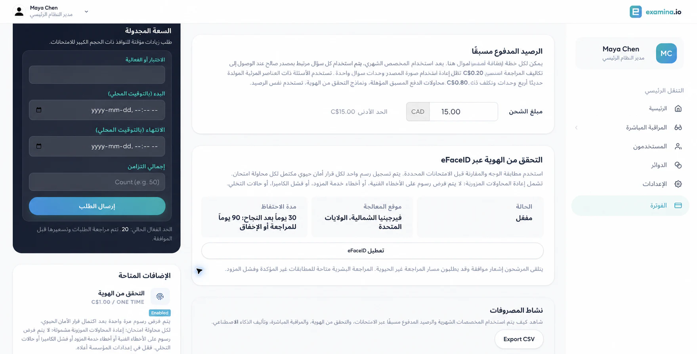
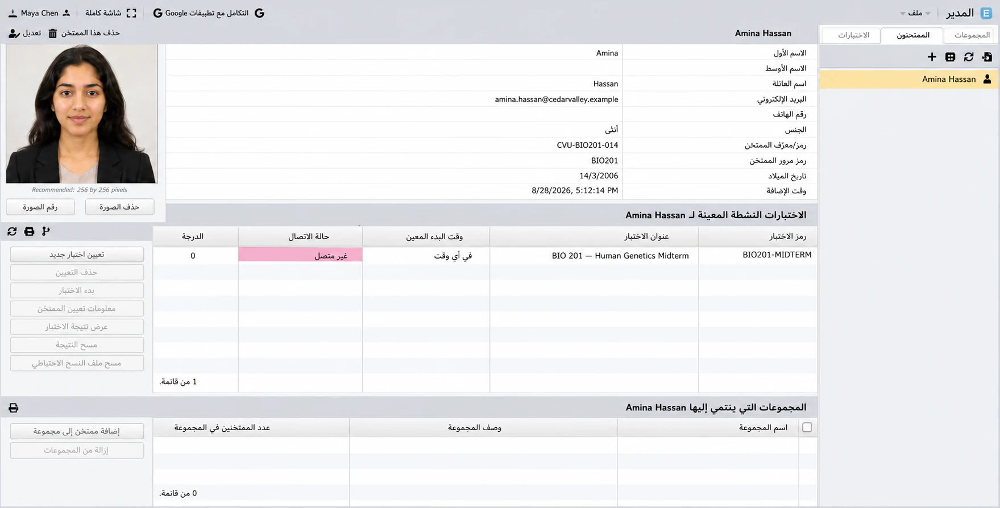
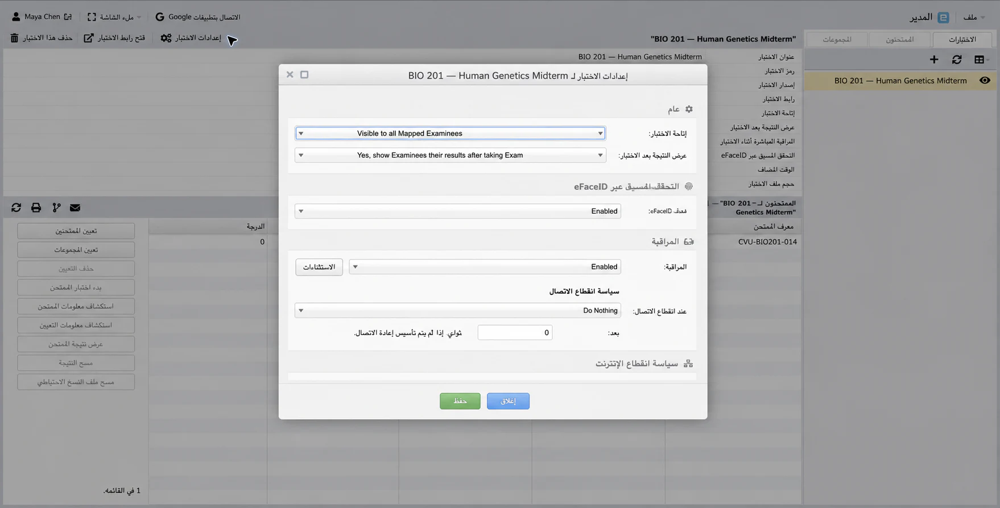
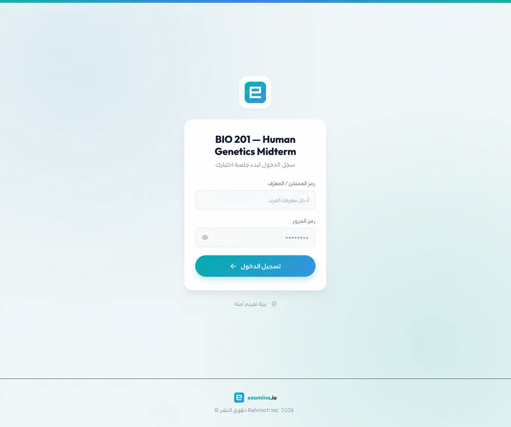
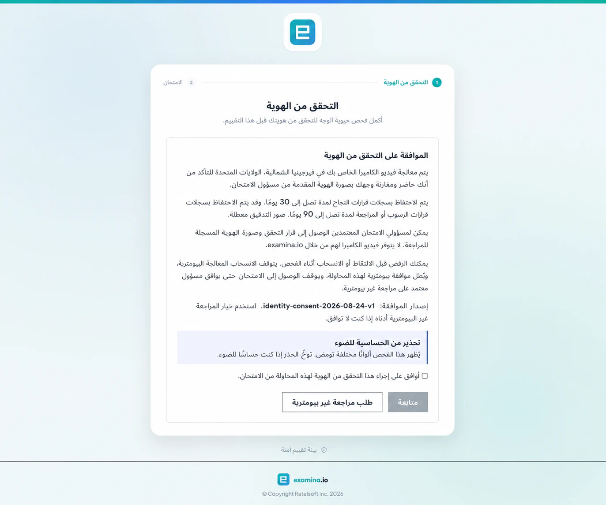
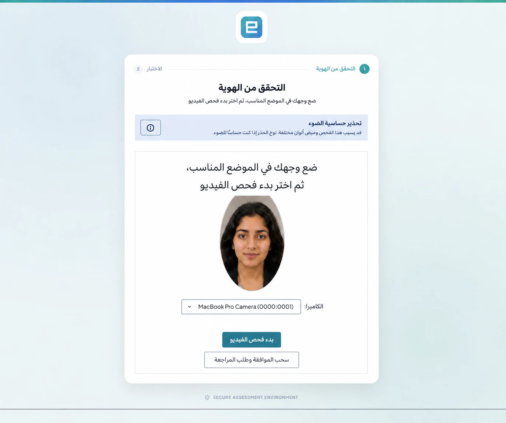

# إعداد واستخدام eFaceID

يساعد eFaceID المؤسسة على التأكد من أن الشخص الذي يبدأ اختبارًا محميًا حاضر
فعليًا ويطابق صورة الهوية التي قدّمها مسؤول مخوّل. يرتبط القرار بالممتحَن
والاختبار ومحاولة الاختبار نفسها.

يستخدم هذا الشرح مؤسسة **Cedar Valley University** الخيالية، والممتحَنة
**Amina Hassan**، واختبار **BIO 201 — Human Genetics Midterm**.

!!! important "وفّر مسارًا بشريًا بديلًا"

    لا ينبغي أن تكون القياسات الحيوية الطريقة الوحيدة لدخول الاختبار. انشر
    قناة دعم، واستخدم المراجعة غير البيومترية لمن لا يوافق أو لا يستطيع
    استخدام الكاميرا أو يحتاج إلى تسهيلات.

## قبل البدء

تحتاج إلى خطة متوافقة، والصلاحيات اللازمة، وصورة حديثة لكل ممتحَن، وكاميرا
مدعومة، وإجراء موثق للمراجعة غير البيومترية.

## 1. تفعيل eFaceID

افتح **الفوترة** وتأكد من أن **التحقق عبر eFaceID** في حالة **مفعّل**. تعرض
البطاقة أيضًا موقع المعالجة وفترات الاحتفاظ المطبقة.

يظهر الموقع في صورة مدينة أو منطقة ودولة، مثل **شمال فرجينيا، الولايات
المتحدة**. قد تختلف إعدادات مؤسستك.

## 2. تسجيل صورة الممتحَن

في **Manager** افتح **الممتحَنين**، وحدد الشخص، واختر **تغيير الصورة**، ثم
ارفع صورة شخصية حديثة وواضحة وأمامية بإضاءة جيدة. راجع الاسم والرمز وربط
الاختبار.

لا تستخدم صورة جماعية أو صفحة ممسوحة ضوئيًا أو صورة ذات مرشح أو صورة تحتوي
على أكثر من وجه.

## 3. حماية الاختبار

افتح إعدادات الاختبار وفعّل **التحقق عبر eFaceID**. فعّل أيضًا **المراقبة
المباشرة** إذا كان المراقب سيشاهد الجلسة. راجع الممتحَنين والأوراق وفترات
الاحتفاظ ومسار المراجعة البديل.

## 4. تجربة الممتحَن

يفتح الممتحَن الرابط الرسمي ويُدخل الرمز وكلمة المرور.

## 5. مراجعة الموافقة

بعد ذلك يراجع نص الموافقة: الغرض، وموقع المعالجة، وفترات الاحتفاظ، والأشخاص
المخوّلين، وتحذير الحساسية للضوء، وخيار المراجعة غير البيومترية.

## 6. إكمال فحص الحيوية

بعد الموافقة يسمح للكاميرا، ويضع الوجه وسط الإطار، ويتبع تعليمات الألوان
والحركة. يجب أن يظهر وجه واحد فقط مع إضاءة أمامية مناسبة.

تستخدم الصورة المنشورة شخصية خيالية لحماية الخصوصية، بينما تمثل عناصر التحكم
المسار الذي تم اختباره فعليًا.

## 7. فهم القرار

**تمت الموافقة**: ينتقل الممتحَن إلى إعداد الجهاز أو ملخص الاختبار.

**مطلوب مراجعة**: تتوقف المحاولة مؤقتًا ويراجع مسؤول مخوّل مسارًا غير
بيومتري موثقًا.

**فشل تقني**: تحقّق من إذن الكاميرا والإضاءة والمتصفح والشبكة قبل إعادة
المحاولة.

**رفض الموافقة أو سحبها**: لا تصدر موافقة بيومترية، ويختار الممتحَن **طلب
مراجعة غير بيومترية**.

تُحتسب فقط قرارات الأمان البيومترية المكتملة. أخطاء الأذونات والمحاولات
المهجورة وأعطال الشبكة أو الخدمة ليست قرارات ناجحة. راجع **الفوترة** لمعرفة
السعر والرصيد المتضمن.

## 8. الاحتفاظ والتدقيق

يمكن للمسؤولين المخوّلين رؤية القرار وصورة التسجيل، لكن فيديو الكاميرا لا
يتاح لهم عبر examina.io. قد تختلف مدة الاحتفاظ بالقرارات الناجحة عن حالات
المراجعة. لا تنسخ الصور البيومترية إلى البريد أو الدردشة أو تذاكر الدعم.

## استكشاف الأخطاء

**لا تفتح الكاميرا**: اسمح بالكاميرا للموقع نفسه، وأغلق التطبيقات الأخرى
التي تستخدمها، ثم أعد تحميل الصفحة. قد يطلب نظام التشغيل إعادة تشغيل المتصفح
بعد منح إذن جديد.

**لا يتم اكتشاف الوجه**: حسّن الإضاءة الأمامية ووسّط الوجه وأبعد أي وجوه
أخرى عن الإطار.

**تغيير المتصفح**: ترتبط الموافقة بجلسة المحاولة وقد يلزم التحقق مرة أخرى.

للاختبار الذي يستخدم مراقبًا، انتقل إلى
[تشغيل اختبار بمراقبة مباشرة](live-exam-proctoring.md).
