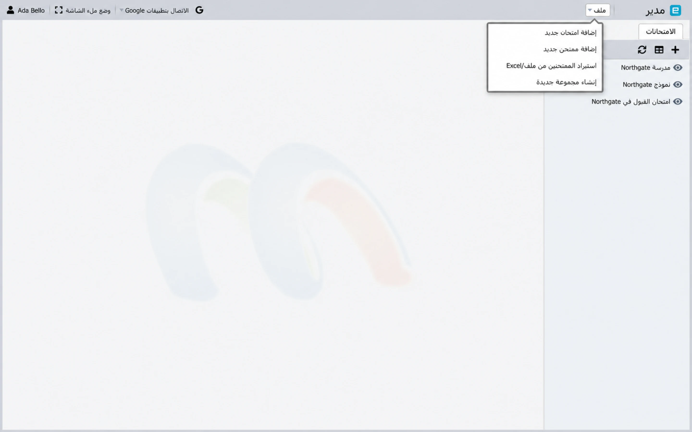
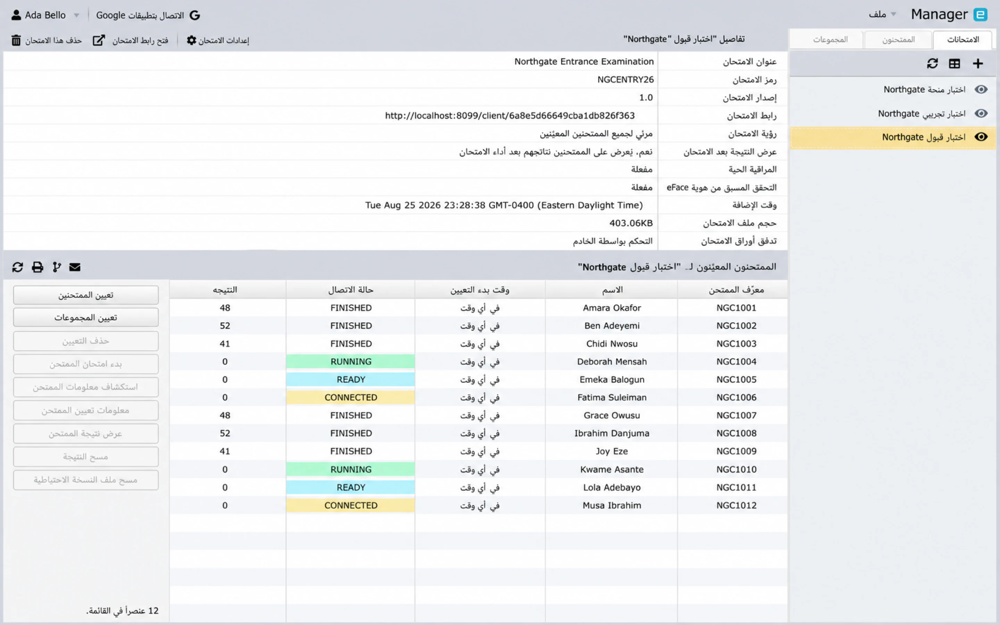

# استيراد اختبار إلى Manager {#import-an-exam-into-manager}

يقبل Manager حزم الاختبارات المصدرة بواسطة Designer كملفات `.smex`. استيراد
الحزمة قبل إضافة الواجبات أو مشاركة رابط الاختبار.

## قبل الاستيراد {#before-you-import}

في Designer، قم بتأكيد:

- عنوان الامتحان وكوده صحيحان؛
- تحتوي كل ورقة على الأسئلة المقصودة؛
- مدة الورقة وإعدادات الأسئلة للإجابة صحيحة؛
- تمت مراجعة التهديف والإجابات الصحيحة.
- التعليمات وقواعد التنقل كاملة؛ و
- تم حفظ المشروع قبل التصدير.

احتفظ بالمشروع المصدر باعتباره المشروع الرئيسي القابل للتحرير. الملف `.smex` الذي تم تصديره هو
حزمة التسليم.

## قم باستيراد الملف {#import-the-file}

1. افتح **Manager**.
2. حدد **ملف → إضافة اختبار جديد**.
3. اسحب ملف `.smex` إلى منطقة التحميل أو حدده مع الملف
   منتقي.
4. أرسل التحميل.
5. انتظر رسالة النجاح التي تحتوي على رمز الامتحان المستورد وعنوانه.

إذا أبلغ Manager أن نوع الملف غير مدعوم، فارجع إلى Designer و
قم بتصدير الاختبار بتنسيق `.smex` المدعوم. إذا تجاوز الملف
الحجم المسموح به لبيئتك أو خطتك، وتقليل أصول الوسائط الكبيرة والتصدير
مرة أخرى.

## التحقق من الامتحان المستورد {#verify-the-imported-exam}

قم باختيار الاختبار ومراجعة لوحة التفاصيل الخاصة به:

- عنوان الامتحان، والرمز، والإصدار؛
- تدفق ورقة الامتحان.
- الرؤية؛
- حجم الملف المستورد؛ و
- وقت إضافتها.

**حجم ملف الاختبار** هو أسرع طريقة للتحقق من صحة الحزمة
وصل - وهو رقم أقل بكثير من المتوقع يعني عادةً تصديرًا
في عداد المفقودين وسائل الإعلام الخاصة بها.

افتح المعلومات الورقية وقارنها بمشروع Designer. لا خريطة
الممتحنين الحقيقيين حتى يصبح المحتوى والتوقيت صحيحين.

## تحديث الامتحان بأمان {#update-an-exam-safely}

إذا تغير المحتوى بعد الاستيراد:

1. قم بتحديث المشروع المصدر والتحقق من صحته في Designer.
2. قم بتصدير ملف تسليم جديد.
3. قم باستيراده وفقًا لعملية التغيير في مؤسستك.
4. أعد فحص التعيينات والرؤية والمراقبة والاتصالات قبل الإصدار.

لا تفترض أن الملف الذي تم تصديره حديثًا سيحافظ على كل جانب من جوانب التسليم
الإعداد. تحقق من سجل Manager واختبر رحلة العميل بعد أي شيء
استبدال أو تغيير الإصدار.

## متابعة الإعداد {#continue-setup}

بعد ذلك، [أضف أو استورد الممتحنين](examinees.md)، ثم [قم بتعيين الأشخاص و
الأوراق](groups-and-assignments.md).
