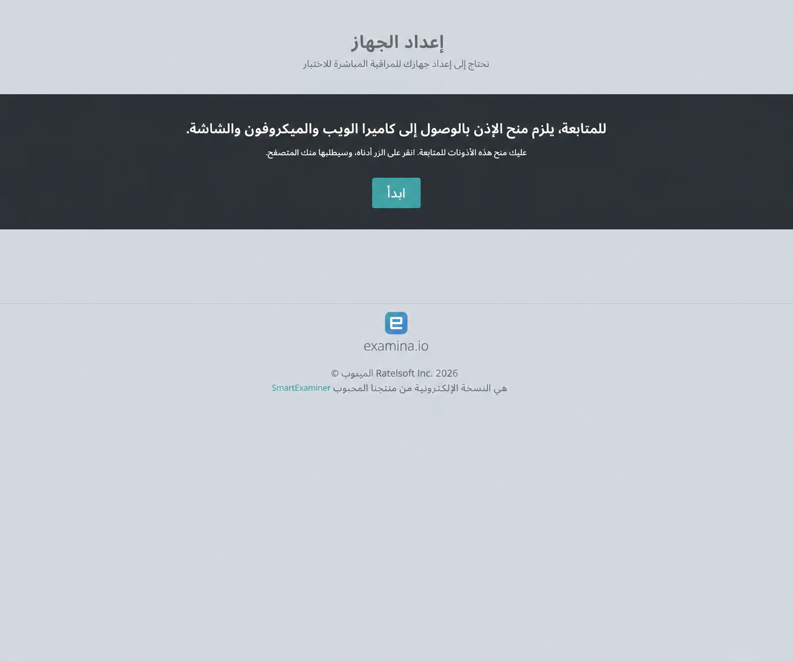
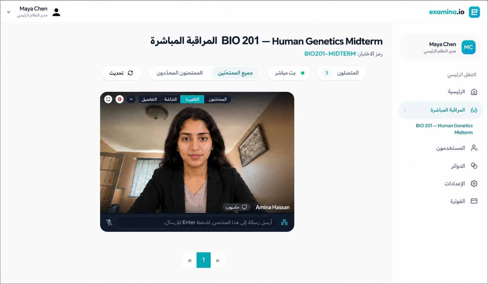
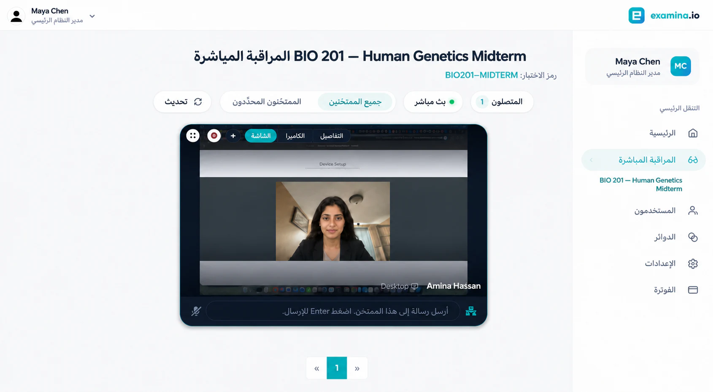
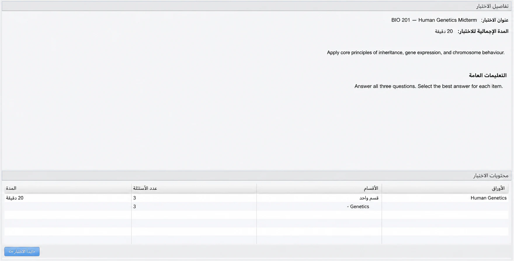
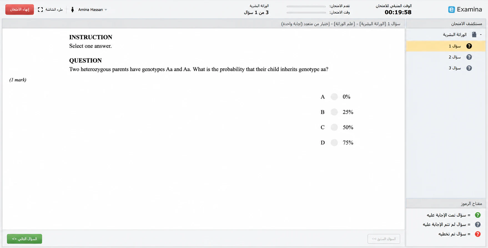
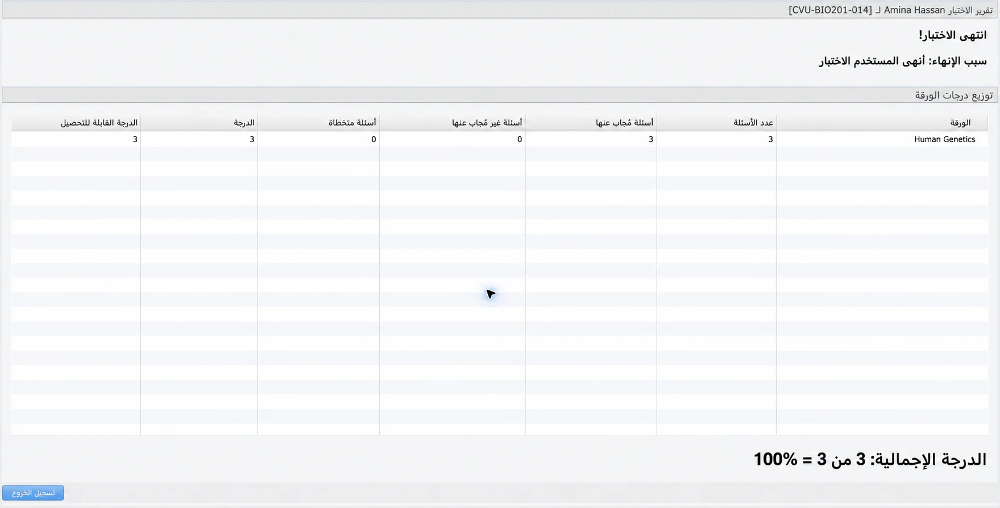

# تشغيل اختبار بمراقبة مباشرة

تسمح المراقبة المباشرة لمراقب مخوّل بمشاهدة كاميرا الممتحَن وشاشته المشتركة،
وإرسال الرسائل، والسماح ببدء الاختبار، ومتابعة الجلسة في وحدة Examina.

يستخدم المثال **Cedar Valley University** و**Amina Hassan** و**BIO 201 — Human
Genetics Midterm**.

## قبل يوم الاختبار

راجع ربط الممتحَنين والأوراق والمدة ونافذة البدء والتعليمات وعرض النتائج.
فعّل **المراقبة المباشرة**، وفعّل **التحقق عبر eFaceID** عند الحاجة. امنح
المراقب الدور والوصول إلى الدائرة الصحيحة.

يحتاج الممتحَن إلى حاسوب وكاميرا وميكروفون ومتصفح حديث ومشاركة شاشة واتصال
مستقر. يستخدم المراقب حاسوبًا وجلسة منفصلين. استخدم HTTPS في الإنتاج؛ لا
يمكن لعنوان HTTP عادي على الشبكة المحلية طلب أذونات الوسائط.

### إعداد التقييم

راجع التعيينات والمواعيد والتعليمات وصلاحيات المراقبين قبل النشر.

### تجهيز الأجهزة والشبكات

نفّذ تدريبًا كاملًا باستخدام ممتحَن خيالي قبل يوم الاختبار.

## 1. إعداد جهاز الممتحَن

بعد تسجيل الدخول وإكمال
[eFaceID](efaceid-identity-verification.md) عند تفعيله، تظهر صفحة **إعداد
الجهاز**.

يختار الممتحَن **بدء**، ويسمح بالكاميرا والميكروفون، ثم يشارك علامة تبويب
الاختبار أو الشاشة المطلوبة. يجب إغلاق النوافذ والإشعارات الخاصة أولًا.

!!! warning "لا تشارك محتوى خاصًا"

    أغلق النوافذ والإشعارات غير المتعلقة بالاختبار. شارك علامة تبويب الاختبار
    فقط عندما تسمح سياسة المؤسسة بذلك.

## 2. فتح وحدة المراقبة

يفتح المراقب الاختبار تحت **المراقبة**. من قائمة الممتحَن يختار **طلب تدفقات
الصوت والفيديو للممتحَن**، ويسمح بميكروفون المتصفح، وينتظر اكتمال الاتصال.
بعد إعادة الاتصال، حدّث الوحدة قبل إرسال طلب جديد.

## 3. التحقق من الكاميرا والشاشة

في **Webcam** تحقّق من الهوية المتوقعة والإضاءة وزاوية الكاميرا وعدم وجود
شخص آخر.

في **Screen** تحقّق من مشاركة صفحة الاختبار أو الشاشة المتفق عليها.

تستخدم الصور ممتحَنة خيالية لحماية الخصوصية مع الحفاظ على حالة الوحدة التي
تم اختبارها فعليًا.

## 4. السماح ببدء الاختبار

بعد اكتمال الفحوص، افتح قائمة الممتحَن الصحيح واختر **السماح بالبدء**. تأكد
من رسالة النجاح. يتلقى الممتحَن **اكتمل الإعداد** ويراجع العنوان والمدة
والتعليمات والأوراق وعدد الأسئلة.

## 5. المراقبة والإنهاء

تستمر المراقبة أثناء إجابة الممتحَن في Client.

راقب الاتصال، ولا تتدخل إلا عند الحاجة، وسجّل الحوادث وفق سياسة المؤسسة،
وميّز بين العطل التقني والسلوك غير النظامي. لا تجمع محتوى شخصيًا لا يتعلق
بالاختبار.

عند النهاية يختار الممتحَن **إنهاء الاختبار** ويؤكد الإرسال. راجع في Manager
الأسئلة المجابة وغير المجابة والمتروكة والدرجة المحققة والدرجة الممكنة.

## 6. إنهاء الجلسة

يؤكد الممتحَن الإرسال، وينتظر المراقب انتهاء التدفقات أو انقطاعها الطبيعي قبل
إغلاق الوحدة.

## 7. التحقق من النتيجة

راجع في Manager الحالة النهائية والإجابات والدرجة وتسوية أي حادث مسجل.

## حوادث شائعة

**الشاشة فارغة**: أوقف المشاركة وشارك علامة تبويب الاختبار أو الشاشة مرة
أخرى، وحدّث الوحدة، ثم اطلب التدفقات مجددًا.

**في انتظار التدفق**: تحقّق من HTTPS أو localhost والأذونات وزر **بدء** لدى
الممتحَن وطلب التدفقات لدى المراقب.

**إذن نظام جديد**: أعد تشغيل المتصفح إذا طلب نظام التشغيل ذلك.

**تغيير المتصفح**: أنهِ الجلسة القديمة أو انتظر انتهاء حضورها؛ قد يلزم تكرار
eFaceID.

**انقطاع الاتصال**: حافظ على المحاولة واستعد الشبكة واتبع سياسة الانقطاع. لا
تمسح النتيجة كإجراء استرداد اعتيادي.

## قائمة يوم الاختبار

- المراقب مسجل الدخول على حاسوب منفصل.
- الاختبار الصحيح مفتوح تحت **المراقبة**.
- تم التحقق من الهوية والصورة عند استخدام eFaceID.
- تم السماح بالكاميرا والميكروفون والشاشة.
- تم فحص الكاميرا والشاشة قبل السماح.
- تم السماح للممتحَن الصحيح صراحةً.
- تم التحقق من النتيجة النهائية في Manager.
