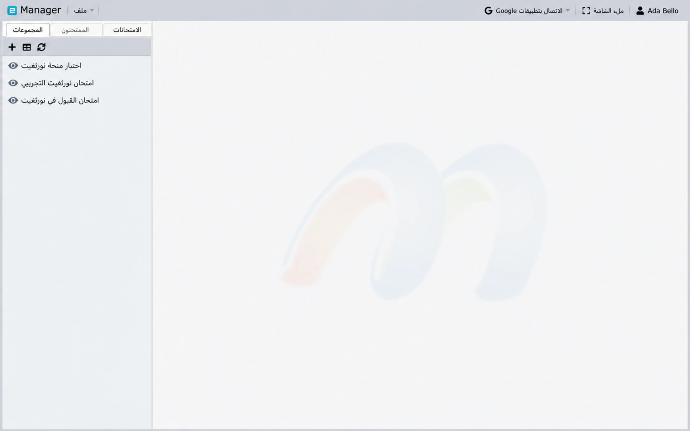
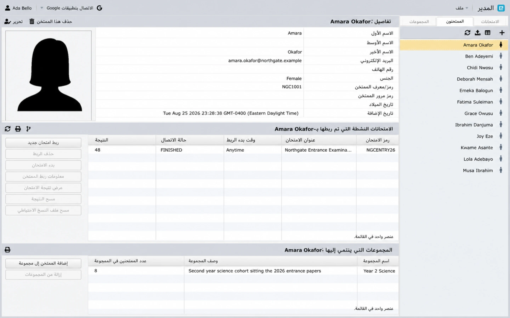
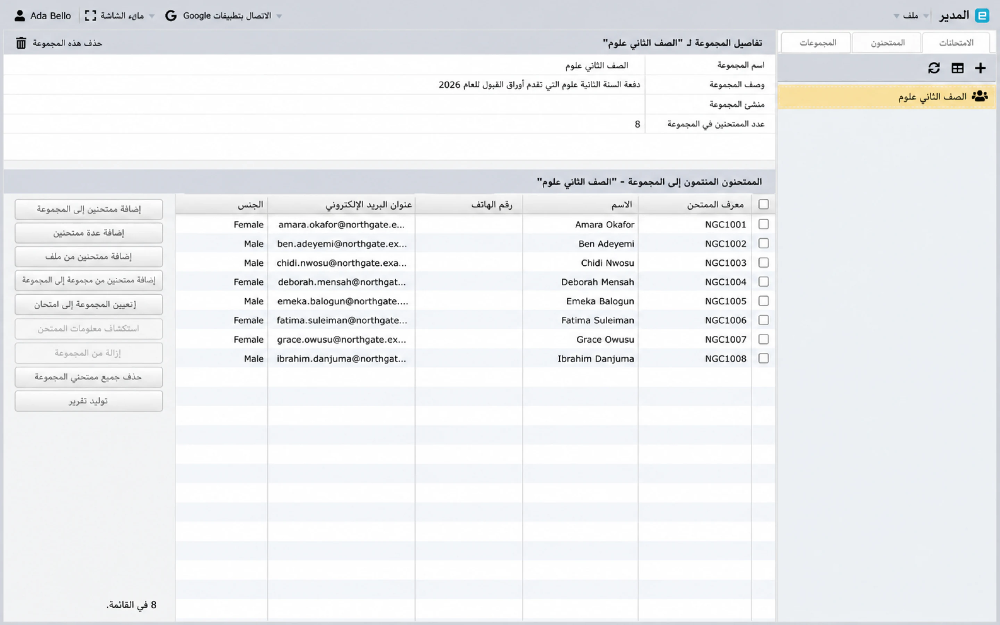

# نظرة عامة على Manager {#manager-overview}

Manager هي مساحة عمل إدارة الامتحانات. فهو يربط الامتحان المصدر مع
سجلات الممتحنين، والواجبات الورقية، وإعدادات التسليم، والمراقبة، و
النتائج.

## افتح Manager {#open-manager}

قم بتسجيل الدخول، وافتح **الصفحة الرئيسية**، وحدد **Manager** في معرض التطبيقات. منتظم،
يمكن للمسؤول والمستخدمين الجذر فتح Manager، ولكن الممتحنين والممتحنين
قد يكون الوصول إليهم محدودًا بـ [Circles](../administration/circles-and-permissions.md).

## مساحة العمل الرئيسية {#main-workspace}

يحتوي Manager على ثلاث علامات تبويب للموارد:

- **الاختبارات** تسرد التقييمات المستوردة.
- **الممتحنون** يسرد المرشحين الذين يمكن تعيينهم للاختبارات.
- **المجموعات** تسرد مجموعات الممتحنين القابلة لإعادة الاستخدام.

حدد عنصرًا في اللوحة اليمنى لفتح تفاصيله وإجراءاته المتاحة. ال
يقوم شريط الأدوات الصغير الموجود أعلى كل قائمة بإضافة سجل جديد، والتبديل إلى طريقة عرض الجدول، و
ينعش من الخادم. قم بالتحديث عندما يقوم مستخدم آخر بتغيير البيانات.

تحتوي القائمة **ملف** على أوامر الإنشاء الأربعة، وهي نفسها
في أي علامة تبويب أنت عليها:

- **إضافة اختبار جديد**
- **إضافة ممتحن جديد**
- **استيراد الممتحنين من ملف/اكسل**
- **إنشاء مجموعة جديدة**

## تسلسل التشغيل الموصى به {#recommended-operating-sequence}

1. [استيراد الامتحان](import-exams.md).
2. [إضافة أو استيراد الممتحنين](examinees.md).
3. قم بإنشاء مجموعات بشكل اختياري.
4. [تعيين الممتحنين أو المجموعات ](groups-and-assignments.md) للامتحان و
   أوراق.
5. مراجعة الرؤية وعرض النتائج والمراقبة والهوية والجهاز و
   إعدادات قطع الاتصال.
6. اختبر رابط الاختبار مع ممتحن الاختبار المعين.
7. نشر الامتحان وتبليغه.
8. [مراقبة الجلسة وتوليد النتائج](deliver-monitor-report.md).

## الامتحانات {#exams}

يُظهر سجل الامتحان عنوانه ورمزه وإصداره، والرابط الذي يستخدمه الممتحنين،
الرؤية، سواء تم عرض النتائج بعد الامتحان، سواء كانت المراقبة المباشرة
ويتم تمكين التحقق المسبق من eFace ID، ووقت إضافته، واستيراده
حجم الملف وتدفق الورق. يمكن أن تشمل إجراءات الاختبار ما يلي:

- خريطة الممتحنين أو المجموعات.
- فتح رابط الامتحان.
- إرسال بريد إلكتروني إلى الممتحنين المعينين؛
- تبديل الرؤية أو عرض النتيجة؛
- تكوين المراقبة المباشرة والتحقق من الهوية؛
- بدء أو إيقاف أو مراقبة اختبار مؤهل؛
- إدارة الأذونات وإعدادات التسليم؛ و
- عرض النتائج أو إنشاء التقارير.

تعتمد الإجراءات المتاحة على نوع الاختبار ودور الحساب والخطة والاختبار الحالي
الدولة.

## الممتحنين {#examinees}

يخزن سجل الممتحن رمزًا أو معرفًا فريدًا، ورمز المرور، والاسم، والجنس، ورقم الهوية
تفاصيل اختيارية مثل البريد الإلكتروني ورقم الهاتف وتاريخ الميلاد والصورة.
يوجد أسفل التفاصيل لوحتان: الاختبارات التي تم تعيين هذا الشخص لها، و
المجموعات التي ينتمون إليها. من هنا يمكنك إدارة عضوية المجموعة، وتخطيط الاختبار
والأوراق، ومراجعة تفاصيل التعيين، وعرض النتيجة المكتملة.

## المجموعات {#groups}

المجموعة عبارة عن مجموعة تشغيلية من الممتحنين، مثل الفصل أو المجموعة أو
جلسة الامتحان. يؤدي تعيين مجموعة إلى اختبار إلى تطبيق المهمة على المجموعة
الأعضاء الحاليين الذين لم يتم تعيينهم بالفعل.

تختلف المجموعات عن الدوائر: المجموعات تجعل عمل الممتحنين الجماعي أسهل؛
الدوائر تتحكم في وصول الموظفين.

## ممارسات التحضير الآمنة {#safe-preparation-practices}

- إبقاء الاختبار غير مرئي حتى يتم التحقق من المحتوى والواجبات والإعدادات.
- استخدم رموز الممتحنين الفريدة وقناة آمنة لرموز المرور.
- التحقق من المنطقة الزمنية عندما تتضمن المهمة وقت البدء.
- الاختبار ببيانات اختبار خيالية أو معتمدة.
- قم بالتحديث قبل التصرف بناءً على حالة الاتصال أو النتائج.
- التعامل مع إجراءات **مسح النتيجة** والحذف وإعادة إنشاء المفاتيح باعتبارها إجراءات حساسة.

## الخطوات التالية {#next-steps}

إذا كان لديك بالفعل تصدير Designer، فتابع مع [Import
الامتحانات](import-exams.md). إذا كان الاختبار موجودًا، فانتقل إلى [إضافة واستيراد
الممتحنين](examinees.md).
