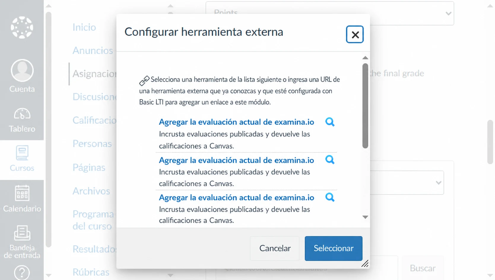
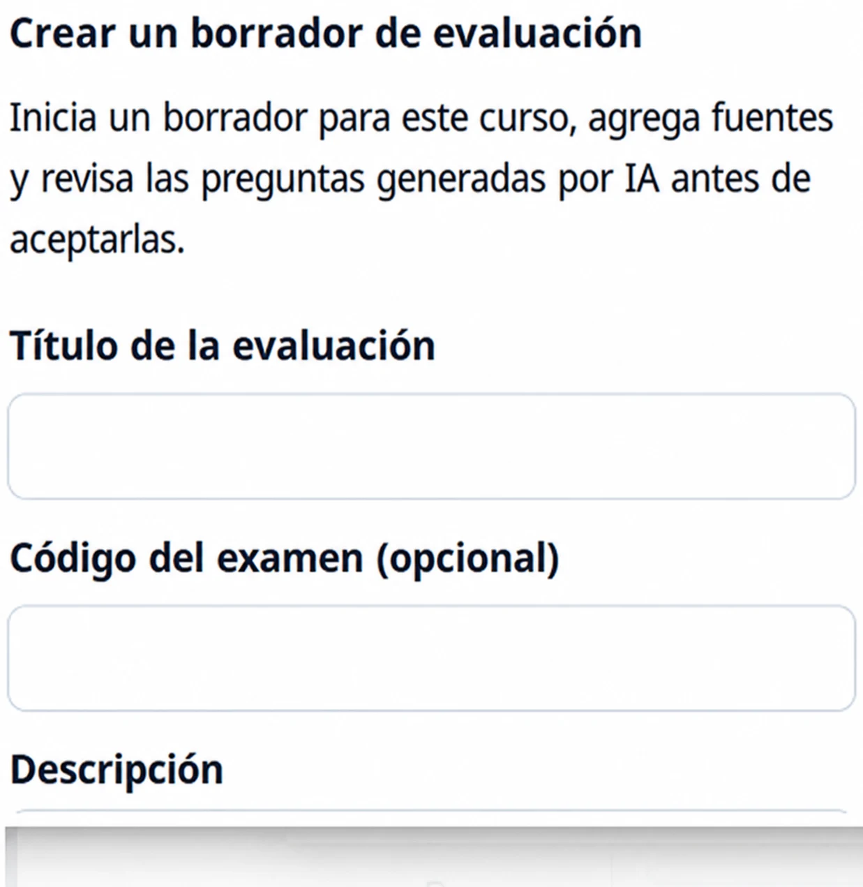
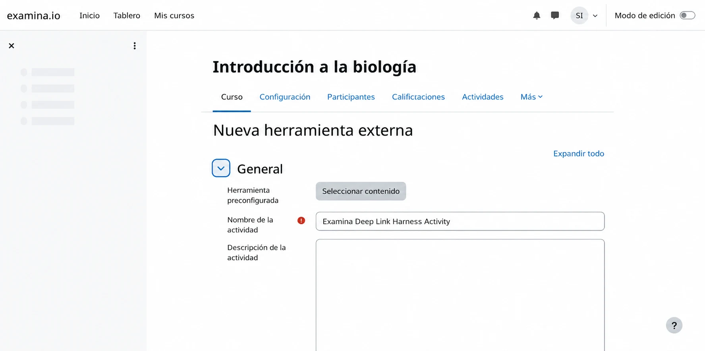
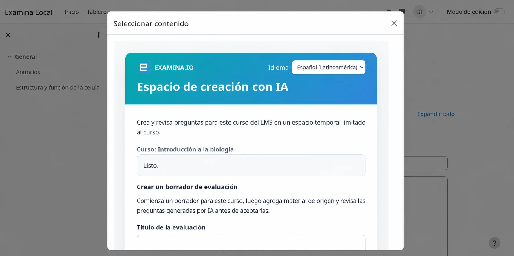
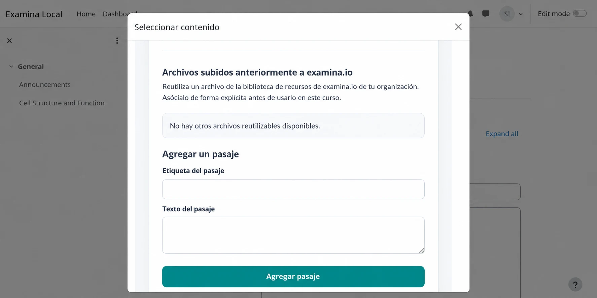
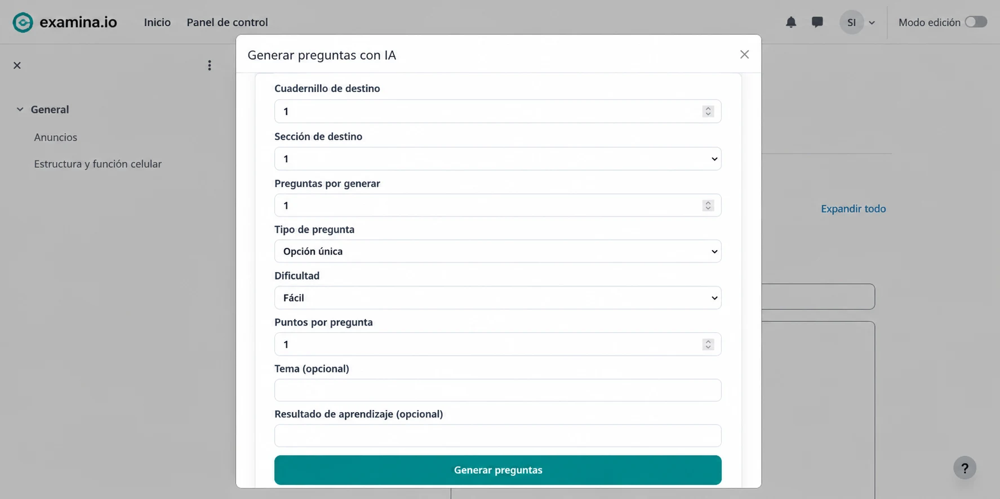
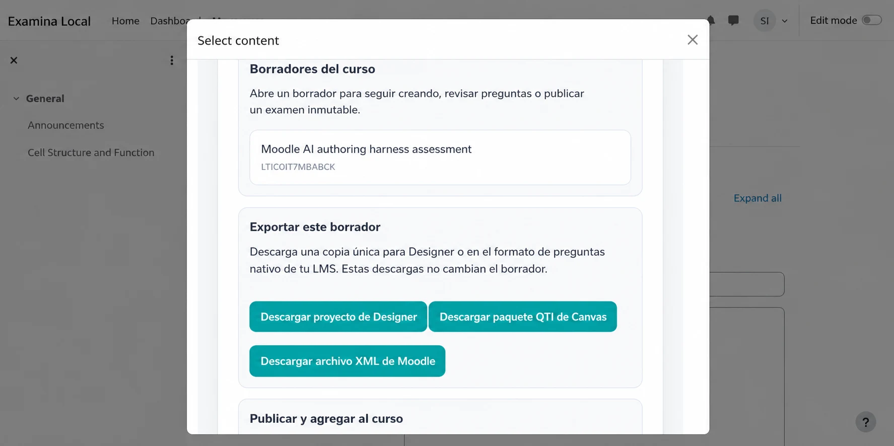
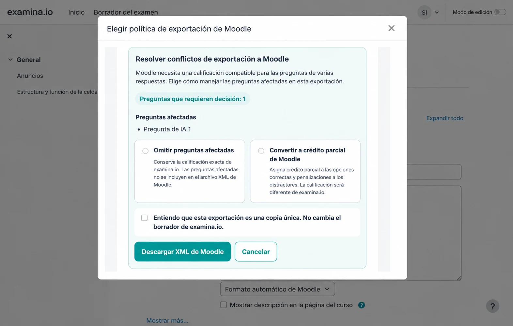

# Crear preguntas con IA desde Canvas o Moodle

Los instructores pueden abrir examina.io desde un curso de Canvas o Moodle,
crear con IA un borrador de preguntas basado en fuentes y devolver un examen
publicado al curso. El mismo borrador también puede producir un proyecto de
Designer de una sola vez o un archivo nativo para el banco de preguntas del LMS.

Esta guía cubre el flujo completo del instructor. Antes, un administrador del
LMS debe completar la [configuración LTI 1.3 de Canvas](canvas-lms.md) o la
[configuración LTI 1.3 de Moodle](moodle-lms.md), incluido **Deep Linking**.

!!! tip "Valida primero en un curso de prueba"

    Usa material y usuarios ficticios para validar la creación, exportación,
    publicación, apertura del estudiante y devolución de calificaciones antes
    de habilitar un examen real.

Los ejemplos usan un curso ficticio de **Introducción a la Biología (BIO 101)**
y un borrador llamado **Evaluación de estructura y función celular**.

## Comprender los borradores y resultados

El espacio de creación mantiene un único borrador canónico en examina.io. La
generación, revisión y modificación de fuentes actualizan ese borrador hasta su
publicación.

| Resultado | Propósito | Relación con el borrador |
| --- | --- | --- |
| Borrador de examina.io | Continuar la creación con IA y la revisión | Mutable y almacenado en el servidor |
| `.smex` | Ejecutar el examen final | Inmutable, final y almacenado en el servidor después de publicarlo |
| `.smexproj` | Continuar la edición avanzada en Designer v3 | Copia local única; guardar en Designer no actualiza el borrador del servidor |
| ZIP QTI de Canvas | Importar preguntas compatibles a un banco clásico de Canvas | Copia nativa única |
| Moodle XML | Importar preguntas compatibles a un banco de Moodle | Copia nativa única |

La publicación es un límite: crea el `.smex` inmutable que usan los
estudiantes. Exportar un proyecto o archivo del LMS no publica ni cambia el
borrador.

## Antes de comenzar

Confirma que:

- examina.io aparece como Herramienta externa en el curso;
- la configuración tiene Deep Linking habilitado;
- eres instructor, diseñador del curso o administrador autorizado para agregar
  actividades al LMS;
- tu cuenta tiene espacio dentro del límite de borradores activos; y
- tus archivos fuente son PDF, DOCX, TXT o HTML.

Los elementos `DRAFT` y `PUBLISHING` cuentan para el límite. Publicar o eliminar
un borrador libera su espacio. Si el entorno indica que se alcanzó el límite,
termina un borrador existente o pide a un administrador de examina.io que retire
uno. Eliminar borradores es actualmente una operación administrativa/API; no
está disponible en la pantalla del LMS ni en Designer.

## 1. Abrir la creación con IA desde tu LMS

### Canvas

1. Abre el curso y selecciona **Tareas**.
2. Crea o edita una tarea y elige **Herramienta externa** como tipo de entrega.
3. Selecciona **Buscar**, elige **examina.io** y abre su selector de contenido.

Elige **Crear preguntas con IA**, escribe **Evaluación de estructura y función
celular** y crea el borrador. Si ya comenzaste uno en el curso, también puedes
abrirlo desde la lista de borradores.

### Moodle

1. Activa el **Modo de edición** en el curso.
2. Selecciona **Agregar una actividad o un recurso** y luego **Herramienta
   externa**.
3. Elige la herramienta examina.io configurada y selecciona **Seleccionar
   contenido**.

Elige **Crear preguntas con IA** o vuelve a abrir un borrador del curso.

### Cambiar el idioma del espacio de trabajo

Usa el menú de idioma en la parte superior de cualquier página LTI de
examina.io para elegir inglés, francés, árabe, español latinoamericano o
portugués brasileño. El árabe utiliza una interfaz de derecha a izquierda. El
menú cambia las instrucciones y controles, pero nunca traduce los pasajes,
preguntas ni respuestas cargados.

## 2. Crear la estructura del borrador

Escribe un título reconocible y, si lo necesitas, un código interno. Para este
ejemplo usa:

- **Título:** Evaluación de estructura y función celular
- **Código:** BIO-101-CELL
- **Cuadernillo:** Cuadernillo 1
- **Sección:** Organelos celulares
- **Instrucción:** Responde cada pregunta usando el pasaje proporcionado.

En pantallas amplias, el entorno separa fuentes y preguntas en dos columnas; en
pantallas pequeñas las apila.

## 3. Agregar uno o varios archivos fuente

Selecciona **Agregar pasajes y archivos** y arrastra varios archivos al área de
carga o elígelos con el selector. Los archivos elegidos aparecen juntos antes
de subirlos para que puedas quitar una selección accidental.

Para un ejemplo rápido, sube un pasaje breve que explique:

> Los cloroplastos capturan energía luminosa para producir azúcares, mientras
> que las mitocondrias liberan energía utilizable de esos azúcares. Las células
> vegetales contienen ambos organelos.

Usa solo material que tu institución esté autorizada para procesar. Verifica que
cada archivo termine de procesarse antes de generar preguntas. Una fuente ya
cargada permanece adjunta al borrador del servidor cuando lo vuelves a abrir
desde Canvas o Moodle.

## 4. Generar preguntas

Selecciona **Generar preguntas con IA** y elige el cuadernillo y la sección de
destino. Actualmente examina.io genera:

- preguntas de opción única;
- preguntas de varias opciones; y
- preguntas de completar el espacio.

Para el ejemplo, crea dos preguntas de opción única, dificultad media y 2
puntos cada una; después crea una pregunta de varias opciones de dificultad
media. Usa **Organelos celulares** como tema y **Distinguir la captura de energía
de su liberación en las células vegetales** como resultado de aprendizaje.

El resultado de la IA puede ser incorrecto o inadecuado. El instructor sigue
siendo responsable de comprobar exactitud, claves de respuesta, ambigüedad,
dificultad, accesibilidad, derechos de autor y alineación pedagógica.

## 5. Revisar las propuestas generadas

Compara cada propuesta con su fuente. Conserva las preguntas aceptables y
rechaza las deficientes. El espacio enfocado del LMS permite seleccionar
preguntas y ajustar el título y la instrucción al estudiante; no es un editor
completo del enunciado y las respuestas.

Si se necesita una edición considerable, rechaza y vuelve a generar la
propuesta o descarga un proyecto de Designer para editarlo localmente. Un
proyecto abierto en Designer es una copia fijada a una revisión: guardarlo
**no** escribe cambios en el borrador canónico de examina.io.

## 6. Elegir qué hacer con el borrador

Abre las acciones del borrador cuando termines la revisión.

Puedes:

- descargar un archivo `.smexproj` para Designer v3;
- descargar un ZIP QTI de Canvas;
- descargar un archivo Moodle XML; o
- publicar el examen y devolverlo al curso.

Estas acciones son independientes. Por ejemplo, puedes importar una copia
nativa para reutilizarla y luego regresar al borrador canónico para publicarlo.

## 7. Importar una copia nativa de preguntas en Canvas

La exportación de Canvas convierte las preguntas compatibles de opción única,
varias opciones y completar el espacio a QTI. Es una exportación manual y
unidireccional.

1. Selecciona **Descargar paquete QTI de Canvas**.
2. En Canvas, abre **Configuración → Importar contenido del curso**.
3. Elige **Archivo QTI .zip**, selecciona la descarga y ejecuta la importación.
4. Abre el banco de preguntas clásico y revisa cada pregunta importada.

La exportación actual está dirigida a bancos de preguntas clásicos de Canvas.
No afirma tener envío directo ni certificación para New Quizzes. Los cambios en
Canvas no se sincronizan con examina.io.

## 8. Importar una copia nativa de preguntas en Moodle

Moodle XML admite las mismas familias básicas, pero la puntuación de varias
opciones de Moodle no siempre conserva la puntuación por conjunto exacto del
borrador. Cuando hay un conflicto, examina.io solicita una política para esa
exportación.

- **Omitir preguntas afectadas** conserva la puntuación de examina.io porque
  omite las preguntas en conflicto del XML.
- **Convertir a crédito parcial de Moodle** distribuye +100 % entre las opciones
  correctas y -100 % entre los distractores. La pregunta importada puede
  otorgar crédito parcial y no tiene una puntuación idéntica.

Si una pregunta ya usa puntuación parcial canónica, elige **Omitir preguntas
afectadas**. Confirma el aviso de copia única antes de descargar. La elección se
aplica solo a esa exportación y nunca modifica el borrador del servidor.

Después importa el archivo:

1. Abre el **Banco de preguntas** del curso de Moodle.
2. Selecciona **Importar** y elige **Formato Moodle XML**.
3. Sube el archivo XML descargado.
4. Revisa cada pregunta, respuesta, calificación y penalización importada.

## 9. Publicar y agregar el examen al curso

Regresa al borrador canónico y selecciona **Publicar y agregar al curso**. Lee
con cuidado el aviso de publicación. La publicación crea y guarda el `.smex`
final e inmutable; los cambios posteriores en el borrador o una copia nativa no
pueden modificarlo.

Después de que examina.io devuelva el Deep Link:

- en Canvas, termina la configuración y selecciona **Guardar** o **Guardar y
  publicar**; o
- en Moodle, termina la configuración de la actividad y selecciona **Guardar y
  mostrar**.

Usa un estudiante ficticio para abrir la actividad, enviarla y confirmar que el
resultado esperado llega al libro de calificaciones cuando AGS está habilitado.

## Volver a abrir un borrador en Designer

Designer v3 permite elegir **Archivo → Abrir desde borradores de examina.io**,
buscar en la tabla y seleccionar un borrador. Designer convierte la revisión
elegida en un `.smexproj` local. No guarda los cambios de vuelta en examina.io
ni sustituye la publicación del borrador canónico.

## Solución de problemas

### No aparece la opción de creación con IA

Confirma que Deep Linking esté habilitado y que el instructor abrió la ubicación
de selección de contenido, no un enlace para estudiantes. El administrador de
Canvas o Moodle también podría necesitar actualizar la herramienta instalada.

### Una fuente no aparece después de cargarla

Confirma que el archivo sea PDF, DOCX, TXT o HTML y espera a que termine el
procesamiento. Vuelve a abrir el mismo borrador antes de subir un duplicado.

### La exportación de Moodle omite una pregunta de varias opciones

Se eligió **Omitir preguntas afectadas** o Moodle XML no puede conservar el modo
de puntuación. Vuelve a exportar con crédito parcial solo si la diferencia de
puntuación es aceptable y se revisó.

### La copia de Designer difiere del borrador del servidor

Esto es normal después de cambiar cualquiera de las copias. `.smexproj` es una
instantánea unidireccional; Designer no sincroniza sus cambios con el borrador.

### La publicación no está disponible

Resuelve primero el procesamiento incompleto o los errores de validación. Si la
cuenta alcanzó un límite del plan o de borradores, contacta a su administrador
de examina.io.

## Lista de validación del instructor

- [ ] Se muestran el curso y el borrador correctos.
- [ ] Cada fuente está autorizada y totalmente procesada.
- [ ] Se revisó cada enunciado, opción, respuesta y valor de puntos.
- [ ] Se aceptó explícitamente cualquier diferencia de puntuación de Moodle.
- [ ] Las importaciones nativas se revisaron en el banco del LMS.
- [ ] Se revisó el aviso final de publicación.
- [ ] Funcionaron la apertura y la devolución de nota de un estudiante ficticio.
