# Integra examina.io con Blackboard Learn Ultra

Conecta examina.io a Blackboard Learn Ultra una sola vez y luego permite que los instructores agreguen un examen publicado desde el Content Market sin copiar la URL del examen. Los candidatos abren la evaluación dentro de Blackboard sin necesidad de iniciar sesión por segunda vez en examina.io, y examina.io puede devolver cada resultado al elemento correspondiente del libro de calificaciones de Blackboard.

!!! tip "Valida antes de un examen en vivo"

    Conecta y valida el flujo de trabajo completo en un curso de Blackboard que no sea de producción con usuarios ficticios antes de habilitarlo para una evaluación en vivo.

Las capturas de pantalla utilizan un curso ficticio llamado **CHEM 101: General Chemistry**, una evaluación llamada **General Chemistry Fundamentals** y una candidata ficticia llamada **Layla Al-Harbi**. Tu institución, curso, usuarios, identificadores y exámenes publicados serán diferentes.

Las capturas de pantalla de Blackboard se tomaron en Learn Ultra 4000.19.0. Es posible que una versión más reciente mueva una acción o cambie ligeramente su etiqueta, pero los campos de LTI 1.3 y el orden en que los dos sistemas los intercambian siguen siendo los mismos.

## Lo que ofrece la integración

- **Un solo inicio de sesión en Blackboard:** los candidatos no vuelven a iniciar sesión en examina.io cuando abren la evaluación desde su curso de Blackboard.
- **Selección de exámenes publicados:** LTI Deep Linking permite que un instructor elija el examen publicado exacto mientras agrega contenido al curso.
- **Ubicación vinculada al curso:** el examen seleccionado se vincula al curso de Blackboard y al elemento de contenido que lo creó.
- **Devolución de calificaciones:** LTI Assignment and Grade Services (AGS) envía la puntuación al candidato y al elemento del libro de calificaciones correctos.
- **Lista de estudiantes del curso opcional:** Names and Roles Provisioning Services (NRPS) puede proporcionar los datos mínimos de membresía requeridos por un flujo de trabajo aprobado.
- **Aislamiento por institución:** la misma Vendor Application ID se puede instalar en varias instituciones, pero cada instalación de Blackboard tiene su propio Deployment ID y su propio registro en examina.io.

## Antes de comenzar

Necesitas:

- una cuenta de Root o Administrador en examina.io;
- un administrador del sistema de Blackboard Learn que pueda registrar herramientas LTI 1.3;
- un instructor y un candidato ficticio en un curso de Blackboard que no sea de producción;
- al menos un examen importado y publicado en examina.io Manager; y
- aprobación institucional para los datos del candidato y los servicios LTI que Blackboard compartirá.

Ambos sistemas deben ser accesibles a través de HTTPS público con certificados de confianza y relojes precisos. Los mensajes de inicio de sesión de LTI y las respuestas firmadas vencen rápidamente, por lo que un reloj incorrecto puede rechazar una configuración que de otro modo sería válida.

!!! important "Usa la Application ID compartida de examina.io"

    Usa la **Examina Application ID** que se muestra en examina.io. No crees una aplicación de proveedor independiente para cada institución. Cada instalación de Blackboard proporciona su propio **Deployment ID**, el cual debe guardarse en un registro independiente de examina.io. Nunca reutilices un Deployment ID de otro entorno de Blackboard.

## 1. Publica el examen que rendirán los candidatos

Antes de configurar Blackboard, prepara la evaluación en examina.io:

1. Abre **Manager** e importa el examen desde Designer si es necesario.
2. Revisa su título, instrucciones, duración, puntuación, disponibilidad y contenido visible para el candidato.
3. Publica el examen.

Solo los exámenes publicados que la organización actual tiene permitido usar aparecerán en la pantalla de selección de Blackboard. Publicar un examen no lo agrega a un curso; el instructor selecciona la ubicación en el curso más adelante a través de Deep Linking.

## 2. Inicia el registro de Blackboard en examina.io

Como Root o Administrador de examina.io:

1. Abre **Inicio → Configuración**.
2. Busca **Lleva Examina a tu LMS** y selecciona **Agregar registro**.
3. Elige **Blackboard Learn / Ultra**.
4. Copia la **Examina Application ID** de solo lectura.

El área de integración de LMS está cerca de la parte inferior de **Configuración**. Blackboard Learn / Ultra debería mostrarse como **Disponible**, junto a Moodle y Canvas. Selecciona **Agregar registro** desde esta área para comenzar.

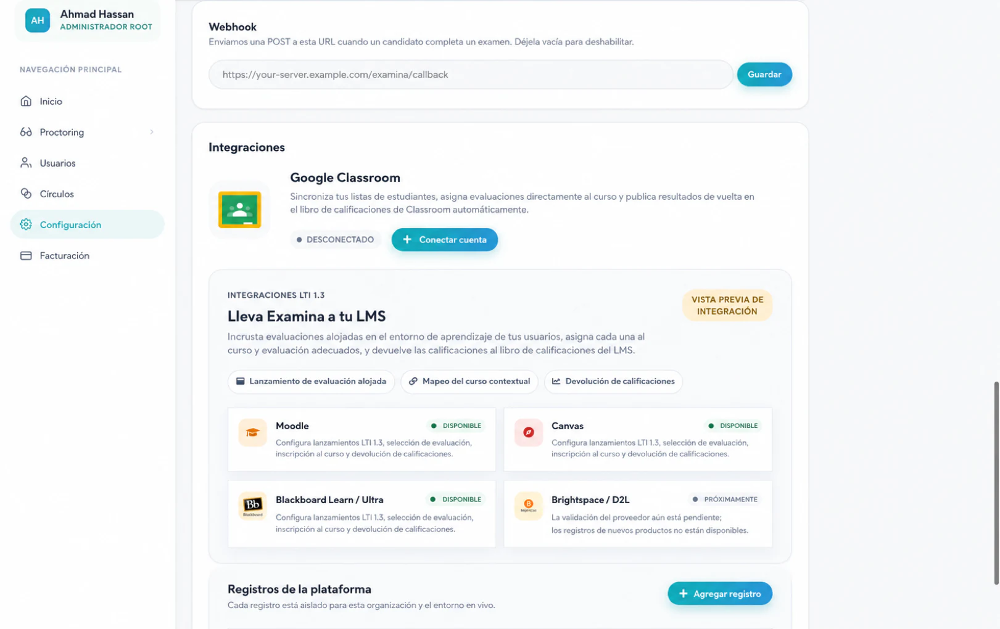

Mantén el formulario abierto. Blackboard necesita la Application ID antes de poder crear el Deployment ID específico de la institución que completa este registro.

## 3. Registra y aprueba examina.io en Blackboard

Como administrador del sistema de Blackboard Learn:

1. Abre el área de administración de Blackboard. En la navegación Ultra, selecciona **Admin. del sistema**; en la Experiencia Original, abre el **Panel del administrador**.
2. Busca la sección **Integraciones** y selecciona **Proveedores de herramientas LTI**.

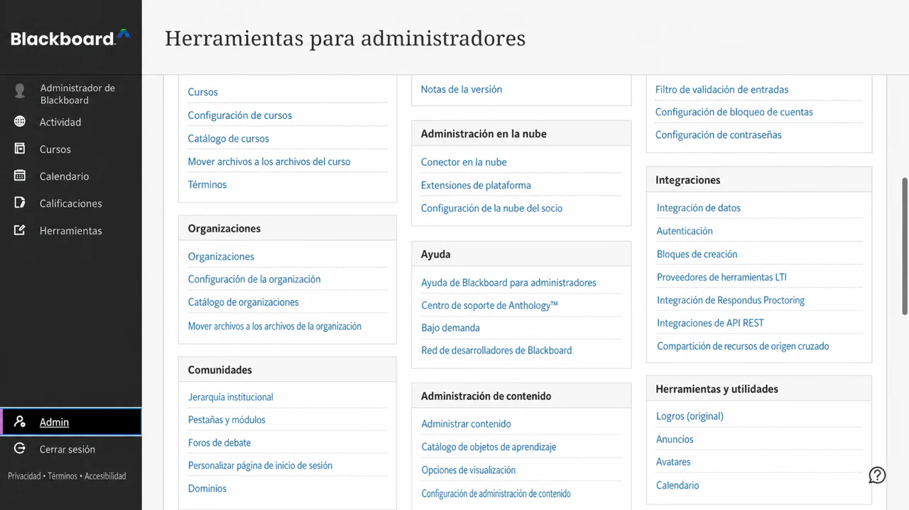

3. Selecciona **Registrar herramienta LTI 1.3/Advantage**.

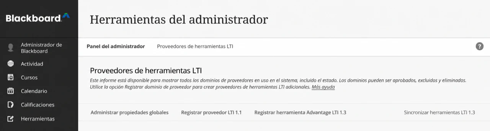

4. Ingresa la **Examina Application ID** y luego selecciona **Enviar**.

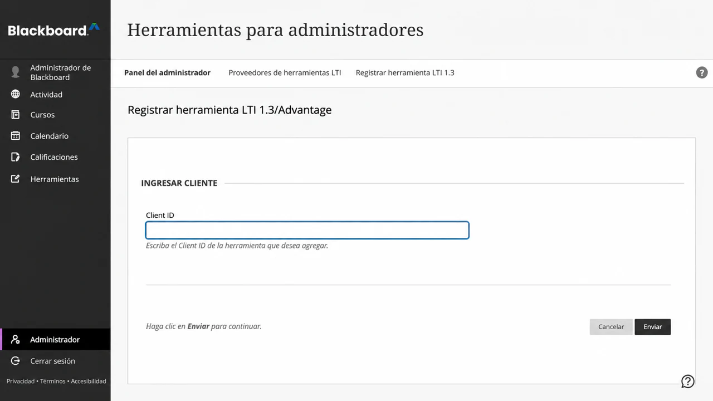

5. Revisa el nombre de la herramienta importada, el dominio, la URL de clave pública, las URL de redirección y la ubicación administrada.
6. Establece el **Estado de la herramienta** en **Aprobado**.

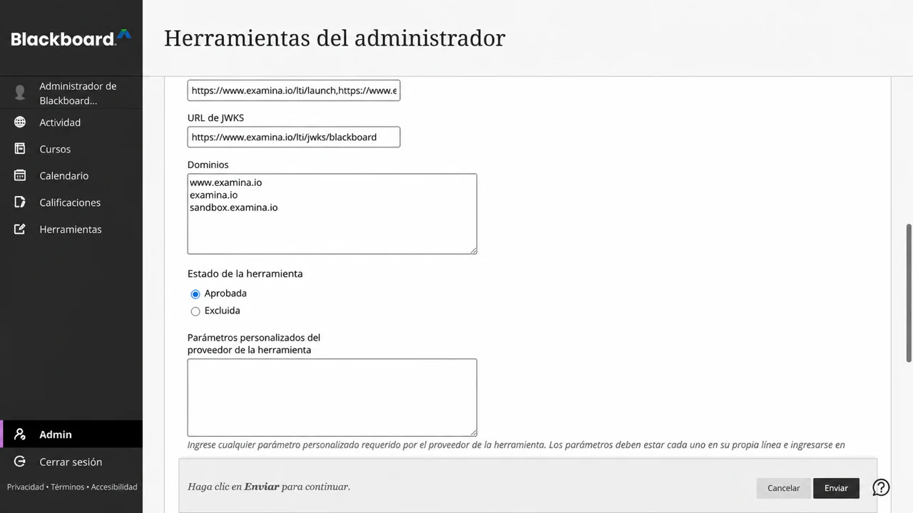

7. En el uso compartido de datos del usuario, aprueba los datos que permita tu institución: **Nombre**, **Correo electrónico** y **Rol**.
8. Habilita **Permitir acceso al servicio de calificaciones** cuando los resultados deban devolverse con AGS.
9. Habilita **Permitir acceso al servicio de membresía** solo cuando se requiera acceso a la lista de estudiantes del curso a través de NRPS.
10. Selecciona **Enviar**.

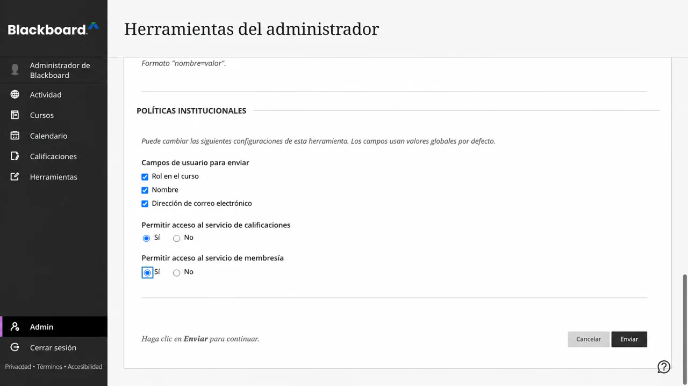

!!! note "El acceso a Admin. del sistema depende de los permisos"

    Si **Admin. del sistema** no está visible en la navegación principal de Blackboard, la cuenta con la que iniciaste sesión no tiene el rol del sistema necesario para instalar una herramienta LTI. Un instructor no puede completar este paso a nivel de institución.

Blackboard siempre proporciona un identificador de sujeto LTI estable para el candidato. El nombre y el correo electrónico son datos de perfil, por lo que debes aprobarlos solo cuando la directiva de tu institución permita que examina.io los reciba. El rol es necesario para distinguir el flujo de trabajo de un instructor del lanzamiento de un candidato.

Abre el menú de la herramienta registrada y elige **Administrar implementaciones**. Copia el Deployment ID que se aplica a la institución o al nodo de la jerarquía institucional donde los instructores utilizarán examina.io. Si tu versión de Blackboard muestra solo una implementación, es posible que aparezca el mismo valor en la página **Editar** de la herramienta. Este valor pertenece a esta instalación de Blackboard y no debe copiarse a otra institución.

Crea otra implementación de Blackboard solo cuando la institución necesite intencionalmente un límite de instalación independiente, como un campus o una unidad con licencia diferente. Cada Deployment ID requiere su propio registro en examina.io.

Después del envío, la lista de proveedores debería mostrar **examina.io Assessments** como una herramienta LTI 1.3 aprobada. Los campos de datos exactos y la cantidad de ubicaciones dependen de los permisos y ubicaciones que haya aprobado tu institución.

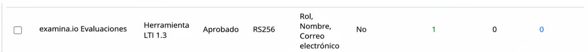

## 4. Finaliza el registro en examina.io

Regresa a **Inicio → Configuración → Lleva Examina a tu LMS**:

1. Continúa en el formulario abierto o vuelve a seleccionar **Agregar registro → Blackboard Learn / Ultra**.
2. Ingresa un nombre descriptivo, como **Northbridge College Blackboard**.
3. Confirma la **Examina Application ID** de solo lectura y pega el **Deployment ID** de Blackboard.
4. Confirma estos valores de la plataforma Blackboard:

| Campo de examina.io | Valor de Blackboard |
| --- | --- |
| Issuer URL | `https://blackboard.com` |
| Examina Application ID | La Application ID de solo lectura proporcionada centralmente |
| Deployment ID | El ID copiado de esta instalación de Blackboard |
| Authorization endpoint | `https://developer.blackboard.com/api/v1/gateway/oidcauth` |
| Token endpoint | `https://developer.blackboard.com/api/v1/gateway/oauth2/jwttoken` |
| LMS public keys (JWKS) URL | `https://developer.blackboard.com/.well-known/jwks.json` |

5. Habilita **Selección de evaluaciones (Deep Linking)**.
6. Habilita **Devolución de calificaciones (AGS)** cuando se haya aprobado el acceso al servicio de calificaciones de Blackboard.
7. Habilita **Lista de estudiantes del curso (NRPS)** solo cuando se haya aprobado el acceso al servicio de membresía de Blackboard.
8. Selecciona **Guardar registro** y luego activa el registro.

La tarjeta de registro guardada es la fuente principal de información para las URL exactas de la herramienta. Los valores orientados al navegador de producción utilizan `https://www.examina.io`:

| Configuración de la herramienta Blackboard | Valor de producción de examina.io |
| --- | --- |
| OIDC login initiation | Copia el valor completo de la tarjeta de registro |
| LTI launch / target-link URI | `https://www.examina.io/lti/launch` |
| Deep Linking redirect | `https://www.examina.io/lti/deep-link` |
| Tool icon | `https://www.examina.io/img/logo128.png` |
| Tool public keys (JWKS) | Copia el valor específico del registro desde la tarjeta de registro |

Copia siempre los valores completos de OIDC y JWKS de la tarjeta de registro porque identifican el registro guardado. La **URL de claves públicas del LMS (JWKS)** de Blackboard en la primera tabla es el conjunto de claves de Blackboard que examina.io lee. La URL de **claves públicas de la herramienta (JWKS)** en la tarjeta de registro es el conjunto de claves de examina.io que Blackboard lee. No los intercambies.

Las Application ID y los Deployment ID son identificadores de configuración, no contraseñas. Nunca pongas claves privadas, tokens de acceso, mensajes de inicio firmados o datos de candidatos en la documentación o en los tickets de soporte.

## 5. Confirma la ubicación en Blackboard

Regresa a **Proveedores de herramientas LTI** en Blackboard, abre el menú de **examina.io Assessments** y elige **Administrar ubicaciones**. Confirma que la ubicación administrada aprobada:

- esté disponible como una herramienta de contenido Deep Linking;
- use la URL de producción de Deep Linking de examina.io;
- se llame **examina.io Assessments**; y
- muestre el logotipo de examina.io.

No crees una segunda ubicación a menos que tu institución necesite intencionalmente una ubicación independiente con una disponibilidad diferente. Una ubicación duplicada puede hacer que no quede claro qué registro está iniciando un instructor.

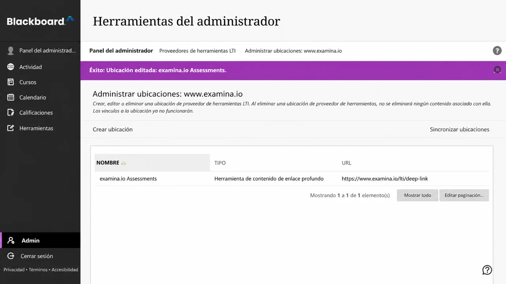

## 6. Agrega un examen publicado a un curso Ultra

Como instructor en el curso de destino:

1. Abre **CHEM 101: General Chemistry → Contenido del curso**.
2. Selecciona el **+** donde debe aparecer la evaluación.
3. Elige **Content Market**.
4. Busca **examina.io Assessments** en **Herramientas de la institución** y selecciónalo.

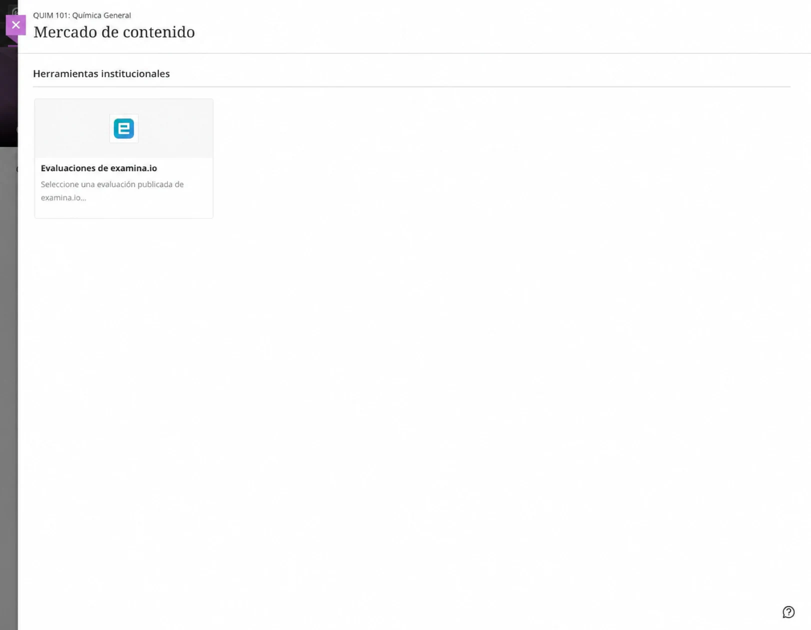

El selector de examina.io se abre dentro de Blackboard. Selecciona **General Chemistry Fundamentals** y luego elige **Add selected exam**.

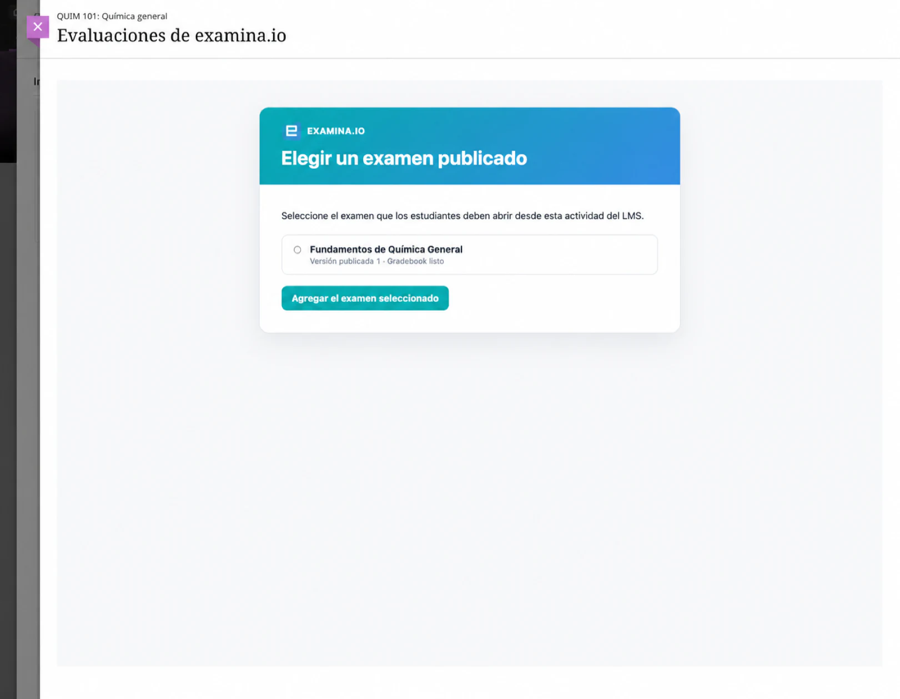

Blackboard regresa al curso y crea el elemento de contenido de la evaluación. Confirma su nombre visible para el candidato, visibilidad, fecha de vencimiento, puntos máximos y directiva de intentos; luego, hazlo visible para los candidatos.

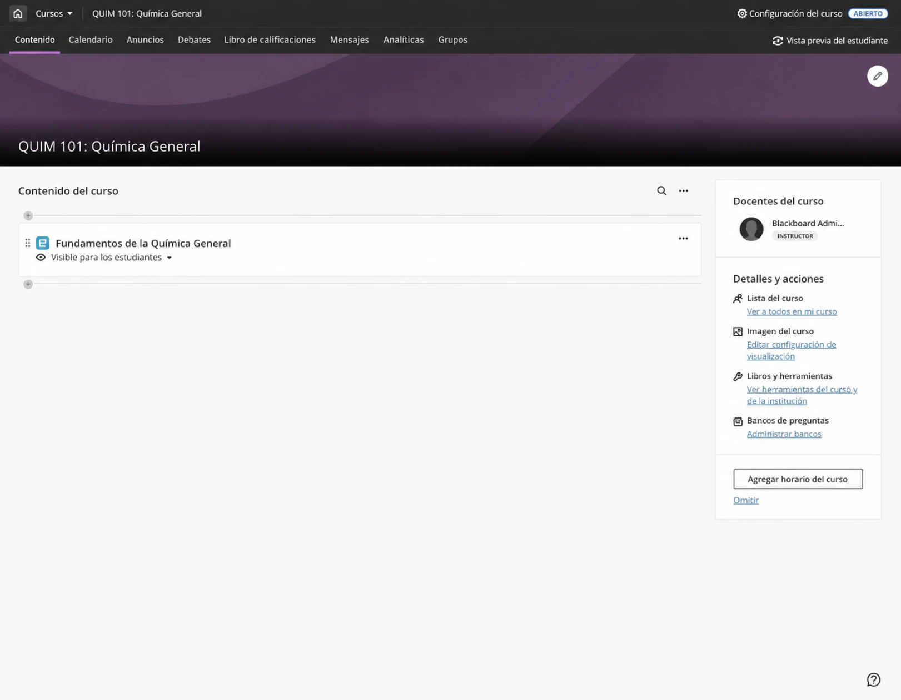

Abre el elemento una vez como instructor y confirma que aparezca el examen publicado previsto. Si seleccionaste el examen incorrecto, elimina el elemento de contenido y vuelve a usar el Content Market para seleccionarlo de nuevo.

## 7. Verifica el inicio por parte del candidato

Utiliza un candidato ficticio inscrito en el curso:

1. Inicia sesión en Blackboard como el candidato.
2. Abre **CHEM 101: General Chemistry → Contenido del curso → General Chemistry Fundamentals**.
3. Confirma que la evaluación se abra dentro de Blackboard sin necesidad de un segundo inicio de sesión en examina.io.
4. Comienza, completa y envía la evaluación.

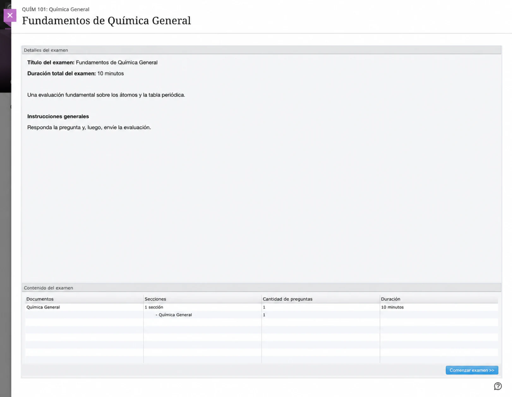

El inicio de LTI verifica la plataforma de Blackboard, el Deployment ID, el curso, el elemento de contenido, el candidato y la publicación seleccionada. Una URL de inicio copiada no reemplaza el hecho de abrir la evaluación desde Blackboard.

## 8. Verifica la calificación devuelta

Después de enviarla, abre el **Libro de calificaciones** como instructor. Confirma que la puntuación aparezca para **General Chemistry Fundamentals**, para el candidato correcto y en el elemento correcto del libro de calificaciones. El candidato también puede revisar el resultado desde la vista de calificaciones del curso.

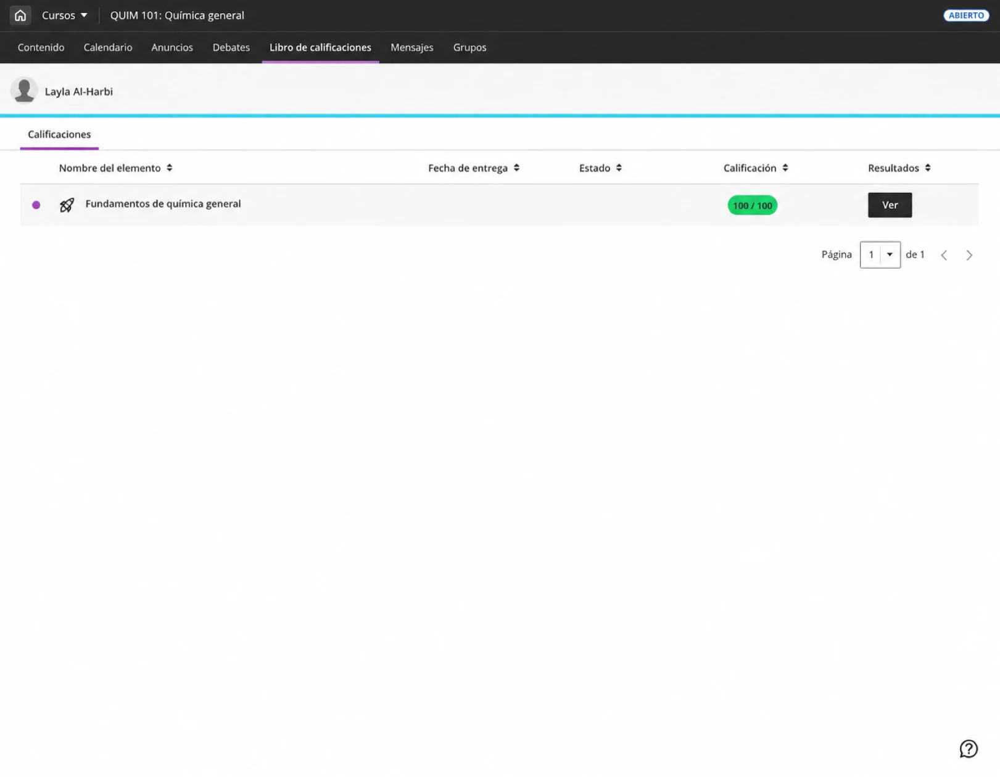

La entrega de calificaciones se pone en cola de forma independiente al envío del examen, por lo que una interrupción temporal de Blackboard no convierte una evaluación completada en un envío fallido. Es posible que la puntuación tarde un momento en aparecer. Actualiza el libro de calificaciones antes de investigar un resultado faltante.

## Conecta otra institución de Blackboard

La Application ID de examina.io proporcionada centralmente se puede instalar en más de una institución de Blackboard. Para cada institución:

1. registra la Application ID compartida en el Blackboard Learn de esa institución;
2. copia el Deployment ID único de esa instalación;
3. crea un registro independiente de Blackboard en la organización correcta de examina.io; y
4. otorga solo los permisos aprobados de datos de usuario, AGS y NRPS de esa institución.

Antes de un despliegue general, verifica que cada institución vea solo los exámenes publicados de su organización y que las puntuaciones se devuelvan únicamente al curso, candidato y elemento del libro de calificaciones de origen.

## Lista de verificación para validación en producción

Antes de usar la integración para un curso en vivo, verifica todo lo siguiente:

- La herramienta esté **Aprobada** y disponible solo donde corresponda.
- **examina.io Assessments** aparezca en el Content Market con el logotipo de examina.io.
- La Application ID sea el valor proporcionado centralmente por examina.io.
- El Deployment ID provenga de esta instalación exacta de Blackboard.
- El intercambio de Nombre, Correo electrónico y Rol coincida con la directiva de datos aprobada por la institución.
- AGS esté habilitado en ambos sistemas cuando se deban devolver calificaciones.
- NRPS esté habilitado en ambos sistemas solo cuando se requiera acceso a la lista de estudiantes del curso.
- Deep Linking muestre solo los exámenes publicados que el instructor puede seleccionar.
- Un candidato abra la evaluación seleccionada sin un segundo inicio de sesión.
- La puntuación completada llegue al candidato y al elemento del libro de calificaciones correctos.
- Cada dirección orientada al navegador utilice HTTPS de producción y un certificado de confianza.

## Solución de problemas

| Síntoma | Qué verificar |
| --- | --- |
| **examina.io Assessments** no aparece en Content Market | Confirma que la herramienta esté aprobada, que su ubicación administrada de Deep Linking esté disponible para este curso y que el usuario actual pueda agregar contenido al curso. |
| La tarjeta de Content Market no tiene el logotipo de examina.io | Confirma que la ubicación administrada utilice `https://www.examina.io/img/logo128.png`. Si la herramienta se instaló antes de configurar el ícono, actualiza los metadatos de la herramienta existente o actualiza su ubicación. |
| El selector se abre pero Blackboard rechaza el examen seleccionado | Confirma que la Application ID y el Deployment ID coincidan, que Blackboard pueda obtener la URL exacta de JWKS de examina.io específica del registro y que ambos sistemas tengan relojes precisos. |
| La evaluación se abre en un marco en blanco o se rechaza el inicio | Revisa la URL de inicio OIDC, la URL de inicio, las URL de redirección, el certificado HTTPS de confianza, el estado del registro, la directiva de iframe y la configuración de cookies de terceros del navegador. |
| Blackboard sigue abriendo una dirección antigua después de que cambió la configuración del proveedor | Es posible que Blackboard conserve las URL importadas cuando se creó la herramienta o la ubicación administrada. Inspecciona las URL de destino de la herramienta y la ubicación existentes. Actualiza los metadatos del registro existente cuando Blackboard lo permita. Si debes volver a registrar la herramienta, registra el nuevo Deployment ID y actualiza el registro correspondiente en examina.io antes de poner a disposición el reemplazo. Vuelve a seleccionar el contenido del curso afectado para que utilice la ubicación actual. |
| Se abre el examen incorrecto | Elimina o edita el contenido del curso y vuelve a seleccionar el examen publicado previsto. No copies un elemento de contenido entre instituciones sin volver a seleccionar el examen. |
| La calificación no aparece | Confirma que **Permitir acceso al servicio de calificaciones** en Blackboard y **Devolución de calificaciones (AGS)** en examina.io estén habilitados, que el elemento de contenido tenga puntos y que el registro esté activo. Da tiempo para la entrega en cola. |
| La lista de estudiantes del curso no está disponible | Confirma que **Permitir acceso al servicio de membresía** en Blackboard y **Lista de estudiantes del curso (NRPS)** en examina.io estén habilitados. El inicio de la evaluación y la devolución de calificaciones no requieren NRPS. |
| Blackboard notifica un error de clave de firma | Confirma que Blackboard use la URL de JWKS de la herramienta copiada de la tarjeta de registro de examina.io y que examina.io use `https://developer.blackboard.com/.well-known/jwks.json` para las claves de Blackboard. Ninguno de los dos puntos de conexión debe redirigir a una página de inicio de sesión. |
| Una segunda institución ve el contenido de la primera institución | Confirma que cada institución tenga su propio registro en examina.io y su propio Deployment ID de Blackboard. Nunca reutilices un Deployment ID entre instituciones. |

Para conocer el comportamiento actual de la plataforma Blackboard y su terminología, consulta la documentación oficial de Anthology sobre el [registro de aplicaciones LTI](https://docs.blackboard.com/docs/blackboard/lti/1.3/register-an-application) y la [integración para administradores](https://help.anthology.com/blackboard/administrator/en/integrations.html).
