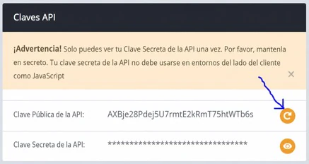
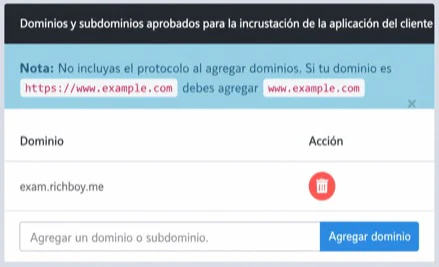
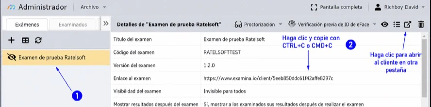

# Incrusta la aplicación Client en tu sitio web

El widget Client reemplaza un enlace de examen con un iframe para que los candidatos puedan realizar una evaluación dentro de un sitio web aprobado.

Necesitas:

- una cuenta y un plan de examina.io que admitan la incrustación;
- acceso a **Inicio → Configuración**;
- un examen importado en Manager;
- permiso para editar el sitio web principal; y
- conocimientos básicos de HTML.

## 1. Crea una clave API pública

Abre **Inicio → Configuración → Claves API y Webhook** y crea una **Clave pública de API**.



La incrustación simple utiliza solo la clave pública. No coloques la clave secreta de la API en el código del navegador.

Regenerar la clave pública requiere actualizar cada instalación del widget.

## 2. Aprueba el dominio del sitio web

En **Dominios y subdominios aprobados para la incrustación del widget Client**:

1. Ingresa el nombre de host sin protocolo ni ruta.
2. Selecciona **Agregar dominio**.

Por ejemplo, ingresa `assessment.example.edu`, no `https://assessment.example.edu/exams`.



Para pruebas locales, agrega el nombre de host que realmente utilices, como `localhost` o `127.0.0.1`; no incluyas el puerto. Elimina los hosts de desarrollo después de hacer las pruebas. Evita permitir todos los dominios en producción.

## 3. Carga el script del widget

Agrega el script del widget a la página y reemplaza `YOUR_PUBLIC_API_KEY`:

```html
<!doctype html>
<html lang="en">
<head>
  <meta charset="utf-8">
  <meta name="viewport" content="width=device-width, initial-scale=1">
  <title>Take the assessment</title>
  <script
    src="https://www.examina.io/client/widget.js?apiKey=YOUR_PUBLIC_API_KEY">
  </script>
</head>
<body>
  <h1>Readiness assessment</h1>
</body>
</html>
```

Si la clave falta o no es válida, el script del widget no se cargará correctamente.

## 4. Agrega el enlace del examen

En Manager, selecciona el examen y elige **Abrir enlace del examen**. Copia la URL.



Agrega el enlace con la clase `examina-io-client-widget`:

```html
<a
  class="examina-io-client-widget"
  href="https://www.examina.io/client/YOUR_EXAM_ID">
  Open the exam
</a>
```

Cuando JavaScript está disponible, el widget reemplaza la etiqueta de enlace por el Client incrustado. El texto del enlace se mantiene como una alternativa útil si el script no puede ejecutarse. Coloca solo un enlace de widget por página.

## Controla las dimensiones del widget

El widget utiliza estos atributos opcionales:

- `data-examina-io-height`
- `data-examina-io-width`

Si se omite un atributo, el widget gestiona esa dimensión en relación con la ventana del navegador y puede ajustarla cuando la ventana cambia de tamaño.

Usa:

- un número positivo para una dimensión fija en píxeles;
- un número negativo para usar el tamaño de la ventana menos esa cantidad de píxeles; o
- `auto` para dejar esa dimensión a tu CSS o a los valores predeterminados del navegador.

Este ejemplo reserva 64 píxeles para el encabezado de la página y deja que CSS gestione el ancho:

```html
<header class="exam-header">Readiness assessment</header>
<a
  class="examina-io-client-widget"
  href="https://www.examina.io/client/YOUR_EXAM_ID"
  data-examina-io-height="-64"
  data-examina-io-width="auto">
  Open the exam
</a>
```

Realiza pruebas en la ventana gráfica (viewport) más pequeña admitida. Al usar `auto`, aplica un tamaño CSS explícito al diseño resultante para que no se use accidentalmente el tamaño de iframe predeterminado del navegador.

## Ejemplo adaptable completo

```html
<!doctype html>
<html lang="en">
<head>
  <meta charset="utf-8">
  <meta name="viewport" content="width=device-width, initial-scale=1">
  <title>Readiness assessment</title>
  <script
    src="https://www.examina.io/client/widget.js?apiKey=YOUR_PUBLIC_API_KEY">
  </script>
  <style>
    html, body { margin: 0; }
    .exam-header { box-sizing: border-box; height: 64px; padding: 20px; }
  </style>
</head>
<body>
  <header class="exam-header">Readiness assessment</header>
  <a
    class="examina-io-client-widget"
    href="https://www.examina.io/client/YOUR_EXAM_ID"
    data-examina-io-height="-64"
    data-examina-io-width="auto">
    Open the exam
  </a>
</body>
</html>
```

## Inicio de sesión automático opcional

Si tu propio sitio ya autenticó al candidato, tu backend puede solicitar un token de inicio de sesión de examen de corta duración y agregarlo al enlace de Client. La clave secreta de la API debe permanecer en tu servidor.

Flujo del backend:

1. Autentica a la persona en tu aplicación.
2. Resuelve su código o ID de candidato de examina.io en el servidor.
3. Desde tu servidor, llama a uno de los puntos de extremo de token documentados mediante autenticación básica HTTPS:
   - `/login/exam/{examId}/code/{examineeCode}/token`
   - `/login/exam/{examId}/id/{examineeId}/token`
4. Construye la URL de Client con los valores de consulta codificados en formato URL.
5. Renderiza la clave pública y la URL de inicio de sesión de duración limitada en la página aprobada.

Formato de enlace de ejemplo:

```html
<a
  class="examina-io-client-widget"
  href="https://www.examina.io/client/YOUR_EXAM_ID?autologin=true&amp;examineeCode=URL_ENCODED_CODE&amp;token=URL_ENCODED_TOKEN"
  data-examina-io-height="-64"
  data-examina-io-width="auto">
  Open the exam
</a>
```

`autologin` debe ser `true`. Proporciona `examineeCode` o `examineeId`; cuando ambos están presentes, Client utiliza el código de candidato.

Nunca generes tokens en el JavaScript del navegador, ni expongas la clave secreta al candidato, ni registres una URL de inicio de sesión automático completa.

## Lista de verificación para producción

- Se aprobó el nombre de host exacto de producción.
- La página y todos los recursos incrustados utilizan HTTPS.
- La clave secreta de la API no está presente en el código fuente de la página ni en las solicitudes de red del navegador.
- El enlace alternativo es comprensible.
- Hay un solo widget presente en la página.
- Se probó el comportamiento en computadoras de escritorio, celulares, teclado y al cambiar el tamaño.
- Un candidato ficticio vinculado puede iniciar sesión o usar el inicio de sesión automático y completar el examen.
- Se eliminaron los dominios temporales de desarrollo.

Para ver la configuración y rotación de credenciales, consulta [Claves API y webhooks](api-keys-and-webhooks.md). Para ver los esquemas de puntos de extremo, utiliza la [Referencia de API](../api/index.md).
