# Integra examina.io con Moodle

Conecta examina.io con Moodle una sola vez y permite que los profesores agreguen evaluaciones publicadas a sus cursos sin enviar a los estudiantes a una página de inicio de sesión independiente. Los estudiantes abren la evaluación dentro de Moodle y examina.io puede devolver sus calificaciones al libro de calificaciones de Moodle.

!!! tip "Valida antes de un examen en vivo"

    Conecta y valida todo el flujo de trabajo en un curso de Moodle que no sea de producción con usuarios ficticios antes de habilitarlo para un examen en vivo.

Las capturas de pantalla de esta guía utilizan un curso ficticio de **Northbridge College**, **Introduction to Biology**, y una evaluación llamada **Cell Structure and Function**. Tu organización, direcciones URL, ID y nombres de cursos serán diferentes.

## Lo que ofrece la integración

- **Un solo inicio de sesión en Moodle:** el estudiante que abre la actividad en Moodle no vuelve a iniciar sesión en examina.io.
- **Selección de evaluaciones:** el profesor elige un examen publicado mediante LTI Deep Linking en lugar de copiar la URL del examen.
- **Ubicación con reconocimiento del curso:** examina.io asocia el curso y la actividad del LMS con la evaluación publicada seleccionada.
- **Envío de calificaciones:** LTI Assignment and Grade Services (AGS) puede devolver el resultado del estudiante al elemento de calificación correcto de Moodle.
- **Lista de participantes opcional:** Names and Roles Provisioning Services (NRPS) puede proporcionar una lista mínima de participantes del curso cuando tu institución lo habilite.

## Antes de comenzar

Necesitas:

- una cuenta de Root o Administrador en examina.io;
- una cuenta de administrador del sitio de Moodle;
- una cuenta de profesor para el curso de Moodle;
- al menos un examen importado y publicado en examina.io Manager;
- direcciones HTTPS públicas para Moodle y examina.io; y
- permiso para configurar una herramienta externa LTI 1.3 y sus servicios en Moodle.

Asegúrate de que ambos sistemas tengan relojes precisos. Los mensajes de inicio de sesión de LTI tienen un límite de tiempo, y una gran diferencia horaria puede hacer que un inicio por lo demás válido falle.

## Cómo intercambian la configuración los dos sistemas

Moodle crea el **Client ID** y el **Deployment ID** que examina.io necesita. A continuación, examina.io crea la URL de clave pública específica de la ruta de registro que Moodle necesita. Por esa razón, la configuración inicial consta de dos pasos:

1. crear una herramienta externa provisional en Moodle;
2. copiar los detalles de registro de Moodle en examina.io;
3. copiar de vuelta los puntos de enlace finales de examina.io en Moodle; y
4. activar el registro y probar todo el flujo.

!!! warning "No inicies una herramienta provisional"

    Si Moodle requiere una URL de clave pública durante la primera fase, utiliza un punto de enlace HTTPS temporal del conjunto de claves controlado por tu institución. Puede devolver un JSON Web Key Set vacío (`{"keys":[]}`). No pongas la herramienta a disposición de los cursos ni intentes iniciarla hasta que la hayas reemplazado con la URL exacta del **Public key set (JWKS)** de examina.io en el [Paso 4](#4-finish-the-moodle-tool).

## 1. Crea la herramienta provisional de Moodle

Inicia sesión con una cuenta de administrador del sitio de Moodle y abre **Administración del sitio** en la navegación principal.

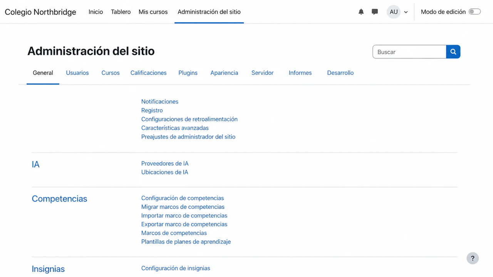

Selecciona la pestaña **Plugins**. En **Módulos de actividad**, selecciona **Herramienta externa**.

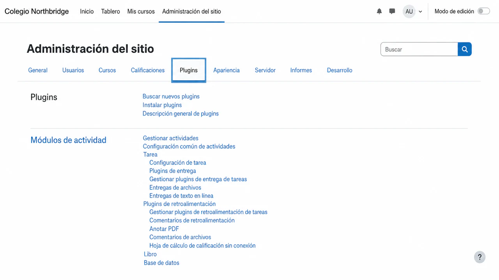

En la página de configuración de Herramienta externa, selecciona **Gestionar herramientas**.

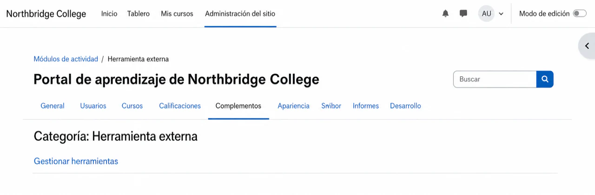

Selecciona **Configurar una herramienta manualmente**. Si ya existe otra herramienta de examina.io, edítala en lugar de crear un duplicado.

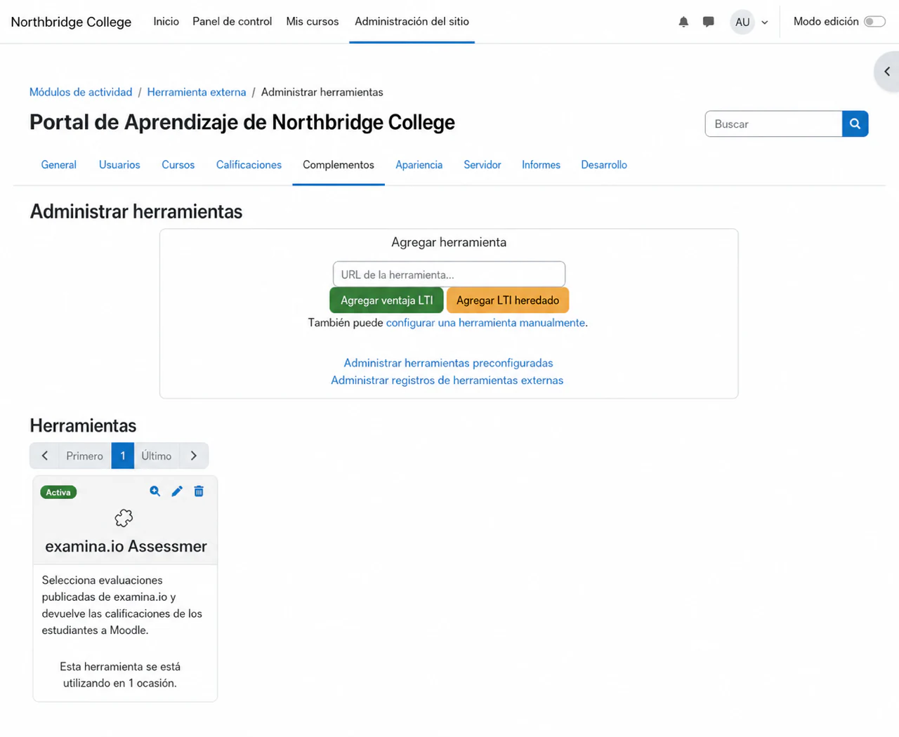

Completa el formulario de la herramienta:

1. Ingresa **examina.io Assessments** como nombre de la herramienta.
2. Ingresa `https://www.examina.io/lti/launch` como la **Tool URL**.
3. Establece la **LTI version** en **LTI 1.3**.
4. Establece el **Public key type** en **Keyset URL**.
5. Ingresa la URL provisional del conjunto de claves descrita anteriormente.
6. Ingresa `https://www.examina.io/lti/login` como la **Initiate login URL**.
7. Agrega las URL de inicio y Deep Linking como **Redirection URI(s)** independientes:
   `https://www.examina.io/lti/launch` y
   `https://www.examina.io/lti/deep-link`.
8. Habilita **Supports Deep Linking** e ingresa
   `https://www.examina.io/lti/deep-link` como la **Content selection URL**.
9. Mantén la herramienta oculta en el selector de actividades hasta completar la configuración y, a continuación, guárdala.

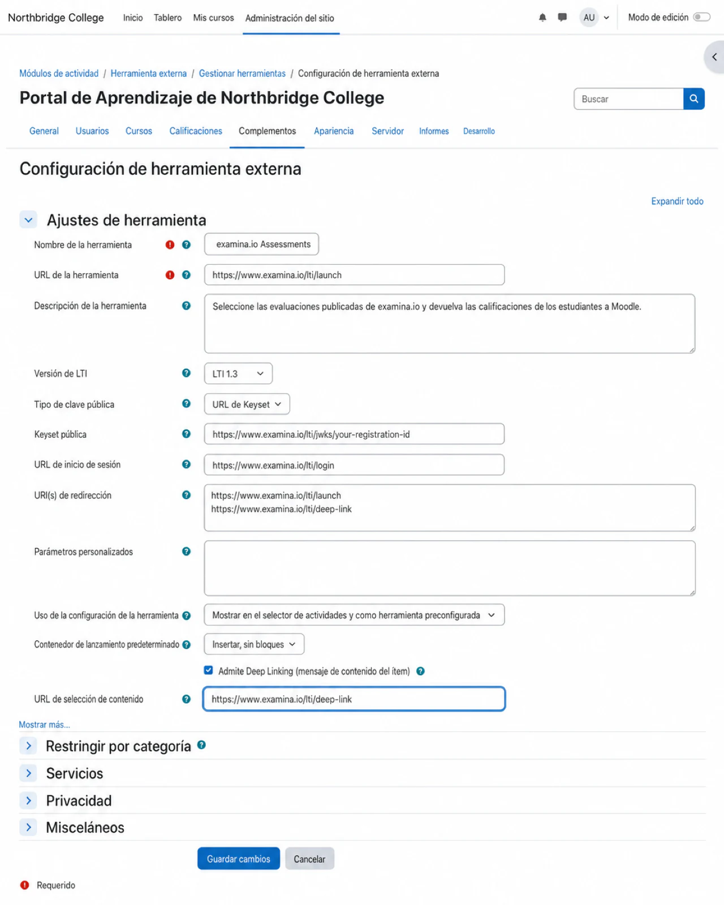

!!! warning "El valor de JWKS de la captura de pantalla es un ejemplo"

    `your-registration-id` es un marcador de posición, no un valor para copiar. Después de guardar los detalles de Moodle en examina.io, reemplaza toda esa URL con la URL exacta de **Public key set (JWKS)** que se muestra en la tarjeta de registro guardada.

Moodle asigna ahora la identidad de la herramienta necesaria para examina.io.

## 2. Copia los detalles de registro de Moodle

Vuelve a **Gestionar herramientas**, busca **examina.io assessments** y selecciona **Ver detalles de configuración**. Mantén abierta esta página mientras configuras examina.io.

Copia estos valores de Moodle en los campos correspondientes de examina.io:

| Detalle de configuración de Moodle | Campo de registro en examina.io |
| --- | --- |
| Platform ID | Issuer URL |
| Client ID | Client ID |
| Deployment ID | Deployment ID |
| Authentication request URL | Authorization endpoint |
| Access token service URL | Token endpoint |
| Public keyset URL | LMS public keys (JWKS) URL |

Trata los identificadores como datos de configuración. No incluyas tokens de acceso, claves privadas, mensajes de inicio de usuario ni contraseñas en la documentación o en los tickets de soporte.

## 3. Agrega el registro de Moodle en examina.io

Como usuario Root o Administrador de examina.io:

1. Abre **Inicio → Configuración**.
2. Busca **Lleva Examina a tu LMS**.
3. Selecciona **Agregar registro**.
4. Elige **Moodle** e ingresa un nombre descriptivo, como **Northbridge College Moodle**.
5. Pega los seis valores de Moodle del Paso 2.
6. Habilita solo los servicios que también concederás en Moodle:
   - **Selección de evaluaciones (Deep Linking)** permite que los profesores elijan un examen publicado desde el formulario de actividad de Moodle.
   - **Envío de calificaciones (AGS)** envía los resultados completados al libro de calificaciones de Moodle.
   - **Lista de participantes del curso (NRPS)** lee la lista de miembros del curso cuando tu flujo de trabajo lo requiera.
7. Selecciona **Guardar registro**.

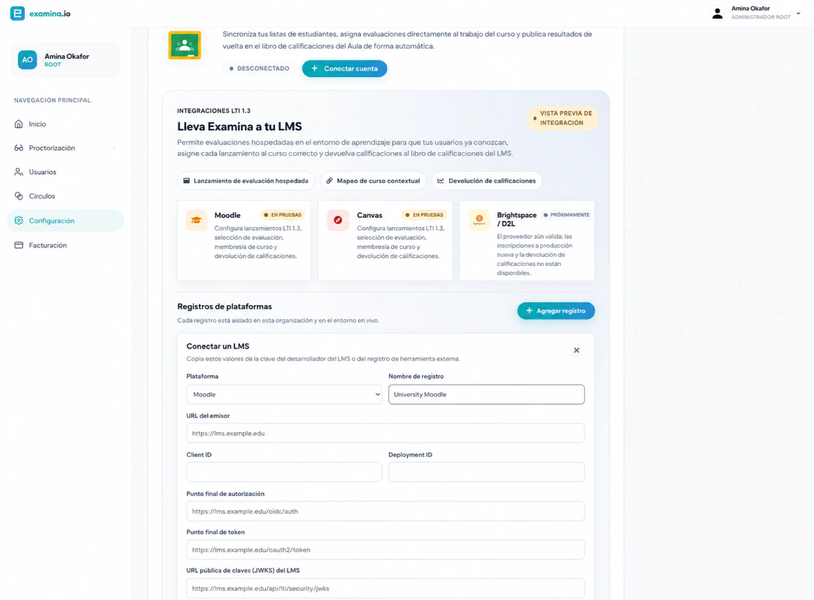

La tarjeta de registro guardada muestra los puntos de enlace exactos de **OIDC login initiation**, **LTI launch**, **Deep Linking** y el **Public key set (JWKS)** específico del registro. Mantén abierta la tarjeta para el siguiente paso.

## 4. Finaliza la herramienta de Moodle {#4-finish-the-moodle-tool}

Edita **examina.io assessments** en Moodle y reemplaza cada valor provisional con el valor exacto mostrado por examina.io:

| Campo de herramienta externa en Moodle | Valor de examina.io |
| --- | --- |
| Tool URL | LTI launch URL |
| Initiate login URL | OIDC login initiation |
| Redirection URI(s) | URL de inicio de LTI y URL de Deep Linking, una por línea |
| Public keyset | Public key set (JWKS) |
| Content selection URL, cuando se muestre | Deep Linking URL |

Luego, configura los servicios y la privacidad de Moodle:

- Habilita **IMS LTI Assignment and Grade Services** si habilitaste el **Envío de calificaciones (AGS)** en examina.io.
- Permite que la herramienta acepte calificaciones desde la configuración de servicios delegados de Moodle.
- Habilita **Names and Role Provisioning Services** solo si habilitaste la **Lista de participantes del curso (NRPS)** y tu institución permite el acceso a la lista.
- Pon la herramienta a disposición en el selector de actividades una vez completada la configuración de puntos de enlace y servicios.
- Utiliza **Incrustar** como el contenedor de inicio predeterminado si deseas que la evaluación permanezca dentro de la página del curso de Moodle.

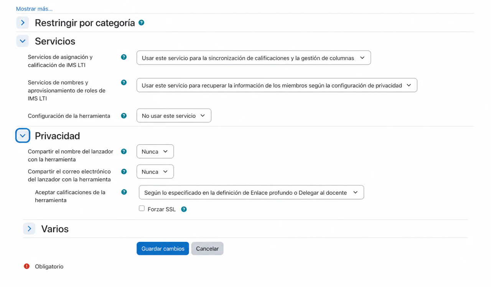

Compartir un nombre visible o una dirección de correo electrónico de Moodle es opcional. examina.io puede mapear a un estudiante de LTI mediante el identificador seudónimo del sujeto de la plataforma. Habilita campos de perfil adicionales solo cuando tu institución tenga una necesidad documentada y una base legal para compartirlos.

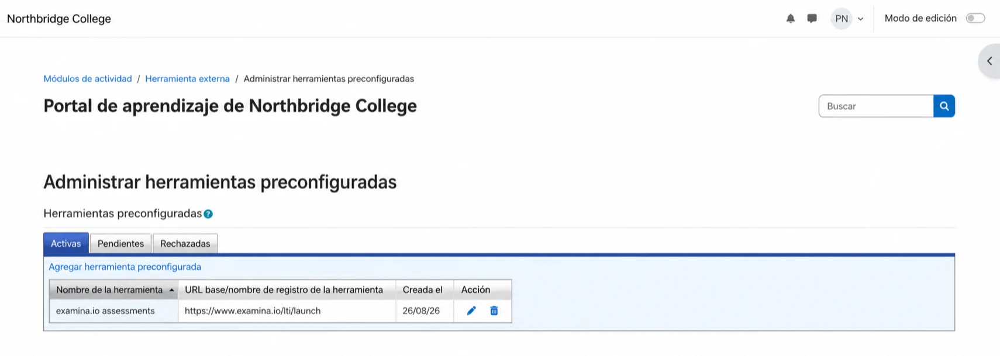

Vuelve a examina.io y activa el registro. Un registro suspendido o revocado no puede aceptar nuevos inicios.

## 5. Agrega una evaluación publicada a un curso de Moodle

Como profesor en el curso de destino:

1. Activa el **Modo de edición**.
2. Selecciona **Añadir una actividad o un recurso** en la sección deseada del curso.
3. Elige **Herramienta externa** o la herramienta preconfigurada **examina.io assessments**.
4. Ingresa el nombre de la actividad visible para los estudiantes.
5. Selecciona **Seleccionar contenido**.

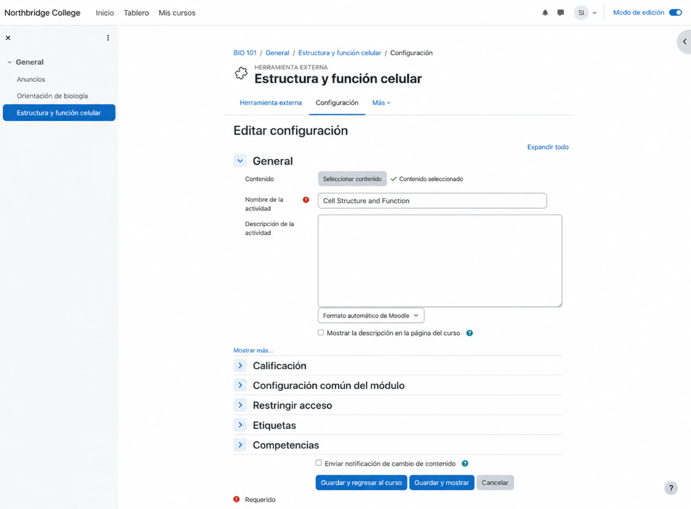

examina.io abre una lista de evaluaciones publicadas que el instructor puede usar. Elige la evaluación deseada y confirma la selección. En este ejemplo, el profesor elige **Cell Structure and Function** para **Introduction to Biology**.

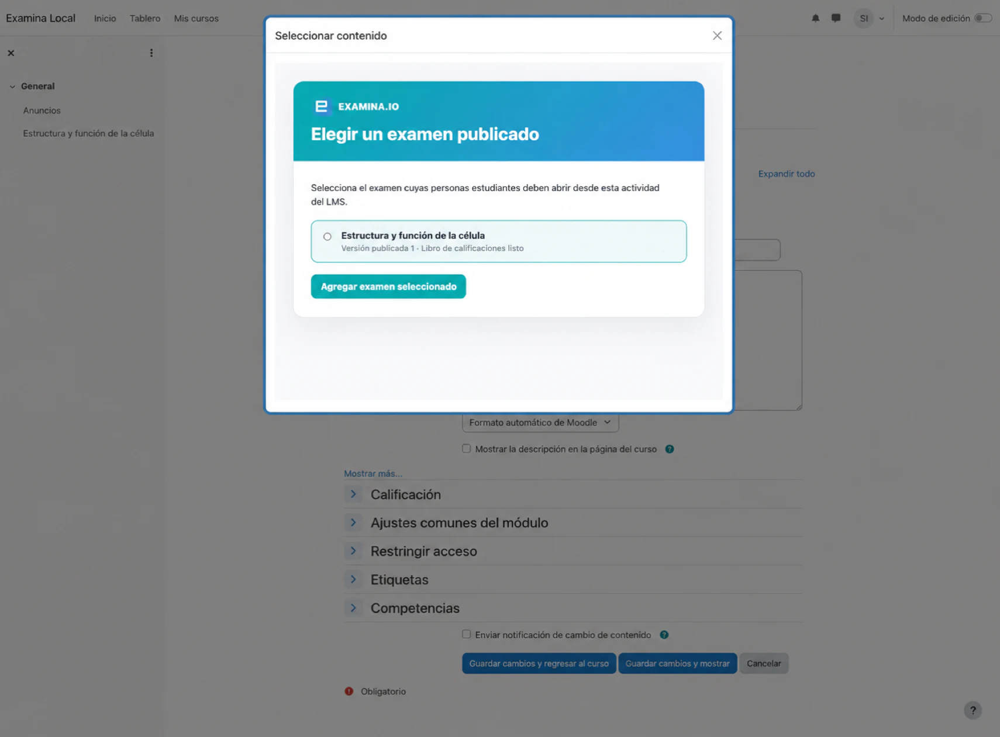

Guarda la actividad y ábrela una vez como profesor. Confirma que la actividad muestre el título correcto de la evaluación y que no solicite un nombre de usuario ni una contraseña independientes para examina.io.

## 6. Verifica la experiencia del estudiante

Utiliza a un estudiante ficticio inscrito en el curso para realizar la validación:

1. Inicia sesión en Moodle como el estudiante.
2. Abre el curso y selecciona la actividad de la evaluación.
3. Confirma que el examen esperado se abra dentro de Moodle.
4. Completa y envía la evaluación.

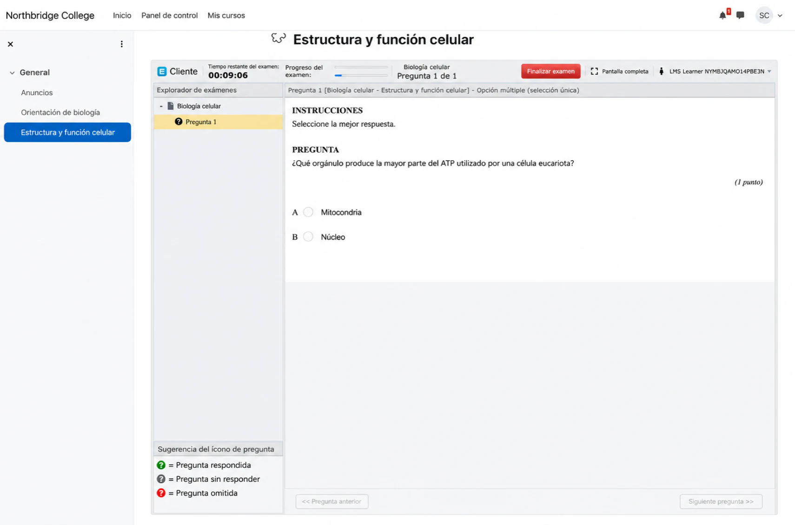

La identidad del estudiante en Moodle, el curso, la ubicación de la actividad y la evaluación publicada seleccionada se verifican durante el inicio de LTI. Una URL copiada de otro curso o entorno no sustituye este inicio.

## 7. Verifica la calificación devuelta

Después de que el estudiante envíe la evaluación, abre **Calificaciones → Informe del calificador** en Moodle. Confirma que el resultado aparezca debajo de la actividad y el estudiante correctos.

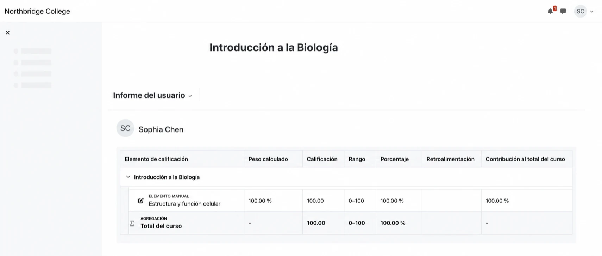

El envío de calificaciones se coloca en cola por separado de la entrega del examen para que una interrupción temporal de Moodle no transforme una evaluación completada en una entrega fallida. Por lo tanto, el resultado puede tardar poco tiempo en aparecer. Actualiza el libro de calificaciones antes de investigar un resultado faltante.

## Lista de verificación para la validación en producción

Antes de habilitar la herramienta para un curso en vivo, verifica todo lo siguiente con un curso que no sea de producción y usuarios ficticios:

- La herramienta de Moodle está activa y utiliza los puntos de enlace finales de examina.io.
- El registro de examina.io está activo en la organización y entorno correctos.
- Deep Linking enumera únicamente las evaluaciones que el profesor tiene permiso de seleccionar.
- La actividad seleccionada inicia la evaluación publicada prevista.
- El estudiante realiza el inicio desde Moodle sin necesidad de un segundo inicio de sesión.
- La puntuación completada llega al estudiante y al elemento de calificación correctos.
- Reabrir o actualizar la actividad no crea elementos de calificación duplicados.
- NRPS está deshabilitado cuando no se requiere acceso a la lista de participantes del curso.
- Ambas aplicaciones utilizan URL HTTPS públicas y certificados de confianza.

## Solución de problemas

| Síntoma | Qué verificar |
| --- | --- |
| Falta **Seleccionar contenido** | Confirma que la herramienta esté activa, que Deep Linking esté habilitado en ambos sistemas, que la URL de Deep Linking esté presente y que el usuario actual de Moodle pueda agregar actividades. |
| La actividad abre una página en blanco o se rechaza el inicio | Revisa el emisor, Client ID, Deployment ID, URL de inicio de sesión OIDC, URL de inicio, certificado HTTPS, directiva de iframe y restricciones del navegador para cookies de terceros. Asegúrate de que no aparezca ningún Docker interno o nombre de host privado en una URL orientada al navegador. |
| Se abre la evaluación incorrecta | Edita la actividad de Moodle y vuelve a seleccionar la evaluación publicada. No copies una actividad entre entornos sin volver a seleccionar su contenido. |
| La calificación no aparece | Confirma que AGS y la aceptación de calificaciones estén habilitados en Moodle, que el **Envío de calificaciones** esté habilitado en examina.io y que la actividad tenga un elemento de calificación. Da un breve margen de tiempo para la entrega en cola. |
| La lista de participantes del curso no está disponible | Confirma que NRPS esté habilitado y concedido en Moodle. El inicio de la evaluación y el envío de calificaciones pueden continuar sin acceso a la lista de participantes. |
| Moodle informa un error de clave o firma | Confirma que Moodle utilice la URL de JWKS de examina.io específica del registro, que examina.io utilice la URL de clave pública actual de Moodle, que ambos relojes sean precisos y que ninguno de los puntos de enlace redirija a una página de inicio de sesión. |

Para obtener la terminología y los menús actuales de Moodle en la plataforma, consulta la documentación oficial sobre [Herramientas externas](https://docs.moodle.org/502/en/LTI_External_tools) y las [Preguntas frecuentes sobre herramientas externas](https://docs.moodle.org/502/en/LTI_External_tool_FAQ).
