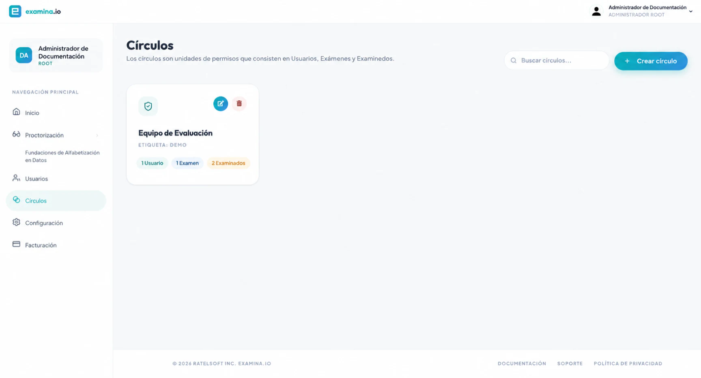

# Configura los Círculos y los permisos

Un Círculo es un límite de permisos compuesto por **Usuarios**, **Exámenes** y **Candidatos** seleccionados. Un usuario puede trabajar con los recursos disponibles a través del Círculo, según el rol de su cuenta.

## Planifica el Círculo

Usa un Círculo para un área de responsabilidad estable, como:

- un curso o departamento;
- un programa de exámenes;
- un cliente u organización;
- una sede escolar; o
- un proyecto de evaluación restringido.

Elige un nombre claro y una etiqueta corta, por ejemplo **Biología 201** y **BIO-201**. Evita incluir información confidencial del candidato en el nombre del Círculo.

## Crea un Círculo

1. Abre **Home → Círculos**.
2. Selecciona **Agregar nuevo Círculo**.
3. Ingresa un nombre único y una etiqueta opcional.
4. Selecciona los Usuarios que necesitan acceso.
5. Selecciona los Exámenes que administrarán o supervisarán.
6. Selecciona los Candidatos que necesitan ver o gestionar.
7. Guarda el Círculo.

Las cuentas Root y Administrator pueden crear y editar Círculos. Otros Usuarios autorizados pueden ver los Círculos relevantes para ellos.

## Verifica el límite

La tabla de Círculos muestra un recuento de Candidatos, Usuarios y Exámenes en cada Círculo. Después de guardar:

1. compara cada recuento con la membresía prevista;
2. edita el Círculo y revisa aleatoriamente los nombres en las tres listas;
3. realiza una prueba con una cuenta Regular o Invigilator;
4. verifica que un examen y un candidato no relacionados no sean visibles; y
5. verifica que aparezcan los espacios de trabajo de Proctor requeridos para los supervisores.

## Círculos en comparación con Grupos

| Círculo | Grupo |
| --- | --- |
| Controla el acceso del personal | Organiza candidatos para operaciones masivas |
| Contiene Usuarios, Exámenes y Candidatos | Contiene Candidatos |
| Se utiliza en las comprobaciones de permisos de Home, Manager y Proctor | Se utiliza en Manager para tareas de asignación |

Es habitual utilizar ambos. Un Círculo de curso puede restringir al equipo del curso, mientras que un Grupo puede contener a los estudiantes asignados a una sesión particular.

## Mantén los Círculos de forma segura

- Actualiza la membresía cuando cambien las responsabilidades del personal.
- Elimina los exámenes completados y el acceso desactualizado de candidatos según la política.
- Mantén los recursos exclusivos de administradores fuera de los Círculos amplios.
- Revisa la membresía del Círculo antes de habilitar la supervisión en vivo.
- Prueba los cambios de permisos con una cuenta que no sea de administrador.

Eliminar un Círculo remueve la agrupación de permisos. Confirma el impacto en el acceso del personal antes de eliminarlo.
