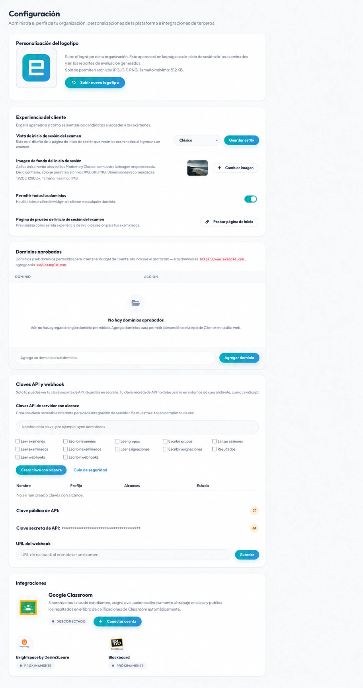

# Configuración e imagen de marca de la organización

Las cuentas Root y Administrator pueden abrir **Inicio → Configuración** para gestionar la imagen de marca de toda la organización, los dominios incrustados, las credenciales de API, el envío de webhooks y las conexiones compatibles con plataformas de aprendizaje.

## Dominios incrustados aprobados

La lista de dominios permitidos controla qué sitios pueden cargar el widget de Client.

1. Ingresa solo el nombre de host, sin **http://** ni **https://**.
2. Selecciona **Agregar dominio**.
3. Elimina los dominios que ya no utilices.

Por ejemplo, ingresa **assessment.example.edu**, no **https://assessment.example.edu/exams**.

Evita la opción **Permitir todos los dominios** en producción. Si agregas **localhost** u otro host de desarrollo, elimínalo después de hacer pruebas, ya que no es exclusivo de tu organización.

Consulta [Incrustar la aplicación Client](../../integrations/embedding-client-app.md).

## Logo de la organización

El panel **Personalización del logo** controla el logo que se muestra en las vistas compatibles orientadas a la organización y a los candidatos. Selecciona **Cargar nuevo logo** y elige un archivo JPG, GIF o PNG de hasta 512 KB.

Utiliza un logo de alto contraste con espacio de relleno transparente o neutro y, a continuación, verifícalo tanto en pantallas de computadora como de celulares.

## Página de inicio de sesión del examen

En el panel **Experiencia de Client**, establece **Vista de inicio de sesión del examen** en **Predeterminada**, **Moderna** o **Clásica**.
Las opciones Moderna y Clásica pueden utilizar una imagen de fondo de la organización. Si no se proporciona ninguna, Client puede mostrar un fondo predeterminado.

1. Elige una vista de inicio de sesión y selecciona **Guardar estilo**.
2. Selecciona **Cambiar imagen** para cargar un fondo JPG, GIF o PNG.
3. Utiliza una imagen de 1920 × 1280 píxeles cuando sea posible y mantenla dentro del límite de tamaño mostrado.
4. Selecciona **Probar página de inicio de sesión del examen** y verifica la legibilidad, la ubicación del logo y el comportamiento en celulares.

Consulta [Personalizar la página de inicio de sesión del examen](../client/custom-login-page.md).

## Claves API

La **Clave pública de API** permite identificar integraciones de navegador aprobadas, como el widget de Client. La **Clave secreta de API** autentica las solicitudes entre servidores y nunca debe incluirse en código JavaScript del navegador, código fuente público, aplicaciones móviles o capturas de pantalla de la documentación.

La clave secreta solo se muestra una vez cuando se crea. Guárdala inmediatamente en un gestor de secretos aprobado. Regenerar una clave puede interrumpir las integraciones existentes hasta que se actualice cada consumidor.

Consulta [Claves API y webhooks](../../integrations/api-keys-and-webhooks.md).

## Webhook de finalización

Ingresa una URL de devolución de llamada (callback) HTTPS para recibir una notificación cuando se complete un examen. El punto de enlace (endpoint) debe validar las solicitudes según el contrato de API actual, responder con éxito a la brevedad y procesar tareas extensas de forma asíncrona.

No utilices una página administrativa privada ni una URL que contenga credenciales como URL del webhook.

## Integraciones con plataformas de aprendizaje

En Configuración se pueden mostrar conectores de plataformas de aprendizaje y registros LTI 1.3. La disponibilidad y los requisitos de configuración dependen de tu plan y de la configuración de la plataforma externa. Para consultar los flujos completos de configuración y validación, consulta [Integrar examina.io con Moodle](../../integrations/moodle-lms.md) e [Integrar examina.io con Canvas](../../integrations/canvas-lms.md), o bien [Integrar examina.io con Blackboard Learn Ultra](../../integrations/blackboard-lms.md).

Utiliza una cuenta de integración dedicada según corresponda, otorga solo los permisos requeridos, documenta al propietario y desconecta las integraciones que ya no utilices.

## Lista de verificación de control de cambios

Después de cambiar la configuración de la organización:

1. prueba la página de inicio de sesión con un examen designado;
2. prueba cada dominio incrustado de producción;
3. verifica los consumidores de API si cambió alguna clave;
4. envía un evento de prueba a través de tu flujo de trabajo de webhook cuando esté disponible; y
5. registra el cambio y el plan de reversión para entornos de alta responsabilidad.
