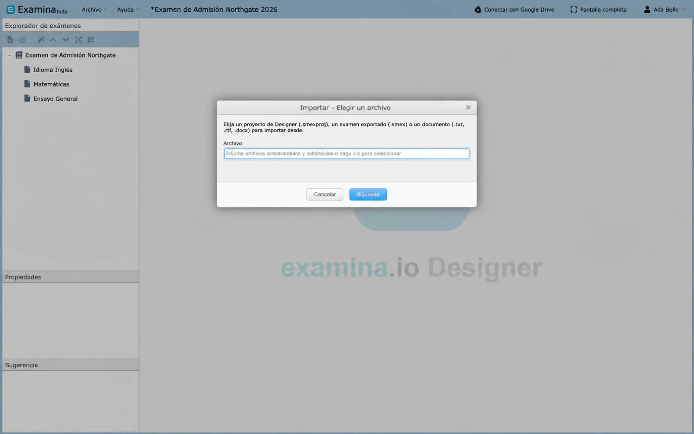
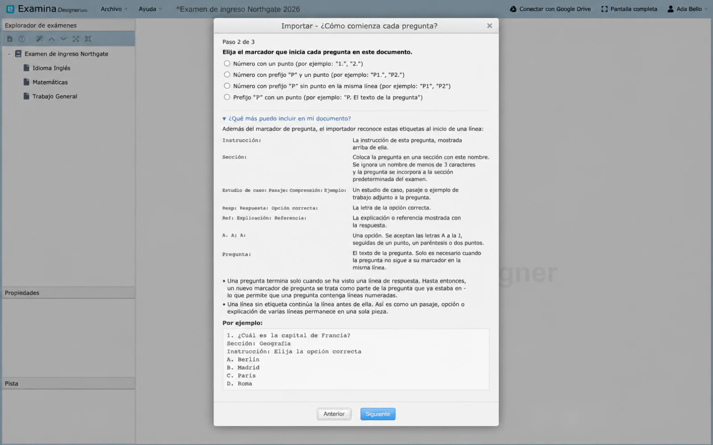
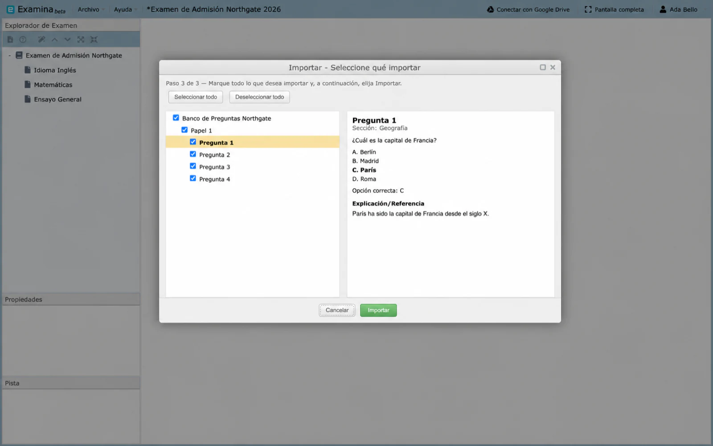
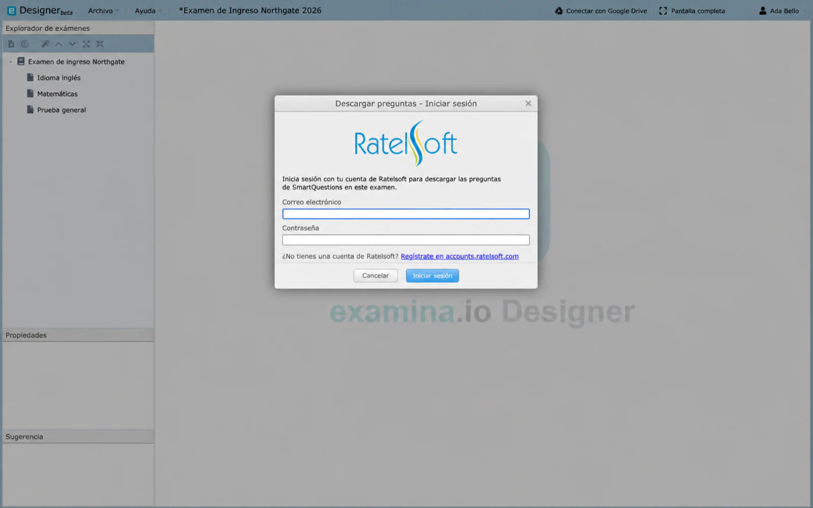

# Importar contenido existente

Designer puede tomar contenido de otro proyecto de Designer, de un examen ya exportado para su aplicación o de un documento de texto en el que estén redactadas las preguntas. Los tres procesos utilizan el mismo asistente: elige un archivo, indícale a Designer cómo está estructurado el documento y marca lo que desees importar. El punto de partida determina qué puedes incorporar.

## Lo que acepta Designer

Un archivo de proyecto `.smexproj` y un examen exportado `.smex` se leen directamente, ya que su contenido ya está estructurado. Un documento `.txt`, `.rtf` o `.docx` se lee como texto, por lo que Designer necesita el marcador y las etiquetas que se muestran a continuación para identificar dónde comienza cada pregunta. `.doc` no es compatible: ábrelo en Word y guárdalo como `.docx`.

!!! warning "Los archivos de una versión más reciente no se importarán"
    Un proyecto o examen exportado que se haya guardado con una versión posterior de la aplicación a la que estás ejecutando será rechazado, mostrando el mismo mensaje que aparecería al intentarlo abrir: *"The file version is greater than the application version"*. Pídele a quien te lo envió que lo guarde desde una versión equivalente.

## Iniciar una importación

1. Elige **File → Import Exams from another Project** para incorporar exámenes completos al proyecto abierto.
2. Haz clic derecho en un examen en el **Exam Explorer** y elige **Import Papers From File** para agregar evaluaciones a ese examen.
3. Haz clic derecho en una evaluación y elige **Import Questions From File** para agregar preguntas a esa evaluación.

El paso 1 solicita el archivo. Los documentos pasan al paso 2 a continuación; cualquier otro archivo pasa directamente al paso 3.

## Indícale a Designer dónde comienza cada pregunta

El paso 2 aparece únicamente para documentos. Elige el marcador con el que comienza cada pregunta en tu archivo: `1.`, `Q1.`, `Q1` en una línea independiente, o `Q.`. No hay nada preseleccionado, así que elige la opción que coincida con tu documento. Abre **¿Qué más puedo incluir en mi documento?** para consultar la referencia de las etiquetas, cada una al inicio de una línea.

### Etiquetas

**Question:**

: El texto de la pregunta; solo es necesario cuando no sigue directamente al marcador.

**Instruction:**

: La instrucción para esa pregunta.

**Section:**

: Coloca la pregunta en una sección con nombre.

**Case Study:**, **Passage:**, **Comprehension:**, **Example:**

: Un pasaje adjunto a la pregunta. La etiqueta que elijas será el texto que se muestre.

**A.**, **A)**, **A:**

: Una opción. Se reconocen las letras de la A a la J.

**Ans:**, **Answer:**, **Correct Option:**

: La letra de la opción correcta.

**Ref:**, **Exp:**, **Explanation:**, **Reference:**

: La explicación que se muestra con la respuesta.

### Los casos que suelen causar confusión

Una pregunta solo se da por finalizada cuando se detecta una línea de respuesta. Esto es lo que permite que una lista numerada dentro de un caso de estudio (`1. First point` y `2. Second point`) permanezca dentro del pasaje en lugar de que cada línea inicie su propia pregunta. Una pregunta sin línea de respuesta nunca se cierra y absorbe a las siguientes, por lo que una pregunta importada que contenga el texto de varias por lo general indica que falta una línea **Ans:**. Una segunda respuesta reemplaza a la primera; no agrega una nueva.

Una línea que no tiene etiqueta continúa la línea anterior; de este modo, un caso de estudio de varias líneas se mantiene unificado, y por eso una nota suelta entre preguntas se añade a la línea superior. El texto sin etiqueta antes de cualquier etiqueta se convierte en el texto de la pregunta, y una etiqueta **Question:** posterior lo anula. Un nombre de **Section:** con menos de tres caracteres se ignora y la pregunta se ubica en la sección predeterminada de la evaluación. La importación de documentos siempre genera reactivos de opción múltiple con respuesta única, por lo que las preguntas de completar espacios en blanco y de opción múltiple con respuesta múltiple deben [crearse manualmente](questions.md).

## Elegir qué importar

El paso 3 muestra lo que Designer encontró en forma de árbol Examen → Evaluación → Pregunta.

1. Marca los exámenes, evaluaciones o preguntas que desees.
2. Selecciona cada elemento para leerlo en el panel de vista previa de la derecha.
3. Elige **Importar**.

Solo se pueden marcar los niveles que permite tu punto de entrada: importar evaluaciones te permite marcar evaluaciones y preguntas, pero no exámenes; importar preguntas, solo preguntas.

Las imágenes dentro de un archivo `.docx` se importan con sus respectivas preguntas; cualquier imagen demasiado grande o en un formato que Designer no pueda mostrar se omitirá, se contabilizará y se informará al finalizar la importación. El resultado es contenido habitual de Designer, por lo que puedes obtener una vista previa, configurar puntuaciones y secciones, y guardar el proyecto.

## Descargar preguntas

**Descargar preguntas** es una función independiente que no forma parte del asistente de importación. Haz clic derecho en una evaluación y selecciónala para obtener preguntas de SmartQuestions.

1. Inicia sesión con tu cuenta de Ratelsoft.
2. Elige un esquema y luego hasta cinco materias.
3. Define cuántas preguntas tomar de cada materia, entre 1 y 100.
4. Selecciona un orden secuencial o aleatorio y, a continuación, descárgalas.

El inicio de sesión no se guarda. Designer volverá a solicitarlo en una nueva sesión.

Para copiar contenido dentro del proyecto abierto, consulta [Reutilizar contenido del proyecto](importing-questions.md).
