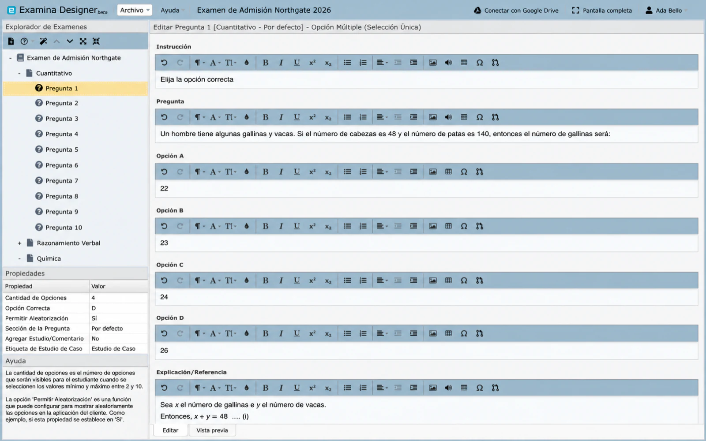
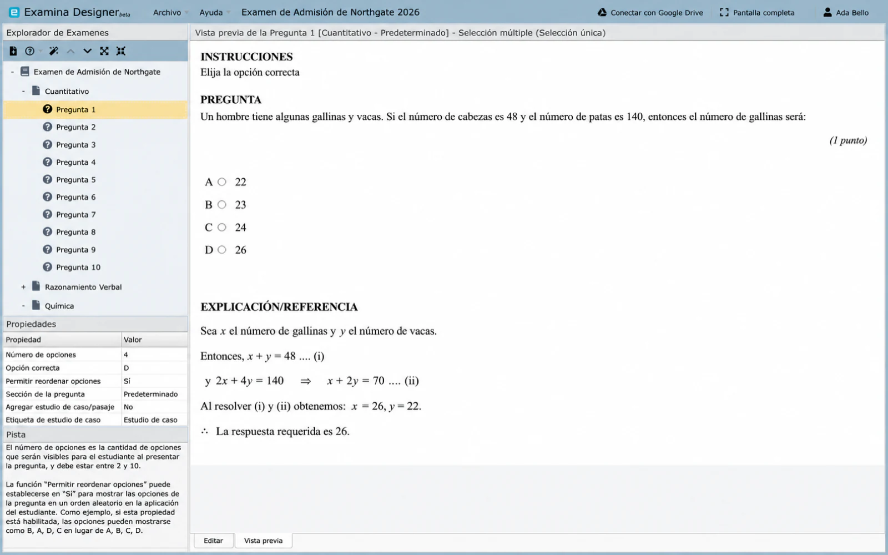

# Crea preguntas en Designer

Las preguntas pertenecen a un examen y, cuando existen secciones, a una sección dentro de dicho examen.

## Agregar una pregunta

1. Abre un proyecto de examen y crea un examen.
2. Haz clic derecho en el examen y elige la acción de nueva pregunta, o selecciona **Nueva pregunta** debajo de Exam Explorer.
3. Elige un tipo de pregunta.
4. Ingresa el enunciado, las opciones de respuesta o respuestas aceptadas, y la explicación opcional.
5. Configura las propiedades de la pregunta.
6. Abre **Vista previa** y verifica el resultado.
7. Guarda el proyecto.

## Tipos de preguntas

Designer admite:

- **Opción múltiple: selección única:** una sola opción es correcta.
- **Opción múltiple: selección múltiple:** más de una opción puede ser correcta.
- **Completar espacios en blanco:** el candidato ingresa texto que se evalúa según las reglas de respuesta configuradas.

Elige el tipo que mida la habilidad deseada. No conviertas una pregunta de respuesta múltiple en una de selección única solo para simplificar la calificación.

## Propiedades principales

**Cantidad de opciones**

: Establece la cantidad de opciones de opción múltiple. El rango admitido es de 2 a 10.

**Opción correcta**

: Identifica la respuesta correcta para una pregunta de selección única. Las preguntas de selección múltiple permiten las opciones correctas correspondientes.

**Permitir mezclar opciones**

: Aleatoriza el orden de las opciones en Client mientras mantiene la opción correcta. Evita mezclar opciones como "todas las anteriores" que dependen de la posición.

**Sección de la pregunta**

: Asigna la pregunta a una sección. Crea las secciones de examen requeridas antes de asignar preguntas.

**Puntaje/Valor de la pregunta**

: Establece la puntuación otorgada a la pregunta. Se admiten valores decimales como 0.5.

## Casos de estudio y lecturas

Activa **Agregar caso de estudio/lectura** cuando un enunciado dependa de material de lectura compartido, una exhibición, un escenario o un planteamiento de problema. Usa **Etiqueta del caso de estudio** para reemplazar la etiqueta predeterminada por un nombre más claro, como **Lectura de comprensión**.

Si varias preguntas usan la misma lectura, mantén la redacción y el formato uniformes y previsualiza cada pregunta.

## Editar y previsualizar contenido

El panel Editar admite formato de texto, encabezados, color, listas, alineación, superíndice, subíndice, símbolos, expresiones, imágenes, audio y tablas.

Usa el formato para mejorar la estructura, no como decoración. Confirma que la información importante no se comunique únicamente mediante el color.

### Imágenes

Mantén la imagen importada dentro de los límites que muestra Designer. La guía del editor recomienda un máximo de 650 píxeles de ancho y 500 KB para que la imagen se procese de manera confiable en computadoras y dispositivos móviles.

Redimensiona y comprime las imágenes grandes antes de importarlas. Agrega texto suficiente en la pregunta para que el propósito de la imagen siga siendo comprensible.

### Audio

Los elementos de audio son compatibles con las preguntas de comprensión auditiva. Configura los controles disponibles de volumen, pausa, detención y búsqueda para que coincidan con las reglas de la evaluación.

Realiza pruebas con audífonos y el ancho de banda más bajo esperado el día del examen. Proporciona una opción de adaptación aprobada cuando sea necesario.

### Tablas

Usa la herramienta de tablas para agregar filas y columnas.

Para editar o eliminar una tabla, haz clic derecho dentro de ella y abre **Propiedades de la tabla**.

Mantén las tablas lo suficientemente pequeñas como para que quepan en las pantallas admitidas sin desplazamiento horizontal.

## Vista previa y control de calidad {#preview-and-quality-check}

Selecciona **Vista previa** para inspeccionar el enunciado y las opciones procesadas.

Antes de exportar, verifica que:

- el enunciado tenga una sola interpretación defendible;
- la respuesta correcta y el puntaje estén configurados;
- los distractores sean plausibles y no revelen la respuesta por accidente;
- la asignación de sección sea correcta;
- las opciones mezcladas sigan teniendo sentido;
- el contenido multimedia se cargue y sea legible o audible;
- la ortografía, la gramática y la notación matemática sean correctas; y
- la pregunta funcione en el tamaño de pantalla permitido más pequeño.

Para reutilizar contenido existente, consulta [Reutilizar contenido del proyecto](importing-questions.md).
Para importar preguntas desde un documento u otro proyecto, consulta [Importar contenido existente](import-content.md).
