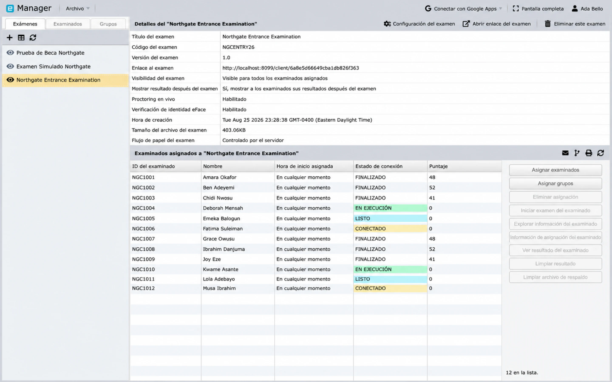

# Entrega, supervisa y genera informes

Usa esta guía después de haber preparado el examen, los candidatos y las asignaciones de pruebas. Las acciones exactas disponibles dependen del tipo de examen, el plan, el rol y el estado actual del examen.

## Lista de verificación previa a la entrega

Selecciona el examen en Manager y verifica:

- **Visibilidad:** mantén el examen invisible hasta que esté listo para los candidatos.
- **Candidatos asignados:** la lista y las asignaciones de pruebas están completas.
- **Hora:** las horas de inicio asignadas y las zonas horarias son correctas.
- **Visualización de resultados:** decide si los candidatos ven los resultados al finalizar o un mensaje genérico de finalización.
- **Supervisión en vivo:** actívala solo cuando sea requerida y cuente con el personal necesario.
- **Verificación de identidad:** verifica fotos, consentimiento, exenciones y contactos de respaldo cuando se utilice esta función.
- **Dispositivos:** decide si se permiten celulares o tabletas y qué diseño de Client deben recibir.
- **Política de desconexión:** elige qué debe suceder después de fallas repetidas al guardar o una pérdida prolongada de conexión.
- **Instrucciones:** confirma que las instrucciones del examen y de la prueba coincidan con las reglas de operación finales.

Client guarda el estado del examen periódicamente mientras está conectado. Una desconexión impide que el nuevo estado llegue al servidor, por lo que la política configurada y las instrucciones para el candidato deben contemplar la pérdida de red.

## Realiza pruebas antes de publicar

Usa un candidato de prueba designado y abre **Abrir enlace del examen** en una ventana de navegación privada. Prueba la misma ruta que usarán los candidatos reales:

1. inicia sesión con las credenciales del candidato;
2. completa las comprobaciones de identidad o dispositivo;
3. verifica las pruebas disponibles;
4. inicia y responde una prueba corta de ensayo;
5. vuelve a conectarte después de una breve interrupción de red si resulta práctico;
6. finaliza y confirma la pantalla de finalización o de resultado; y
7. verifica el resultado en Manager.

No reutilices las credenciales de un candidato real para realizar pruebas.

## Publica y envía el examen

1. Cambia el examen a **Visible**.
2. Selecciona **Abrir enlace del examen** y copia el enlace final.
3. Usa **Enviar correo a los candidatos** cuando los candidatos asignados tengan direcciones de correo electrónico válidas, o distribuye el enlace a través de tu sistema de comunicación aprobado. Consulta [Envía correos a tus candidatos](email-examinees.md) para conocer los marcadores de posición de personalización y los enlaces de inicio de sesión que le evitan al candidato tener que escribir un código y una contraseña.

Informa a los candidatos la fecha, la hora, la zona horaria, el enlace, el método de distribución de credenciales, los requisitos del dispositivo, las expectativas de supervisión y el contacto de soporte. Comparte la [guía para el día del examen](../client/take-an-exam.md).

## Supervisa una sesión activa

La tabla de candidatos asignados del examen es la vista de supervisión. Muestra el estado de conexión de cada persona y, una vez que finaliza, su puntuación.

Manager muestra los estados de asignación y conexión como **Connected**, **Ready**, **Running**, **Disconnected** y **Finished**, codificados por colores para que una sesión en curso se pueda evaluar de un vistazo. Actualiza la tabla de asignaciones antes de tomar una decisión para contar con los datos más recientes del servidor.

Según la configuración del examen, las acciones pueden incluir:

- iniciar o detener el examen de un candidato;
- iniciar o detener el examen;
- supervisar a un candidato o el examen completo;
- inspeccionar la información de asignación; y
- desconectar a un candidato del examen.

Si la supervisión en vivo está activada, abre el examen en **Proctoring** desde la barra lateral de la cuenta. Es posible que los supervisores deban aprobar a un candidato antes de que comience el examen.

## Maneja incidentes comunes

**El candidato no puede ver el examen**

: Confirma la visibilidad, la asignación, las pruebas seleccionadas, la hora de inicio, la zona horaria y el acceso a Circle para el miembro del personal que esté investigando.

**El candidato no puede iniciar sesión**

: Verifica el enlace exacto del examen, el código, la contraseña, la asignación del examen y las mayúsculas/minúsculas. Restablece o vuelve a distribuir las credenciales solo a través de un canal aprobado.

**La conexión muestra Disconnected**

: Pídele al candidato que mantenga abierta la página del examen, restablezca la red y siga la [guía de reconexión](../client/troubleshooting.md). Actualiza Manager antes de enviar comandos para iniciar, detener o desconectar.

**El Proctor no puede ver el examen**

: Confirma que la supervisión en vivo esté activada, que el rol de supervisor sea correcto y que el supervisor tenga acceso a través del Circle correspondiente.

## Revisa los resultados

Después de que un candidato finalice, usa **Ver resultado del candidato** para un caso individual o **Ver resultado del examen** para la evaluación. Los resultados pueden incluir:

- preguntas respondidas y sin responder;
- preguntas omitidas;
- puntuación obtenible y alcanzada; y
- porcentaje de puntuación.

Usa **Generar informe** para obtener un informe del examen más amplio. Es posible que los candidatos que no hayan finalizado queden excluidos, así que confirma el recuento de finalizados antes de considerar definitivo un informe.

## Correcciones y reintentos

**Borrar resultado** elimina el resultado existente del candidato seleccionado para ese examen y puede permitir un reintento. Esta acción no es reversible. Antes de usarla:

1. confirma que el candidato y el examen sean los correctos;
2. conserva cualquier registro de auditoría o resultado que sea requerido;
3. registra la autorización y el motivo; y
4. verifica la nueva asignación y el plan de comunicación.

Ten el mismo cuidado al eliminar un examen, un candidato o una asignación.
