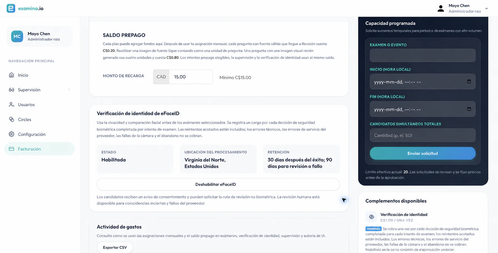
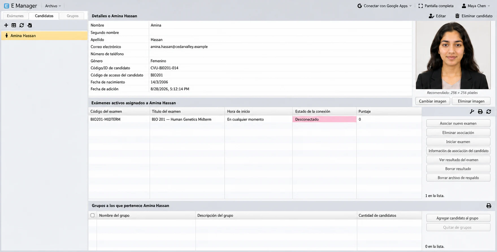
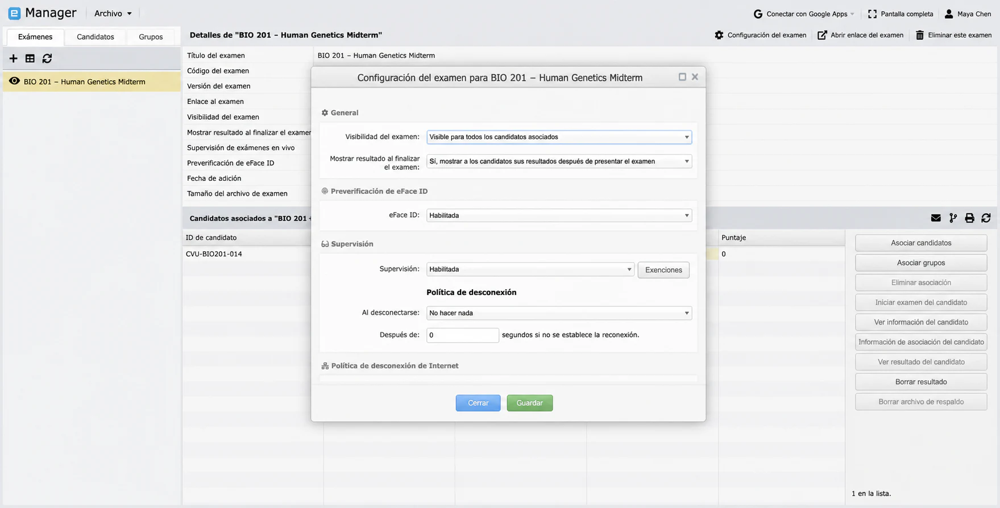
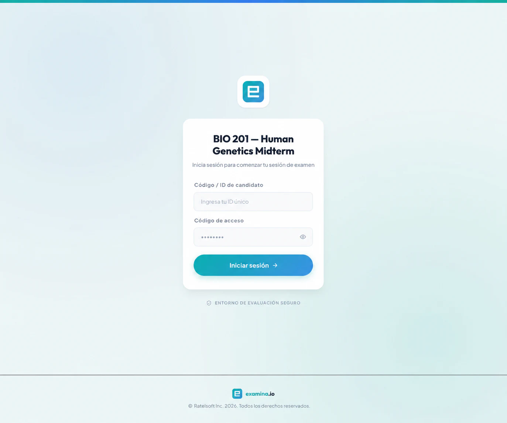
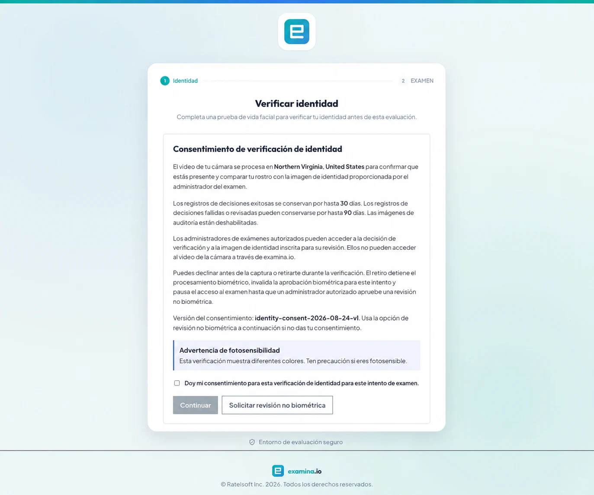
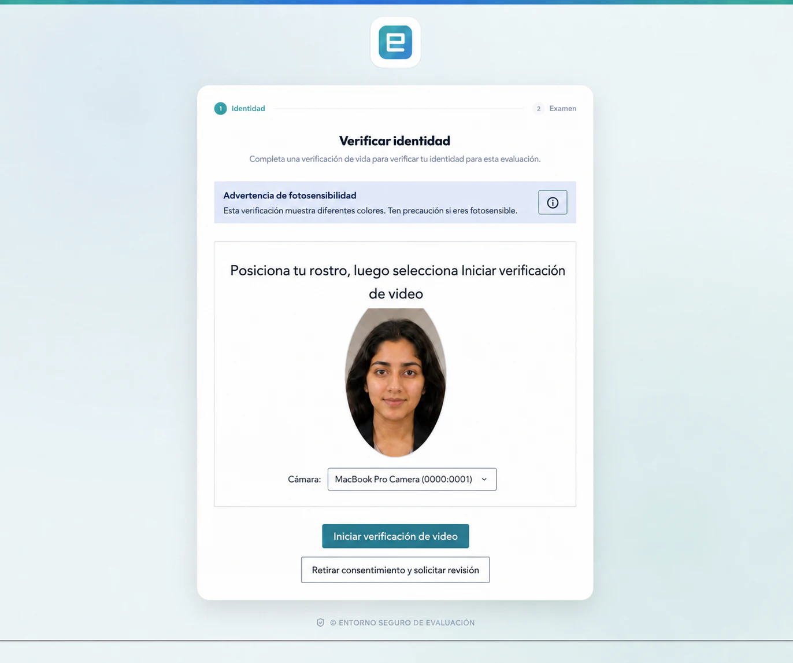

# Configurar y usar eFaceID

eFaceID ayuda a confirmar que la persona que inicia un examen protegido está
presente y coincide con la foto proporcionada por un administrador autorizado.
La decisión queda vinculada al candidato, al examen y a ese intento.

Este recorrido usa la organización ficticia **Cedar Valley University**, la
candidata **Amina Hassan** y **BIO 201 — Human Genetics Midterm**.

!!! important "Mantén una alternativa humana"

    La biometría no debe ser la única forma de acceder al examen. Publica un
    canal de soporte y usa la revisión no biométrica para quienes no den su
    consentimiento, no puedan usar la cámara o necesiten una adaptación.

## Antes de comenzar

Necesitas un plan compatible, los permisos necesarios, una foto actual por
candidato, una cámara compatible y un proceso de revisión no biométrica.

## 1. Activar eFaceID

Abre **Facturación** y confirma que **Verificación eFaceID** aparezca como
**Activada**. La tarjeta también muestra la ubicación de procesamiento y los
periodos de retención configurados.

La ubicación se expresa como ciudad o región y país, por ejemplo, **Virginia
del Norte, Estados Unidos**. Tu organización puede usar otros valores.

## 2. Registrar la foto del candidato

En **Manager**, abre **Candidatos**, selecciona a la persona, elige **Cambiar
imagen** y carga un retrato actual, nítido, frontal y bien iluminado. Confirma
el nombre, código y asignación del examen.

No uses fotos grupales, páginas escaneadas, selfis con filtros ni imágenes con
más de un rostro.

## 3. Proteger el examen

Abre la configuración del examen y activa **Verificación eFaceID**. Activa
también **Supervisión en vivo** cuando un supervisor deba observar la sesión.
Confirma candidatos, pruebas asignadas, retención y el procedimiento alterno.

## 4. Recorrido del candidato

El candidato abre el enlace oficial e ingresa su código y contraseña.

## 5. Revisar el consentimiento

Después revisa el consentimiento: propósito, ubicación, retención, personas
autorizadas, advertencia de fotosensibilidad y opción de revisión no biométrica.

## 6. Completar la prueba de vida

Tras aceptar, autoriza la cámara, centra el rostro y sigue las indicaciones de
color y movimiento. Debe haber un solo rostro y luz frontal suficiente.

La captura publicada usa un retrato ficticio para proteger la privacidad; los
controles corresponden al flujo probado en vivo.

## 7. Entender el resultado

**Aprobado**: el candidato continúa a la configuración del dispositivo o al
resumen del examen.

**Revisión requerida**: el intento se pausa y un administrador autorizado
evalúa una alternativa no biométrica documentada.

**Falla técnica**: revisa permisos de cámara, iluminación, navegador y red
antes de volver a intentar.

**Consentimiento rechazado o retirado**: no se emite aprobación biométrica. El
candidato selecciona **Solicitar revisión no biométrica**.

Solo se factura una decisión biométrica de seguridad completada. Los errores
de permisos, abandonos y fallas de red o servicio no son decisiones exitosas.
Consulta **Facturación** para conocer el precio y la cantidad incluida.

## 8. Retención y auditoría

Los administradores autorizados pueden ver la decisión y la foto registrada,
pero el video de la cámara no queda disponible para ellos en examina.io. Los
resultados exitosos y los casos revisados pueden tener retenciones diferentes.
No copies imágenes biométricas en correo, chat ni tickets de soporte.

## Solución de problemas

**La cámara no se abre**: permite la cámara para el sitio exacto, cierra otras
aplicaciones que la usen y recarga. El sistema operativo puede exigir reiniciar
el navegador después de otorgar un permiso nuevo.

**No se detecta el rostro**: mejora la luz frontal, centra el rostro y elimina
otros rostros del encuadre.

**El candidato cambia de navegador**: la aprobación está ligada a la sesión
del intento y puede requerirse una nueva verificación.

Para un examen supervisado, continúa con
[Supervisar un examen en vivo](live-exam-proctoring.md).
