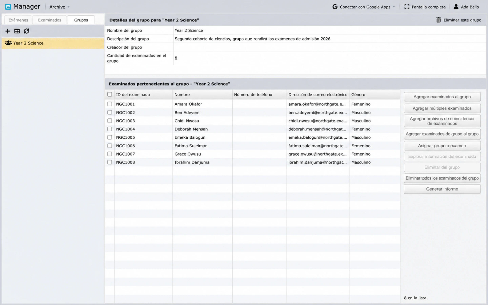

# Grupos y asignaciones de exámenes

Manager utiliza **Grupos** para colecciones reutilizables de candidatos y **mapeos** para decidir qué pruebas de examen puede realizar cada candidato.

## Cuándo usar un Grupo

Crea un Grupo para un conjunto de personas que gestionas regularmente juntas, como:

- un curso o clase;
- un ingreso o cohorte;
- un centro de evaluación;
- un departamento; o
- una sesión programada.

Un Grupo no otorga permisos al personal. Usa un [Círculo](../administration/circles-and-permissions.md) para el control de acceso.

## Crea un Grupo

1. Abre **Manager**.
2. Selecciona **Archivo → Crear nuevo Grupo**.
3. Ingresa un nombre único y una descripción útil.
4. Guarda el Grupo.
5. Selecciona el Grupo y, a continuación, agrega candidatos desde la lista con opción de búsqueda.

Los botones junto a la lista de miembros abarcan todas las formas de llenar un Grupo: agregar candidatos uno a la vez, agregar varios a la vez, agregar los candidatos que coincidan con un archivo cargado o copiar los miembros de otro Grupo.

También puedes agregar la pertenencia a un Grupo desde el registro de un candidato o asignar candidatos importados a un Grupo durante la importación de archivos.

## Mapea un candidato a un examen

1. Abre la pestaña **Candidatos** y selecciona a la persona.
2. Elige la acción para mapear al candidato a un examen.
3. Busca y selecciona un examen.
4. Continúa con el mapeo de pruebas.
5. Selecciona las pruebas que el candidato puede realizar.
6. Opcionalmente, asigna la hora de inicio más temprana del examen y elige la zona horaria correcta.
7. Guarda el mapeo.

Solo se selecciona un examen en una sola operación de mapeo, pero puedes mapear al mismo candidato a exámenes adicionales en operaciones posteriores.

## Mapea varios candidatos desde un examen

1. Abre la pestaña **Exámenes** y selecciona el examen.
2. Elige **Mapear candidatos**.
3. Busca candidatos por nombre, código o un campo adicional disponible.
4. Mueve los candidatos deseados a la lista seleccionada.
5. Continúa con el mapeo de pruebas.
6. Elige las pruebas y la hora de inicio opcional.
7. Guarda los mapeos.

## Mapea un Grupo

Puedes comenzar desde el examen o desde el Grupo:

- Selecciona un examen y elige **Mapear Grupos**; o
- selecciona un Grupo y elige **Mapear Grupo a examen**.

Al mapear un Grupo, Manager aplica la asignación a los miembros actuales del Grupo que aún no estén mapeados a ese examen. Agregar a alguien al Grupo más adelante no significa que cada operación de mapeo anterior se repita automáticamente, por lo que debes revisar los candidatos mapeados del examen después de realizar cambios en los miembros.

## Elige las pruebas y la hora con cuidado

Las pruebas seleccionadas son las pruebas que el candidato puede realizar en Client. Si un examen contiene varias pruebas, confirma que cada candidato tenga la combinación correcta.

La hora de inicio mapeada opcional es la hora más temprana en que el examen está disponible para esa asignación. Siempre verifica:

- la fecha del calendario;
- la hora local;
- la zona horaria;
- las implicaciones del horario de verano; y
- si los candidatos de diferentes regiones necesitan asignaciones independientes.

## Verifica los mapeos

Antes de publicar un examen:

1. Abre la lista de candidatos mapeados del examen.
2. Compara el total con la lista de participantes prevista.
3. Revisa de forma aleatoria las asignaciones de pruebas.
4. Revisa las horas de inicio y las zonas horarias.
5. Confirma que no haya candidatos retirados o duplicados.
6. Haz una prueba con una cuenta de candidato que tenga el mismo patrón de pruebas.

Eliminar un mapeo borra la asignación; no elimina al candidato ni al Grupo subyacentes.

## Siguiente paso

Continúa con [Entregar, supervisar e informar](deliver-monitor-report.md).
