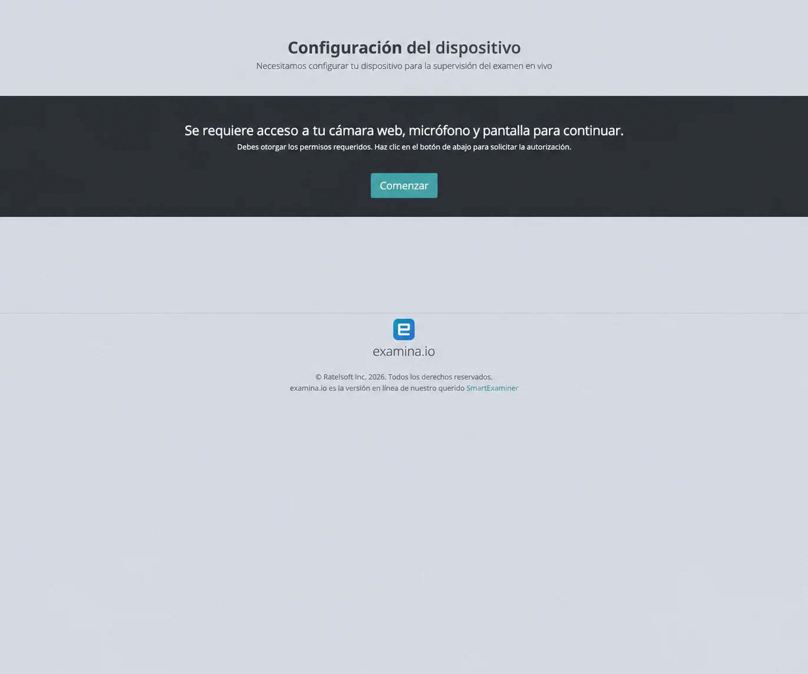
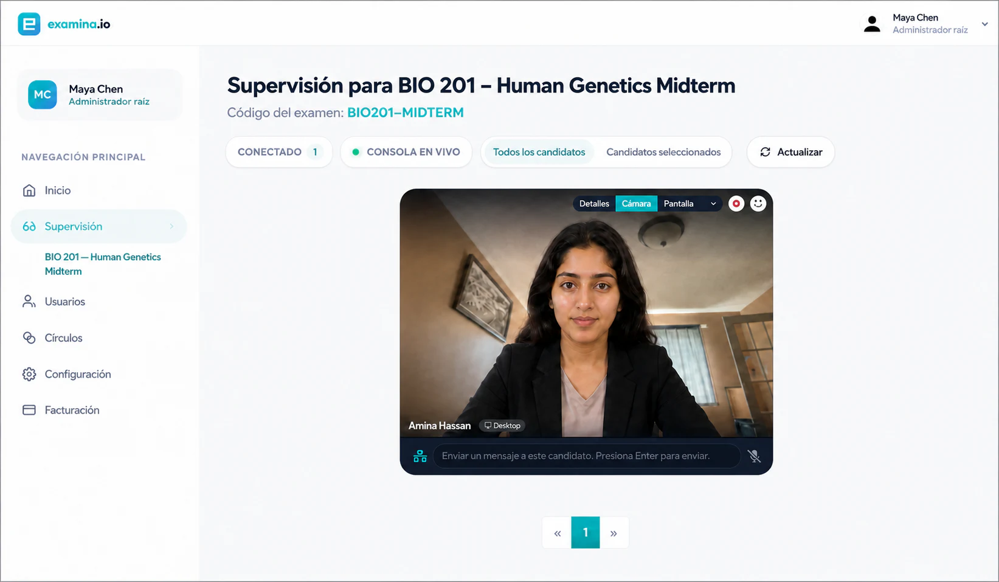
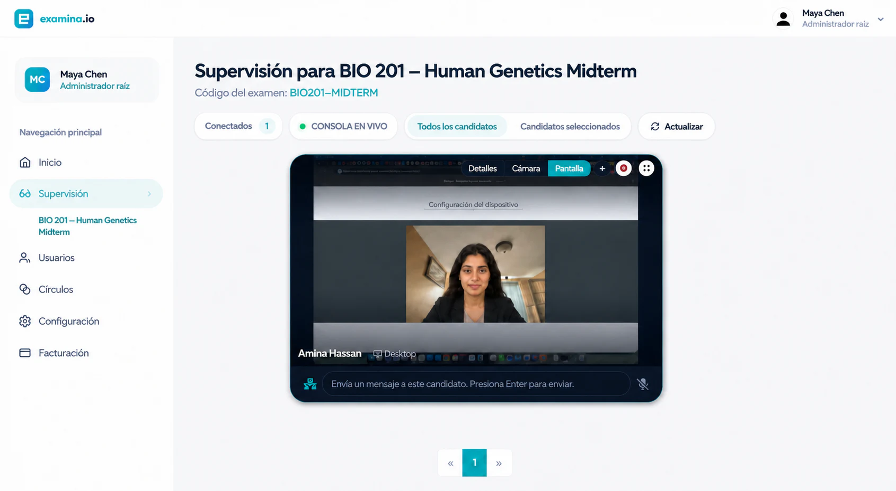
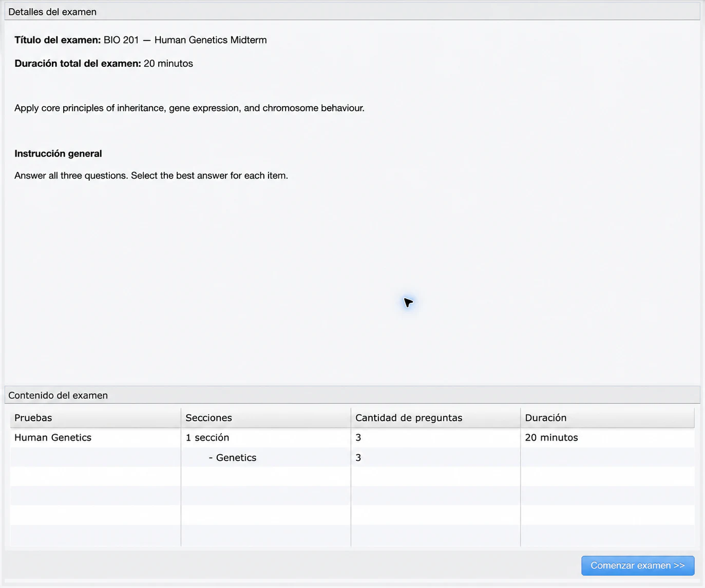
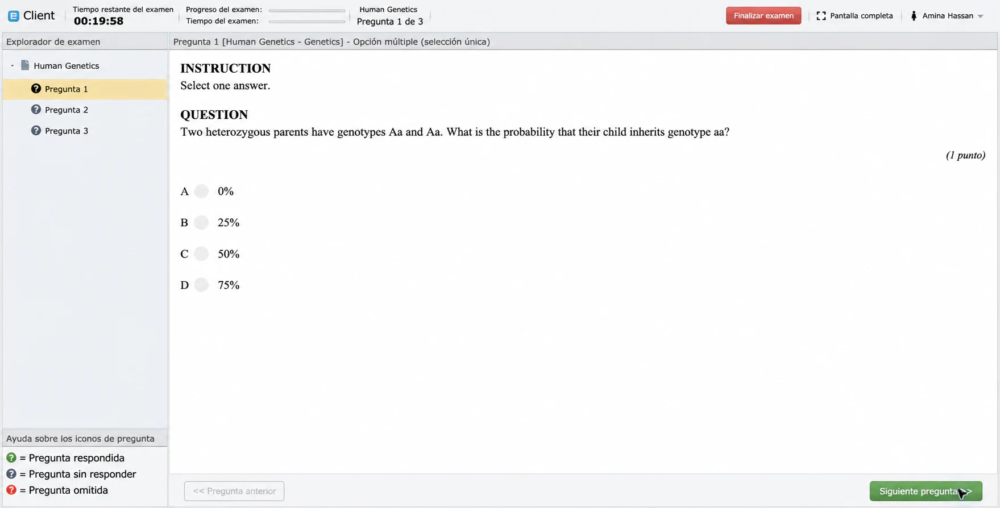
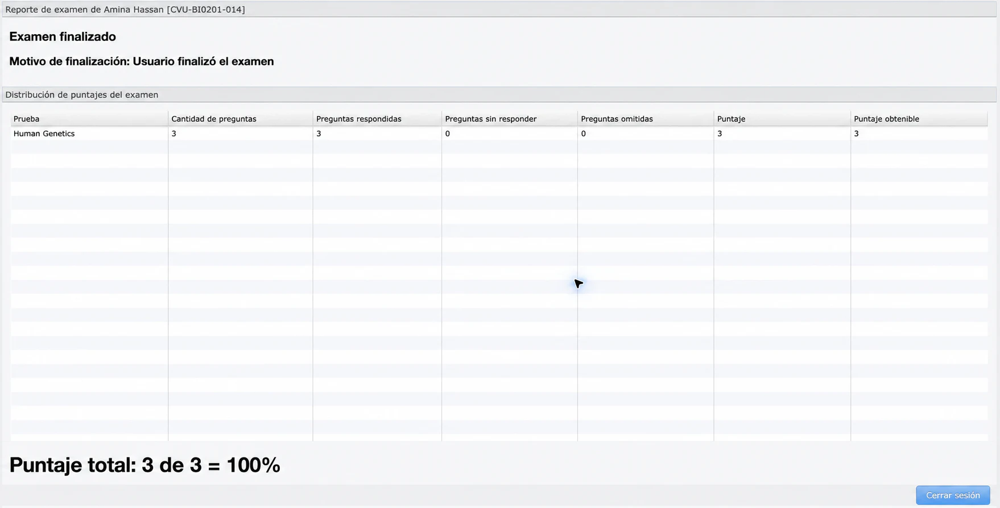

# Supervisar un examen en vivo

La supervisión en vivo permite que una persona autorizada vea la cámara y la
pantalla compartida, envíe mensajes, autorice el inicio y observe la sesión en
la consola de Examina.

Este ejemplo usa **Cedar Valley University**, **Amina Hassan** y **BIO 201 —
Human Genetics Midterm**.

## Antes del examen

Confirma asignaciones, pruebas, duración, horario, instrucciones y visibilidad
de resultados. Activa **Supervisión en vivo** y, cuando corresponda,
**Verificación eFaceID**. Otorga al supervisor el rol y acceso al Círculo
correctos.

El candidato necesita computadora, cámara, micrófono, navegador actualizado,
pantalla compartida y red estable. El supervisor debe usar otra computadora y
otra sesión. En producción usa HTTPS: una dirección HTTP de la red local no
puede solicitar permisos multimedia del navegador.

### Configurar la evaluación

Revisa asignaciones, horarios, instrucciones y permisos antes de publicar.

### Preparar dispositivos y redes

Realiza un ensayo completo con un candidato ficticio antes del examen.

## 1. Configuración del dispositivo

Después de iniciar sesión y, si aplica, completar
[eFaceID](efaceid-identity-verification.md), el candidato ve **Configuración
del dispositivo**.

Selecciona **Iniciar**, permite cámara y micrófono, y comparte la pestaña del
examen o la pantalla prevista. Antes debe cerrar ventanas y notificaciones
privadas.

!!! warning "No compartas contenido privado"

    Cierra ventanas y notificaciones ajenas al examen. Cuando la política lo
    permita, comparte solamente la pestaña del examen.

## 2. Abrir la consola

El supervisor abre el examen en **Supervisión**. En el menú del candidato
selecciona **Solicitar audio y video del candidato**, permite el micrófono del
navegador y espera la conexión. Si hubo una reconexión, actualiza la consola
antes de solicitar de nuevo.

## 3. Verificar cámara y pantalla

En **Cámara web**, confirma identidad, iluminación, ángulo y ausencia de otra
persona.

En **Pantalla**, confirma que se comparte el examen o la pantalla acordada.

Las imágenes usan una candidata ficticia para proteger la privacidad y
conservan el estado real de la consola probada.

## 4. Autorizar el inicio

Tras validar el entorno, abre el menú del candidato correcto y selecciona
**Autorizar inicio**. Comprueba el mensaje de éxito. El candidato recibe
**Configuración completa** y revisa título, duración, instrucciones, pruebas y
cantidad de preguntas.

## 5. Supervisar y finalizar

La supervisión continúa mientras el candidato responde en Client.

Observa la conexión, interviene solo cuando sea necesario, registra incidentes
según la política y distingue una falla técnica de una conducta irregular. No
recolectes contenido personal ajeno al examen.

Al terminar, el candidato selecciona **Finalizar examen** y confirma el envío.
En Manager valida preguntas respondidas, sin responder y omitidas, además del
puntaje obtenido y posible.

## 6. Cerrar la sesión

El candidato confirma el envío; el supervisor espera el cierre normal de los
flujos antes de salir de la consola.

## 7. Verificar el resultado

En Manager revisa el estado final, las respuestas, el puntaje y la resolución
de los incidentes registrados.

## Incidentes comunes

**Pantalla en blanco**: detén y vuelve a compartir la pestaña o pantalla del
examen, actualiza la consola y solicita los flujos otra vez.

**Esperando transmisión**: confirma HTTPS o localhost, permisos, **Iniciar** en
el lado del candidato y la solicitud del supervisor.

**Permiso nuevo del sistema**: reinicia el navegador si el sistema operativo
lo solicita.

**Cambio de navegador**: cierra la sesión anterior o espera a que venza su
presencia; eFaceID puede tener que repetirse.

**Pérdida de conexión**: conserva el intento, restaura la red y aplica la
política de desconexión. No borres un resultado como recuperación rutinaria.

## Lista para el día del examen

- Supervisor en una computadora independiente.
- Examen correcto abierto en **Supervisión**.
- Identidad y foto verificadas cuando se usa eFaceID.
- Cámara, micrófono y pantalla permitidos.
- Cámara y pantalla verificadas antes de autorizar.
- Candidato correcto autorizado expresamente.
- Resultado final validado en Manager.
