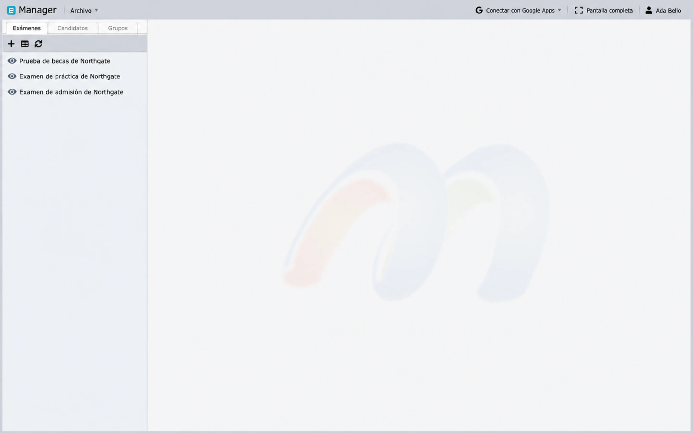
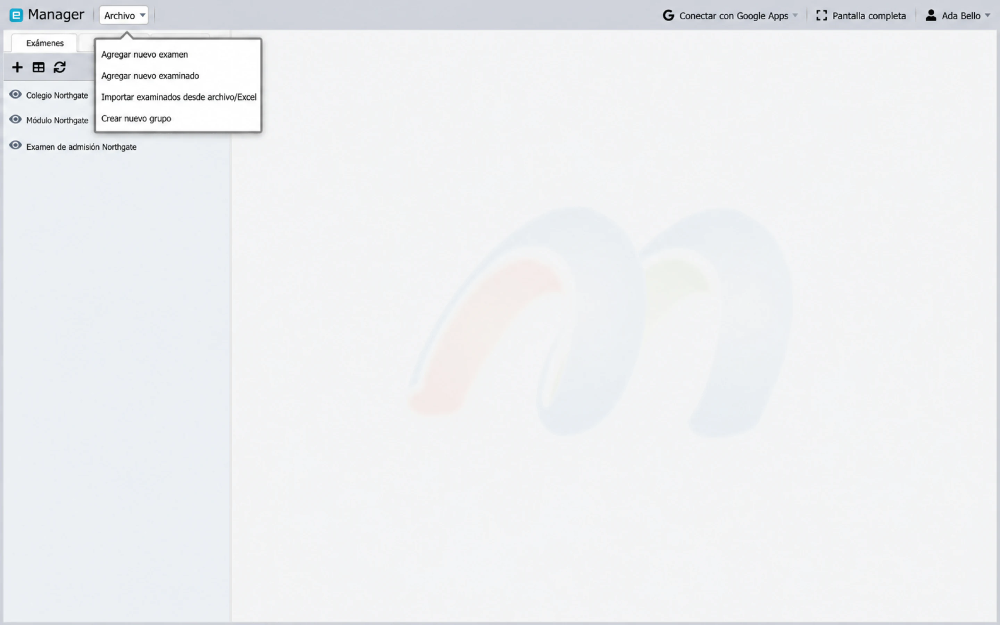
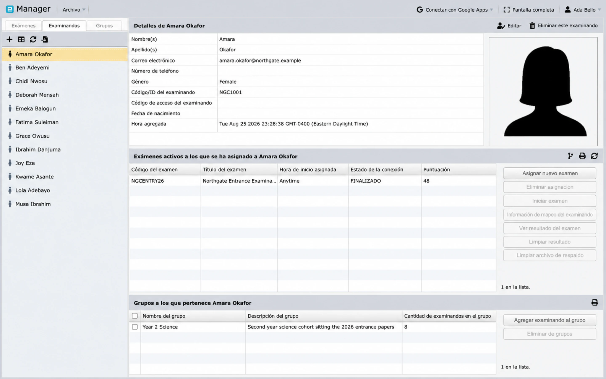

# Descripción general de Manager

Manager es el entorno de trabajo de administración de exámenes. Conecta un examen exportado con los registros de los candidatos, las asignaciones de evaluaciones, la configuración de aplicación, la supervisión de exámenes y los resultados.

## Abrir Manager

Inicia sesión, abre **Inicio** y selecciona **Manager** en la Galería de aplicaciones. Los usuarios habituales, Administradores y Root pueden abrir Manager, pero los exámenes y candidatos a los que pueden acceder pueden estar limitados por los [Círculos](../administration/circles-and-permissions.md).

## Entorno de trabajo principal

Manager tiene tres pestañas de recursos:

- **Exámenes** muestra las evaluaciones importadas.
- **Candidatos** muestra los candidatos que se pueden vincular a los exámenes.
- **Grupos** muestra colecciones reutilizables de candidatos.

Selecciona un elemento en el panel izquierdo para abrir sus detalles y las acciones disponibles. La barra de herramientas pequeña que está arriba de cada lista agrega un nuevo registro, cambia a una vista de tabla y actualiza los datos desde el servidor. Actualiza la página siempre que otro usuario haya podido modificar los datos.

El menú **Archivo** contiene los cuatro comandos de creación, y son los mismos independientemente de la pestaña en la que te encuentres:

- **Agregar nuevo examen**
- **Agregar nuevo candidato**
- **Importar candidatos desde un archivo/Excel**
- **Crear nuevo grupo**

## Secuencia de operación recomendada

1. [Importa el examen](import-exams.md).
2. [Agrega o importa candidatos](examinees.md).
3. Opcionalmente, crea grupos.
4. [Asigna candidatos o grupos](groups-and-assignments.md) al examen y a sus evaluaciones.
5. Revisa la configuración de visibilidad, visualización de resultados, supervisión de exámenes, identidad, dispositivo y desconexión.
6. Prueba el enlace del examen con un candidato de prueba designado.
7. Publica y comunica el examen.
8. [Supervisa la sesión y genera los resultados](deliver-monitor-report.md).

## Exámenes

El registro de un examen muestra su título, código y versión, el enlace que utilizan los candidatos, la visibilidad, si se muestran los resultados después del examen, si están habilitadas la supervisión de exámenes en vivo y la preverificación con eFace ID, la hora en que se agregó, el tamaño del archivo importado y el flujo de la evaluación. Las acciones del examen pueden incluir:

- vincular candidatos o grupos;
- abrir el enlace del examen;
- enviar un correo electrónico a los candidatos vinculados;
- alternar la visibilidad o la visualización de resultados;
- configurar la supervisión de exámenes en vivo y la verificación de identidad;
- iniciar, detener o supervisar un examen elegible; y
- administrar permisos y configuraciones de aplicación; y
- ver resultados o generar reportes.

Las acciones disponibles dependen del tipo de examen, el rol de la cuenta, el plan y el estado actual del examen.

## Candidatos

El registro de un candidato almacena un código o ID único, contraseña de acceso, nombre, género y detalles opcionales como correo electrónico, número de teléfono, fecha de nacimiento y fotografía. Debajo de los detalles se encuentran dos paneles: los exámenes a los que está vinculada esta persona y los grupos a los que pertenece. Desde aquí puedes administrar la pertenencia a grupos, vincular un examen y evaluaciones, revisar los detalles de la vinculación y ver un resultado completado.

## Grupos

Un grupo es una colección operativa de candidatos, como una clase, cohorte o sesión de examen. Vincular un grupo a un examen aplica la asignación a los miembros actuales del grupo que aún no estén vinculados.

Los grupos son diferentes de los Círculos: los grupos facilitan el trabajo masivo con los candidatos, mientras que los Círculos controlan el acceso del personal.

## Prácticas de preparación seguras

- Mantén el examen invisible hasta que se hayan verificado el contenido, las asignaciones y la configuración.
- Utiliza códigos de candidato únicos y un canal seguro para las contraseñas de acceso.
- Verifica la zona horaria siempre que una asignación incluya una hora de inicio.
- Realiza pruebas con datos de prueba ficticios o aprobados.
- Actualiza antes de tomar medidas respecto al estado de conexión o los resultados.
- Trata de forma sensible las acciones de **Borrar resultado**, eliminación y regeneración de claves.

## Próximos pasos

Si ya cuentas con una exportación de Designer, continúa con [Importar exámenes](import-exams.md). Si el examen ya está presente, ve a [Agregar e importar candidatos](examinees.md).
