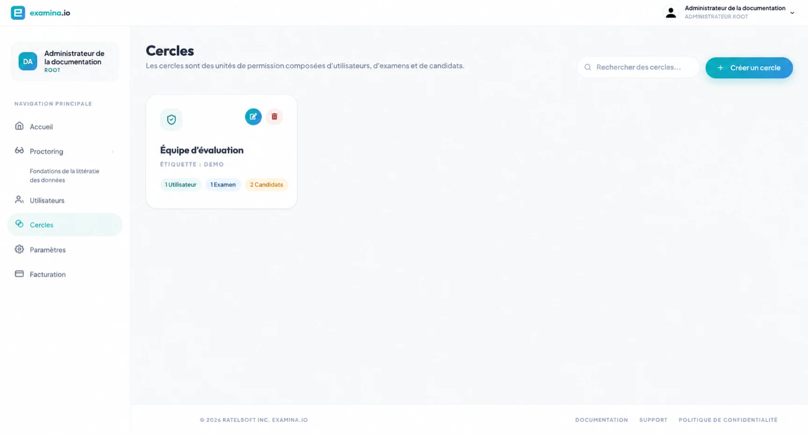

# Rôles et autorisations des utilisateurs {#user-roles-and-permissions}

Les membres du personnel se connectent en tant qu'**Utilisateurs**. Chaque utilisateur dispose d'un rôle de compte qui contrôle
quels domaines d'application sont disponibles. **Cercles** puis restreindre l'accès à
examens spécifiques et candidats.

Les candidats n'ont pas besoin de comptes d'utilisateurs du personnel ; ils entrent via un lien d'examen avec
leurs qualifications de candidat.

## Rôles du compte {#account-roles}

| Rôle | Utilisez-le pour | Accès typique |
| --- | --- | --- |
| **Racine** | Le principal propriétaire de l'organisation | Administration de l'organisation, utilisateurs, cercles, paramètres, facturation, Designer, Manager et espaces de travail Proctor éligibles |
| **Administrateur** | Administrateurs de plateforme de confiance | Utilisateurs, Cercles, Paramètres, Designer, Manager et espaces de travail Proctor éligibles ; aucun accès à la facturation de l'organisation |
| **Régulier** | Auteurs de questions, coordinateurs d'examens et autres membres du personnel opérationnel | Designer et Manager pour les ressources autorisées via les cercles ; peut afficher les cercles pertinents et utiliser les espaces de travail Proctor éligibles |
| **Surveillant** | Personnel qui supervise uniquement les examens actifs | Surveillance des examens attribués et activés |

Parce que les comptes racine et administrateur peuvent gérer d'autres membres du personnel et de l'organisation
paramètres, attribuez-les avec parcimonie.

## Comment les cercles affectent l'accès {#how-circles-affect-access}

Un cercle contient trois types de membres :

- **Utilisateurs** qui reçoivent l'accès ;
- **Examens** avec lesquels ils peuvent travailler ; et
- **Les candidats** qu'ils peuvent consulter ou gérer.

Par exemple, un cercle `BIO-201` peut contenir le coordinateur du cours et
les surveillants, l'examen de mi-session et les étudiants inscrits. Personnel à l'extérieur
Circle n’y aurait pas accès simplement parce qu’il possède un compte régulier.

## Modèle recommandé {#recommended-role-model}

- Conservez un ou deux comptes Root soigneusement protégés.
- Utilisez l'administrateur pour les personnes qui gèrent les utilisateurs, les paramètres de l'organisation ou
  Structure circulaire.
- Utilisez Regular pour le travail quotidien de rédaction et de gestion des examens.
- Utilisez Invigilator lorsqu'une personne n'a besoin que de l'espace de travail Proctor.
- Créer des cercles autour de limites de responsabilité stables comme un cours,
  département, client ou programme d’examen.
- Examiner et supprimer l'accès lorsqu'un membre du personnel change de responsabilité.

## Liste de contrôle des autorisations {#permission-checklist}

Avant un examen :

1. Confirmez que chaque membre du personnel occupe le rôle le plus bas qui soutient son travail.
2. Confirmez que l'examen et ses candidats se trouvent dans le cercle prévu.
3. Confirmez que chaque utilisateur opérationnel fait partie de ce cercle.
4. Si la surveillance est activée, confirmez que les surveillants désignés peuvent voir l'examen.
5. Testez avec un compte non-administrateur pour vérifier la limite prévue.

Pour les instructions de configuration, voir [Utilisateurs et compte
rôles](../user-guides/administration/users-and-roles.md) et [Cercles et
autorisations](../user-guides/administration/circles-and-permissions.md).
