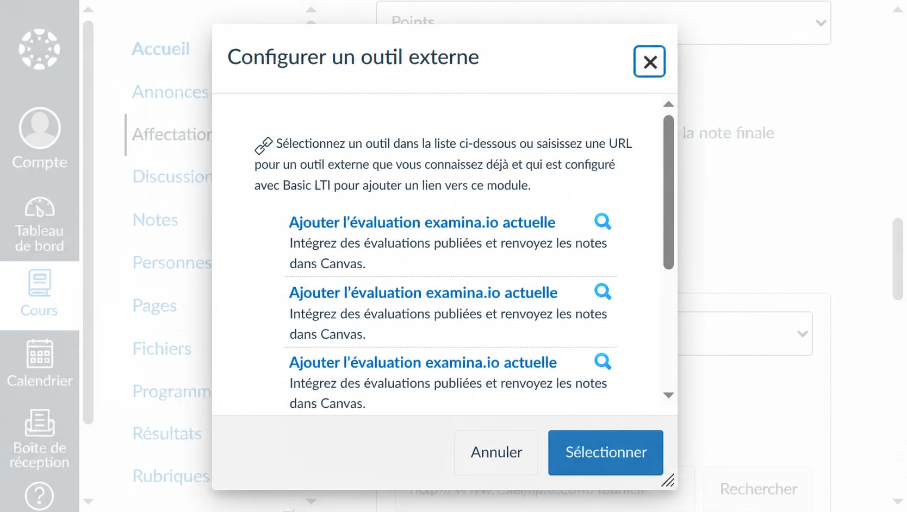
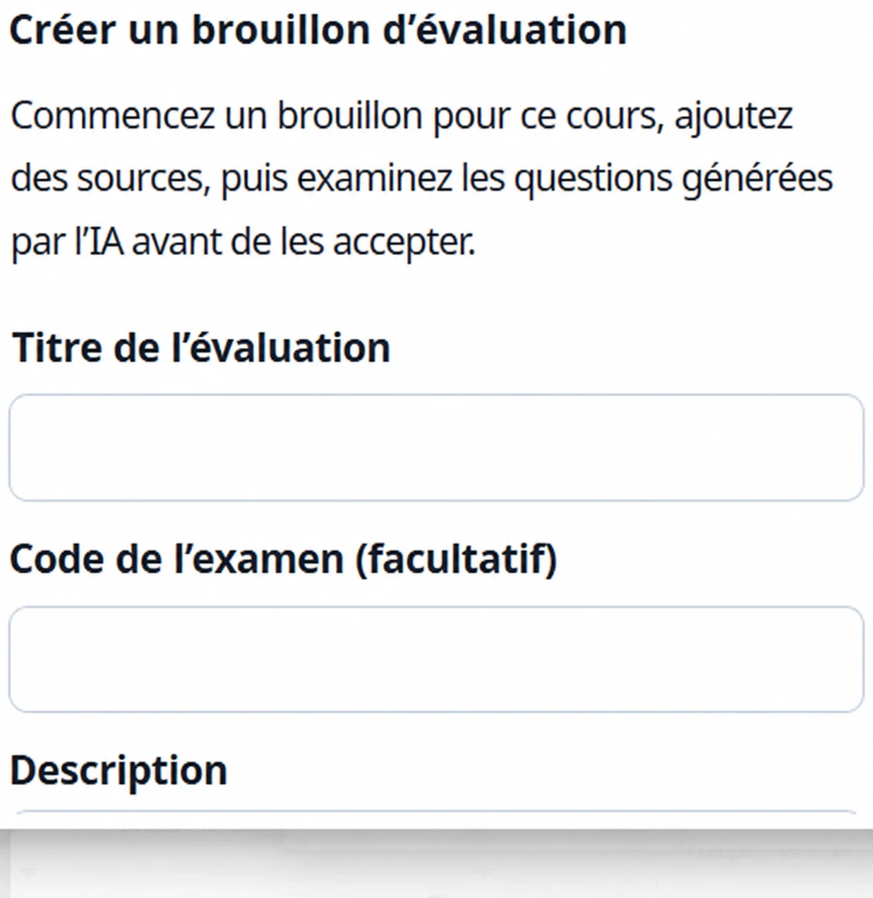
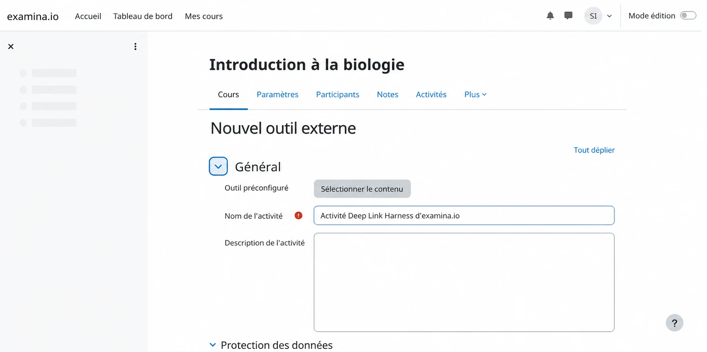
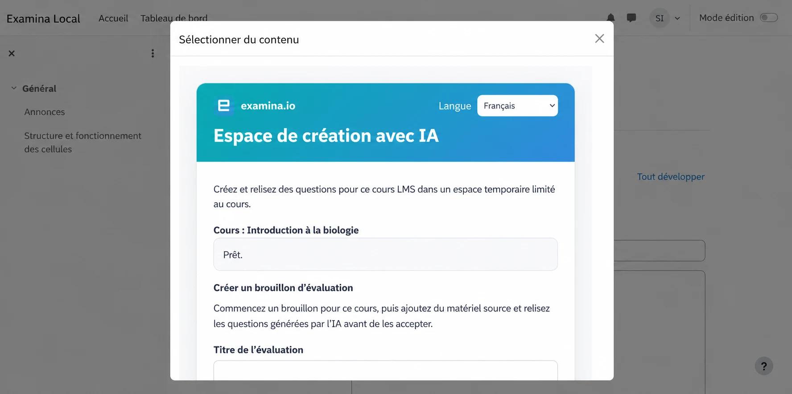
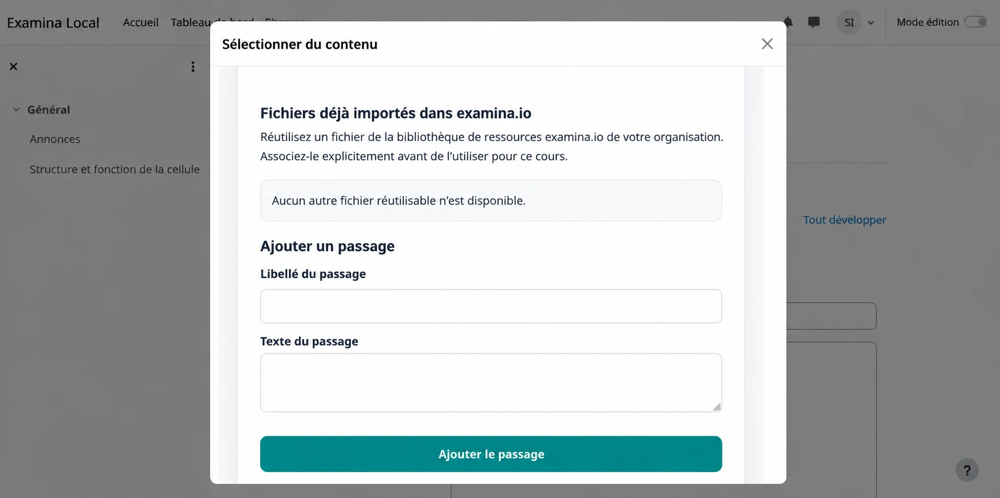
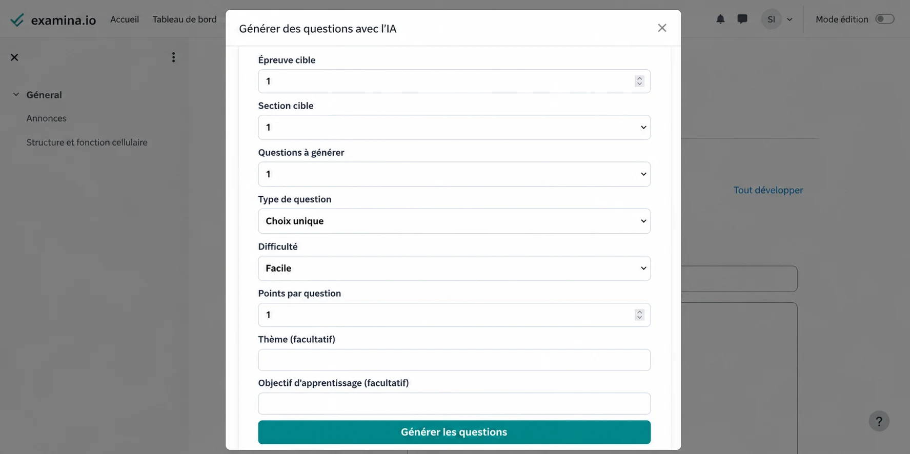
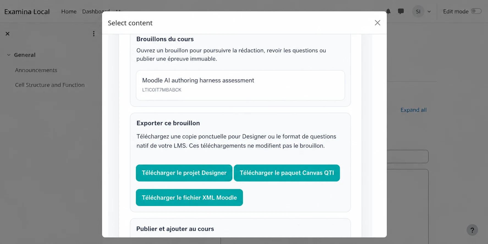
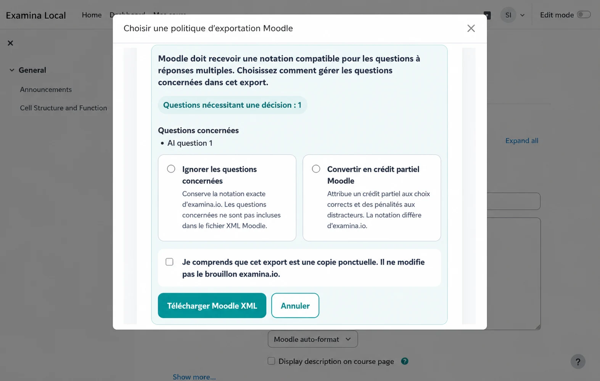

# Créer des questions avec l’IA depuis Canvas ou Moodle

Les enseignants peuvent lancer examina.io depuis un cours Canvas ou Moodle,
créer avec l’IA un brouillon de questions fondé sur des sources, puis renvoyer
une épreuve publiée dans le cours. Le même brouillon peut aussi produire un
projet Designer ponctuel ou un fichier de banque de questions natif du LMS.

Ce guide décrit tout le parcours enseignant. Un administrateur du LMS doit
d’abord terminer la [configuration LTI 1.3 de Canvas](canvas-lms.md) ou la
[configuration LTI 1.3 de Moodle](moodle-lms.md), y compris **Deep Linking**.

!!! tip "Validez d’abord dans un cours de test"

    Utilisez des contenus et des comptes fictifs pour valider la création,
    l’exportation, la publication, le lancement apprenant et le retour des notes
    avant toute épreuve réelle.

Les exemples utilisent un cours fictif **Introduction à la biologie (BIO 101)**
et un brouillon nommé **Contrôle sur la structure et la fonction cellulaires**.

## Comprendre les brouillons et les sorties

L’espace de création conserve un unique brouillon de référence sur examina.io.
La génération, la révision et les changements de sources mettent à jour ce
brouillon jusqu’à sa publication.

| Sortie | Utilité | Relation avec le brouillon |
| --- | --- | --- |
| Brouillon examina.io | Poursuivre la création avec l’IA et la révision | Modifiable et stocké sur le serveur |
| `.smex` | Faire passer l’épreuve finale | Immuable, final et stocké sur le serveur après publication |
| `.smexproj` | Poursuivre les modifications avancées dans Designer v3 | Copie locale ponctuelle ; les enregistrements de Designer ne mettent pas à jour le brouillon serveur |
| ZIP Canvas QTI | Importer les questions compatibles dans une banque classique Canvas | Copie native ponctuelle |
| Moodle XML | Importer les questions compatibles dans une banque Moodle | Copie native ponctuelle |

La publication constitue une limite nette : elle crée le `.smex` immuable
utilisé par les apprenants. Exporter un projet ou un fichier LMS ne publie ni ne
modifie le brouillon.

## Avant de commencer

Vérifiez que :

- examina.io apparaît comme outil externe dans le cours ;
- Deep Linking est activé pour l’inscription ;
- vous avez le rôle d’enseignant, concepteur de cours ou administrateur autorisé
  à ajouter des activités LMS ;
- votre compte dispose d’une place sous son plafond de brouillons actifs ; et
- vos sources sont au format PDF, DOCX, TXT ou HTML.

Les éléments `DRAFT` et `PUBLISHING` comptent dans le plafond. Publier ou
supprimer un brouillon libère sa place. Si l’espace de travail indique que le
plafond est atteint, terminez un brouillon existant ou demandez à un
administrateur examina.io d’en retirer un. La suppression est actuellement une
opération d’administration/API ; elle n’est proposée ni dans l’écran LMS ni
dans Designer.

## 1. Ouvrir la création avec l’IA depuis votre LMS

### Canvas

1. Ouvrez le cours et sélectionnez **Devoirs**.
2. Créez ou modifiez un devoir, puis choisissez **Outil externe** comme type de
   remise.
3. Sélectionnez **Rechercher**, choisissez **examina.io**, puis ouvrez son
   sélecteur de contenu.

Choisissez **Créer des questions avec l’IA**, saisissez **Contrôle sur la
structure et la fonction cellulaires**, puis créez le brouillon. Si vous en avez
déjà commencé un dans ce cours, ouvrez-le depuis la liste des brouillons.

### Moodle

1. Activez le **Mode édition** dans le cours.
2. Sélectionnez **Ajouter une activité ou ressource**, puis **Outil externe**.
3. Choisissez l’outil examina.io configuré et sélectionnez **Sélectionner le
   contenu**.

Choisissez **Créer des questions avec l’IA** ou rouvrez un brouillon du cours.

### Changer la langue de l’espace de travail

Utilisez le menu de langue en haut de chaque page LTI examina.io pour choisir
l’anglais, le français, l’arabe, l’espagnol d’Amérique latine ou le portugais du
Brésil. L’arabe utilise une interface de droite à gauche. Le menu traduit les
instructions et commandes, jamais les passages, questions ou réponses importés.

## 2. Créer la structure du brouillon

Saisissez un titre identifiable et, si utile, un code interne. Pour cet exemple :

- **Titre :** Contrôle sur la structure et la fonction cellulaires
- **Code :** BIO-101-CELL
- **Épreuve :** Épreuve 1
- **Section :** Organites cellulaires
- **Instruction :** Répondez à chaque question à l’aide du passage fourni.

Sur un écran large, l’espace de travail place les sources et les questions dans
deux colonnes ; sur un petit écran, elles sont empilées.

## 3. Ajouter un ou plusieurs fichiers sources

Sélectionnez **Ajouter des passages et des fichiers**, puis glissez plusieurs
fichiers dans la zone de dépôt ou choisissez-les dans le sélecteur. Tous les
fichiers sélectionnés s’affichent avant l’envoi afin de pouvoir retirer une
sélection accidentelle.

Pour un exemple rapide, importez un court passage expliquant :

> Les chloroplastes captent l’énergie lumineuse pour produire des sucres,
> tandis que les mitochondries libèrent l’énergie utilisable de ces sucres. Les
> cellules végétales contiennent ces deux organites.

N’utilisez que des documents que votre établissement est autorisé à traiter.
Attendez la fin du traitement de chaque fichier avant de générer des questions.
Une source déjà importée reste attachée au brouillon serveur lorsque vous le
rouvrez depuis Canvas ou Moodle.

## 4. Générer les questions

Sélectionnez **Générer des questions avec l’IA**, puis choisissez l’épreuve et
la section de destination. examina.io génère actuellement :

- des questions à choix unique ;
- des questions à choix multiples ; et
- des textes à compléter.

Pour l’exemple, créez deux questions à choix unique de difficulté moyenne,
valant 2 points chacune, puis une question à choix multiples moyenne. Indiquez
**Organites cellulaires** comme thème et **Distinguer la capture de l’énergie de
sa libération dans les cellules végétales** comme objectif d’apprentissage.

Une sortie d’IA peut être incorrecte ou inadaptée. L’enseignant reste
responsable de vérifier l’exactitude, les réponses, l’absence d’ambiguïté, la
difficulté, l’accessibilité, les droits d’auteur et l’alignement pédagogique.

## 5. Réviser les propositions générées

Comparez chaque proposition à sa source. Conservez les bonnes questions et
rejetez les autres. L’espace LMS ciblé permet de sélectionner les questions et
d’ajuster leur titre et l’instruction apprenant ; ce n’est pas un éditeur complet
de l’énoncé et des réponses.

Si une modification importante est nécessaire, rejetez et régénérez la
proposition ou téléchargez un projet Designer pour une édition locale avancée.
Un projet ouvert dans Designer est une copie figée d’une révision : son
enregistrement ne réécrit **pas** le brouillon examina.io de référence.

## 6. Choisir l’action à effectuer sur le brouillon

Ouvrez les actions du brouillon une fois la révision terminée.

Vous pouvez :

- télécharger un fichier `.smexproj` pour Designer v3 ;
- télécharger un ZIP Canvas QTI ;
- télécharger un fichier Moodle XML ; ou
- publier l’épreuve et la renvoyer dans le cours.

Ces actions sont indépendantes. Vous pouvez, par exemple, importer une copie
native pour la réutiliser, puis revenir plus tard au brouillon de référence pour
le publier.

## 7. Importer une copie de questions native dans Canvas

L’exportation Canvas mappe les questions compatibles à choix unique, choix
multiples et texte à compléter vers QTI. Il s’agit d’un export manuel à sens
unique.

1. Sélectionnez **Télécharger le paquet Canvas QTI**.
2. Dans Canvas, ouvrez **Paramètres → Importer le contenu du cours**.
3. Choisissez **Fichier QTI .zip**, sélectionnez le téléchargement et lancez
   l’importation.
4. Ouvrez la banque de questions classique et prévisualisez chaque question.

L’exportation actuelle vise les banques classiques Canvas. Elle ne revendique
ni envoi direct ni certification pour New Quizzes. Les modifications dans
Canvas ne sont pas resynchronisées vers examina.io.

## 8. Importer une copie de questions native dans Moodle

Moodle XML prend en charge les mêmes familles de base, mais la notation des
choix multiples dans Moodle ne préserve pas toujours la notation par ensemble
exact du brouillon. En cas de conflit, examina.io demande une règle pour cette
exportation.

- **Ignorer les questions concernées** préserve la notation examina.io en
  omettant ces questions du fichier XML.
- **Convertir en crédit partiel Moodle** répartit +100 % entre les bonnes
  réponses et -100 % entre les distracteurs. La question importée peut donc
  accorder un crédit partiel et sa notation n’est pas identique.

Si une question utilise déjà la notation partielle canonique, choisissez
**Ignorer les questions concernées**. Confirmez l’avertissement de copie
ponctuelle avant de télécharger. Votre choix ne concerne que cet export et ne
modifie jamais le brouillon serveur.

Importez ensuite le fichier :

1. Ouvrez la **Banque de questions** du cours Moodle.
2. Sélectionnez **Importer**, puis **Format XML Moodle**.
3. Importez le fichier XML téléchargé.
4. Prévisualisez chaque question, réponse, note et pénalité.

## 9. Publier et ajouter l’épreuve au cours

Revenez au brouillon de référence et sélectionnez **Publier et ajouter au
cours**. Lisez attentivement l’avertissement de publication. La publication crée
et stocke le `.smex` final immuable ; aucune modification ultérieure du
brouillon ou d’une copie LMS ne peut le changer.

Après le renvoi du Deep Link par examina.io :

- dans Canvas, terminez les paramètres du devoir et sélectionnez **Enregistrer**
  ou **Enregistrer et publier** ; ou
- dans Moodle, terminez les paramètres de l’activité et sélectionnez
  **Enregistrer et afficher**.

Utilisez un apprenant fictif pour ouvrir l’activité, la remettre et confirmer
que le résultat attendu atteint le carnet de notes lorsque AGS est activé.

## Rouvrir un brouillon dans Designer

Dans Designer v3, choisissez **Fichier → Ouvrir depuis les brouillons
examina.io**, recherchez dans le tableau et sélectionnez le brouillon. Designer
convertit sa révision en `.smexproj` local. Il ne réenregistre pas les
modifications dans examina.io et ne remplace pas la publication du brouillon de
référence.

## Résolution des problèmes

### L’option de création avec l’IA est absente

Vérifiez que Deep Linking est activé et que l’enseignant utilise l’emplacement
de sélection de contenu, non un lien de ressource apprenant. L’administrateur
Canvas ou Moodle peut aussi devoir mettre à jour l’outil installé.

### Une source n’apparaît pas après l’envoi

Vérifiez que le fichier est PDF, DOCX, TXT ou HTML, puis attendez la fin du
traitement. Rouvrez le même brouillon avant d’envoyer un doublon.

### Une question à choix multiples manque dans l’export Moodle

La règle **Ignorer les questions concernées** a été choisie ou le mode de
notation n’est pas reproductible dans Moodle XML. Réexportez en crédit partiel
uniquement si la différence de notation est acceptable et a été vérifiée.

### La copie Designer diffère du brouillon serveur

C’est normal dès que l’une des copies change. `.smexproj` est un instantané à
sens unique ; Designer ne synchronise pas ses changements avec le brouillon.

### La publication n’est pas disponible

Corrigez d’abord tout traitement incomplet ou toute erreur de validation. Si le
compte a atteint une limite de formule ou de brouillons, contactez son
administrateur examina.io.

## Liste de validation de l’enseignant

- [ ] Le cours et le brouillon affichés sont les bons.
- [ ] Chaque source est autorisée et entièrement traitée.
- [ ] Chaque énoncé, choix, réponse et valeur en points a été vérifié.
- [ ] Toute différence de notation Moodle a été explicitement acceptée.
- [ ] Les imports natifs ont été prévisualisés dans la banque du LMS.
- [ ] L’avertissement final de publication a été lu.
- [ ] Le lancement et le retour de note d’un apprenant fictif ont réussi.
