# Intégrez examina.io à Blackboard Learn Ultra {#integrate-examinaio-with-blackboard-learn-ultra}

Connectez examina.io à Blackboard Learn Ultra une fois, puis laissez les instructeurs ajouter un
examen publié à partir du Content Market sans copier l'URL de l'examen. Apprenants
ouvrir l'évaluation dans Blackboard sans deuxième connexion à examina.io, et
examina.io peut renvoyer chaque résultat à l'élément de carnet de notes Blackboard correspondant.

!!! tip "Valider avant une évaluation en direct"
    Connectez et validez le flux de travail complet dans un Blackboard hors production
    cours avec des utilisateurs fictifs avant de l'activer pour une évaluation en direct.

Les captures d'écran utilisent un cours fictif nommé **CHEM 101 : Chimie générale**,
une évaluation intitulée **Fondements généraux de la chimie** et un apprenant fictif
nommée **Layla Al-Harbi**. Votre établissement, cours, utilisateurs, identifiants et
les examens publiés seront différents.

Les captures d'écran Blackboard ont été capturées dans Learn Ultra 4000.19.0. Un plus récent
release peut déplacer une action ou modifier légèrement son étiquette, mais les champs LTI 1.3
et l'ordre dans lequel les deux systèmes les échangent reste le même.

## Ce que l'intégration apporte {#what-the-integration-provides}

- **Une seule connexion à Blackboard :** les apprenants ne se reconnectent pas à examina.io lorsque
  ils ouvrent l'évaluation de leur cours Blackboard.
- **Sélection d'examen publié :** LTI Deep Linking permet à un instructeur de choisir le
  examen publié exact tout en ajoutant le contenu du cours.
- **Placement axé sur le cours :** l'examen sélectionné est lié au Blackboard
  cours et élément de contenu qui l'ont créé.
- **Retour de note :** Les services d'affectation et de note LTI (AGS) envoient le score à
  l'élément correct de l'apprenant et du carnet de notes.
- **Liste de cours optionnels :** Les services de provisioning de noms et de rôles (NRPS) peuvent
  fournir les données d’adhésion minimales requises par un flux de travail approuvé.
- **Isolement de l'institution :** le même ID d'application du fournisseur peut être installé par
  plusieurs institutions, mais chaque installation Blackboard a la sienne
  ID de déploiement et son propre enregistrement examina.io.

## Avant de commencer {#before-you-start}

Il vous faut :

- un compte Root ou Administrateur dans examina.io ;
- un administrateur système Blackboard Learn qui peut enregistrer les outils LTI 1.3 ;
- un instructeur et un apprenant fictif dans un cours Blackboard hors production ;
- au moins un examen importé et publié dans examina.io Manager ; et
- l'approbation institutionnelle pour les données de l'apprenant et les services LTI Blackboard sera
  partager.

Les deux systèmes doivent être accessibles via HTTPS public avec des certificats de confiance et
horloges précises. Les messages de connexion LTI et les réponses signées expirent rapidement.
une horloge incorrecte peut rejeter une configuration par ailleurs valide.

!!! important "Utiliser l'ID d'application partagé examina.io"
    Utilisez l'**ID d'application Examina** indiqué dans examina.io. Ne créez pas de
    demande de fournisseur distincte pour chaque établissement. Chaque Blackboard
    l'installation fournit son propre **ID de déploiement**, qui doit être enregistré dans un
    enregistrement séparé examina.io. Ne réutilisez jamais un ID de déploiement d'un autre
    Environnement Blackboard.

## 1. Publiez l’examen que les apprenants passeront {#1-publish-the-exam-learners-will-take}

Avant de configurer Blackboard, préparez l'évaluation dans examina.io :

1. Ouvrez **Manager** et importez l'examen depuis Designer si nécessaire.
2. Vérifiez son titre, ses instructions, sa durée, sa notation, sa disponibilité et
   contenu destiné à l’apprenant.
3. Publiez l'examen.

Seuls les examens publiés que l'organisation actuelle est autorisée à utiliser apparaissent dans
l'écran de sélection Blackboard. La publication d'un examen ne l'ajoute pas à un
cours ; l'instructeur sélectionne le placement du cours plus tard via Deep Linking.

## 2. Démarrez l'enregistrement Blackboard dans examina.io {#2-start-the-blackboard-registration-in-examinaio}

En tant que racine ou administrateur examina.io :

1. Ouvrez **Accueil → Paramètres**.
2. Recherchez **Apportez Examina dans votre LMS** et sélectionnez **Ajouter une inscription**.
3. Choisissez **Blackboard Apprendre / Ultra**.
4. Copiez l'**ID d'application Examina** en lecture seule.

La zone d'intégration LMS se trouve en bas des **Paramètres**. Blackboard Apprendre /
Ultra devrait afficher **Disponible**, aux côtés de Moodle et Canvas. Sélectionnez **Ajouter
inscription** depuis cette zone pour commencer.

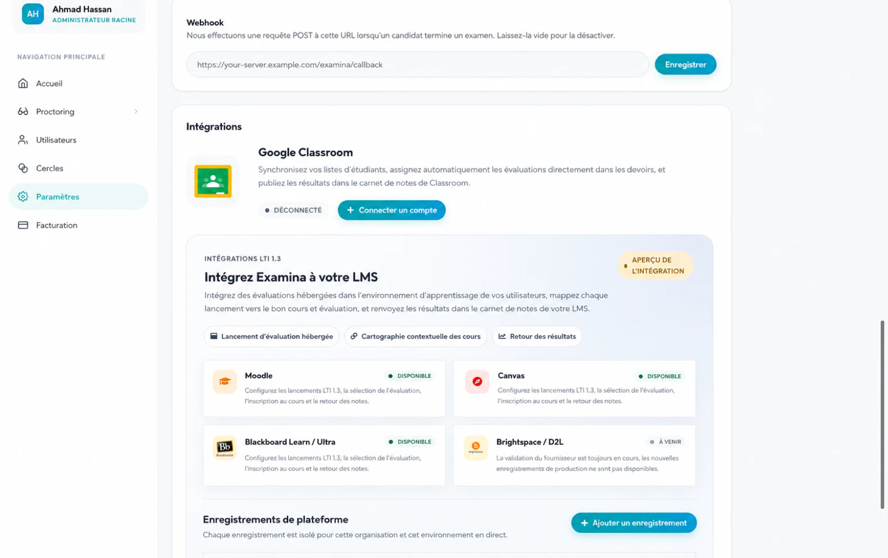

Gardez le formulaire ouvert. Blackboard a besoin de l'ID d'application avant de pouvoir créer
l'ID de déploiement spécifique à l'établissement qui complète cet enregistrement.

## 3. Enregistrez et approuvez examina.io dans Blackboard {#3-register-and-approve-examinaio-in-blackboard}

En tant qu'administrateur système Blackboard Learn :

1. Ouvrez la zone administrateur Blackboard. Dans la navigation Ultra, sélectionnez **Système
   Administrateur** ; dans Original Experience, ouvrez le **Panneau d'administration**.
2. Recherchez la section **Intégrations** et sélectionnez **Fournisseurs d'outils LTI**.

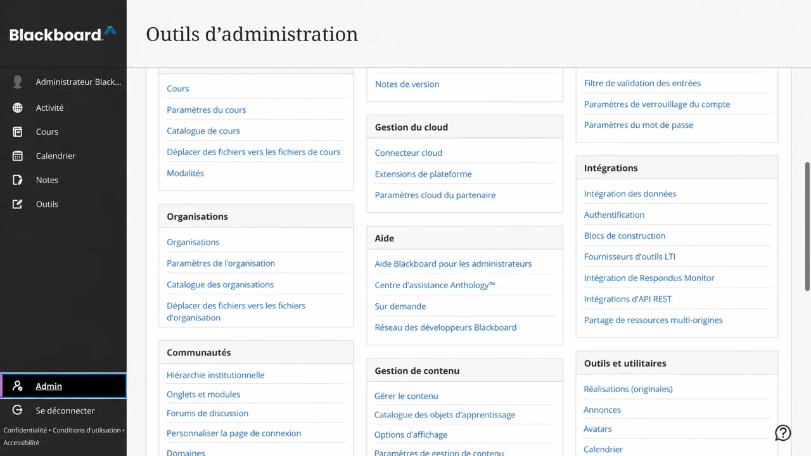.

3. Sélectionnez **Enregistrer LTI 1.3/Advantage Tool**.

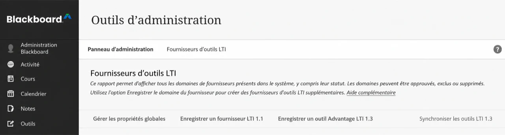

4. Saisissez l'**ID de demande d'examen**, puis sélectionnez **Soumettre**.

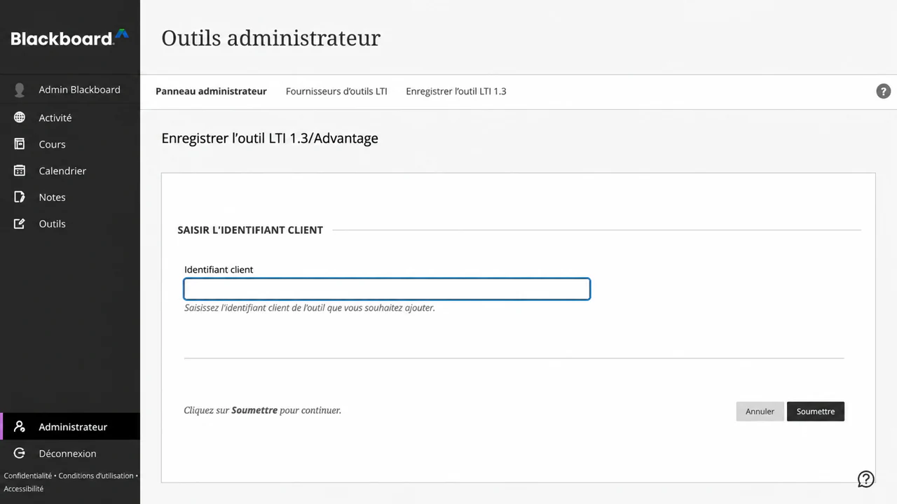

5. Vérifiez le nom de l'outil importé, le domaine, l'URL de clé publique, les URL de redirection et
   placement géré.
6. Définissez **Statut de l'outil** sur **Approuvé**.

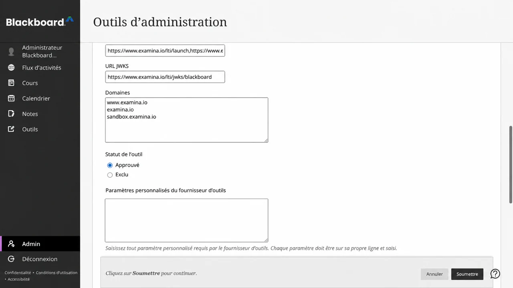

7. Sous Partage des données utilisateur, approuvez les données autorisées par votre institution :
   **Nom**, **E-mail** et **Rôle**.
8. Activez **Autoriser l'accès au service de notation** lorsque les scores doivent être renvoyés avec
   AGS.
9. Activez **Autoriser l'accès au service d'adhésion** uniquement lorsque l'accès à la liste de cours est
   requis via NRPS.
10. Sélectionnez **Soumettre**.

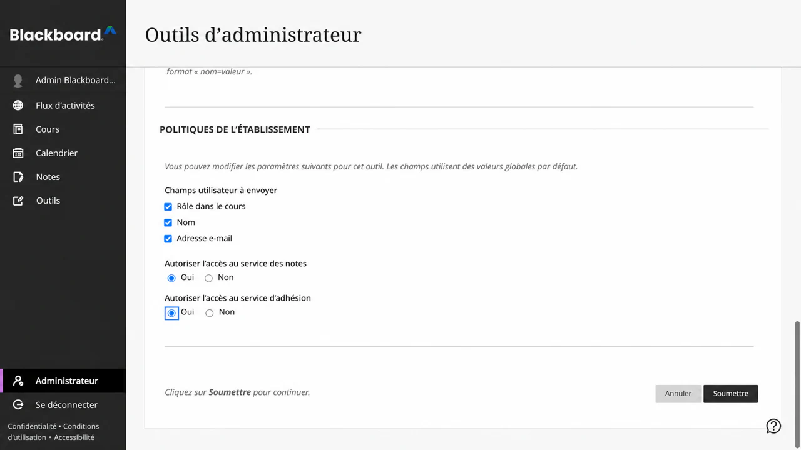

!!! note "L'administrateur système est contrôlé par les autorisations"
    Si **System Admin** n'est pas visible dans la navigation principale Blackboard, le
    le compte connecté ne dispose pas du rôle système requis pour installer un LTI
    outil. Un instructeur ne peut pas effectuer cette étape au niveau de l’établissement.

Blackboard fournit toujours un identifiant de sujet LTI stable pour l'apprenant.
Le nom et l'adresse e-mail sont des données de profil. Approuvez-les donc uniquement lorsque
la politique autorise examina.io à les recevoir. Un rôle est nécessaire pour distinguer un
flux de travail de l'instructeur à partir d'un lancement d'apprenant.

Ouvrez le menu de l'outil enregistré et choisissez **Gérer les déploiements**. Copiez le
ID de déploiement qui s'applique à l'institution ou au nœud de hiérarchie institutionnelle
où les instructeurs utiliseront examina.io. Si votre version Blackboard expose uniquement
un déploiement, la même valeur peut apparaître sur la page **Modifier** de l'outil.
Cette valeur appartient à cette installation Blackboard et ne doit pas être copiée dans
un autre établissement.

Créez un autre déploiement Blackboard uniquement lorsque l'institution a intentionnellement
nécessite une limite d'installation distincte, telle qu'un campus différent ou une licence
unité. Chaque ID de déploiement nécessite son propre enregistrement examina.io.

Après la soumission, la liste des fournisseurs doit afficher **Évaluations examina.io** comme
un outil LTI 1.3 approuvé. Les champs de données exacts et le nombre d'emplacements dépendent
sur les autorisations et les placements approuvés par votre établissement.

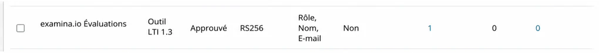

## 4. Terminez l'enregistrement dans examina.io {#4-finish-the-registration-in-examinaio}

Retournez dans **Accueil → Paramètres → Intégrez Examina dans votre LMS** :

1. Continuez le formulaire ouvert ou sélectionnez **Ajouter une inscription → Blackboard Apprendre /
   Encore Ultra**.
2. Entrez un nom descriptif, tel que **Northbridge College Blackboard**.
3. Confirmez l'**ID d'application Examina** en lecture seule et collez le Blackboard.
   **ID de déploiement**.
4. Confirmez ces valeurs de plate-forme Blackboard :

| Champ examina.io | Valeur Blackboard |
| --- | --- |
| URL de l'émetteur | `https://blackboard.com` |
| ID de demande d'examen | L'ID d'application fourni de manière centralisée et en lecture seule |
| ID de déploiement | L'ID copié à partir de cette installation Blackboard |
| Point de terminaison d'autorisation | `https://developer.blackboard.com/api/v1/gateway/oidcauth` |
| Point de terminaison du jeton | `https://developer.blackboard.com/api/v1/gateway/oauth2/jwttoken` |
| Clés publiques LMS (JWKS) URL | `https://developer.blackboard.com/.well-known/jwks.json` |

5. Activez **Sélection d'évaluation (lien profond)**.
6. Activez **Retour de note (AGS)** lorsque l'accès au service de note Blackboard était
   approuvé.
7. Activez **Liste des cours (NRPS)** uniquement lorsque le service d'adhésion Blackboard
   L'accès a été approuvé.
8. Sélectionnez **Enregistrer l'enregistrement**, puis activez l'enregistrement.

La carte d'enregistrement enregistrée est la source de vérité pour les URL exactes des outils.
Les valeurs affichées dans le navigateur de production utilisent `https://www.examina.io` :

| Réglage de l'outil Blackboard | Valeur de production examina.io |
| --- | --- |
| OIDC initiation à la connexion | Copiez la valeur complète de la carte d'immatriculation |
| URI de lancement/lien cible LTI | `https://www.examina.io/lti/launch` |
| Redirection de liens profonds | `https://www.examina.io/lti/deep-link` |
| Icône de l'outil | `https://www.examina.io/img/logo128.png` |
| Clés publiques de l'outil (JWKS) | Copiez la valeur spécifique à l'enregistrement de la carte d'enregistrement |

Copiez toujours les valeurs complètes OIDC et JWKS de la carte d'immatriculation.
car ils identifient l'enregistrement enregistré. Les clés publiques Blackboard **LMS
(JWKS) L'URL** dans le premier tableau correspond au jeu de clés de Blackboard, que lit examina.io.
L'URL des **clés publiques de l'outil (JWKS)** sur la carte d'enregistrement est la clé de examina.io.
défini, que Blackboard lit. Ne les échangez pas.

Les ID d'application et les ID de déploiement sont des identifiants de configuration, et non
mots de passe. Ne mettez jamais de clés privées, de jetons d'accès, de messages de lancement signés ou
données de l’apprenant dans la documentation ou les tickets d’assistance.

## 5. Confirmez l'emplacement du Blackboard {#5-confirm-the-blackboard-placement}

Revenez à **Fournisseurs d'outils LTI** dans Blackboard, ouvrez le menu pour
**Évaluations examina.io**, puis choisissez **Gérer les emplacements**. Confirmez que le
placement géré approuvé :

- est disponible en tant qu'outil de contenu Deep Linking ;
- utilise l'URL de lien profond de production examina.io ;
- est nommé **examina.io Évaluations** ; et
- affiche le logo examina.io.

Ne créez pas de deuxième stage à moins que votre établissement n'ait intentionnellement besoin d'un
placement séparé avec des disponibilités différentes. Un emplacement en double peut créer
on ne sait pas quelle inscription un instructeur lance.

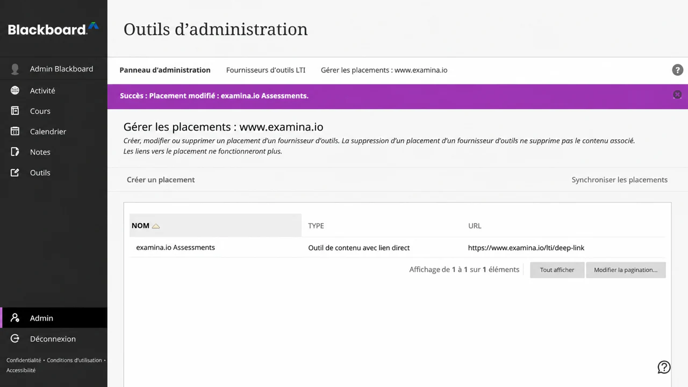

## 6. Ajouter un examen publié à un cours Ultra {#6-add-a-published-exam-to-an-ultra-course}

En tant que moniteur dans le cours de destination :

1. Ouvrez **CHEM 101 : Chimie générale → Contenu du cours**.
2. Sélectionnez le ****** où l'évaluation doit apparaître.
3. Choisissez **Marché de contenu**.
4. Recherchez **Évaluations examina.io** sous **Outils institutionnels** et sélectionnez-le.

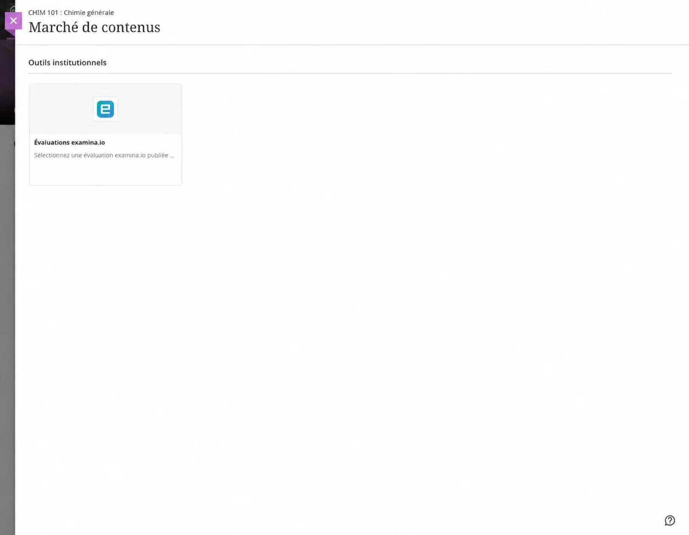

Le sélecteur examina.io s'ouvre à l'intérieur du Blackboard. Sélectionnez **Chimie générale
Fondamentaux**, puis choisissez **Ajouter l'examen sélectionné**.

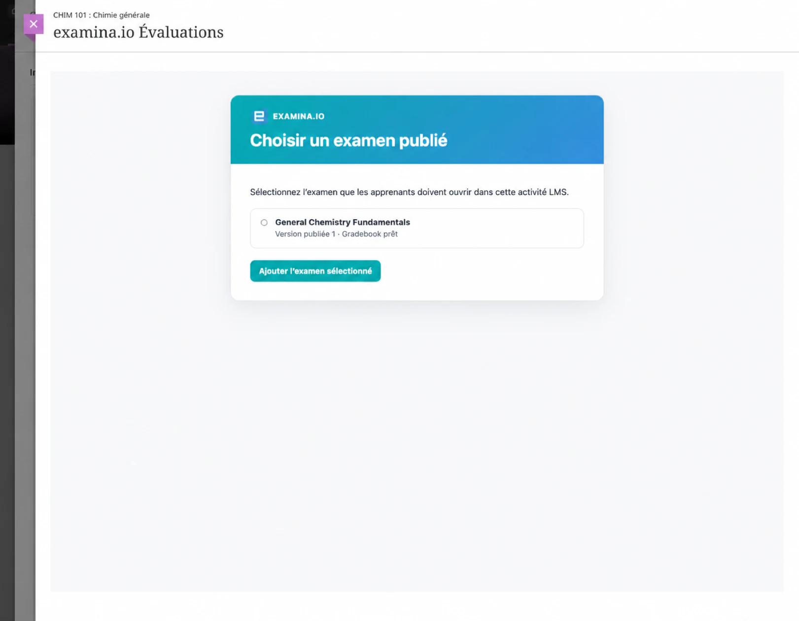

Blackboard revient au cours et crée l'élément de contenu d'évaluation.
Confirmez son nom destiné à l'apprenant, sa visibilité, sa date d'échéance, son nombre maximum de points et
tenter une politique, puis la rendre visible aux apprenants.

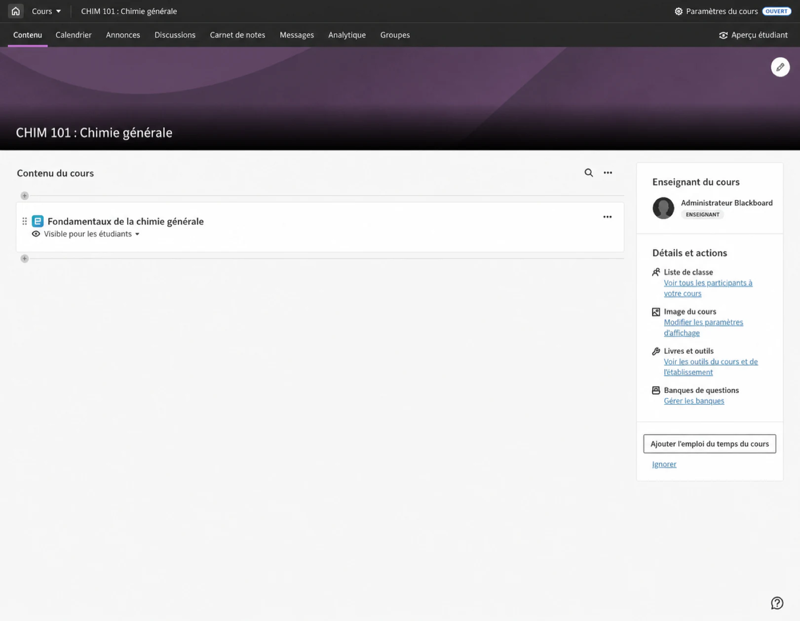

Ouvrez l'élément une fois en tant qu'instructeur et confirmez que le contenu publié prévu
l'examen apparaît. Si le mauvais examen a été sélectionné, supprimez l'élément de contenu et utilisez
le Content Market pour le sélectionner à nouveau.

## 7. Vérifiez le lancement de l'apprenant {#7-verify-the-learner-launch}

Utilisez un apprenant fictif inscrit au cours :

1. Connectez-vous à Blackboard en tant qu'apprenant.
2. Ouvrez **CHEM 101 : Chimie générale → Contenu du cours → Chimie générale
   Fondamentaux**.
3. Confirmez que l'évaluation s'ouvre dans Blackboard sans aucune seconde.
   Connexion examina.io.
4. Commencez, complétez et soumettez l’évaluation.

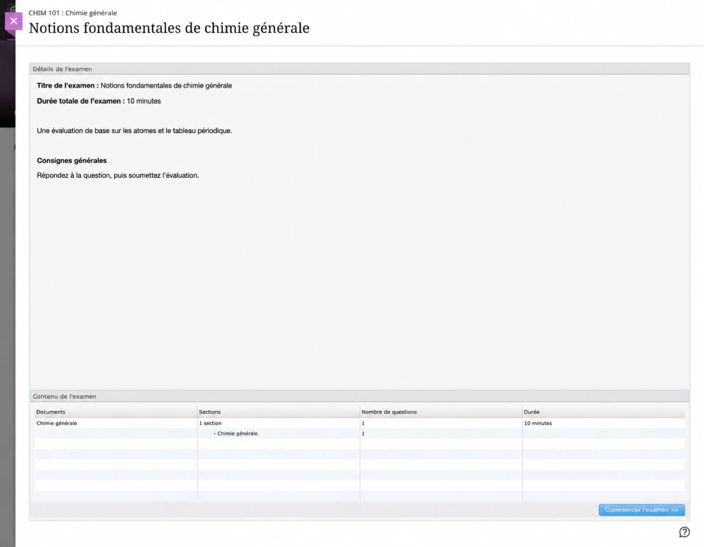

Le lancement LTI vérifie la plate-forme Blackboard, l'ID de déploiement, bien sûr,
élément de contenu, apprenant et publication sélectionnée. Une URL de lancement copiée n'est pas une
remplacement pour l'ouverture de l'évaluation à partir de Blackboard.

## 8. Vérifiez la note renvoyée {#8-verify-the-returned-grade}

Après l'envoi, ouvrez **Gradebook** en tant qu'instructeur. Confirmez que le score
apparaît pour **Fondamentaux généraux de chimie**, le bon apprenant et le
élément correct du carnet de notes. L'apprenant peut également revoir le résultat du cours
vue des notes.

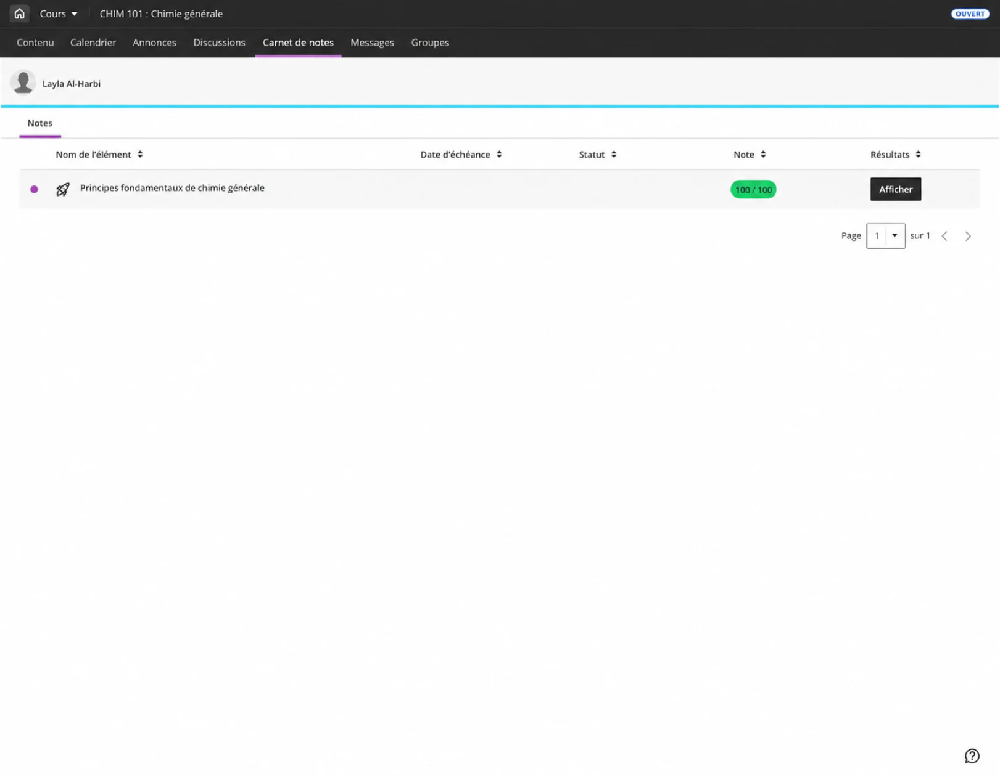

La remise des notes est mise en file d'attente séparément de la soumission de l'examen, donc un délai temporaire
La panne Blackboard ne transforme pas une évaluation terminée en échec
soumission. La partition peut mettre un certain temps à apparaître. Actualiser le carnet de notes
avant d'enquêter sur un résultat manquant.

## Connectez une autre institution Blackboard {#connect-another-blackboard-institution}

L'ID d'application examina.io fourni de manière centralisée peut être installé dans plus de
un établissement Blackboard. Pour chaque établissement :

1. enregistrez l'ID d'application partagé dans le Blackboard Learn de cette institution ;
2. copiez l'ID de déploiement unique de cette installation ;
3. créez un enregistrement Blackboard distinct dans le bon examina.io
   organisation; et
4. accorder uniquement les autorisations de données utilisateur approuvées, AGS et NRPS de cette institution.

Avant un déploiement à grande échelle, vérifiez que chaque institution ne voit que ses
examens publiés par l'organisation et que les résultats reviennent uniquement à l'organisme d'origine
élément de cours, d'apprenant et de carnet de notes.

## Liste de contrôle de validation de la production {#production-validation-checklist}

Avant d'utiliser l'intégration pour un cours en direct, vérifiez tous les éléments suivants :

- L'outil est **Approuvé** et disponible uniquement là où il est prévu.
- **Évaluations examina.io** apparaît dans Content Market avec le logo examina.io.
- L'ID d'application est la valeur examina.io fournie de manière centralisée.
- L'ID de déploiement provient de cette installation exacte Blackboard.
- Le nom, l'adresse e-mail et le partage de rôle correspondent à la politique de données approuvée par l'institution.
- AGS est activé dans les deux systèmes lorsque les notes doivent être renvoyées.
- NRPS est activé dans les deux systèmes uniquement lorsque l'accès à la liste de cours est requis.
- Deep Linking répertorie uniquement les examens publiés que l'instructeur peut sélectionner.
- Un apprenant ouvre l'évaluation sélectionnée sans deuxième connexion.
- Un score terminé atteint le bon élément de l'apprenant et du carnet de notes.
- Chaque adresse visible dans le navigateur utilise le HTTPS de production et un certificat de confiance.

## Dépannage {#troubleshooting}

| Symptôme | Que vérifier |
| --- | --- |
| **Évaluations examina.io** manquantes dans Content Market | Confirmez que l'outil est approuvé, que son emplacement Deep Linking géré est disponible pour ce cours et que l'utilisateur actuel peut ajouter du contenu au cours. |
| La vignette Content Market ne comporte pas de logo examina.io | Confirmez que l'emplacement géré utilise `https://www.examina.io/img/logo128.png`. Si l'outil a été installé avant la configuration de l'icône, actualisez les métadonnées de l'outil existant ou mettez à jour son emplacement. |
| Le sélecteur s'ouvre mais Blackboard rejette l'examen sélectionné | Confirmez la correspondance de l'ID d'application et de l'ID de déploiement, Blackboard peut récupérer l'URL examina.io JWKS exacte spécifique à l'enregistrement, et les deux systèmes ont des horloges précises. |
| L'évaluation s'ouvre dans un cadre vide ou le lancement est refusé | Vérifiez l'URL d'initiation OIDC, l'URL de lancement, les URL de redirection, le certificat HTTPS de confiance, l'état d'enregistrement, la politique iframe et les paramètres des cookies tiers du navigateur. |
| Blackboard ouvre toujours une ancienne adresse après la modification de la configuration du fournisseur | Blackboard peut conserver les URL importées lors de la création de l'outil ou de l'emplacement géré. Inspectez les URL de l'outil et de l'emplacement cible existants. Actualisez ou mettez à jour les métadonnées d'enregistrement existantes lorsque Blackboard le permet. Si l'outil doit être à nouveau enregistré, enregistrez le nouvel ID de déploiement et mettez à jour l'enregistrement examina.io correspondant avant de rendre le remplacement disponible. Resélectionnez le contenu du cours concerné afin qu'il utilise l'emplacement actuel. |
| Le mauvais examen s'ouvre | Supprimez ou modifiez le contenu du cours et sélectionnez à nouveau l'examen publié souhaité. Ne copiez pas un élément de contenu entre établissements sans resélectionner l’examen. |
| La note n'apparaît pas | Confirmez que Blackboard **Autoriser l'accès au service de note** et examina.io **Retour de note (AGS)** sont activés, que l'élément de contenu a des points et que l'inscription est active. Prévoyez du temps pour les livraisons en file d’attente. |
| La liste des cours n'est pas disponible | Confirmez que Blackboard **Autoriser l'accès au service d'adhésion** et examina.io **Liste des cours (NRPS)** sont activés. Le lancement de l’évaluation et le retour des notes ne nécessitent pas NRPS. |
| Blackboard signale une erreur de clé de signature | Confirmez que Blackboard utilise l'URL de l'outil JWKS copiée à partir de la carte d'enregistrement examina.io et que examina.io utilise `https://developer.blackboard.com/.well-known/jwks.json` pour les clés de Blackboard. Aucun des deux points de terminaison ne doit rediriger vers une page de connexion. |
| Une deuxième institution voit le contenu de la première institution | Confirmez que chaque institution dispose de son propre enregistrement examina.io et de son propre ID de déploiement Blackboard. Ne réutilisez jamais un ID de déploiement dans plusieurs institutions. |

Pour connaître le comportement et la terminologie actuels de la plate-forme Blackboard, consultez l'Anthologie.
enregistrement officiel de la demande [LTI](https://docs.blackboard.com/docs/blackboard/lti/1.3/register-an-application)
et [intégration administrateur](https://help.anthology.com/blackboard/administrator/en/integrations.html)
documentation.
