# Intégrer examina.io à Canvas {#integrate-examinaio-with-canvas}

Connectez examina.io à un compte racine Canvas, puis laissez les enseignants ajouter des publications publiées.
évaluations aux devoirs sans copier les liens d’examen. Les apprenants ouvrent le
évaluation dans Canvas sans deuxième connexion, et examina.io renvoie chacun
résultat dans la colonne correspondante du carnet de notes Canvas.

!!! tip "Valider avant une évaluation en direct"
    Connectez et validez le flux de travail complet dans un Canvas hors production
    cours avec des utilisateurs fictifs avant de l'activer pour une évaluation en direct.

Les captures d'écran utilisent un cours fictif du **Northbridge College**,
**Introduction à la biologie (BIO 101)** et une évaluation nommée **Cell
Structure et fonction**. Votre institution, le nom d'hôte Canvas, les identifiants et
les noms des cours seront différents.

## Ce que l'intégration apporte {#what-the-integration-provides}

- **Une seule connexion Canvas :** les apprenants ne se reconnectent pas à examina.io lorsqu'ils
  ouvrez une affectation à partir de Canvas.
- **Sélection d'évaluations publiées :** LTI Deep Linking permet à un enseignant de choisir
  l'examen exact lors de la création d'un devoir d'outil externe.
- **Placement adapté au cours :** la publication sélectionnée est liée au Canvas
  cours et devoir qui l'ont créé.
- **Retour de note :** Les services d'affectation et de note LTI (AGS) envoient le score à
  la bonne colonne d'apprenant et de carnet de notes.
- **Liste de cours optionnels :** Les services de provisioning de noms et de rôles (NRPS) peuvent
  fournir les données minimales d'adhésion au cours requises par un flux de travail approuvé.

Canvas appelle ce modèle un placement `assignment_selection`. C'est officiel
la documentation confirme que l'emplacement utilise le Deep Linking, charge le
outil d'évaluation pour les étudiants assignés et peut synchroniser les notes via LTI
services de classement.

## Avant de commencer {#before-you-start}

Il vous faut :

- un compte Root ou Administrateur dans examina.io ;
- un administrateur de compte root Canvas qui peut gérer les clés de développeur et les applications ;
- un instructeur et un apprenant fictif dans un cours Canvas hors production ;
- au moins un examen importé et publié dans examina.io Manager ;
- adresses HTTPS publiques avec certificats de confiance pour les deux systèmes ; et
- un plan approuvé par l'établissement pour les données de l'apprenant que Canvas peut divulguer.

Gardez les horloges des deux systèmes précises. Messages de connexion LTI et réponses signées
expirer rapidement, donc une grande différence d'horloge peut rejeter sinon corriger
configuration.

## Comment les paramètres d'échange des Canvas et examina.io {#how-canvas-and-examinaio-exchange-settings}

Canvas crée un **ID client** et un **ID de déploiement** dont examina.io a besoin.
examina.io crée une URL de clé publique spécifique à l'enregistrement dont Canvas a besoin.
Lors de la préversion, la configuration comporte donc deux passes :

1. créer une clé de développeur Canvas LTI 1.3 provisoire et installer son application ;
2. copiez les identifiants et les points de terminaison de la plate-forme Canvas dans examina.io ;
3. recopiez les points de terminaison examina.io finaux dans la clé Canvas ; et
4. activez l'application, rendez-la disponible et validez l'intégralité du flux de travail.

!!! warning "Maintenir l'application provisoire indisponible"
    Si Canvas nécessite une URL de clé publique lors du premier passage, utilisez une URL temporaire.
    HTTPS JSON Web Key Set point de terminaison contrôlé par votre institution. Il se peut
    renvoie un ensemble vide (`{"keys":[]}`). Gardez la clé éteinte et l'application
    indisponible jusqu'à ce que vous le remplaciez par le examina.io spécifique à l'enregistrement
    **Jeu de clés publiques (JWKS)** URL à l'étape 3. N'utilisez jamais de clé locale, Docker ou privée.
    nom d'hôte dans une clé de production Canvas.

## 1. Créez la clé et l'application provisoires Canvas. {#1-create-the-provisional-canvas-key-and-app}

Connectez-vous avec un compte administrateur de compte racine Canvas. Sélectionnez **Admin** dans
la navigation globale, puis choisissez le compte racine de votre institution. Si Canvas
affiche d'abord la liste des comptes, sélectionnez le nom du compte racine.

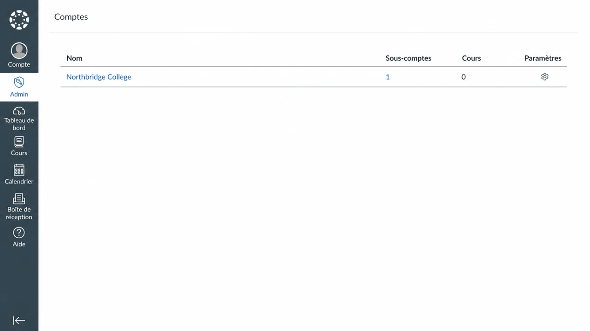

La navigation dans le compte doit inclure les **clés de développeur** et les **applications**. Si soit
l'élément est manquant, votre rôle Canvas ne dispose pas du compte root requis
autorisation ; demandez à l'administrateur Canvas de l'établissement d'effectuer cette configuration.

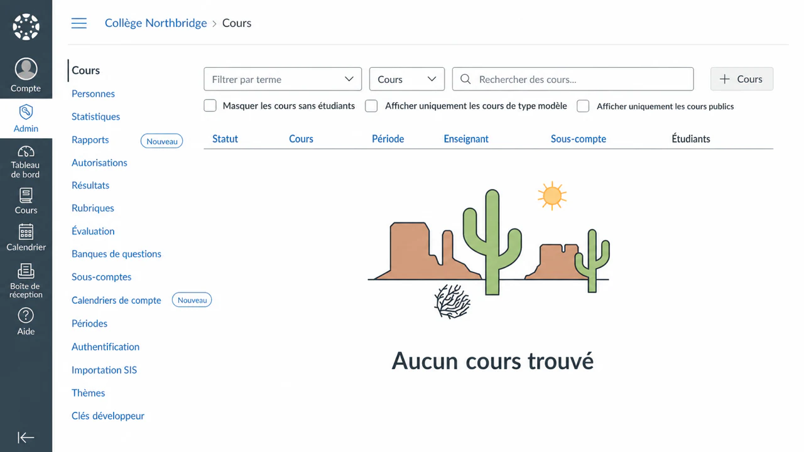

Ouvrez **Clés de développeur**, puis sélectionnez **+ Clé de développeur**.

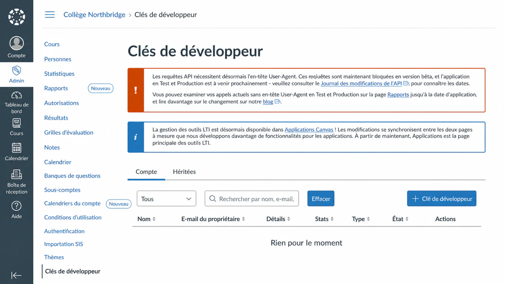

Choisissez **Clé LTI**. Canvas peut également afficher **Inscription LTI** ; utilise cette option
uniquement lorsque examina.io a fourni une URL d'enregistrement dynamique unique.

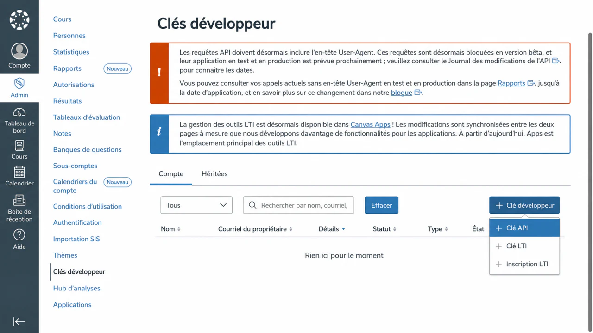

Choisissez **Saisie manuelle**, puis complétez les paramètres clés :

1. Saisissez **examina.io Assessments** comme nom et titre de clé.
2. Ajoutez l'adresse e-mail de l'administrateur responsable de cela
   intégration.
3. Ajoutez `https://www.examina.io/lti/launch` et
   `https://www.examina.io/lti/deep-link` en tant qu’URI de redirection distincts.
4. Saisissez `https://www.examina.io/lti/launch` comme **URI du lien cible**.
5. Entrez `https://www.examina.io/lti/login` comme **OpenID Connect
   URL de lancement**.
6. Définissez la **Méthode JWK** sur **URL JWK publique** et entrez le jeu de clés provisoire.
   URL décrite ci-dessus.

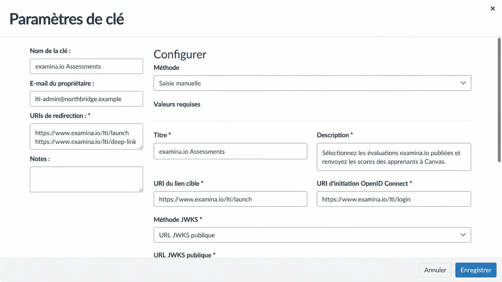

!!! warning "La valeur JWKS est spécifique à l'enregistrement"
    Si vous utilisez `https://www.examina.io/lti/jwks/your-registration-id` pendant
    le laissez-passer provisoire, `your-registration-id`, n'est qu'un espace réservé. Étape
    3 remplace la valeur entière par l'URL exacte du **jeu de clés publiques (JWKS)**.
    montré par examina.io.

Dans **LTI Advantage Services**, activez uniquement les cinq étendues nécessaires au
services dans ce guide :

- créer et afficher les données d'affectation ;
- afficher les données d'affectation ;
- afficher les données de soumission ;
- créer et mettre à jour les résultats de soumission ; et
- récupérer les données utilisateur associées au contexte.

Les quatre premiers niveaux de support reviennent via AGS. La portée finale prend en charge le
liste de cours NRPS en option ; laissez-le désactivé lorsque vous n'avez pas besoin de la liste
accès.

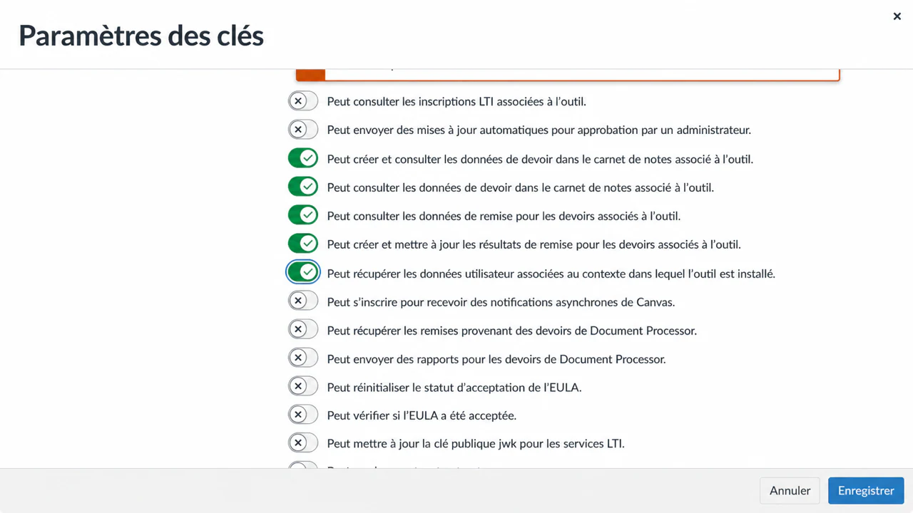

Sous **Emplacements**, ajoutez **Sélection d'affectation**. Ajouter **Navigation du cours**
uniquement si votre établissement souhaite également un point d’entrée examina.io au niveau du cours.

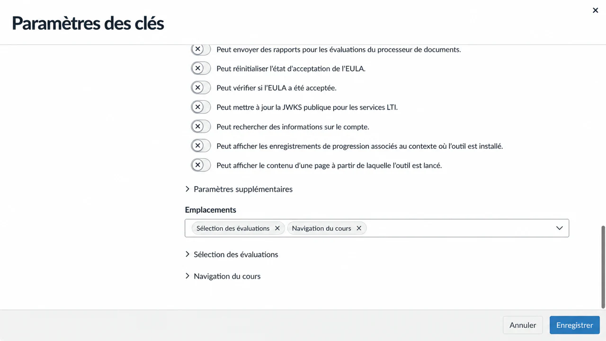

Enregistrez la clé, copiez son **ID client** et conservez la clé **Désactivée**. Ouvrir **Admin →
votre compte root → Applications → Gérer**, installez l'application à l'aide de l'ID client et
copiez son **ID de déploiement**.

Canvas prend également en charge l'enregistrement dynamique, mais son enregistrement API est
actuellement marqué en version bêta. Utilisez une URL d'enregistrement dynamique unique uniquement lorsqu'elle est
explicitement fourni par examina.io pour votre aperçu ; sinon utilise le manuel
écoulement à deux passages ci-dessus.

## 2. Ajoutez l'enregistrement Canvas dans examina.io {#2-add-the-canvas-registration-in-examinaio}

En tant que racine ou administrateur examina.io :

1. Ouvrez **Accueil → Paramètres**.
2. Recherchez **Apportez Examina dans votre LMS** et sélectionnez **Ajouter une inscription**.
3. Choisissez **Canvas** et entrez un nom descriptif, tel que **Northbridge
   Collège Canvas**.
4. Entrez les valeurs Canvas indiquées ci-dessous.

| Champ examina.io | Valeur Canvas |
| --- | --- |
| URL de l'émetteur | `https://<your-canvas-host>` |
| Identifiant client | ID client de la clé de développeur LTI |
| ID de déploiement | L'ID de déploiement de l'application installée |
| Point de terminaison d'autorisation | `https://<your-canvas-host>/api/lti/authorize_redirect` |
| Point de terminaison du jeton | `https://<your-canvas-host>/login/oauth2/token` |
| Clés publiques LMS (JWKS) URL | `https://<your-canvas-host>/api/lti/security/jwks` |

Pour Canvas hébergé, remplacez `<your-canvas-host>` par le nom d'hôte exact de votre
les utilisateurs se connectent. N'ajoutez pas de chemin de fin à l'URL de l'émetteur et n'utilisez pas
Point de terminaison générique OAuth JWKS de Canvas dans le champ des clés publiques LMS.

5. Activez la **Sélection d'évaluation (lien profond)** et le **Retour de note (AGS)**.
6. Activez **Liste de cours (NRPS)** uniquement si la portée Canvas correspondante était
   approuvé et accordé.
7. Sélectionnez **Enregistrer l'enregistrement**.

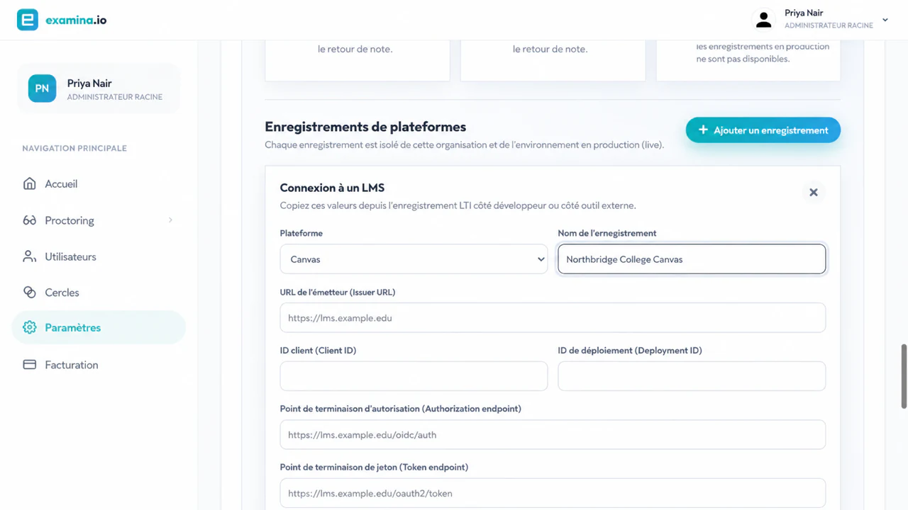

La carte enregistrée affiche l'**initiation de connexion OIDC exacte**, le **lancement LTI**,
**Deep Linking** et URL **Ensemble de clés publiques (JWKS)** spécifiques à l'enregistrement.
Gardez cette carte ouverte pour la prochaine étape.

## 3. Terminez et activez l'application Canvas {#3-finish-and-activate-the-canvas-app}

Modifiez la clé de développeur Canvas LTI et remplacez chaque valeur d'outil provisoire.
avec la valeur exacte indiquée par examina.io :

| Canvas LTI champ clé | Valeur de examina.io |
| --- | --- |
| URL de lancement d’OpenID Connect | OIDC initiation à la connexion |
| URI du lien cible | Lancement du LTI |
| URI de redirection | URL de lancement et de liens profonds LTI, une par ligne |
| Lien cible de sélection d’affectation | Liens profonds |
| URL JWK publique | Jeu de clés publiques (JWKS) |
| URL de l'icône de l'outil | `https://www.examina.io/img/logo128.png` |

Les itinéraires de production destinés au navigateur commencent par `https://www.examina.io`.
Par exemple, l'URL de lancement est
`https://www.examina.io/lti/launch`. Copiez toujours les valeurs complètes du
carte d'enregistrement car l'URL JWKS inclut l'identifiant d'enregistrement.

Enregistrez la clé et allumez-la **Activée**. Dans **Applications → Gérer**, ouvrez **examina.io.
évaluations**, confirmez que l'application est activée et mettez-la à la disposition de la racine
compte ou aux sous-comptes et cours approuvés.

L'**URL de l'icône de l'outil** donne aux instructeurs et aux administrateurs un identifiant reconnaissable.
Logo examina.io en Canvas. Si une installation existante affiche toujours le nom de Canvas
icône d'outil externe générique, mettez à jour la clé de développeur avec cette valeur et
actualisez ou réinstallez l'application pour que Canvas recharge ses métadonnées d'enregistrement.

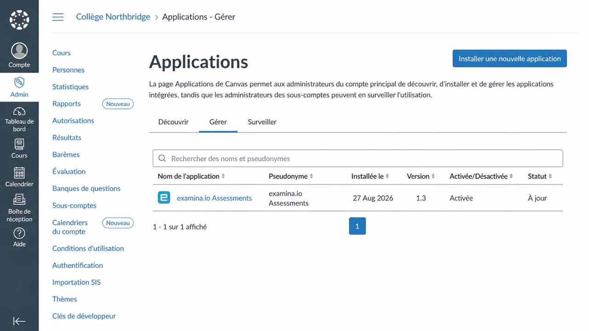.

Si l'application affiche **Non disponible**, ouvrez son paramètre de disponibilité, choisissez le
compte root ou un sous-compte approuvé, sélectionnez **Disponible** et enregistrez. Limite
disponibilité pour les institutions, sous-comptes ou cours approuvés pour le
intégration.

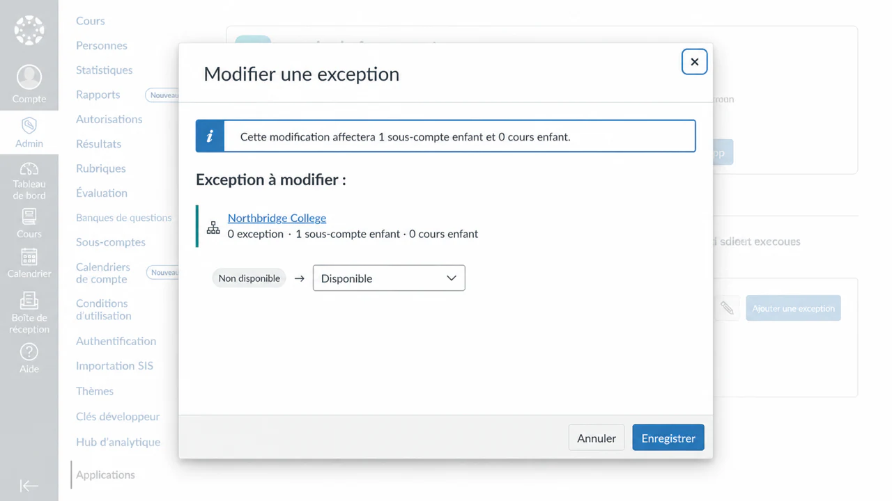

Retournez à examina.io et activez l'enregistrement. Un suspendu ou révoqué
l'inscription ne peut pas accepter de nouveaux lancements.

## 4. Ajouter une évaluation publiée à un devoir Canvas {#4-add-a-published-assessment-to-a-canvas-assignment}

En tant que moniteur dans le cours de destination :

1. Ouvrez **Devoirs → + Devoir**.
2. Saisissez le nom du devoir destiné à l'apprenant et le nombre maximum de points.
3. Définissez le **Type de soumission** sur **Outil externe**.
4. Sélectionnez **Rechercher**, puis choisissez **Ajouter une évaluation examina.io**.
5. Sélectionnez l'examen publié souhaité et choisissez **Ajouter l'examen sélectionné**.

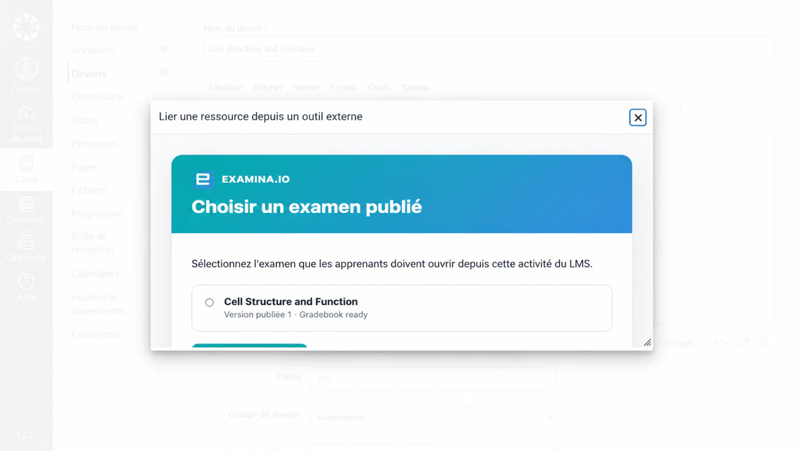

Canvas revient au formulaire d'affectation avec l'URL de lancement sélectionnée. Confirmer
le nom de l'affectation, les points, l'accès à l'affectation, les dates et la politique de tentative.

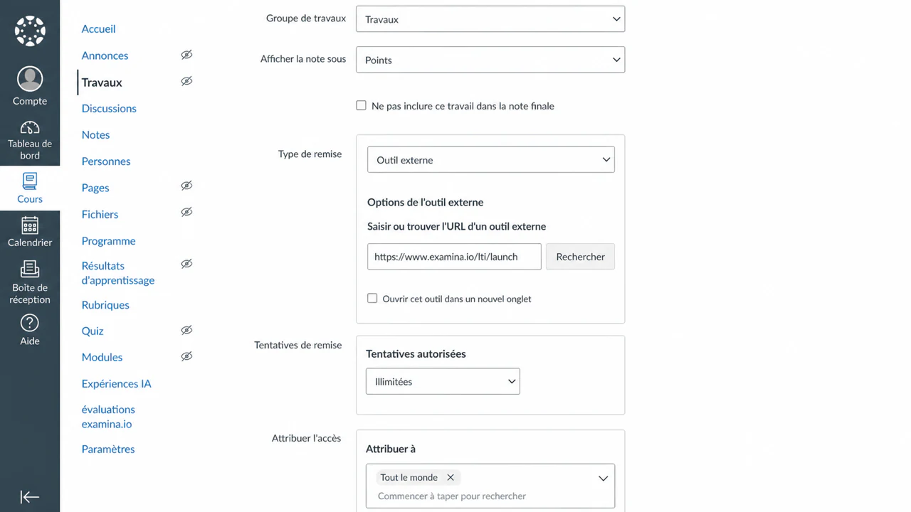

Choisissez **Enregistrer et publier**, puis ouvrez le devoir une fois en tant qu'instructeur.
Confirmez que l'évaluation attendue apparaît et que Canvas ne vous invite pas
pour une connexion examina.io distincte.

## 5. Vérifier l'expérience de l'apprenant {#5-verify-the-learner-experience}

Utilisez un apprenant fictif inscrit au cours :

1. Connectez-vous à Canvas en tant qu'apprenant.
2. Ouvrez **BIO 101 → Affectations → Structure et fonction des cellules**.
3. Confirmez que l'examen attendu s'ouvre dans le devoir Canvas.
4. Commencez, complétez et soumettez l’évaluation.

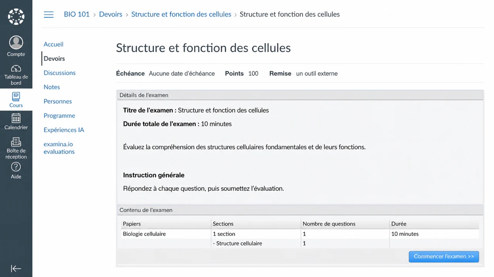

Le lancement LTI vérifie la plate-forme Canvas, le déploiement, le cours, l'affectation,
apprenant et publication sélectionnée. Une URL de lancement copiée ne remplace pas
ouverture de l'affectation à partir de Canvas.

## 6. Vérifiez la note renvoyée {#6-verify-the-returned-grade}

Après la soumission, ouvrez la vue des notes Canvas en tant qu'apprenant ou Carnet de notes.
en tant qu'instructeur. Confirmez que le résultat apparaît pour l'affectation correcte
et l'apprenant.

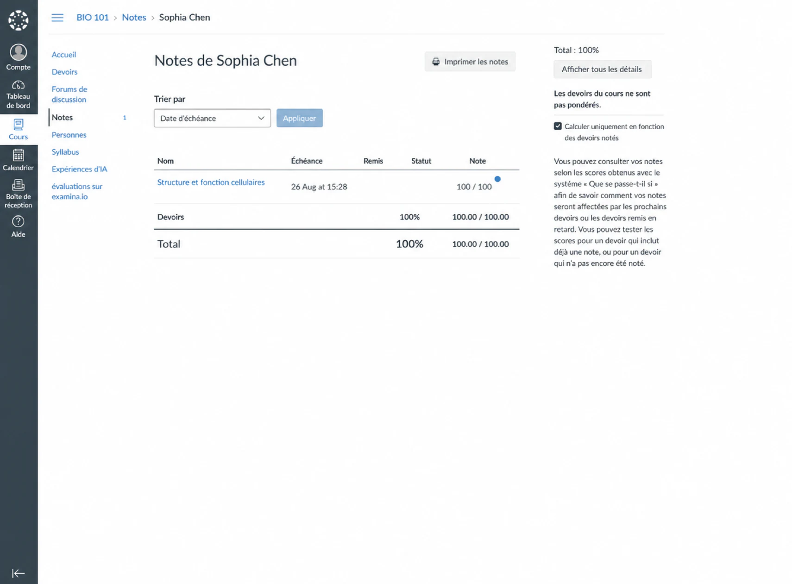

La remise des notes est mise en file d'attente séparément de la soumission de l'examen, donc un délai temporaire
La panne Canvas ne transforme pas une évaluation terminée en un échec de soumission.
La partition peut mettre un certain temps à apparaître. Actualisez la vue des notes avant
enquêter sur un résultat manquant.

## Liste de contrôle de validation de la production {#production-validation-checklist}

Avant d'activer l'application pour un cours en direct, vérifiez tous les éléments suivants avec un
cours hors production et utilisateurs fictifs :

- La clé et l'application Canvas sont activées et disponibles uniquement là où elles sont prévues.
- L'enregistrement examina.io est actif dans la bonne organisation et
  environnement.
- Canvas utilise l'URL examina.io JWKS spécifique à l'enregistrement.
- examina.io utilise le point de terminaison `/api/lti/security/jwks` de Canvas.
- Deep Linking répertorie uniquement les évaluations que l'instructeur peut sélectionner.
- La mission lance l'évaluation publiée prévue dans Canvas.
- Un apprenant se lance sans deuxième connexion.
- Un score terminé atteint la bonne colonne d'apprenant et de carnet de notes.
- La réouverture ou l'actualisation de l'attribution ne duplique pas un élément de campagne.
- NRPS est désactivé lorsque l'accès à la liste de cours n'est pas nécessaire.
- Chaque URL destinée à la production utilise HTTPS public et un certificat de confiance.

## Dépannage {#troubleshooting}

| Symptôme | Que vérifier |
| --- | --- |
| **Évaluations examina.io** manquantes dans **Rechercher** | Confirmez que la clé est activée, que l'application est disponible pour ce cours et que la clé inclut le placement de sélection de devoir avec `LtiDeepLinkingRequest`. |
| Le sélecteur s'ouvre mais Canvas rejette l'examen sélectionné | Confirmez que Canvas peut récupérer l'URL exacte examina.io JWKS spécifique à l'enregistrement à partir de son réseau de serveurs. L’accessibilité du navigateur à elle seule ne suffit pas. Vérifiez également l’ID client, l’ID de déploiement, l’émetteur et la précision de l’horloge. |
| L'affectation ouvre un cadre vide ou refuse le lancement | Vérifiez l'URL d'initiation OIDC, l'URL de lancement, les URI de redirection, le certificat HTTPS de confiance, la politique iframe et les paramètres des cookies tiers du navigateur. Supprimez tous les noms d’hôtes locaux, Docker et privés de la configuration de production. |
| La mauvaise évaluation s'ouvre | Modifiez le devoir et sélectionnez à nouveau la publication. Ne copiez pas une affectation entre environnements sans resélectionner son contenu. |
| La note n'apparaît pas | Vérifiez que les étendues AGS et **Retour de note** sont activés, que le devoir comporte des points et que l'application est toujours disponible. Prévoyez un court délai pour la livraison en file d'attente. |
| La liste des cours n'est pas disponible | Confirmez que la portée NRPS et la **liste des cours** sont activées. Le lancement et le retour de notes peuvent continuer sans accès à la liste. |
| Canvas signale une erreur de clé de signature | Canvas doit utiliser l'URL examina.io JWKS spécifique à l'enregistrement, et examina.io doit utiliser `https://<your-canvas-host>/api/lti/security/jwks`. Confirmez qu’aucun des points de terminaison ne redirige vers une page de connexion. |

Pour connaître le comportement et la terminologie actuels de la plate-forme Canvas, voir Instructure
officiel [enregistrement LTI](https://developerdocs.instructure.com/services/canvas/external-tools/lti/file.registration),
[Placement de sélection d'affectation](https://developerdocs.instructure.com/services/canvas/external-tools/lti/placements/file.assignment_selection_placement),
[Lien profond](https://developerdocs.instructure.com/services/canvas/external-tools/lti/file.content_item),
et [classement](https://developerdocs.instructure.com/services/canvas/external-tools/lti/file.assignment_tools)
documentation.
